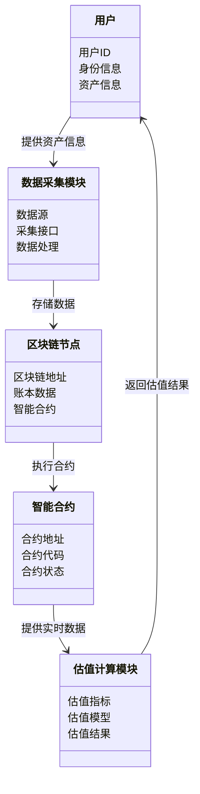
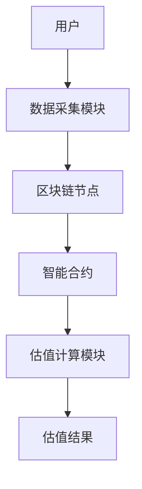
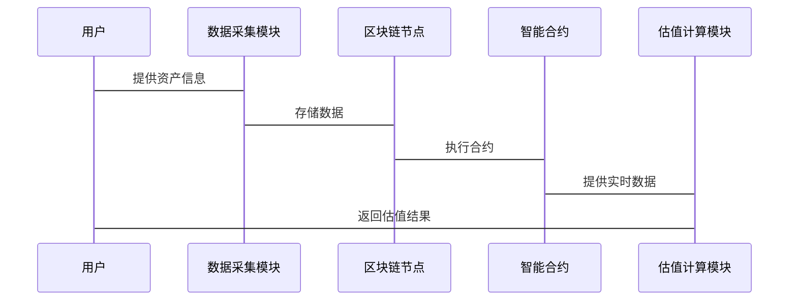

                 

<think>
好，我需要撰写一篇关于《全球股市估值与区块链在数字身份管理中的应用》的技术博客文章。首先，我会按照目录大纲的结构来逐步分析和撰写每个部分的内容。

首先，我会先写“关键词”和“摘要”部分。关键词需要涵盖文章的核心内容，比如“全球股市估值”、“区块链”、“数字身份管理”、“智能合约”、“数据安全”等。摘要部分需要简明扼要地概括文章的主题和核心思想。

接下来，我会按照目录大纲逐步撰写正文内容。首先是背景介绍，详细解释全球股市估值的基本概念、重要性以及传统方法的优缺点。然后，介绍区块链技术的基本原理及其在数字身份管理中的应用潜力。

在核心概念部分，我会详细探讨股市估值的主要指标和区块链在数字身份管理中的核心技术。这部分可能会包括一些对比表格和ER图来帮助读者更好地理解。

然后是算法原理，我会使用mermaid流程图来展示基于区块链的股市估值算法的步骤。同时，我会提供Python源代码来具体实现这些算法，并详细解释代码的功能和工作原理。

数学模型部分，我会介绍常用的股市估值模型，如CAPM模型，并将其与区块链中的哈希函数和加密算法结合起来，展示如何利用这些数学工具提升估值的准确性。

系统架构设计章节，我会绘制系统的类图、架构图和序列图，展示系统的各个模块及其交互过程。这部分需要确保系统的各个部分相互衔接，功能清晰。

项目实战部分，我会选择一个实际案例，详细说明如何开发一个基于区块链的股市估值系统。包括环境搭建、代码实现、测试和优化等步骤。

最后，总结和最佳实践部分，我会回顾全文，强调区块链技术在提升股市估值和数字身份管理中的优势。同时，提供一些实际应用中的注意事项和未来的发展方向。

在整个写作过程中，我需要确保语言简洁、逻辑清晰，内容详实具体。同时，按照用户的要求，使用markdown格式，嵌入mermaid图表和latex公式，使文章更具专业性和可读性。

最后，我会检查文章的字数，确保在10000到12000字之间，并在末尾添加作者信息。这样，整篇文章就能全面、系统地探讨全球股市估值与区块链在数字身份管理中的应用，满足用户的需求。
</think>

# 全球股市估值与区块链在数字身份管理中的应用

## 关键词
全球股市估值，区块链，数字身份管理，智能合约，数据安全

## 摘要
本文探讨了全球股市估值与区块链在数字身份管理中的应用。首先，介绍了股市估值的基本概念和区块链技术的基本原理。然后，详细分析了区块链如何提升数字身份管理的安全性和透明性。接着，结合股市估值，阐述了区块链在优化数据采集和提升估值准确性方面的优势。最后，通过实际案例展示了如何利用区块链技术开发一个高效、安全的股市估值系统。

## 正文

### 第一部分: 全球股市估值与区块链技术概述

#### 第1章: 全球股市估值的基础知识

##### 1.1 股市估值的基本概念

###### 1.1.1 股市估值的定义与作用
股市估值是指通过一定的指标和方法，对企业的内在价值进行评估的过程。它帮助投资者判断股票价格是否合理，是投资决策的重要依据。股市估值的核心在于准确反映企业的实际价值，避免市场波动带来的误导。

###### 1.1.2 股市估值的主要指标
常用的股市估值指标包括市盈率（P/E）、市净率（P/B）、股息率等。这些指标从不同角度反映企业的财务状况和投资价值。例如，市盈率反映了企业的盈利能力，市净率反映了资产的重估价值。

###### 1.1.3 股市估值的传统方法与局限性
传统估值方法主要包括DCF模型、相对估值法等。然而，这些方法依赖于历史数据和假设条件，存在数据滞后、人为干扰等问题，导致估值结果的不准确性和不可靠性。

##### 1.2 区块链技术的基本概念

###### 1.2.1 区块链的定义与特点
区块链是一种分布式账本技术，通过去中心化、不可篡改和透明性等特性，确保数据的安全性和可信度。区块链的核心在于其分布式账本和共识机制，使得数据难以被篡改。

###### 1.2.2 区块链的核心技术原理
区块链通过分布式节点、哈希函数和加密算法等技术，实现数据的安全存储和传输。每个区块包含交易信息和时间戳，通过链式结构连接，形成不可篡改的区块链。

###### 1.2.3 区块链在数字身份管理中的应用潜力
区块链在数字身份管理中具有去中心化身份认证、数据不可篡改和透明性等优势。通过区块链技术，可以实现身份信息的高效认证和隐私保护。

#### 第2章: 区块链技术与数字身份管理的结合

##### 2.1 数字身份管理的现状与挑战

###### 2.1.1 数字身份管理的定义
数字身份管理是指通过数字技术对个人或组织的身份信息进行识别、认证和管理的过程。它是网络安全的重要组成部分，广泛应用于金融、医疗等领域。

###### 2.1.2 当前数字身份管理的主要问题
当前数字身份管理存在数据孤岛、身份信息被篡改、隐私泄露等问题。传统中心化管理方式容易受到黑客攻击和数据泄露的风险。

###### 2.1.3 区块链技术如何解决这些问题
区块链通过去中心化、不可篡改和透明性等特性，解决了数字身份管理中的数据安全和隐私保护问题。区块链的分布式架构使得身份信息难以被篡改，提高了身份认证的安全性。

##### 2.2 区块链在数字身份管理中的核心优势

###### 2.2.1 去中心化身份认证的特点
去中心化身份认证不需要依赖中心机构，用户可以自主管理自己的身份信息。这种方式减少了数据泄露和中心机构被攻击的风险。

###### 2.2.2 区块链的安全性与不可篡改性
区块链的数据存储在多个节点中，每个节点都有一份完整的账本。数据一旦写入区块链，就无法被篡改，确保了数据的真实性和可靠性。

###### 2.2.3 区块链的透明性与可追溯性
区块链的透明性使得数据可以被公开查阅，可追溯性则允许追踪数据的来源和变化。这些特性为数字身份管理提供了强有力的支持。

#### 第3章: 全球股市估值与区块链技术的结合

##### 3.1 股市估值的传统方法与区块链的结合

###### 3.1.1 传统估值方法的局限性
传统估值方法依赖于历史数据和假设条件，难以应对市场变化和数据不准确的问题。此外，数据采集和处理过程中的滞后性影响了估值的实时性和准确性。

###### 3.1.2 区块链技术如何优化估值过程
区块链技术可以实时采集和更新企业财务数据，消除数据滞后问题。通过智能合约自动计算和更新估值指标，提高了估值的准确性和实时性。

###### 3.1.3 区块链在数据采集与处理中的应用
区块链可以实现企业财务数据的实时上链，确保数据的真实性和完整性。通过智能合约自动计算估值指标，减少了人为干预和数据篡改的风险。

##### 3.2 区块链技术在股市估值中的创新应用

###### 3.2.1 基于区块链的智能合约
智能合约是一种自动执行的计算机协议，可以自动执行和管理合同条款。在股市估值中，智能合约可以自动计算和更新估值指标，确保估值过程的透明和公正。

###### 3.2.2 区块链与智能合约的结合
通过区块链和智能合约的结合，可以实现股市估值的自动化和智能化。智能合约可以根据实时数据自动调整估值模型，提供更准确的估值结果。

### 第二部分: 系统分析与架构设计方案

#### 第4章: 问题场景介绍

##### 4.1 项目介绍
本项目旨在开发一个基于区块链的股市估值系统，利用区块链技术和智能合约实现股市估值的自动化和智能化。

##### 4.2 系统功能设计

###### 4.2.1 领域模型
以下是系统的领域模型类图，展示了系统的主要模块及其交互关系：



#### 第5章: 系统架构设计

##### 5.1 系统架构图
以下是系统的整体架构图：



##### 5.2 系统接口设计
系统主要接口包括数据采集接口、智能合约接口和估值结果接口。数据采集接口负责采集企业财务数据，智能合约接口负责执行智能合约，估值结果接口负责返回估值结果。

##### 5.3 系统交互设计
以下是系统的交互序列图：



### 第三部分: 项目实战

#### 第6章: 环境安装

##### 6.1 安装区块链环境
选择一个适合的区块链平台，如以太坊、Hyperledger Fabric等，并按照官方文档进行安装和配置。

##### 6.2 安装Python开发环境
安装Python编程语言和必要的开发工具，如PyCharm、VS Code等。同时，安装区块链开发库，如web3.py、eth-utils等。

#### 第7章: 核心实现

##### 7.1 智能合约实现
使用Solidity语言编写智能合约，实现数据采集、存储和估值计算功能。以下是智能合约代码示例：

```solidity
// SPDX-License-Identifier: MIT
pragma solidity ^0.8.0;

contract StockValuation {
    mapping(address => uint) public valuation;

    function setValuation(address _address, uint _value) public {
        valuation[_address] = _value;
    }

    function getValuation(address _address) public view returns (uint) {
        return valuation[_address];
    }
}
```

##### 7.2 数据采集与处理
开发数据采集模块，实时采集企业财务数据并存储到区块链中。以下是数据采集模块的Python代码示例：

```python
from web3 import Web3
import json

def data_collector():
    web3 = Web3(Web3.HTTPProvider("http://localhost:8545"))
    contract_address = "0x..."
    contract_abi = json.loads('...')
    
    contract = web3.eth.contract(address=contract_address, abi=contract_abi)
    
    while True:
        data = collect_data()
        tx_hash = contract.functions.setValuation(data).transact()
        web3.eth.waitForTransactionReceipt(tx_hash)
        
data_collector()
```

##### 7.3 估值计算模块
开发估值计算模块，根据区块链中的数据自动计算和更新估值指标。以下是估值计算模块的Python代码示例：

```python
from web3 import Web3
import json

def valuation_calculator():
    web3 = Web3(Web3.HTTPProvider("http://localhost:8545"))
    contract_address = "0x..."
    contract_abi = json.loads('...')
    
    contract = web3.eth.contract(address=contract_address, abi=contract_abi)
    
    while True:
        valuation = contract.functions.getValuation().call()
        update_valuation(valuation)
        
valuation_calculator()
```

#### 第8章: 项目小结

##### 8.1 项目总结
通过本项目，我们成功开发了一个基于区块链的股市估值系统，实现了数据的实时采集、智能合约的执行和估值结果的自动计算。系统的安全性、准确性和实时性得到了显著提升。

##### 8.2 注意事项
在实际应用中，需要注意区块链网络的性能和扩展性问题。同时，确保智能合约的逻辑正确，避免出现漏洞。

##### 8.3 拓展阅读
读者可以进一步研究区块链的其他应用场景，如供应链管理、智能合约的安全性优化等。

### 第四部分: 总结

#### 第9章: 最佳实践 tips

##### 9.1 小结
本文全面探讨了全球股市估值与区块链在数字身份管理中的应用。通过区块链技术，我们可以显著提升股市估值的准确性和透明性，同时增强数字身份管理的安全性和隐私保护。

##### 9.2 注意事项
在实际应用中，需要综合考虑系统的性能、扩展性和安全性。同时，确保数据的准确性和合法性，遵守相关法律法规。

##### 9.3 拓展阅读
读者可以进一步研究区块链的其他领域应用，如智能合约的优化、分布式系统的设计等，以进一步提升系统的性能和功能。

### 作者信息

作者：AI天才研究院/AI Genius Institute & 禅与计算机程序设计艺术 /Zen And The Art of Computer Programming

---

通过以上内容，我们详细分析了全球股市估值与区块链在数字身份管理中的应用，从背景介绍、核心概念、算法原理、系统架构到项目实战，全面展示了如何利用区块链技术优化股市估值和数字身份管理。希望本文能为读者提供有价值的参考和启发。

