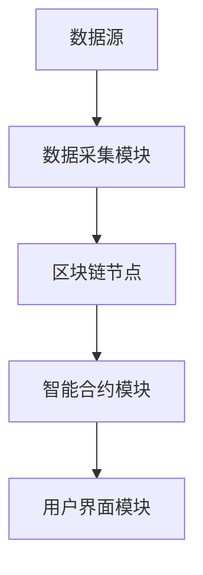

                 

# 全球股市估值与区块链应用的关联

> 关键词：全球股市估值，区块链，智能合约，去中心化，金融创新

> 摘要：本文探讨了区块链技术如何影响全球股市估值。通过分析区块链的核心原理、其在金融领域的应用以及对股市估值的具体影响，本文揭示了区块链如何通过提高透明度、优化模型和提升效率来改变传统的估值方法。结合实际案例和系统架构设计，本文为读者提供了全面的技术视角和实践指导。

---

## 第1章 全球股市估值概述

### 1.1 什么是全球股市估值

#### 1.1.1 股市估值的基本概念

股市估值是指对上市公司股票价值的评估，通常基于公司财务数据、市场环境和行业趋势等因素。常见的估值方法包括市盈率（P/E）、市净率（P/B）和现金流折现法（DCF）等。这些方法帮助投资者确定股票的合理价格区间。

#### 1.1.2 股市估值的主要方法

- **市盈率（P/E）**：用股价除以每股收益，反映市场对公司的预期。
- **市净率（P/B）**：用股价除以每股净资产，适用于评估资产密集型行业。
- **现金流折现法（DCF）**：基于未来现金流的现值估算公司价值。

#### 1.1.3 股市估值的经济意义

股市估值为投资者提供了决策依据，帮助识别被低估或高估的股票，同时也为公司管理层提供了优化资本结构的参考。

---

### 1.2 全球股市的现状与挑战

#### 1.2.1 全球主要股市的分布与特点

全球主要股市包括纽约证券交易所（NYSE）、纳斯达克（NASDAQ）、伦敦金融时报（FTSE）和东京证券交易所（TSE）等。不同市场的特点包括交易规则、参与者和监管框架的差异。

#### 1.2.2 股市估值中的常见问题

- 数据不透明：传统估值方法依赖于公开财务数据，可能存在滞后或不准确的问题。
- 高交易成本：跨市场交易涉及高昂的佣金和结算费用。
- 信息不对称：投资者获取信息的不平等影响了估值的准确性。

#### 1.2.3 区块链技术在金融领域的潜力

区块链技术通过去中心化、不可篡改和高效透明的特点，有望解决传统金融中的信任和效率问题。

---

## 第2章 区块链技术基础

### 2.1 区块链的核心概念

#### 2.1.1 区块链的定义与特点

区块链是一种去中心化的分布式账本技术，通过密码学确保数据安全，且数据不可篡改。

#### 2.1.2 区块链的分类与应用场景

- **公有链**：如比特币和以太坊，任何人都可以参与。
- **联盟链**：用于特定机构之间的协作，如供应链金融。
- **私有链**：仅限于特定用户，如企业内部使用。

#### 2.1.3 区块链的去中心化特性

去中心化意味着没有单点故障，提高了系统的抗攻击性和稳定性。

---

### 2.2 区块链的核心原理

#### 2.2.1 区块链的数据结构

区块链由区块和链组成，每个区块包含交易数据和时间戳，通过哈希指针连接。

#### 2.2.2 区块链的共识机制

- **工作量证明（PoW）**：比特币采用的机制，通过计算找到有效哈希值。
- **权益证明（PoS）**：以太坊计划过渡到的机制，根据持币数量分配记账权。
- **实用拜占庭容错（PBFT）**：适用于联盟链的高效共识算法。

#### 2.2.3 区块链的哈希函数与Merkle树

哈希函数用于生成数据的唯一指纹，Merkle树用于高效验证数据完整性。

---

### 2.3 区块链的共识机制

#### 2.3.1 工作量证明（PoW）

通过计算找到有效区块哈希值，确保网络安全，但消耗大量计算资源。

#### 2.3.2 权益证明（PoS）

根据持币数量分配记账权，降低了能源消耗，但可能面临“富者愈富”的问题。

#### 2.3.3 其他共识机制

包括 delegated PoS（dPoS）和门限签名等，适用于不同场景。

---

## 第3章 区块链在金融领域的应用

### 3.1 区块链在金融领域的优势

#### 3.1.1 提高交易透明度

区块链的透明性和不可篡改性降低了信任成本。

#### 3.1.2 降低交易成本

通过自动化和去中心化减少中间环节，降低交易佣金和结算成本。

#### 3.1.3 提升交易效率

智能合约自动执行，减少人工干预，提升交易速度。

---

### 3.2 区块链在金融领域的具体应用

#### 3.2.1 数字货币与支付

区块链支持去中心化数字货币，如比特币和以太坊，实现快速、低成本的跨境支付。

#### 3.2.2 智能合约

智能合约自动执行合同条款，确保交易的可追溯性和自动化。

#### 3.2.3 供应链金融

区块链用于追踪物流信息，优化供应链融资，降低风险。

---

### 3.3 区块链在金融监管中的作用

#### 3.3.1 提高监管效率

区块链提供实时数据追踪，帮助监管机构快速发现违规行为。

#### 3.3.2 降低监管成本

自动化监控和报告减少人工审核的工作量。

#### 3.3.3 增强监管透明度

区块链的数据不可篡改性增强监管机构的信任基础。

---

## 第4章 区块链技术对全球股市估值的影响

### 4.1 区块链技术如何改变股市估值

#### 4.1.1 提高数据透明度

区块链确保财务数据的真实性和及时性，减少信息不对称。

#### 4.1.2 优化估值模型

通过实时数据分析和智能合约，动态调整估值参数，提高准确性。

#### 4.1.3 提升估值效率

自动化数据处理和智能合约执行，减少人工操作，提升估值速度。

---

### 4.2 区块链在股市估值中的具体应用

#### 4.2.1 智能合约在估值中的应用

智能合约自动执行估值模型，实时调整股票价格。

#### 4.2.2 区块链在数据共享中的应用

通过区块链实现跨机构的数据共享，支持更全面的估值分析。

#### 4.2.3 区块链在风险管理中的应用

实时监控市场波动，利用区块链技术进行风险预警和控制。

---

### 4.3 区块链技术对股市估值的挑战

#### 4.3.1 技术挑战

需要解决区块链的扩展性问题，如交易速度和网络延迟。

#### 4.3.2 法律与监管挑战

区块链技术的跨国性和去中心化特性与现有监管框架可能存在冲突。

#### 4.3.3 安全挑战

尽管区块链本身安全，但智能合约的漏洞可能引发风险。

---

## 第5章 区块链技术在股市估值中的实现

### 5.1 区块链技术在股市估值中的核心算法

#### 5.1.1 哈希函数在数据完整性中的应用

通过哈希函数确保数据在传输过程中的完整性，防止篡改。

#### 5.1.2 智能合约的实现原理

智能合约基于区块链平台编写，自动执行预设的条件。

#### 5.1.3 区块链的共识机制在估值中的应用

共识机制确保数据的一致性和可靠性，支持准确的估值计算。

---

### 5.2 区块链技术的数学模型

#### 5.2.1 哈希函数的数学表达

$$ H(m) = \text{hash}(m) $$

其中，$H(m)$ 表示对消息 $m$ 进行哈希计算的结果。

#### 5.2.2 智能合约的执行流程

智能合约的执行基于区块链的交易确认，确保每笔交易的合法性。

---

### 5.3 系统架构设计

#### 5.3.1 系统功能设计

- 数据采集模块：收集股票市场数据和财务信息。
- 智能合约模块：执行自动化的估值计算。
- 用户界面模块：提供数据可视化和交互功能。

#### 5.3.2 系统架构图

---

## 总结

区块链技术通过提高透明度、优化模型和提升效率，正在改变全球股市估值的方式。尽管面临技术、法律和安全等挑战，但其潜力巨大。未来，随着技术的成熟和监管框架的完善，区块链将在金融领域发挥更大的作用。

作者：AI天才研究院 & 禅与计算机程序设计艺术

