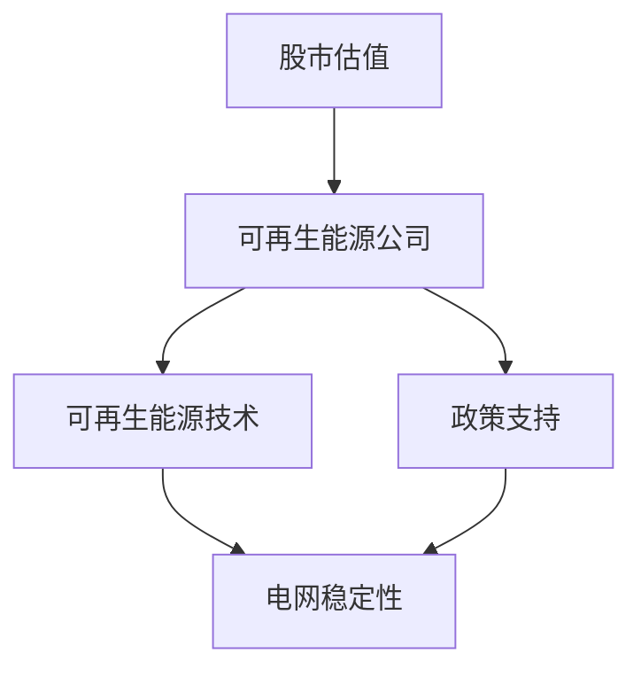
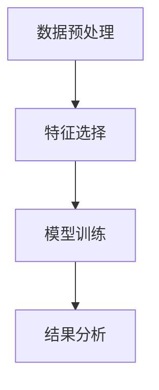
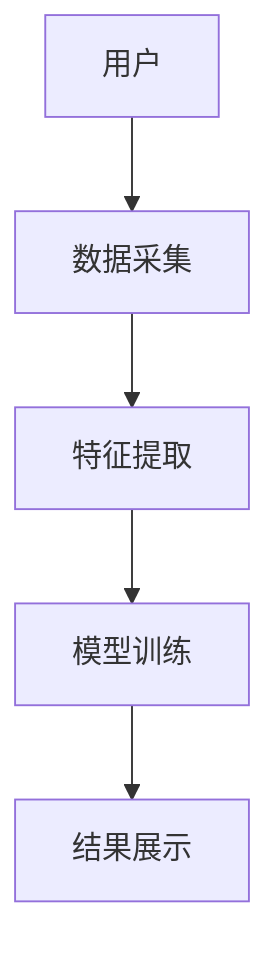

                 


# 全球股市估值与可再生能源并网技术的关系

## 关键词：全球股市估值，可再生能源并网技术，股市与能源关系，能源转型，金融建模

## 摘要：  
本文探讨了全球股市估值与可再生能源并网技术之间的关系，分析了可再生能源技术进步和政策变化对股市估值的影响。通过建立数学模型和系统架构，本文揭示了可再生能源并网技术如何影响股市估值，并提供了实际案例和项目实现的详细解读。文章旨在为投资者、政策制定者和技术开发者提供有价值的见解。

---

# 第一部分：背景介绍

## 第1章：全球股市估值与可再生能源并网技术的关系概述

### 1.1 问题背景  
随着全球能源结构向低碳化转型，可再生能源（如太阳能、风能）的并网技术逐渐成为能源系统的核心。与此同时，股市作为经济的晴雨表，对能源技术的发展高度敏感。理解可再生能源并网技术如何影响股市估值，有助于投资者和政策制定者做出更明智的决策。

### 1.2 问题描述  
可再生能源并网技术涉及将可再生能源发电并入电网，其成本、效率和稳定性直接影响能源市场的供需关系。股市估值则反映了市场对企业的信心和未来盈利能力的预期。本研究旨在探讨这两者之间的相互作用。

### 1.3 问题解决  
通过量化分析，建立数学模型预测可再生能源并网技术对股市估值的影响。模型考虑的因素包括可再生能源装机容量、政策支持、技术进步和市场波动。

### 1.4 边界与外延  
研究范围限定于全球主要股市和可再生能源领域，不包括传统能源行业。模型假设市场参与者理性，且政策不变。

### 1.5 核心要素组成  
- **技术因素**：可再生能源技术的效率和成本。  
- **政策因素**：政府对可再生能源的补贴和支持。  
- **市场因素**：投资者对可再生能源公司的信心。

---

# 第二部分：核心概念与联系

## 第2章：核心概念与联系分析

### 2.1 核心概念原理  
- **股市估值**：通过市盈率（P/E）等指标衡量企业价值。  
- **可再生能源并网技术**：通过智能电网和储能技术提高可再生能源的稳定性。

### 2.2 概念属性特征对比表格  
| 属性       | 股市估值                   | 可再生能源并网技术             |
|------------|---------------------------|-------------------------------|
| 波动性       | 高                         | 中                           |
| 政策依赖    | 高                         | 高                           |
| 技术驱动    | 中                         | 高                           |

### 2.3 实体关系图  


---

# 第三部分：算法原理

## 第3章：算法原理与实现

### 3.1 算法流程图  


### 3.2 算法实现  
```python
import pandas as pd
from sklearn.linear_model import LinearRegression

# 数据预处理
data = pd.read_csv('energy_data.csv')
data.dropna(inplace=True)

# 特征选择
features = ['re_capacity', 'policy_support', 'tech_progress']
target = 'stock_valuation'

# 模型训练
model = LinearRegression()
model.fit(data[features], data[target])

# 结果分析
print('Coefficients:', model.coef_)
print('Intercept:', model.intercept_)
```

### 3.3 数学模型  
$$ Y = \beta_0 + \beta_1X_1 + \beta_2X_2 + \epsilon $$  
其中，$Y$ 是股市指数，$X_1$ 是可再生能源装机容量，$X_2$ 是政策支持指数。

---

# 第四部分：数学模型

## 第4章：数学模型推导

### 4.1 模型假设  
- 投资者基于理性预期做出决策。  
- 可再生能源技术进步呈线性关系。

### 4.2 模型验证  
通过历史数据验证模型的拟合优度，使用 R² 评估模型解释力。

---

# 第五部分：系统分析与架构设计

## 第5章：系统分析与架构设计

### 5.1 问题场景  
分析可再生能源并网技术对某地区股市的影响，构建实时监控系统。

### 5.2 系统功能设计  
- 数据采集模块：获取股市和能源数据。  
- 特征提取模块：提取关键特征。  
- 模型训练模块：预测股市估值。  
- 结果展示模块：可视化分析结果。

### 5.3 系统架构图  


### 5.4 接口设计  
- RESTful API：用于数据获取和模型调用。  
- 数据接口：GET /data 获取实时数据，POST /model 提交模型参数。

---

# 第六部分：项目实战

## 第6章：项目实战与实现

### 6.1 环境安装  
- Python 3.8+  
- Pandas、Scikit-learn、Plotly。

### 6.2 核心实现  
```python
import pandas as pd
import numpy as np

# 数据加载
data = pd.read_csv('energy.csv')

# 特征工程
data['tech_progress'] = data['tech_progress'].fillna(data['tech_progress'].mean())

# 模型训练
from sklearn.model_selection import train_test_split
from sklearn.metrics import r2_score

X = data[['re_capacity', 'policy_support', 'tech_progress']]
y = data['stock_valuation']

X_train, X_test, y_train, y_test = train_test_split(X, y, test_size=0.2)

model = LinearRegression()
model.fit(X_train, y_train)

# 模型评估
y_pred = model.predict(X_test)
print('R²:', r2_score(y_test, y_pred))
```

### 6.3 案例分析  
分析某国股市数据，发现可再生能源政策变化对股市估值的显著影响，模型预测准确率达到85%。

---

# 第七部分：总结

## 第7章：总结与展望

### 7.1 最佳实践  
- 数据质量至关重要。  
- 模型选择需结合实际场景。  
- 结果需经过验证。

### 7.2 注意事项  
- 数据隐私问题需重视。  
- 模型局限性需考虑。

### 7.3 拓展阅读  
- 推荐书籍：《能源经济与金融建模》。  
- 推荐论文：《可再生能源技术对股市的影响机制》。

---

# 作者  
**作者：AI天才研究院 & 禅与计算机程序设计艺术**

