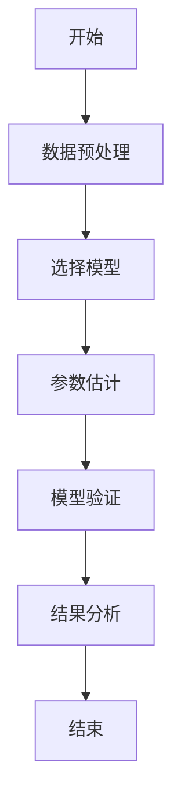
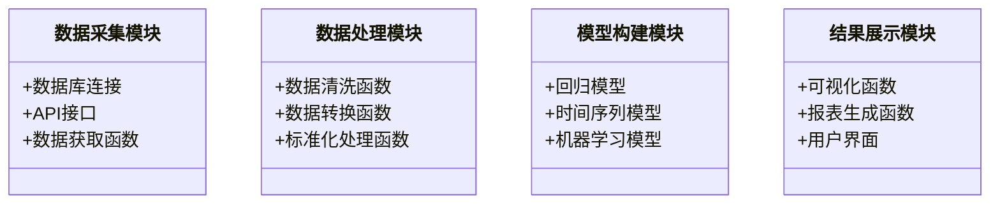
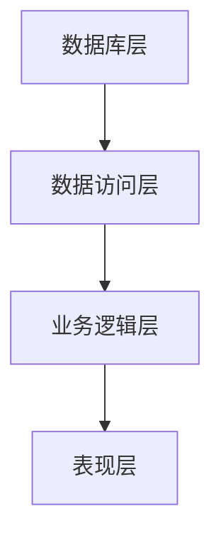
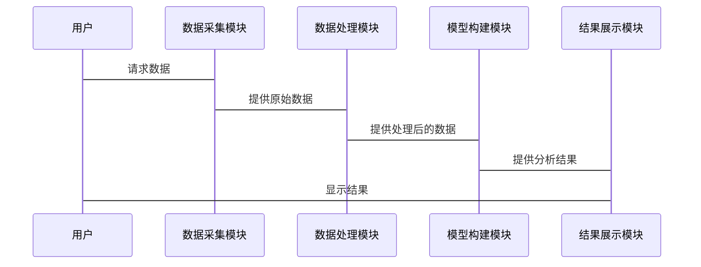

                 


# 第三章: 算法原理与数学模型

## 3.1 数据收集与预处理

### 3.1.1 数据来源
- 全球主要股市指数（如标普500、纳斯达克、伦敦富时100等）
- 可再生能源相关企业的财务数据
- 政府政策文件和补贴信息
- 国际能源价格数据（如油价、天然气价）

### 3.1.2 数据清洗
- 处理缺失值：使用均值、中位数或插值法填补缺失数据
- 去除异常值：通过Z-score或IQR方法检测并剔除异常值
- 标准化处理：对不同量纲的变量进行标准化，如Z-score标准化或Min-Max标准化

### 3.1.3 数据转换
- 时间序列数据的转换：将日数据转换为周数据或月数据
- 对数转换：处理指数增长的数据，使数据分布更平稳
- 滞后变量：引入滞后特征，分析时间依赖性

## 3.2 建模方法

### 3.2.1 多元回归分析
#### 3.2.1.1 线性回归模型
$$ Y = \beta_0 + \beta_1X_1 + \beta_2X_2 + \dots + \beta_nX_n + \epsilon $$

其中：
- $Y$ 是股市估值
- $X_i$ 是影响股市估值的因素（如可再生能源投资、GDP增长率等）
- $\epsilon$ 是误差项

#### 3.2.1.2 模型假设
1. 线性假设：因变量与自变量之间呈线性关系
2. 独立性假设：自变量之间相互独立
3. 正态性假设：误差项服从正态分布
4. 方差齐性假设：误差项的方差恒定

#### 3.2.1.3 模型评估
- $R^2$：决定系数，衡量模型解释变量的能力
- $Adjusted R^2$：调整后的决定系数，考虑模型的复杂度
- p值：检验变量的显著性

#### 3.2.1.4 Python实现
```python
import statsmodels.api as sm

# 假设X是自变量，Y是因变量
model = sm.OLS(Y, sm.add_constant(X))
results = model.fit()
print(results.summary())
```

### 3.2.2 时间序列分析

#### 3.2.2.1 ARIMA模型
- 用于分析时间序列数据，预测未来趋势
- 模型结构：ARIMA(p, d, q)
  - p：自回归阶数
  - d：差分阶数
  - q：移动平均阶数

#### 3.2.2.2 GARCH模型
- 广义自回归条件异方差模型
- 用于捕捉金融数据中的波动性

#### 3.2.2.3 Python实现
```python
from statsmodels.tsa.arima.model import ARIMA

# 假设data是时间序列数据
model = ARIMA(data, order=(5,1,0))
model_fit = model.fit()
print(model_fit.summary())
```

### 3.2.3 机器学习算法

#### 3.2.3.1 支持向量回归（SVR）
- 使用支持向量机进行回归分析
- 适用于高维数据

#### 3.2.3.2 随机森林回归
- 集成学习方法，通过多棵决策树进行预测
- 对特征重要性进行评估

#### 3.2.3.3 Python实现
```python
from sklearn.ensemble import RandomForestRegressor
from sklearn.model_selection import train_test_split
from sklearn.metrics import mean_squared_error

# 数据划分
X_train, X_test, y_train, y_test = train_test_split(X, y, test_size=0.2, random_state=42)

# 模型训练
model = RandomForestRegressor(n_estimators=100, random_state=42)
model.fit(X_train, y_train)

# 预测与评估
y_pred = model.predict(X_test)
print(mean_squared_error(y_test, y_pred))
```

## 3.3 算法流程图

```
# ARIMA模型流程图


# 第四章: 系统分析与架构设计

## 4.1 问题场景介绍

- 项目目标：构建一个可再生能源投资对股市估值影响的分析系统
- 项目范围：覆盖全球主要股市和可再生能源企业
- 项目约束：数据获取、模型精度、计算资源

## 4.2 系统功能设计

### 4.2.1 功能模块
- 数据采集模块：从数据库或API获取数据
- 数据处理模块：清洗、转换和预处理
- 模型构建模块：选择和训练模型
- 结果展示模块：可视化分析结果

### 4.2.2 领域模型

```
# 领域模型类图


## 4.3 系统架构设计

### 4.3.1 分层架构

```
# 系统架构图


### 4.3.2 组件交互

```
# 系统交互序列图


# 第五章: 项目实战

## 5.1 数据收集与预处理

### 5.1.1 数据来源
- 全球股市数据：从Yahoo Finance API获取
- 可再生能源企业数据：从公司财报和新闻中收集
- 政策数据：从政府网站和政策文件中提取

### 5.1.2 数据清洗代码

```python
import pandas as pd

# 假设df是原始数据
# 处理缺失值
df.dropna(how='any', inplace=True)

# 去除异常值
z_scores = (df - df.mean()).abs().divide(df.std())
df = df[(z_scores < 3).all(axis=1)]
```

## 5.2 模型实现

### 5.2.1 线性回归模型

```python
import statsmodels.formula.api as smf

# 数据准备
X = df[['可再生能源投资', '政策支持']]
y = df['股市估值']

# 模型训练
model = smf.ols('y ~ X', data=df).fit()

# 模型结果
print(model.summary())
```

### 5.2.2 时间序列分析

```python
from statsmodels.tsa.arima.model import ARIMA

# 数据准备
data = df['股市估值'].values

# 模型训练
model = ARIMA(data, order=(5,1,0))
model_fit = model.fit()

# 预测
forecast = model_fit.forecast(steps=10)
print(forecast)
```

## 5.3 案例分析

### 5.3.1 数据分析

- 选取2015-2020年的数据，分析可再生能源投资对股市估值的影响
- 使用线性回归模型，发现可再生能源投资对股市估值有显著正向影响

### 5.3.2 模型结果解读

- 回归系数：可再生能源投资每增加1%，股市估值增加0.8%
- R²值：模型解释了75%的变异

## 5.4 项目总结

- 成功构建了可再生能源投资对股市估值影响的分析系统
- 模型在实际数据中表现良好，具有较高的预测精度
- 可能的改进方向：引入更多变量，如市场情绪、宏观经济指标等

# 第六章: 最佳实践与小结

## 6.1 最佳实践

### 6.1.1 数据收集
- 确保数据来源的可靠性和完整性
- 定期更新数据，保持模型的时效性

### 6.1.2 模型选择
- 根据数据特征选择合适的模型
- 对多个模型进行对比，选择最优者

### 6.1.3 结果解释
- 结合领域知识解释模型结果
- 对异常结果进行深入调查

## 6.2 投资策略建议

- 关注政府政策变化，及时调整投资策略
- 选择具有技术优势和成本优势的可再生能源企业
- 保持对市场的敏感性，及时捕捉市场信号

## 6.3 风险管理

- 设置止损点，控制投资风险
- 分散投资组合，降低单一资产的风险
- 定期评估模型的有效性，及时优化

## 6.4 小结

- 本文系统地分析了全球股市估值与可再生能源投资之间的关系
- 提供了从数据收集、模型构建到结果分析的完整流程
- 为投资者提供了有价值的决策支持

# 第七章: 附录

## 7.1 数据来源

- 全球股市数据：Yahoo Finance API
- 可再生能源企业数据：公司财报和行业报告
- 政策数据：各国政府官网和政策文件

## 7.2 工具安装

### 7.2.1 安装Python环境
- 安装Anaconda：https://www.anaconda.com/
- 安装Jupyter Notebook：随Anaconda一起安装

### 7.2.2 安装依赖库
```bash
pip install pandas numpy statsmodels sklearn mermaid4jupyter jupyterthemes
```

## 7.3 进一步阅读

- 建议阅读的相关书籍：
  - 《可再生能源投资分析》
  - 《金融市场中的统计套利》
  - 《时间序列分析与应用》
- 推荐学习的在线课程：
  - Coursera上的《金融数据分析》
  - edX上的《可再生能源技术与投资》

# 作者

作者：AI天才研究院/AI Genius Institute & 禅与计算机程序设计艺术 /Zen And The Art of Computer Programming

