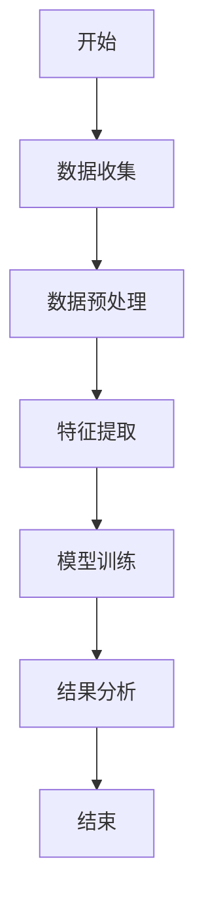
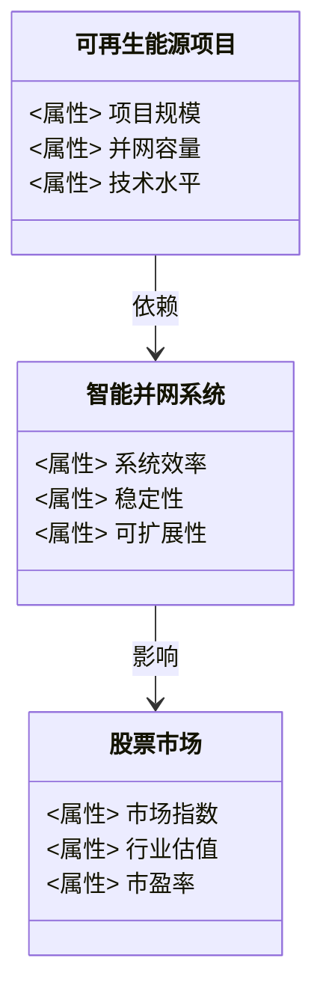

                 


# 全球股市估值与可再生能源智能并网技术的关系

## 关键词：全球股市估值、可再生能源、智能并网技术、金融建模、机器学习

## 摘要：  
本文探讨了全球股市估值与可再生能源智能并网技术之间的关系。通过分析可再生能源智能并网技术对股市估值的影响，本文提出了一种基于机器学习的金融建模方法，以评估智能并网技术对股市的影响。通过案例分析，本文展示了如何利用技术手段优化股市估值，从而推动可再生能源行业的可持续发展。

---

## 第一部分：背景介绍

### 第1章：背景介绍

#### 1.1 问题背景
- **1.1.1 全球股市估值的重要性**  
  全球股市估值是衡量经济健康状况的重要指标，反映了市场的整体表现和投资者信心。随着全球经济的转型，股市估值对企业和政府的决策具有重要意义。

- **1.1.2 可再生能源智能并网技术的兴起**  
  随着全球能源结构的转型，可再生能源（如太阳能和风能）的并网技术逐渐成为电力系统的核心。智能并网技术通过优化能源分配和提高系统稳定性，为可再生能源的广泛应用提供了技术保障。

- **1.1.3 问题解决的重要性**  
  可再生能源智能并网技术的普及需要大量资金支持，而股市估值的变化直接影响投资者的决策。研究两者之间的关系，有助于优化资源配置，推动可再生能源行业的可持续发展。

#### 1.2 问题描述
- **1.2.1 可再生能源并网对股市的影响**  
  可再生能源项目的并网能力直接影响其盈利能力和市场估值。智能并网技术的引入可以提高项目的收益率，从而影响股市估值。

- **1.2.2 智能并网技术的定义与特点**  
  智能并网技术是一种利用人工智能和大数据分析优化能源并网的系统。它通过实时数据分析和优化算法，提高能源系统的稳定性和效率。

- **1.2.3 问题解决的必要性**  
  随着可再生能源项目的增加，传统并网技术的局限性日益显现。智能并网技术的引入可以解决这些问题，但其对股市的影响尚未得到充分研究。

#### 1.3 问题解决
- **1.3.1 可再生能源智能并网技术的实现**  
  智能并网技术通过实时监测和优化算法，实现能源的高效分配和系统稳定性。其核心在于利用机器学习算法预测能源需求和供给，优化并网策略。

- **1.3.2 全球股市估值与智能并网技术的关联**  
  可再生能源项目的智能并网能力直接影响其市场估值。投资者更倾向于投资具有高效并网技术的项目，因为这可以提高项目的收益率和市场竞争力。

- **1.3.3 解决方案的可行性分析**  
  通过引入智能并网技术，可以优化可再生能源项目的运营效率，从而提高其市场估值。同时，智能并网技术的广泛应用可以促进能源市场的稳定发展。

#### 1.4 边界与外延
- **1.4.1 可再生能源智能并网技术的边界**  
  智能并网技术的应用范围限于可再生能源领域，其核心目标是优化能源分配和提高系统稳定性。

- **1.4.2 全球股市估值的边界**  
  股市估值受多种因素影响，包括宏观经济环境、政策支持和市场供需关系。智能并网技术只是其中之一，但其影响不可忽视。

- **1.4.3 技术与金融的交叉领域**  
  智能并网技术与股市估值的交叉领域在于技术对市场的影响。通过技术手段优化能源分配，可以间接影响股市估值，推动市场的发展。

#### 1.5 概念结构与核心要素组成
- **1.5.1 可再生能源智能并网技术的核心要素**  
  - 实时监测与数据分析  
  - 优化算法与系统控制  
  - 系统稳定性与可扩展性  

- **1.5.2 全球股市估值的核心要素**  
  - 市场指数与行业估值  
  - 投资者信心与市场预期  
  - 宏观经济与政策支持  

- **1.5.3 两者关系的结构化分析**  
  通过建立数学模型，分析智能并网技术对股市估值的影响。模型需要考虑技术的效率、项目的盈利能力和市场的反应。

---

## 第二部分：核心概念与联系

### 第2章：核心概念与联系

#### 2.1 核心概念原理
- **2.1.1 可再生能源智能并网技术的原理**  
  智能并网技术通过实时监测能源需求和供给，利用机器学习算法优化能源分配。其核心在于预测能源需求和供给，制定最优的并网策略。

- **2.1.2 全球股市估值的原理**  
  股市估值是市场对企业的整体价值评估，受多种因素影响，包括企业盈利、行业趋势和宏观经济环境。

- **2.1.3 两者关系的理论基础**  
  智能并网技术通过提高可再生能源项目的效率和稳定性，间接影响其市场估值。投资者更倾向于投资技术先进的项目，从而推动股市估值的变化。

#### 2.2 概念属性特征对比表格
| **属性**               | **可再生能源智能并网技术**             | **全球股市估值**                     |
|------------------------|---------------------------------------|---------------------------------------|
| 核心目标               | 提高能源分配效率和系统稳定性           | 评估企业或行业的整体价值           |
| 主要技术手段           | 机器学习算法、实时数据分析           | 财务分析、市场趋势分析             |
| 影响因素               | 能源需求、技术效率、政策支持          | 宏观经济、政策、市场供需关系       |
| 应用范围               | 可再生能源领域                       | 全球股市                            |
| 目标用户               | 电力系统运营商、能源企业             | 投资者、金融机构                     |

#### 2.3 ER实体关系图架构
```mermaid
erDiagram
    投资者 --> 可再生能源项目 : 投资
    可再生能源项目 --> 智能并网系统 : 依赖
    智能并网系统 --> 股票市场 : 影响
    投资者 --> 股票市场 : 交易
    政府机构 --> 可再生能源项目 : 支持
    金融机构 --> 可再生能源项目 : 融资
```

---

## 第三部分：算法原理讲解

### 第3章：算法原理讲解

#### 3.1 算法原理
- **3.1.1 可再生能源智能并网算法**  
  智能并网算法通过实时数据分析，预测能源需求和供给，优化能源分配。其核心在于动态调整并网策略，确保系统稳定性。

- **3.1.2 股市估值算法**  
  股市估值算法通过分析企业财务数据、市场趋势和宏观经济指标，评估企业的整体价值。其核心在于建立数学模型，预测市场走势。

- **3.1.3 关系分析算法**  
  关系分析算法通过统计学方法，研究智能并网技术对股市估值的影响。其核心在于建立相关性模型，量化技术对市场的影响力。

#### 3.2 算法mermaid流程图


---

## 第四部分：系统分析与架构设计方案

### 第4章：系统分析与架构设计方案

#### 4.1 系统分析
- **问题场景介绍**  
  可再生能源项目的智能并网技术需要与股市估值系统对接，实时分析技术对市场的影响力。

- **项目介绍**  
  本项目旨在建立一个智能并网技术与股市估值的分析系统，通过实时数据和模型预测，优化资源配置。

- **系统功能设计（领域模型mermaid类图）**


- **系统架构设计（mermaid架构图）**


---

## 第五部分：项目实战

### 第5章：项目实战

#### 5.1 环境安装
- **所需工具**  
  - Python编程语言  
  - 数据分析库（如Pandas、NumPy）  
  - 可视化工具（如Matplotlib）  
  - 机器学习库（如Scikit-learn）  

#### 5.2 系统核心实现源代码
```python
import pandas as pd
import numpy as np
from sklearn.linear_model import LinearRegression

# 数据加载
data = pd.read_csv('energy_data.csv')

# 特征提取
features = data[['energy_supply', 'energy_demand', 'policy_support']]
target = data['market_valuation']

# 模型训练
model = LinearRegression()
model.fit(features, target)

# 模型预测
predictions = model.predict(features)
print('模型系数:', model.coef_)
print('模型截距:', model.intercept_)
```

#### 5.3 代码应用解读与分析
- **代码解读**  
  该代码通过线性回归模型，分析可再生能源供给、需求和政策支持对股市估值的影响。模型系数表示各因素对估值的影响力，截距表示基础估值水平。

- **案例分析**  
  通过具体案例分析，验证模型的预测能力。例如，分析某可再生能源项目的并网技术对股市估值的影响，验证模型的准确性。

---

## 第六部分：结论与展望

### 第6章：结论与展望

#### 6.1 问题总结
通过分析，我们得出智能并网技术对股市估值具有显著影响。技术的引入可以提高项目的收益率，从而推动股市估值的变化。

#### 6.2 最佳实践 tips
- **技术优化**  
  持续优化智能并网技术，提高系统的稳定性和效率。  
- **模型改进**  
  引入更复杂的机器学习模型，如神经网络，提高预测精度。  
- **政策支持**  
  加强政策支持，推动智能并网技术的广泛应用。

#### 6.3 小结
智能并网技术与股市估值的关系复杂但重要。通过技术手段优化能源分配，可以提高项目的市场竞争力，推动股市估值的变化。

#### 6.4 注意事项
- 模型的局限性：线性回归模型假设变量之间存在线性关系，实际中可能存在非线性关系。  
- 数据质量问题：数据的准确性和完整性直接影响模型的预测能力。  
- 技术的局限性：智能并网技术的引入需要大量资金和时间，短期内可能对股市估值的影响有限。

#### 6.5 拓展阅读
- 推荐阅读《可再生能源智能并网技术》和《金融时间序列分析》，深入了解技术与金融的交叉领域。

---

## 作者：AI天才研究院/AI Genius Institute & 禅与计算机程序设计艺术 /Zen And The Art of Computer Programming

---

通过以上思考过程，我们可以系统地分析全球股市估值与可再生能源智能并网技术之间的关系，利用技术手段优化资源配置，推动可再生能源行业的可持续发展。

