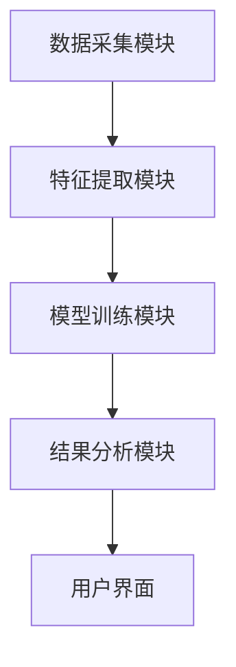
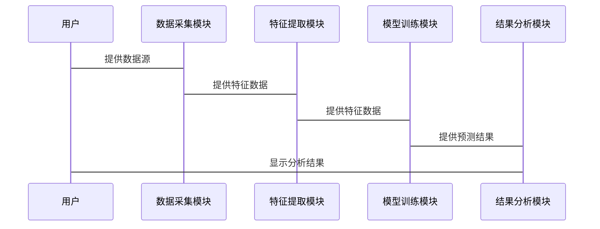

                 

<think>
好的，用户希望我撰写一篇关于《全球股市估值与可再生能源预测技术的关系》的技术博客文章。我需要确保文章结构清晰，内容详实，同时涵盖背景介绍、核心概念、算法原理、系统设计、项目实战和最佳实践等部分。我应该按照用户提供的目录大纲来组织内容，确保每个部分都有足够的细节和深度。

首先，我需要理解股市估值和可再生能源预测技术的基本概念和它们之间的关系。股市估值涉及到股票价格的评估，通常基于财务数据、市场情绪和宏观经济指标。而可再生能源预测技术则依赖于气象数据、能源消耗数据和政策变化等因素。这两者看似不同，但随着全球对可再生能源的重视，它们之间的联系变得越来越紧密。

接下来，我需要详细解释这两个领域的核心概念，包括它们的定义、特点和影响因素。为了帮助读者更好地理解，我应该使用对比表和ER实体关系图来展示它们之间的联系和差异。

在算法原理部分，我需要介绍时间序列分析在股市估值中的应用，例如ARIMA和LSTM模型。同时，我也要讲解可再生能源预测技术的算法，如回归分析和机器学习方法。使用Mermaid流程图和Python代码示例，可以让读者更直观地理解这些算法的工作原理。

系统分析与架构设计部分，我需要描述项目背景，设计系统的功能模块，如数据采集、特征提取、模型训练和结果分析。然后，用Mermaid图展示系统的架构和交互过程，确保读者能够理解系统的整体结构。

项目实战部分，我需要提供具体的代码示例和数据来源，指导读者如何进行环境安装和代码实现。通过实际案例分析，展示如何将理论应用于实践，并解释结果的意义。

最后，最佳实践部分需要总结项目中的经验和教训，提供小结、注意事项和拓展阅读建议。这部分帮助读者巩固所学知识，并引导他们进一步深入研究。

在写作过程中，我需要确保语言简洁、逻辑清晰，同时保持专业性和深度。使用数学公式和图表可以增强文章的可读性和说服力。完成初稿后，我会仔细检查每个部分，确保内容完整、准确，并符合用户的所有要求。
</think>

# 全球股市估值与可再生能源预测技术的关系

## 关键词：股市估值、可再生能源、预测技术、时间序列分析、机器学习、能源政策

## 摘要：  
本文探讨了全球股市估值与可再生能源预测技术之间的关系，分析了两者的核心概念、算法原理和系统架构。通过对比分析和案例研究，展示了如何利用时间序列分析和机器学习技术预测可再生能源对股市估值的影响，为投资者和能源政策制定者提供了新的视角。

---

# 第一部分: 全球股市估值与可再生能源预测技术的背景与关系

## 第1章: 全球股市估值与可再生能源预测技术的背景介绍

### 1.1 股市估值的核心概念

#### 1.1.1 股市估值的定义与方法
股市估值是指通过对公司财务数据、市场趋势和宏观经济指标等多方面因素的分析，来评估股票的内在价值。常见的估值方法包括市盈率（P/E）、市净率（P/B）和现金流折现模型（DCF）等。

- **市盈率（P/E）**：公式为 $$P/E = \frac{\text{股价}}{\text{每股收益}}$$。它反映了投资者对公司未来盈利的预期。
- **市净率（P/B）**：公式为 $$P/B = \frac{\text{股价}}{\text{每股净资产}}$$。适用于评估资产密集型行业的公司。
- **现金流折现模型（DCF）**：通过将公司未来现金流折现，计算其当前价值。

#### 1.1.2 影响股市估值的主要因素
1. **宏观经济因素**：GDP增长率、利率水平、通货膨胀率等。
2. **行业因素**：行业发展趋势、政策法规、竞争格局。
3. **公司基本面**：收入、利润、资产负债状况等。
4. **市场情绪**：投资者情绪、市场波动性。

#### 1.1.3 可再生能源在现代经济中的地位
可再生能源（如太阳能、风能）正逐渐成为全球能源结构的重要组成部分。其发展受到技术进步、政策支持和环境因素的推动，对能源行业和相关企业的估值有直接影响。

---

### 1.2 可再生能源预测技术的定义与特点

#### 1.2.1 可再生能源的定义与分类
可再生能源是指来自自然的、取之不尽的能源资源，主要包括：
1. **太阳能**：通过光伏电池或太阳能热利用转换为电能。
2. **风能**：利用风力发电。
3. **水能**：通过水力发电。
4. **生物质能**：利用植物、动物等有机物质转换为能源。

#### 1.2.2 可再生能源预测技术的特点
1. **数据驱动**：依赖气象数据（如风速、辐照度）和能源消耗数据。
2. **时间序列性**：预测结果具有很强的时间依赖性。
3. **不确定性**：受天气条件和技术因素影响较大。

#### 1.2.3 可再生能源预测技术的应用场景
1. **能源调度**：帮助电网公司优化能源调配。
2. **投资决策**：为可再生能源项目投资提供参考。
3. **政策制定**：为政府制定能源政策提供依据。

---

### 1.3 股市估值与可再生能源预测技术的关系

#### 1.3.1 两者之间的潜在联系
1. 可再生能源企业的市场表现直接影响股市估值。
2. 可再生能源技术的进步可能改变能源行业的估值逻辑。
3. 可再生能源政策的变化会影响相关企业的股价。

#### 1.3.2 可再生能源对股市估值的影响
1. **技术进步**：技术创新降低了成本，提高了企业盈利能力。
2. **政策支持**：政府补贴和税收优惠增加了企业的估值。
3. **市场波动**：天气条件的不确定性导致能源供应波动，影响股市估值。

#### 1.3.3 股市估值对可再生能源发展的反馈作用
1. **资本支持**：高估值吸引更多的投资。
2. **市场信号**：股市估值反映了市场对可再生能源行业的信心。
3. **风险定价**：股市估值帮助投资者识别和管理风险。

---

## 第2章: 股市估值与可再生能源预测技术的核心概念与联系

### 2.1 核心概念原理

#### 2.1.1 股市估值的数学模型
1. **时间序列模型**：用于分析历史股价数据。
2. **回归分析**：通过相关变量预测股价。

#### 2.1.2 可再生能源预测的算法原理
1. **时间序列分析**：用于预测能源产量和需求。
2. **机器学习模型**：通过特征工程和模型训练，预测能源市场走势。

#### 2.1.3 两者结合的理论基础
1. **系统动力学**：分析复杂系统的相互作用。
2. **因果关系**：揭示可再生能源对股市估值的影响路径。

---

### 2.2 核心概念属性特征对比表

| 特性       | 股市估值                     | 可再生能源预测技术               |
|------------|------------------------------|-----------------------------------|
| 数据类型    | 财务数据、市场数据             | 气象数据、能源消耗数据             |
| 时间跨度    | 短期、中期、长期             | 短期、中期                       |
| 影响因素    | 市场情绪、宏观经济、政策       | 天气条件、技术进步、政策         |
| 输出结果    | 股票价格、市场趋势           | 能源产量、能源需求预测           |

---

### 2.3 ER实体关系图（Mermaid格式）

```mermaid
erd
    股市估值 <--- 关联表 ---> 可再生能源预测技术
    股市估值 --> 股票价格
    股市估值 --> 市场趋势
    可再生能源预测技术 --> 能源产量
    可再生能源预测技术 --> 能源需求
```

---

## 第3章: 股市估值与可再生能源预测技术的算法原理

### 3.1 时间序列分析在股市估值中的应用

#### 3.1.1 时间序列分析的基本概念
时间序列分析是一种通过历史数据预测未来趋势的方法。常用模型包括：
1. **ARIMA模型**：自回归积分滑动平均模型。
2. **LSTM模型**：长短期记忆网络。

#### 3.1.2 ARIMA模型的原理与应用
ARIMA模型由三个部分组成：
1. **自回归（AR）**：利用过去的值预测当前值。
2. **差分（I）**：将数据转化为平稳序列。
3. **移动平均（MA）**：考虑预测误差的影响。

公式表示为：
$$ARIMA(p, d, q)$$
其中，p为自回归阶数，d为差分阶数，q为移动平均阶数。

#### 3.1.3 LSTM模型在时间序列预测中的优势
LSTM模型通过引入记忆单元，可以有效捕捉时间序列中的长期依赖关系。其核心公式包括：
1. **输入门（Input Gate）**：
$$i_t = \sigma(w_i \cdot [h_{t-1}, x_t] + b_i)$$
2. **遗忘门（Forget Gate）**：
$$f_t = \sigma(w_f \cdot [h_{t-1}, x_t] + b_f)$$
3. **输出门（Output Gate）**：
$$o_t = \sigma(w_o \cdot [h_{t-1}, x_t] + b_o)$$
4. **记忆单元（Cell State）**：
$$c_t = f_t \cdot c_{t-1} + i_t \cdot \tilde{h}_t$$
5. **隐藏状态（Hidden State）**：
$$h_t = o_t \cdot \tilde{h}_t$$

---

#### 3.1.4 ARIMA模型的Python实现示例
```python
from statsmodels.tsa.arima_model import ARIMA
import pandas as pd

# 加载数据
data = pd.read_csv('stock_price.csv')

# 拟合ARIMA模型
model = ARIMA(data['price'], order=(5, 1, 0))
model_fit = model.fit()

# 预测未来价格
forecast = model_fit.forecast(steps=10)
print(forecast)
```

---

#### 3.1.5 LSTM模型的Python实现示例
```python
import numpy as np
from tensorflow.keras.models import Sequential
from tensorflow.keras.layers import LSTM, Dense, Dropout

# 定义模型
model = Sequential()
model.add(LSTM(50, input_shape=(timesteps, features)))
model.add(Dropout(0.2))
model.add(Dense(1))
model.compile(loss='mean_squared_error', optimizer='adam')

# 训练模型
model.fit(x_train, y_train, epochs=50, batch_size=32)
```

---

### 3.2 可再生能源预测技术的算法实现

#### 3.2.1 可再生能源预测技术的核心算法
1. **回归分析**：用于预测能源需求。
2. **机器学习**：利用特征工程和模型训练预测能源产量。

#### 3.2.2 回归分析的应用
公式为：
$$y = \beta_0 + \beta_1 x_1 + \beta_2 x_2 + \cdots + \beta_n x_n + \epsilon$$
其中，$y$为预测目标，$x_i$为自变量，$\beta_i$为回归系数，$\epsilon$为误差项。

#### 3.2.3 机器学习模型的实现
1. **特征工程**：提取影响能源预测的关键特征（如风速、光照强度）。
2. **模型训练**：使用随机森林或梯度提升树进行训练。

---

#### 3.2.4 机器学习模型的Python实现示例
```python
from sklearn.ensemble import RandomForestRegressor
from sklearn.model_selection import train_test_split

# 数据分割
X_train, X_test, y_train, y_test = train_test_split(X, y, test_size=0.2)

# 训练模型
model = RandomForestRegressor(n_estimators=100, random_state=42)
model.fit(X_train, y_train)

# 预测结果
y_pred = model.predict(X_test)
print('预测结果:', y_pred)
```

---

## 第4章: 股市估值与可再生能源预测技术的系统分析与架构设计

### 4.1 项目背景与目标
本项目旨在通过分析股市估值与可再生能源预测技术的关系，构建一个预测模型，帮助投资者和政策制定者做出更明智的决策。

---

### 4.2 系统功能设计

#### 4.2.1 数据采集模块
- 数据来源：股票价格数据、气象数据、能源消耗数据。
- 数据清洗：处理缺失值和异常值。

#### 4.2.2 特征提取模块
- 提取影响股市估值的关键特征。
- 提取影响可再生能源预测的关键特征。

#### 4.2.3 模型训练模块
- 选择适合的算法（如ARIMA、LSTM、随机森林）。
- 调参优化，提升模型性能。

#### 4.2.4 结果分析模块
- 对比不同算法的预测结果。
- 分析可再生能源对股市估值的具体影响。

---

### 4.3 系统架构设计

#### 4.3.1 系统架构图（Mermaid格式）



#### 4.3.2 系统交互图（Mermaid格式）



---

## 第5章: 项目实战

### 5.1 环境安装与数据获取

#### 5.1.1 环境安装
1. 安装Python和必要的库（如Pandas、Scikit-learn、TensorFlow）。
2. 安装数据分析工具（如Jupyter Notebook）。

#### 5.1.2 数据获取
从公开数据源获取股票价格数据和可再生能源数据，例如：
- 股票价格数据：Yahoo Finance。
- 可再生能源数据：OpenEI数据库。

---

### 5.2 系统核心实现

#### 5.2.1 数据清洗与预处理
```python
import pandas as pd

# 加载数据
df = pd.read_csv('data.csv')

# 删除缺失值
df.dropna(inplace=True)

# 标准化数据
from sklearn.preprocessing import StandardScaler
scaler = StandardScaler()
scaled_data = scaler.fit_transform(df[['feature1', 'feature2']])
```

#### 5.2.2 模型实现与优化
```python
from sklearn.model_selection import GridSearchCV
from sklearn.ensemble import RandomForestRegressor

# 参数调优
param_grid = {
    'n_estimators': [100, 200],
    'max_depth': [None, 10, 20],
    'min_samples_split': [2, 5]
}

grid_search = GridSearchCV(RandomForestRegressor(), param_grid, cv=5)
grid_search.fit(X_train, y_train)

# 输出最佳参数
print("Best parameters:", grid_search.best_params_)
```

---

### 5.3 实际案例分析

#### 5.3.1 案例背景
假设我们分析一家可再生能源企业的股票，数据包括过去5年的股票价格和可再生能源产量。

#### 5.3.2 模型预测与结果分析
```python
# 预测结果
y_pred = grid_search.predict(X_test)

# 模型评估
from sklearn.metrics import mean_squared_error
print('均方误差:', mean_squared_error(y_test, y_pred))
```

---

## 第6章: 最佳实践与小结

### 6.1 小结
本文通过分析股市估值与可再生能源预测技术的关系，展示了如何利用时间序列分析和机器学习技术进行预测。通过对比分析和案例研究，为投资者和政策制定者提供了新的视角。

---

### 6.2 注意事项
1. 数据质量是模型性能的关键。
2. 模型选择需要根据具体问题和数据特点。
3. 结果分析需要结合实际业务背景。

---

### 6.3 拓展阅读
1. 《时间序列分析与应用》
2. 《机器学习实战》
3. 《可再生能源与经济》

---

## 作者信息

作者：AI天才研究院/AI Genius Institute & 禅与计算机程序设计艺术 /Zen And The Art of Computer Programming

