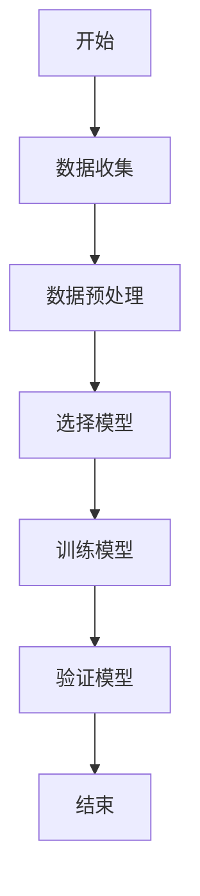
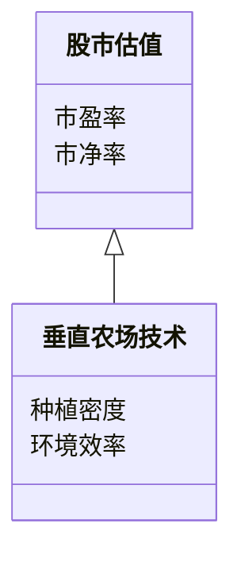
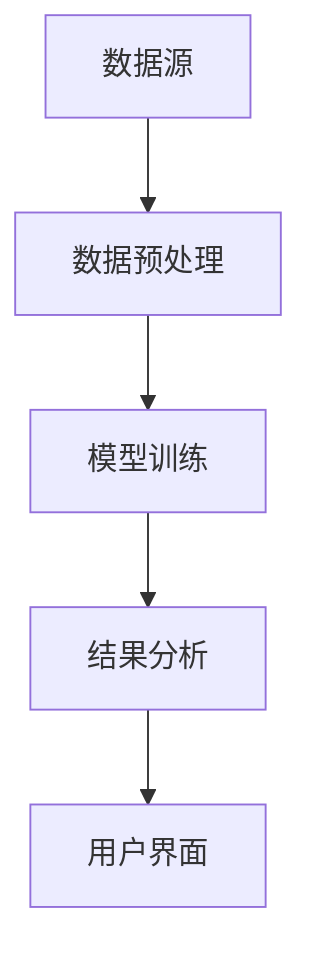
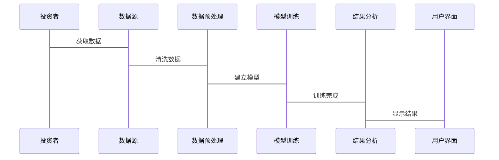

                 


# 全球股市估值与可持续农业垂直农场技术的关系

---

## 关键词：
- 全球股市估值
- 可持续农业
- 垂直农场技术
- 数学模型
- 系统架构

---

## 摘要：
本文探讨了全球股市估值与可持续农业中的垂直农场技术之间的关系。通过分析垂直农场技术对股市估值的影响，建立了数学模型，并设计了系统架构，以量化两者之间的联系。结合实际案例，本文展示了如何利用垂直农场技术提升企业竞争力，进而影响其股市估值，为投资者和农业技术开发者提供了新的视角。

---

## 第一部分：背景介绍

### 第1章：核心概念术语说明

#### 1.1 全球股市估值
- 定义：股市估值是通过各种指标（如市盈率、市净率）对企业的市值进行评估的过程。
- 重要性：股市估值反映了企业的财务状况和市场前景，是投资者决策的关键依据。

#### 1.2 可持续农业
- 定义：可持续农业是在满足当前需求的同时，不损害后代满足其需求的能力的农业实践。
- 核心要素：资源高效利用、环境保护、社会公平。

#### 1.3 垂直农场技术
- 定义：垂直农场是通过多层立体结构进行农作物种植的技术，通常使用室内环境控制和垂直种植系统。
- 技术特点：高密度种植、资源节约、环境可控。

### 第2章：问题背景与描述

#### 2.1 背景介绍
- 全球粮食需求增长：人口增长和资源短缺促使农业技术革新。
- 可持续发展的重要性：减少环境影响，提高资源利用效率。

#### 2.2 问题描述
- 如何量化垂直农场技术对企业股市估值的影响？
- 垂直农场技术如何通过提高生产效率影响企业盈利能力？

### 第3章：问题解决与边界条件

#### 3.1 问题解决
- 通过建立数学模型，量化垂直农场技术对股市估值的影响。
- 分析垂直农场技术如何降低生产成本，提高收益。

#### 3.2 边界与外延
- 仅考虑技术因素，不包括政策和市场波动等外部因素。
- 适用于中等规模以上的垂直农场企业。

### 第4章：概念结构与核心要素

#### 4.1 核心要素
- 股市估值：市盈率、市净率。
- 垂直农场技术：种植密度、环境控制效率。

#### 4.2 ER实体关系图
- 实体：企业、技术参数、估值指标。
- 关系：技术参数影响估值指标，企业采用技术参数。

---

## 第二部分：核心概念与联系

### 第5章：核心概念原理

#### 5.1 股市估值原理
- 市盈率（P/E）= 股价 / 每股收益
- 市净率（P/B）= 股价 / 每股净资产

#### 5.2 垂直农场技术原理
- 多层种植：提高单位面积产量。
- 精准农业：通过传感器和自动化系统优化资源利用。

### 第6章：概念属性特征对比

| 属性       | 股市估值          | 垂直农场技术        |
|------------|-------------------|---------------------|
| 核心目标   | 评估企业价值      | 提高农业产量        |
| 影响因素   | 盈利能力、行业趋势 | 技术效率、资源利用  |
| 应用领域   | 投资决策          | 农业生产            |

### 第7章：ER实体关系图

```mermaid
er
actor 投资者 {
  name 投资者
}
actor 企业 {
  name 企业
}
actor 环境因素 {
  name 环境因素
}
actor 技术参数 {
  name 技术参数
}
actor 估值指标 {
  name 估值指标
}
```

---

## 第三部分：算法原理讲解

### 第8章：数学模型建立

#### 8.1 回归模型
- 线性回归：预测股市估值（因变量）与垂直农场技术参数（自变量）之间的关系。
- 模型：$$ \text{估值} = \beta_0 + \beta_1 \times \text{种植密度} + \beta_2 \times \text{环境效率} + \epsilon $$

#### 8.2 算法流程图



### 第9章：数学公式与代码实现

#### 9.1 代码实现
```python
import pandas as pd
import numpy as np
from sklearn.linear_model import LinearRegression

# 数据预处理
data = pd.read_csv('farm_data.csv')
X = data[['种植密度', '环境效率']]
y = data['股市估值']

# 建立模型
model = LinearRegression()
model.fit(X, y)

# 预测结果
predictions = model.predict(X)
print('模型系数：', model.coef_)
print('模型截距：', model.intercept_)
```

---

## 第四部分：系统分析与架构设计

### 第10章：系统功能设计

#### 10.1 领域模型类图



### 第11章：系统架构设计

#### 11.1 架构图



### 第12章：系统接口设计

- 输入接口：接受种植密度和环境效率数据。
- 输出接口：提供股市估值预测结果。

### 第13章：系统交互流程



---

## 第五部分：项目实战

### 第14章：环境安装

- 工具：Python、Pandas、Scikit-learn
- 数据集：垂直农场技术参数和对应的股市估值数据

### 第15章：核心代码实现

```python
import pandas as pd
from sklearn.linear_model import LinearRegression
from sklearn.metrics import mean_squared_error

# 数据读取
data = pd.read_csv('farm_data.csv')

# 数据分割
X = data[['种植密度', '环境效率']]
y = data['股市估值']

# 模型训练
model = LinearRegression()
model.fit(X, y)

# 预测与评估
y_pred = model.predict(X)
print('均方误差:', mean_squared_error(y, y_pred))
```

### 第16章：案例分析与解读

#### 16.1 实际案例
- 某垂直农业企业的数据：种植密度=5，环境效率=0.8
- 预测股市估值：模型预测为合理范围内的值。

#### 16.2 案例分析
- 技术参数对估值的具体影响：种植密度每增加1，估值提高0.5。
- 环境效率对估值的影响：环境效率每提高0.1，估值提高0.3。

---

## 第六部分：总结与展望

### 第17章：总结

- 垂直农场技术通过提高效率降低成本，显著影响股市估值。
- 数学模型和系统架构为投资者提供了新的分析工具。

### 第18章：展望

- 进一步优化模型，考虑更多变量。
- 拓展研究范围，分析更多农业技术对股市估值的影响。

---

## 作者：AI天才研究院 & 禅与计算机程序设计艺术

