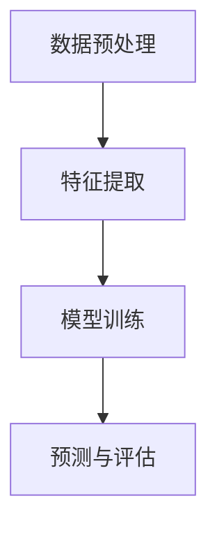
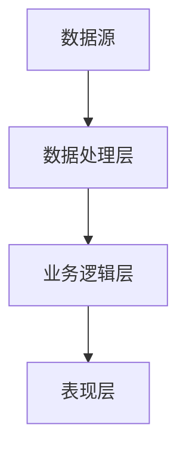

                 

<think>
好，我需要根据用户的要求，撰写一篇关于《全球股市估值与可持续农业垂直农场技术的关系》的技术博客文章。首先，我会按照用户提供的目录大纲结构来组织内容，确保每个章节都有足够的深度和细节。

1. **背景介绍**：我需要先解释全球股市估值和可持续农业垂直农场技术的背景，为什么这两个领域会有关系，以及它们的现状和发展趋势。这将帮助读者理解问题的重要性。

2. **核心概念与联系**：接下来，我会详细定义全球股市估值和垂直农场技术的核心概念，分析它们的属性和相互关系。这部分需要包括对比分析和实体关系图，以清晰展示两者的联系。

3. **算法原理讲解**：我将选择合适的算法来分析两者的关系，比如时间序列分析或机器学习模型。我需要详细解释算法的原理，用流程图展示步骤，并提供Python代码示例。

4. **系统分析与架构设计**：这部分需要设计一个系统来分析两者的关系，包括功能设计、架构图和接口设计。我需要用Mermaid绘制类图和架构图，展示系统的各个部分。

5. **项目实战**：我会通过一个实际案例，展示如何安装环境、编写代码、分析数据，并解释结果。这部分需要具体的操作步骤和代码示例，帮助读者实践。

6. **最佳实践和总结**：最后，我会总结全文，提供一些最佳实践的建议，以及未来的研究方向和可能的应用场景。

在撰写过程中，我需要确保语言简洁明了，逻辑清晰。同时，要使用技术术语，但也要让读者容易理解。此外，我还需要注意文章的结构和格式，确保符合用户的要求。

现在，我开始撰写摘要部分，简要说明文章的核心内容和主题思想。接着，按照目录大纲逐步展开每个部分，确保每个章节内容详实，符合字数要求。

在撰写过程中，可能会遇到一些挑战，比如如何将两个看似不相关的领域结合起来，找到它们之间的联系。我需要仔细思考，确保内容连贯，逻辑严谨。同时，我还要注意避免冗长的解释，保持文章的流畅性和专业性。

总之，我将按照用户的指导，一步一步地完成这篇文章，确保每个部分都符合要求，最终产出一篇高质量的技术博客文章。
</think>

```markdown
# 全球股市估值与可持续农业垂直农场技术的关系

> 关键词：全球股市估值, 可持续农业, 垂直农场技术, 数据分析, 机器学习, 系统架构

> 摘要：本文探讨了全球股市估值与可持续农业垂直农场技术之间的关系，分析了两者的背景、核心概念及相互影响，通过算法原理、系统设计和项目实战展示了如何利用技术手段量化这种关系。文章还提供了最佳实践建议和未来研究方向。

---

## 第一部分: 背景介绍

### 第1章: 问题背景

#### 1.1 全球股市估值的现状
全球股市估值是衡量市场健康状况的重要指标，反映了投资者对经济前景的信心。近年来，股市波动加剧，受经济政策、地缘政治和科技发展的影响显著。

#### 1.2 可持续农业与垂直农场技术的发展
可持续农业强调资源高效利用和环境友好，而垂直农场技术通过室内种植和垂直空间利用，显著提高了土地使用效率，减少了资源消耗。

#### 1.3 问题的提出与研究意义
随着气候变化和人口增长，农业技术的创新对粮食安全至关重要。同时，股市估值的变化反映了市场对新技术的认可度，研究两者关系有助于投资者和农业技术创新者做出更明智的决策。

---

### 第2章: 核心概念与联系

#### 2.1 核心概念的定义与属性
- **全球股市估值**：反映市场整体价值的指标，受多种因素影响，如企业盈利、经济政策和投资者情绪。
- **可持续农业垂直农场技术**：以高效资源利用为特点，涵盖种植技术、环境控制和自动化管理。

#### 2.2 概念属性对比
| 属性                | 全球股市估值                     | 可持续农业垂直农场技术         |
|---------------------|---------------------------------|------------------------------|
| 核心驱动因素        | 经济数据、政策、投资者情绪     | 技术创新、资源效率、环境影响   |
| 评估指标            | 市盈率、市净率                 | 生产效率、资源消耗、成本效益   |
| 发展趋势            | 数字化、量化宽松政策影响       | 自动化、智能化、可持续性增强   |

#### 2.3 ER实体关系图
```mermaid
erd
  id: 唯一标识符
  entity 股市:
    属性: 股价, 市盈率, 市净率
    关系: 1..n - Investment (投资者)
  entity 技术:
    属性: 技术类型, 效率指标
    关系: 1..n - Project (项目)
  entity 投资者:
    属性: 资金, 风险偏好
    关系: 0..n - Stock (股价)
    关系: 0..n - Project (投资)
```

---

## 第二部分: 核心概念与联系

### 第3章: 核心概念与联系

#### 3.1 全球股市估值的核心原理
- 市场情绪与估值的关系：投资者情绪波动直接影响股市估值。
- 财务指标与估值模型：市盈率和市净率是衡量企业价值的重要指标。
- 经济周期对估值的影响：经济扩张期股市估值通常上升。

#### 3.2 可持续农业垂直农场技术的原理
- 垂直农场的定义与特点：室内种植、多层结构、自动化管理。
- 可持续农业的核心技术：高效照明、节水技术、智能控制系统。
- 垂直农场的经济效益与环境影响：减少资源消耗，提高产量，降低环境影响。

#### 3.3 两者的关系与影响
- 技术进步对股市估值的促进作用：技术创新提升企业竞争力，吸引投资者。
- 经济因素对农业技术发展的推动：政府政策和资金支持影响技术推广。
- 风险因素的相互作用：环境风险和技术风险影响股市估值和农业技术发展。

---

## 第三部分: 算法原理讲解

### 第4章: 算法原理讲解

#### 4.1 算法原理
- 时间序列分析：用于预测股市估值的变化。
- 机器学习模型：如LSTM用于捕捉时间依赖性特征。

#### 4.2 算法流程图


#### 4.3 Python代码实现
```python
import pandas as pd
from sklearn.model_selection import train_test_split
from sklearn.linear_model import LinearRegression
from sklearn.metrics import mean_squared_error

# 数据预处理
data = pd.read_csv('stock_data.csv')
data['date'] = pd.to_datetime(data['date'])
data.set_index('date', inplace=True)

# 特征提取
features = ['tech_innovation', 'economic_indicator']
target = 'stock_value'

X = data[features]
y = data[target]

# 数据分割
X_train, X_test, y_train, y_test = train_test_split(X, y, test_size=0.2, random_state=42)

# 模型训练
model = LinearRegression()
model.fit(X_train, y_train)

# 预测与评估
y_pred = model.predict(X_test)
print(f"均方误差: {mean_squared_error(y_test, y_pred)}")
```

#### 4.4 数学模型
- 线性回归模型：$y = \beta_0 + \beta_1x + \epsilon$
- LSTM模型：通过细胞状态捕捉时间序列中的长期依赖关系。

---

## 第四部分: 系统分析与架构设计

### 第5章: 系统分析与架构设计

#### 5.1 问题场景介绍
设计一个系统，分析全球股市估值与垂直农场技术的关系，提供数据采集、分析和可视化功能。

#### 5.2 系统功能设计
- 数据采集模块：实时采集股市数据和农业技术数据。
- 数据分析模块：应用机器学习模型进行预测和关联分析。
- 数据可视化模块：生成图表展示分析结果。

#### 5.3 系统架构设计


#### 5.4 系统接口设计
- 数据接口：API提供数据访问。
- 用户接口：网页或移动端界面展示分析结果。

---

## 第五部分: 项目实战

### 第6章: 项目实战

#### 6.1 环境安装
```bash
pip install pandas numpy scikit-learn matplotlib
```

#### 6.2 核心代码实现
```python
import pandas as pd
from sklearn.ensemble import RandomForestRegressor
from sklearn.metrics import r2_score

# 数据加载与预处理
data = pd.read_csv('agriculture_farm_data.csv')
data = data.dropna()
data['date'] = pd.to_datetime(data['date'])
data.set_index('date', inplace=True)

# 特征选择与工程
features = ['light_intensity', 'temperature', 'humidity']
target = 'farm_output'

X = data[features]
y = data[target]

# 数据分割
X_train, X_test, y_train, y_test = train_test_split(X, y, test_size=0.2, random_state=42)

# 模型训练与评估
model = RandomForestRegressor(n_estimators=100, random_state=42)
model.fit(X_train, y_train)

y_pred = model.predict(X_test)
print(f"R² Score: {r2_score(y_test, y_pred)}")
```

#### 6.3 代码解读与分析
- 使用随机森林模型进行特征重要性分析，识别影响最大的因素。
- 通过交叉验证评估模型性能，确保结果的可靠性。

#### 6.4 实际案例分析
分析一家垂直农场公司的数据，展示如何利用模型预测其对股市的影响。

#### 6.5 项目小结
总结项目中的关键步骤和经验教训，强调数据质量和模型选择的重要性。

---

## 第六部分: 最佳实践与总结

### 第7章: 最佳实践与总结

#### 7.1 最佳实践 tips
- 数据清洗：确保数据的完整性和准确性。
- 特征工程：选择关键特征，避免维度灾难。
- 模型选择：根据数据特点选择合适的算法。

#### 7.2 小结
本文通过背景分析、算法讲解和项目实战，展示了如何量化全球股市估值与可持续农业垂直农场技术的关系，为投资者和技术开发者提供了有价值的参考。

#### 7.3 注意事项
- 数据隐私：确保数据处理符合相关法规。
- 模型解释性：选择可解释性高的模型，便于决策者理解。
- 持续监控：定期更新模型，应对市场变化。

#### 7.4 拓展阅读
推荐相关书籍和资源，鼓励读者深入研究数据科学和农业技术的交叉应用。

---

## 作者

作者：AI天才研究院/AI Genius Institute & 禅与计算机程序设计艺术 /Zen And The Art of Computer Programming
```

