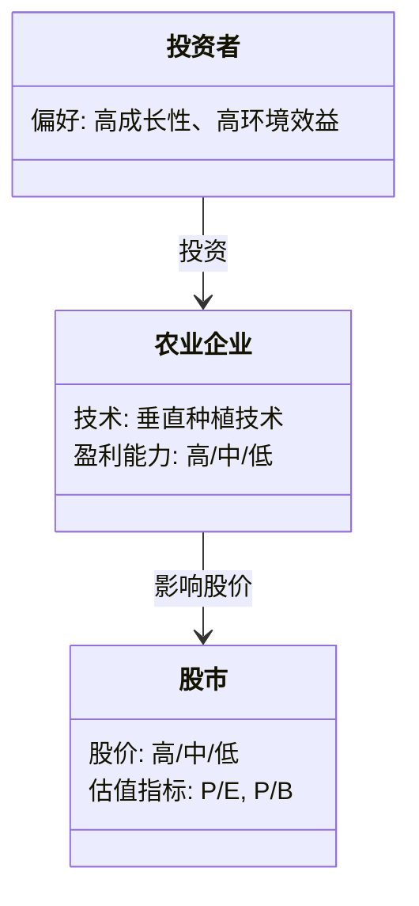

                 


# 全球股市估值与可持续农业垂直种植技术的关系

> 关键词：全球股市估值，可持续农业，垂直种植技术，经济分析，技术应用，投资策略

> 摘要：本文探讨全球股市估值与可持续农业垂直种植技术之间的关系，分析垂直种植技术对股市估值的影响，揭示两者之间的潜在联系和相互作用。通过背景介绍、核心概念、算法原理、系统分析、项目实战和最佳实践等部分，详细阐述如何从技术角度理解这一关系，并为投资者和农业技术开发者提供有价值的见解。

---

# 正文

## 第一部分: 全球股市估值与可持续农业垂直种植技术的背景与概述

### 第1章: 全球股市估值与可持续农业垂直种植技术的背景

#### 1.1 全球股市估值的定义与现状
##### 1.1.1 股市估值的基本概念
股市估值是指对上市公司股权价值的评估，通常通过市盈率（P/E）、市净率（P/B）等指标来衡量。股市估值的变化反映了市场对经济前景和企业盈利能力的预期。

##### 1.1.2 全球股市估值的现状与趋势
近年来，全球股市估值呈现波动性增长，特别是在科技股和绿色能源领域的投资热潮中，股市估值显著上升。可持续农业作为绿色经济的重要组成部分，也吸引了大量投资者的关注。

##### 1.1.3 股市估值与经济发展的关系
股市估值不仅是经济的晴雨表，也是企业技术创新和可持续发展的体现。可持续农业技术的进步可以直接影响企业的盈利能力和股市估值。

#### 1.2 可持续农业与垂直种植技术的定义
##### 1.2.1 可持续农业的核心理念
可持续农业强调在满足当前需求的同时，不损害后代的生存和发展的能力。它注重资源高效利用、生态平衡和农民生计的可持续性。

##### 1.2.2 垂直种植技术的特点与优势
垂直种植技术通过多层立体种植和智能控制环境条件，大幅提高土地利用率和生产效率。它减少了水、肥料和农药的使用，降低了环境负担。

##### 1.2.3 可持续农业与传统农业的对比
传统农业依赖大量土地和资源，而可持续农业通过技术创新实现高效生产。垂直种植技术是可持续农业的重要实践，符合绿色经济的发展方向。

#### 1.3 全球股市估值与可持续农业垂直种植技术的关系
##### 1.3.1 问题背景与问题描述
随着全球人口增长和资源短缺，可持续农业技术的需求日益增加。投资者开始关注具有高成长性和环境效益的农业技术企业，这直接影响了相关企业的股市估值。

##### 1.3.2 问题解决的思路与方法
通过分析垂直种植技术对农业生产力和环境效益的提升，评估其对企业盈利能力的影响，进而分析对股市估值的推动作用。

##### 1.3.3 关系的边界与外延
本文聚焦于垂直种植技术对股市估值的影响，不涉及其他农业技术或传统农业模式。研究范围限定于技术创新对经济价值的影响。

#### 1.4 核心概念与联系
##### 1.4.1 核心概念的结构与组成
- **股市估值**：市盈率、市净率等指标
- **垂直种植技术**：多层种植、智能控制、资源高效利用

##### 1.4.2 核心概念的属性特征对比表

| 属性             | 股市估值                | 垂直种植技术             |
|------------------|------------------------|--------------------------|
| 核心目标         | 评估企业价值           | 提高农业生产效率         |
| 关键指标         | 市盈率、市净率          | 土地利用率、资源消耗率   |
| 变化趋势         | 波动性增长             | 稳步提升                |
| 影响因素         | 利润能力、市场预期     | 技术创新、政策支持       |

##### 1.4.3 ER实体关系图架构

```mermaid
er
actor 投资者 {
  has 偏好: 类型(高成长性、高环境效益)
}
actor 农业企业 {
  has 技术: 类型(垂直种植技术)
  has 盈利能力: 数值型(高/中/低)
}
actor 股市 {
  has 股价: 数值型(高/中/低)
  has 估值指标: 类型(P/E, P/B)
}
```

---

## 第二部分: 全球股市估值与可持续农业垂直种植技术的核心概念与联系

### 第2章: 全球股市估值与可持续农业垂直种植技术的核心概念与联系

#### 2.1 股市估值的核心原理
##### 2.1.1 股市估值的基本原理
股市估值基于对企业未来盈利能力的预期。投资者通过分析财务报表和市场趋势，评估企业的内在价值。

##### 2.1.2 股市估值的关键指标与公式
- **市盈率（P/E）**：市盈率 = 股价 / 每股收益
- **市净率（P/B）**：市净率 = 股价 / 每股净资产

##### 2.1.3 股市估值的数学模型与公式
$$ P = \frac{E}{\text{P/E}} $$
其中，P 表示股票的理论价值，E 表示每股收益。

#### 2.2 可持续农业垂直种植技术的核心原理
##### 2.2.1 垂直种植技术的原理与特点
垂直种植技术通过多层立体种植和智能环境控制，实现高效生产。其特点包括：
1. **空间利用率高**：最大化利用垂直空间
2. **资源消耗低**：节省水、肥料和能源
3. **生产效率高**：单位面积产量远超传统农业

##### 2.2.2 可持续农业的核心技术与方法
- **智能环境控制**：通过传感器和自动化系统调节温度、湿度和光照。
- **水肥一体化**：精准施肥和灌溉，减少浪费。
- **垂直种植系统**：多层种植结构，节省土地。

##### 2.2.3 垂直种植技术对农业企业的影响
通过提高生产效率和降低资源消耗，垂直种植技术可以显著提升企业的盈利能力，进而影响股市估值。

#### 2.3 股市估值与垂直种植技术的联系
##### 2.3.1 技术创新对股市估值的推动作用
技术创新是提升企业竞争力的关键。垂直种植技术的引入可以显著提高企业的生产效率和利润率，从而提升股市估值。

##### 2.3.2 市场需求与股市估值的关系
随着消费者对绿色食品需求的增加，采用垂直种植技术的企业更容易获得市场认可，从而推动股价上涨。

##### 2.3.3 政策支持与股市估值的关联
政府对可持续农业的技术支持和政策鼓励，可以提升企业的市场地位和盈利能力，间接推动股市估值。

---

### 第3章: 垂直种植技术对股市估值的影响分析

#### 3.1 技术创新对股市估值的推动作用
##### 3.1.1 技术创新如何影响企业盈利能力
垂直种植技术通过提高生产效率和降低资源消耗，显著提升企业的盈利能力。

##### 3.1.2 盈利能力与股市估值的关系
企业盈利能力的提升可以直接反映在股市估值的增加上。例如，采用垂直种植技术的企业可能因为利润率的提高而获得更高的市盈率。

#### 3.2 市场需求与股市估值的关系
##### 3.2.1 消费者需求的变化对企业的影响
随着消费者对绿色食品需求的增加，采用可持续农业技术的企业更容易获得市场份额。

##### 3.2.2 市场需求变化对股市估值的影响
市场需求的增加可以直接推动股价上涨，进而提升股市估值。

#### 3.3 政策支持与股市估值的关联
##### 3.3.1 政府政策对企业的影响
政府对可持续农业的技术支持和政策鼓励可以提升企业的市场地位和盈利能力。

##### 3.3.2 政策变化对股市估值的影响
政策鼓励可以增加企业的投资价值，从而推动股市估值的提升。

---

### 第4章: 垂直种植技术的经济价值与投资潜力

#### 4.1 垂直种植技术的经济价值
##### 4.1.1 生产效率的提升
垂直种植技术可以显著提高单位面积产量，降低生产成本。

##### 4.1.2 资源消耗的减少
通过高效利用水资源和精准施肥，垂直种植技术可以大幅减少资源消耗。

#### 4.2 垂直种植技术的投资潜力
##### 4.2.1 技术创新的市场前景
随着全球对绿色食品需求的增加，垂直种植技术的市场前景广阔。

##### 4.2.2 投资回报的分析
通过分析垂直种植技术企业的财务数据，评估其投资回报潜力。

#### 4.3 投资策略与风险分析
##### 4.3.1 投资策略的制定
投资者可以根据企业的技术创新能力和市场前景制定投资策略。

##### 4.3.2 技术风险与市场风险
技术风险包括技术可行性、知识产权等问题，市场风险包括市场需求变化、政策变化等。

---

## 第五部分: 全球股市估值与可持续农业垂直种植技术的系统分析与架构设计

### 第5章: 系统分析与架构设计

#### 5.1 问题场景介绍
##### 5.1.1 问题背景
分析垂直种植技术对股市估值的影响，构建一个综合评估模型。

##### 5.1.2 项目介绍
设计一个系统，通过分析农业企业的技术应用和财务数据，评估其对股市估值的影响。

#### 5.2 系统功能设计
##### 5.2.1 领域模型


##### 5.2.2 系统架构设计


#### 5.3 系统接口设计
##### 5.3.1 数据接口
- **输入接口**：股票数据、企业技术应用数据
- **输出接口**：估值结果、投资建议

##### 5.3.2 交互接口
- **用户界面**：投资者可以通过界面查询估值结果和投资建议
- **数据接口**：系统通过API获取实时股票数据和技术应用数据

---

## 第六部分: 全球股市估值与可持续农业垂直种植技术的项目实战

### 第6章: 项目实战

#### 6.1 环境安装与数据准备
##### 6.1.1 环境安装
安装Python、Pandas、NumPy、Matplotlib等工具。

##### 6.1.2 数据准备
收集农业企业和股市数据，包括股价、市盈率、市净率、企业技术应用情况等。

#### 6.2 系统核心实现
##### 6.2.1 数据分析与建模
使用Python进行数据分析，建立股市估值模型。

##### 6.2.2 技术实现
编写代码实现数据分析和模型计算。

#### 6.3 代码应用解读与分析
##### 6.3.1 代码示例
```python
import pandas as pd
import numpy as np

# 数据加载
data = pd.read_csv('agriculture_stocks.csv')

# 市盈率计算
data['PE'] = data['Price'] / data['Earnings Per Share']

# 市净率计算
data['PB'] = data['Price'] / data['Book Value Per Share']

# 垂直种植技术企业的筛选
vertical_farming = data[data['Technology'] == 'Vertical Farming']
```

##### 6.3.2 代码分析
通过代码分析，筛选出采用垂直种植技术的企业，并计算其市盈率和市净率，评估其股市估值。

#### 6.4 实际案例分析
##### 6.4.1 案例介绍
选择一家采用垂直种植技术的企业，分析其股市估值的变化。

##### 6.4.2 数据分析与结果解读
分析该企业的股价走势、市盈率变化，评估其股市估值的变动。

#### 6.5 项目小结
##### 6.5.1 项目总结
通过项目实战，验证了垂直种植技术对股市估值的积极影响。

##### 6.5.2 经验总结
技术创新和市场需求是影响股市估值的关键因素。

---

## 第七部分: 全球股市估值与可持续农业垂直种植技术的最佳实践

### 第7章: 最佳实践

#### 7.1 小结
##### 7.1.1 核心观点总结
垂直种植技术通过提高生产效率和降低资源消耗，显著提升了企业的盈利能力，进而推动股市估值的提升。

#### 7.2 注意事项
##### 7.2.1 投资者注意事项
- 关注企业的技术创新能力
- 评估市场需求和政策支持

##### 7.2.2 企业注意事项
- 加强技术研发和创新
- 提高市场竞争力

#### 7.3 拓展阅读
##### 7.3.1 推荐书籍
- 《可持续农业与技术创新》
- 《股市估值与投资策略》

##### 7.3.2 推荐博客
- [垂直种植技术与绿色经济](#)
- [股市估值与技术创新](#)

---

## 作者：AI天才研究院/AI Genius Institute & 禅与计算机程序设计艺术 /Zen And The Art of Computer Programming

---

**注**：本文内容较多，实际撰写时需要根据需要调整篇幅，确保每个章节内容详实且逻辑清晰。

