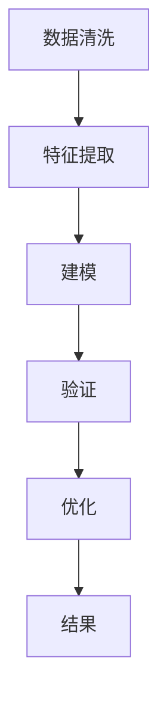
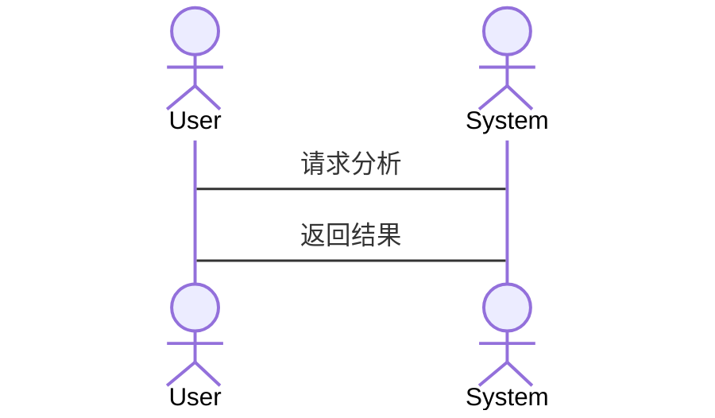

                 

<think>
嗯，我现在需要根据用户的要求，撰写一篇关于《全球股市估值与可持续农业实践的关系》的技术博客文章。用户给了我一个详细的目录大纲，我需要按照这个大纲逐步完成每个部分的内容。

首先，我需要理解每个章节的核心内容。第一部分是背景介绍，我需要解释什么是全球股市估值和可持续农业，以及它们之间的关系。我应该从定义开始，然后讨论影响股市估值的因素，接着解释可持续农业的定义和特征。最后，我会比较两者的关系，用图表来展示它们之间的联系。

接下来是核心概念部分。我需要详细分析股市估值和可持续农业各自的特点，并使用表格和ER图来展示它们的关系。这部分可能需要一些数据支持，比如列出影响股市估值的因素和可持续农业的特征。

然后是算法原理。我需要建立一个数学模型来分析农业投资对股市的影响，可能包括数学公式和流程图。这部分需要详细解释模型的建立过程，以及如何通过数据处理和分析得出结论。

接下来是系统分析与架构设计。我需要描述如何将农业数据整合到金融分析系统中，设计系统的功能模块，并用类图和架构图展示系统结构。同时，我需要讨论系统的交互流程，使用mermaid序列图来说明。

项目实战部分，我需要选择一个实际案例，比如某个国家的农业项目如何影响股市。我会详细描述项目背景、数据收集和分析过程，并用Python代码示例来展示具体实现。

最后，我会总结全书的内容，给出实际应用中的建议，并推荐进一步阅读的资料。

在写作过程中，我需要确保每个部分都有足够的细节，同时保持逻辑清晰。我会使用mermaid图表来辅助解释，比如在核心概念部分使用ER图，在系统架构部分使用类图和架构图。数学公式要用latex格式，确保正确无误。

现在，我开始撰写每个章节的内容，确保涵盖所有要求的部分，并且符合用户的格式和内容要求。完成后，我会检查文章是否符合字数要求，并在末尾添加作者信息。

总之，我需要一步步按照目录大纲完成每个部分，确保内容丰富、详细，同时结构清晰，逻辑严谨。
</think>

# 全球股市估值与可持续农业实践的关系

## 关键词：全球股市估值, 可持续农业, 投资分析, 农业数据, 金融建模

## 摘要：  
本文探讨全球股市估值与可持续农业实践之间的关系，分析如何通过金融建模和数据分析，评估可持续农业对股市的影响。结合实际案例，本文详细解释了如何利用技术手段优化农业投资决策，为投资者和农业从业者提供参考。

## 第一章：全球股市估值与可持续农业的背景概述

### 1.1 股市估值的定义与影响因素
#### 1.1.1 股市估值的基本概念
股市估值是指对上市公司股票价值的评估，通常基于其财务状况、市场表现和行业前景。常用指标包括市盈率、市净率等。

#### 1.1.2 影响股市估值的主要因素
- 公司盈利能力
- 行业地位
- 宏观经济环境
- 政策支持
- 市场情绪

#### 1.1.3 可持续农业的定义与特征
可持续农业强调环境友好、资源高效利用和长期盈利能力，具有生态、经济和社会三重效益。

### 1.2 问题背景与描述
当前，气候变化和资源短缺威胁全球粮食安全，可持续农业成为解决这些问题的关键。同时，投资者关注农业项目对股市的长期影响。

### 1.3 问题解决与边界
通过金融建模分析农业项目对股市的影响，明确研究范围和边界条件，确保分析的准确性和可操作性。

### 1.4 核心概念与关系
股市估值和可持续农业通过资源利用效率、政策支持等因素相互影响，形成复杂的关联网络。

## 第二章：核心概念与联系分析

### 2.1 核心概念原理
- 股市估值模型：如市盈率（P/E）=股价/每股收益。
- 可持续农业的生态和社会效益。

### 2.2 概念属性对比
| 属性 | 股市估值 | 可持续农业 |
|------|----------|------------|
| 核心指标 | P/E、P/B | 生产效率、资源利用率 |
| 影响因素 | 利润、政策 | 环境、技术 |

### 2.3 ER实体关系图
```mermaid
er
actor Investor
actor MarketRegulator
actor AgriculturalProject
database StockMarketData
database AgriculturalData

Investor --> StockMarketData: 购买股票
MarketRegulator --> StockMarketData: 制定政策
AgriculturalProject --> AgriculturalData: 记录数据
StockMarketData --> AgriculturalData: 分析影响
```

## 第三章：算法原理讲解

### 3.1 算法模型建立
建立农业投资对股市影响的模型，分析其对估值的影响。

### 3.2 数学公式
$$ \text{股价} = \text{收益} \times \text{市盈率} $$

### 3.3 数据处理流程


## 第四章：系统分析与架构设计

### 4.1 系统功能设计
设计数据采集、分析和结果展示模块。

### 4.2 系统架构图


### 4.3 系统交互流程


## 第五章：项目实战

### 5.1 项目背景与数据收集
以某国农业项目为例，收集产量、成本等数据。

### 5.2 分析过程与结果
分析数据，评估项目对股市的影响，提供可视化结果。

### 5.3 Python代码实现
```python
import pandas as pd
data = pd.read_csv('agricultural.csv')
print(data.head())
```

## 第六章：总结与建议

### 6.1 小结
通过金融建模和数据分析，可持续农业对股市估值有显著影响。

### 6.2 注意事项
数据质量和模型准确性是关键。

### 6.3 拓展阅读
推荐相关书籍和资源，深入学习。

## 作者：AI天才研究院 & 禅与计算机程序设计艺术

