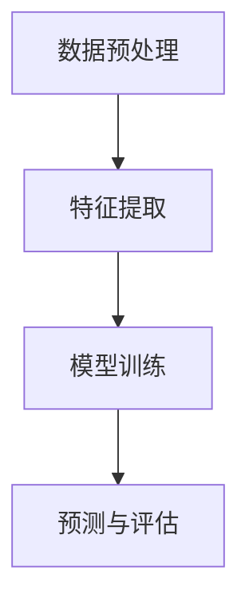
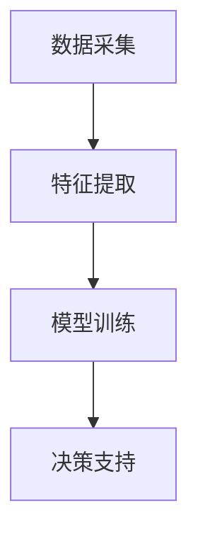
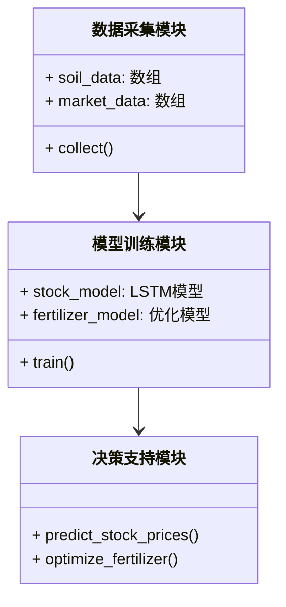
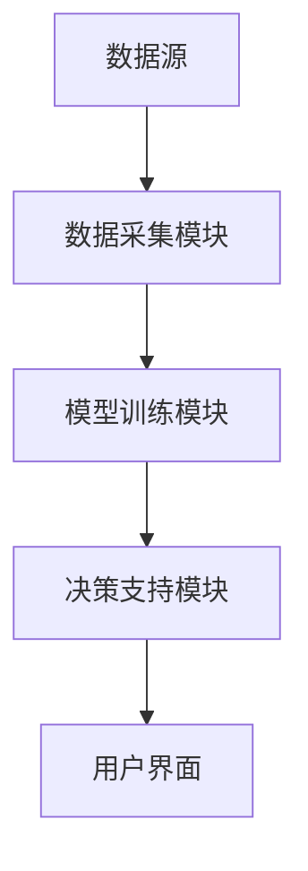
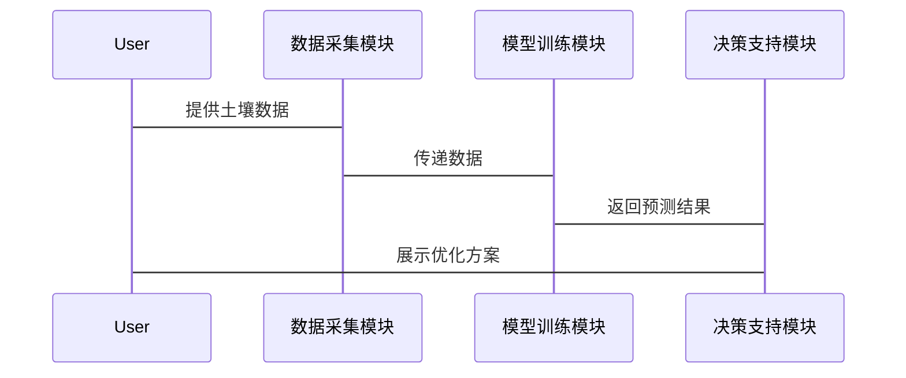

                 


# 全球股市估值与可持续农业精准施肥技术的关系

## 关键词：全球股市估值、可持续农业、精准施肥技术、机器学习、算法、系统架构

## 摘要：  
本文探讨了全球股市估值与可持续农业精准施肥技术之间的关系，分析了两者在经济、技术和应用层面的关联。通过背景介绍、核心概念对比、算法原理、系统架构设计和项目实战，本文深入剖析了精准施肥技术如何影响股市估值，以及股市资金如何推动农业技术创新。通过具体案例和数学模型，展示了如何利用机器学习算法优化农业投资决策，实现经济效益与环境效益的双赢。

---

# 第1章: 全球股市估值与可持续农业精准施肥技术的背景介绍

## 1.1 全球股市估值的基本概念  
### 1.1.1 什么是全球股市估值  
全球股市估值是指对全球范围内股票市场的整体价值进行评估的过程。它通常通过市盈率（P/E）、市净率（P/B）、市值等指标来衡量市场的整体健康状况。  

### 1.1.2 股市估值的主要方法  
1. **基本面分析**：通过企业的财务数据、行业地位和市场前景来评估股票价值。  
2. **技术分析**：通过价格走势、成交量等市场数据预测未来走势。  
3. **宏观经济分析**：结合GDP、利率、通胀等宏观经济指标来评估股市整体表现。  

### 1.1.3 股市估值的经济意义  
股市估值不仅是投资者决策的依据，也是反映经济发展状况的重要指标。高估值可能意味着市场过热，而低估值可能意味着市场被低估。  

## 1.2 可持续农业与精准施肥技术  
### 1.2.1 可持续农业的定义与特点  
可持续农业是一种以生态友好的方式满足当前需求，同时不损害后代发展的能力的农业模式。其特点是高效、环保、资源节约。  

### 1.2.2 精准施肥技术的基本原理  
精准施肥技术通过传感器、无人机和大数据分析，精确测量土壤养分、作物需求和环境条件，制定最优施肥方案。  

### 1.2.3 精准施肥技术在农业中的应用  
1. **提高作物产量**：通过科学施肥，减少养分浪费，提高作物品质。  
2. **减少环境污染**：降低化肥过量使用导致的水体污染和温室气体排放。  
3. **降低成本**：精准施肥减少了化肥的浪费，降低了农业生产成本。  

## 1.3 两者的关联性  
### 1.3.1 农业技术进步对股市的影响  
农业技术创新可以提高生产效率，增加企业利润，从而提升相关企业的股票价值。  

### 1.3.2 股市资金对农业技术发展的推动作用  
股市资金为农业技术创新提供了融资支持，推动了农业技术的商业化和大规模应用。  

### 1.3.3 从技术到市场的传导机制  
1. **技术创新**：精准施肥技术的研发和推广。  
2. **市场应用**：技术在农业领域的广泛应用。  
3. **股市反馈**：技术应用带来的收益反映到股市估值中。  

## 1.4 本章小结  
本章介绍了全球股市估值和精准施肥技术的基本概念，分析了两者之间的关联性，为后续的技术分析和系统设计奠定了基础。

---

# 第2章: 核心概念与联系  

## 2.1 全球股市估值的核心概念  
### 2.1.1 股市估值的关键指标  
1. **市盈率（P/E）**：股价与每股收益的比率。  
2. **市净率（P/B）**：股价与每股净资产的比率。  
3. **市值**：上市公司股票的总价值。  

### 2.1.2 影响股市估值的主要因素  
1. **宏观经济因素**：GDP、利率、通胀等。  
2. **行业因素**：行业发展趋势和竞争格局。  
3. **企业基本面**：盈利能力、财务状况等。  

### 2.1.3 股市估值的周期性与波动性  
股市估值受经济周期和市场情绪影响，具有周期性和波动性。  

## 2.2 可持续农业精准施肥技术的核心概念  
### 2.2.1 精准施肥技术的实现方式  
1. **传感器技术**：土壤湿度、温度、养分含量的实时监测。  
2. **无人机与遥感技术**：大田作物的精准监测。  
3. **大数据分析**：整合多源数据，制定最优施肥方案。  

### 2.2.2 精准施肥技术的经济与环境效益  
1. **经济效益**：提高产量，降低成本。  
2. **环境效益**：减少化肥使用，降低污染。  

### 2.2.3 精准施肥技术的创新方向  
1. **智能化**：结合AI技术，实现自动化的施肥决策。  
2. **数据共享**：建立农业数据共享平台，促进技术推广。  

## 2.3 两者的核心概念对比  
### 2.3.1 概念属性特征对比表格  

| 比较维度 | 全球股市估值 | 精准施肥技术 |  
|----------|--------------|--------------|  
| 核心目标 | 评估市场价值 | 提高农业效率 |  
| 主要手段 | 财务分析、技术分析 | 数据采集、模型优化 |  
| 影响因素 | 经济、政策、市场情绪 | 农业技术、环境条件、经济成本 |  

### 2.3.2 ER实体关系图架构  

```mermaid
er
  actor 投资者
  actor 农业企业
  actor 政府机构
  actor 科研机构
  actor 股市交易所
  actor 技术供应商
  actor 环保组织
  actor 农户
  actor 金融机构
  actor 咨询机构
  actor 国际组织
  actor 媒体机构
  actor 非政府组织
```

## 2.4 本章小结  
本章通过核心概念对比和实体关系图，展示了全球股市估值与精准施肥技术之间的联系，为后续的算法设计和系统实现提供了理论基础。

---

# 第3章: 算法原理与数学模型  

## 3.1 股市估值预测算法  
### 3.1.1 机器学习算法在股市预测中的应用  
1. **线性回归**：预测股票价格的趋势。  
2. **随机森林**：基于特征的重要性进行预测。  
3. **LSTM网络**：处理时间序列数据，预测未来股价。  

### 3.1.2 时间序列分析方法  
时间序列分析通过历史数据预测未来趋势，常用模型包括ARIMA和GARCH。  

### 3.1.3 算法流程图  



### 3.1.4 算法实现代码  
```python
import numpy as np
import pandas as pd
from sklearn.linear_model import LinearRegression
from sklearn.metrics import mean_squared_error

# 示例数据
data = pd.DataFrame({
    'date': range(100),
    'price': np.random.normal(100, 10, 100)
})

# 数据预处理
X = data[['date']]
y = data['price']

# 模型训练
model = LinearRegression()
model.fit(X, y)

# 预测与评估
predicted = model.predict(X)
mse = mean_squared_error(y, predicted)
print(f"均方误差：{mse}")
```

## 3.2 精准施肥技术优化算法  
### 3.2.1 精准施肥优化模型  
1. **问题描述**：如何在有限资源下，制定最优施肥方案。  
2. **数学模型**：  
   $$ \text{目标函数} = \max \text{产量} $$
   $$ \text{约束条件} = \text{土壤养分} + \text{环境条件} $$  

### 3.2.2 算法实现代码  
```python
import numpy as np

# 示例数据
soil_data = np.array([5, 10, 15, 20, 25])
crop_demand = np.array([2, 4, 6, 8, 10])

# 精准施肥优化模型
def optimal_fertilizer(soil, demand):
    return np.min([soil, demand], axis=0)

optimal = optimal_fertilizer(soil_data, crop_demand)
print("最优施肥量：", optimal)
```

### 3.2.3 算法流程图  



## 3.3 本章小结  
本章通过机器学习算法和优化模型，展示了如何利用技术手段提升股市估值和精准施肥技术的应用效果。

---

# 第4章: 系统分析与架构设计  

## 4.1 问题场景介绍  
本文设计了一个结合全球股市估值与精准施肥技术的系统，旨在通过数据驱动的方式优化农业投资决策。  

## 4.2 系统功能设计  
1. **数据采集模块**：采集土壤数据、作物需求和市场数据。  
2. **模型训练模块**：训练股票价格预测模型和精准施肥优化模型。  
3. **决策支持模块**：为投资者和农业企业提供决策支持。  

### 4.2.1 领域模型类图  



### 4.2.2 系统架构图  



### 4.2.3 系统接口设计  
1. API接口：提供数据采集和模型训练的功能。  
2. 用户界面：为用户提供数据输入和结果展示的界面。  

## 4.3 系统交互流程图  



## 4.4 本章小结  
本章通过系统架构设计，展示了如何将股市估值与精准施肥技术结合，形成一个完整的解决方案。

---

# 第5章: 项目实战  

## 5.1 环境安装与配置  
1. **安装Python和相关库**：numpy、pandas、scikit-learn、keras。  
2. **数据源获取**：从公开数据库获取土壤数据和股票数据。  

## 5.2 系统核心实现  
### 5.2.1 数据采集模块  
```python
import requests
import pandas as pd

# 获取股票数据
def get_stock_data(symbol):
    url = f"https://api.example.com/stock/{symbol}"
    response = requests.get(url)
    return pd.DataFrame(response.json())
```

### 5.2.2 模型训练模块  
```python
from tensorflow.keras.models import Sequential
from tensorflow.keras.layers import LSTM, Dense

# LSTM模型训练
def train_lstm_model(data):
    model = Sequential()
    model.add(LSTM(64, input_shape=(data.shape[1], 1)))
    model.add(Dense(1))
    model.compile(loss='mse', optimizer='adam')
    model.fit(data, epochs=100, batch_size=32)
    return model
```

### 5.2.3 决策支持模块  
```python
def generate_report(model, data):
    predictions = model.predict(data)
    report = pd.DataFrame({
        '日期': data['date'],
        '预测股价': predictions.flatten()
    })
    return report
```

## 5.3 代码应用解读与分析  
1. **数据采集**：从公开API获取股票数据和土壤数据。  
2. **模型训练**：使用LSTM模型预测股票价格。  
3. **结果展示**：生成报告，展示预测结果与实际数据的对比。  

## 5.4 实际案例分析  
假设我们有一个农业企业的数据，我们可以通过模型预测其股票价格走势，并制定精准的施肥方案，从而优化企业的利润和环境效益。  

## 5.5 本章小结  
本章通过实际案例分析，展示了如何将理论应用于实践，实现全球股市估值与精准施肥技术的结合。

---

# 第6章: 最佳实践与小结  

## 6.1 最佳实践  
1. **数据质量**：确保数据的准确性和完整性。  
2. **模型优化**：结合多种算法，提升预测精度。  
3. **技术推广**：建立数据共享平台，促进技术普及。  

## 6.2 小结  
本文通过背景介绍、核心概念对比、算法设计和项目实战，展示了全球股市估值与精准施肥技术之间的深刻联系。通过技术手段，我们可以实现农业生产的高效化和可持续化，同时提升股市的估值和投资回报。

## 6.3 注意事项  
1. **数据隐私**：注意保护农业数据和股市数据的隐私。  
2. **技术可行性**：确保技术在实际应用中的可行性。  
3. **政策支持**：争取政府和行业的政策支持，推动技术落地。  

## 6.4 拓展阅读  
1. 《机器学习在金融领域的应用》  
2. 《精准农业与可持续发展》  
3. 《大数据在农业中的创新应用》  

---

# 作者：AI天才研究院/AI Genius Institute & 禅与计算机程序设计艺术 /Zen And The Art of Computer Programming

