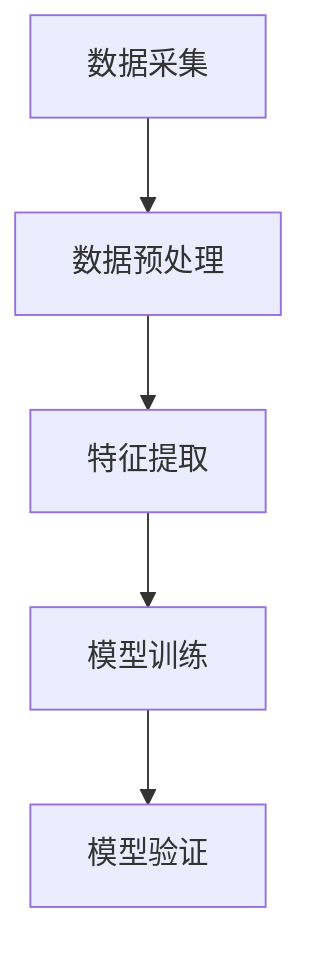
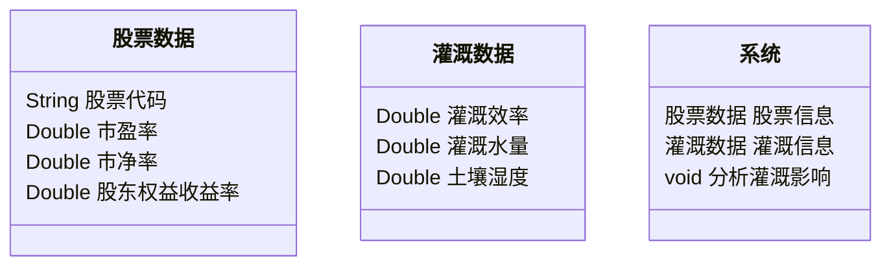
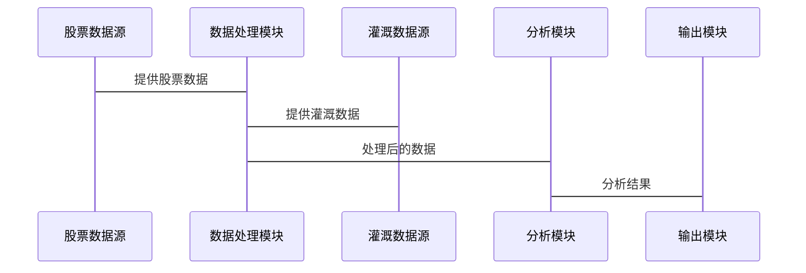

                 


# 全球股市估值与可持续农业精准灌溉技术的关系

## 关键词：
全球股市估值，可持续农业，精准灌溉技术，数学模型，算法，系统架构

## 摘要：
本文探讨了全球股市估值与可持续农业精准灌溉技术之间的关系，通过构建数学模型和算法，分析两者如何相互影响，并提出系统架构设计方案。文章详细讲解了股市估值的核心原理、精准灌溉技术的特点，以及两者关系的数学模型。通过Python代码实现和实际案例分析，展示了如何利用这些技术提升农业效率和股市投资决策。最后，总结了最佳实践和未来的研究方向。

---

# 第一部分: 全球股市估值与可持续农业精准灌溉技术的背景与核心概念

## 第1章: 全球股市估值与可持续农业精准灌溉技术的背景介绍

### 1.1 全球股市估值的定义与重要性

#### 1.1.1 股市估值的基本概念
股市估值是通过对公司财务数据和市场因素的分析，评估公司股票的内在价值。常用的方法包括市盈率（P/E）、市净率（P/B）和股东权益收益率（ROE）等。

#### 1.1.2 全球股市估值的现状与趋势
随着全球经济一体化，股市估值呈现出多样化趋势，投资者更加关注公司的可持续发展能力，如环保、社会责任等因素对估值的影响日益显著。

#### 1.1.3 股市估值对经济的影响力
股市估值不仅反映了企业的经营状况，还影响投资者信心和市场资金流动，是经济晴雨表的重要组成部分。

### 1.2 可持续农业与精准灌溉技术的定义

#### 1.2.1 可持续农业的核心理念
可持续农业强调在满足当前需求的同时，不损害后代发展的能力，注重资源高效利用和生态环境保护。

#### 1.2.2 精准灌溉技术的定义与特点
精准灌溉技术通过传感器和智能系统，实现按需精准供水，提高灌溉效率，减少水资源浪费。

#### 1.2.3 精准灌溉技术在农业中的应用
精准灌溉技术广泛应用于大田作物、温室种植等领域，显著提高了作物产量和水资源利用率。

### 1.3 本章小结
股市估值和精准灌溉技术分别在金融和农业领域发挥重要作用，两者之间可能存在潜在的联系，特别是在可持续发展的背景下。

---

## 第2章: 股市估值与精准灌溉技术的核心概念与联系

### 2.1 股市估值的核心原理

#### 2.1.1 市盈率（P/E）的计算与应用
市盈率 = 股票价格 / 每股净利润。低市盈率可能意味着股票被低估，高市盈率可能表示高成长性或投机性。

#### 2.1.2 市净率（P/B）的计算与应用
市净率 = 股票价格 / 每股净资产。用于评估股票相对于其账面价值的高低。

#### 2.1.3 股东权益收益率（ROE）的计算与应用
ROE = 净利润 / 股东权益。衡量公司使用股东资金的效率。

### 2.2 精准灌溉技术的核心原理

#### 2.2.1 精准灌溉系统的构成与功能
精准灌溉系统通常包括传感器、控制器、执行机构和数据处理模块，能够实时监测土壤湿度、气象数据等，自动调整灌溉策略。

#### 2.2.2 灌溉效率的计算与优化
灌溉效率 = 实际灌溉水量 / 设计灌溉水量。通过优化灌溉时间、频率和水量，提高灌溉效率。

#### 2.2.3 精准灌溉技术的经济效益分析
精准灌溉可以减少水资源浪费，降低灌溉成本，提高作物产量，从而提升农业公司的盈利能力。

### 2.3 股市估值与精准灌溉技术的联系

#### 2.3.1 精准灌溉技术对农业公司股价的影响
采用精准灌溉技术的农业公司可能因效率提升和成本降低而提高盈利能力，从而推动股价上涨。

#### 2.3.2 股市估值对精准灌溉技术的反馈作用
股市估值的变化可能影响投资者对精准灌溉技术的关注度和投资意愿，从而影响技术的推广和应用。

#### 2.3.3 两者关系的数学模型构建
建立一个数学模型，将灌溉效率与股价变化相关联，考虑市场情绪、政策支持等因素的影响。

### 2.4 本章小结
通过分析股市估值和精准灌溉技术的核心原理，初步构建了两者之间的关系框架，为后续分析奠定基础。

---

## 第3章: 股市估值与精准灌溉技术关系的数学模型与算法原理

### 3.1 数学模型的构建

#### 3.1.1 股市估值与灌溉效率的关系模型
模型假设：灌溉效率提高会导致农业公司盈利能力增强，从而提升股价。

公式表示：$$ 股价 = f(灌溉效率, 市场情绪, 公司治理) $$

#### 3.1.2 灌溉效率对农业公司股价的影响模型
建立回归模型，分析灌溉效率对股价的影响程度。

公式表示：$$ 股价 = β_0 + β_1 \times 灌溉效率 + ε $$

#### 3.1.3 综合模型的建立与验证
将灌溉效率、市盈率、市净率等指标纳入模型，进行实证分析和验证。

### 3.2 算法原理的详细讲解

#### 3.2.1 数据采集与预处理
使用Python爬取农业公司股票数据和灌溉效率数据，清洗和标准化数据。

代码示例：
```python
import pandas as pd

# 数据采集
df = pd.read_csv('agriculture_stocks.csv')
# 数据清洗
df.dropna(inplace=True)
# 数据标准化
from sklearn.preprocessing import StandardScaler
scaler = StandardScaler()
df_scaled = pd.DataFrame(scaler.fit_transform(df))
```

#### 3.2.2 数据分析与特征提取
使用统计方法和机器学习算法提取关键特征，如灌溉效率、市盈率等。

#### 3.2.3 算法选择与优化
选择线性回归或随机森林等算法，进行参数调优和模型验证。

#### 3.2.4 模型训练与验证
通过交叉验证评估模型性能，确保模型的泛化能力。

### 3.3 算法流程图（Mermaid）


---

## 第4章: 系统架构设计与实现

### 4.1 问题场景介绍
设计一个系统，实时监测灌溉效率，并分析其对股市估值的影响。

### 4.2 系统功能设计

#### 4.2.1 领域模型（Mermaid 类图）


### 4.3 系统架构设计（Mermaid 架构图）


### 4.4 系统交互设计（Mermaid 序列图）


---

## 第5章: 项目实战与案例分析

### 5.1 项目实战

#### 5.1.1 环境安装
安装必要的Python库，如Pandas、Scikit-learn等。

#### 5.1.2 核心代码实现
实现数据采集、模型训练和结果输出。

代码示例：
```python
from sklearn.linear_model import LinearRegression

# 训练模型
model = LinearRegression()
model.fit(X_train, y_train)

# 预测股价
y_pred = model.predict(X_test)
```

#### 5.1.3 案例分析
分析某农业公司采用精准灌溉技术后的股价变化。

### 5.2 项目小结
总结项目实施过程中的经验教训，优化模型和系统设计。

---

## 第6章: 最佳实践与未来展望

### 6.1 最佳实践 tips
- 数据采集要全面，确保模型的准确性。
- 定期更新模型，适应市场变化。

### 6.2 小结
本文通过构建数学模型和系统架构，深入分析了全球股市估值与精准灌溉技术的关系，为农业和金融领域的可持续发展提供了新思路。

### 6.3 注意事项
- 模型结果仅供参考，实际投资需谨慎。
- 注意数据隐私和安全问题。

### 6.4 拓展阅读
建议进一步研究其他农业技术对股市估值的影响，探索更多应用场景。

---

## 作者：AI天才研究院 & 禅与计算机程序设计艺术

---

通过本文的系统分析和深入探讨，我们不仅了解了全球股市估值与精准灌溉技术的内在联系，还为实现农业可持续发展和优化投资决策提供了理论依据和实践指导。希望本文能为相关领域的研究和应用提供有价值的参考。

