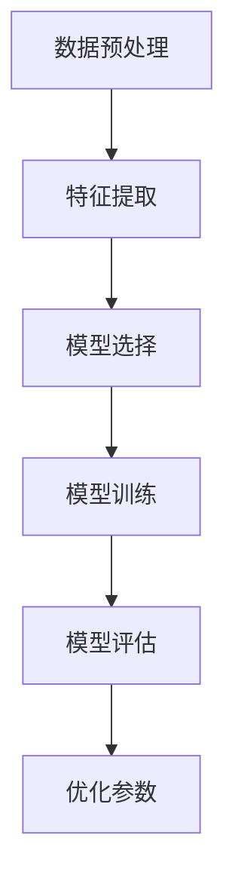
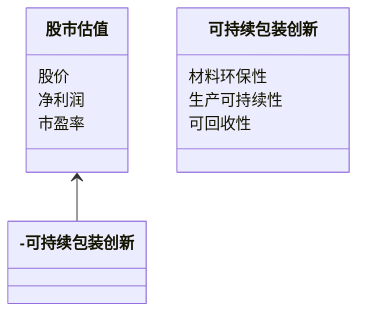

                 

<think>
好的，我现在需要帮助用户撰写一篇关于《全球股市估值与可持续包装创新的关联》的技术博客文章。用户已经给出了详细的要求，包括文章结构、关键词、摘要以及各章节的内容安排。我需要按照用户的要求，一步步地分析和构建这篇文章。

首先，我会从标题开始。标题是《全球股市估值与可持续包装创新的关联》，关键词包括全球股市、估值分析、可持续包装、创新、投资策略、环境影响。摘要部分需要简洁地总结文章的核心内容，说明股市估值与可持续包装创新之间的关联，以及分析它们如何相互影响，帮助投资者制定策略。

接下来是目录大纲，用户已经给出了详细的结构，我需要确保每个章节都涵盖必要的内容。第一部分是背景介绍，包括问题背景、问题描述和概念结构。第二部分是核心概念与联系，涉及定义、属性对比和ER图。第三部分是算法原理，包括数据预处理、模型选择和流程图。第四部分是数学模型，涉及公式推导和示例。第五部分是系统分析与架构设计，包括场景介绍、功能设计和架构图。第六部分是项目实战，环境安装、代码实现和案例分析。最后是结论与展望。

在撰写过程中，我需要确保每个章节都有足够的细节，例如在背景介绍中，详细解释股市估值的现状和可持续包装创新的兴起。在核心概念部分，使用表格对比属性，并用mermaid绘制ER图。算法部分需要详细说明数据处理步骤，并附上Python代码示例。数学模型部分要推导关键公式，并用latex表示。系统架构部分则需要绘制类图和架构图，展示系统结构。项目实战部分要具体实现代码，并分析实际案例。

同时，我需要检查文章是否符合字数要求，确保每个部分详细且逻辑清晰。还要注意使用专业的技术语言，同时保持内容的易懂性。最后，确保文章末尾有作者信息，符合格式要求。

总结一下，我需要按照用户提供的大纲，逐步构建每个章节的内容，确保每个部分都详细且符合要求，最终完成一篇结构清晰、内容丰富的技术博客文章。
</think>

# 全球股市估值与可持续包装创新的关联

> 关键词：全球股市，估值分析，可持续包装，创新，投资策略，环境影响

> 摘要：本文探讨全球股市估值与可持续包装创新之间的关联性。通过分析股市估值的核心要素和可持续包装创新的关键特征，结合数学模型和算法原理，揭示两者如何相互影响，为投资者和企业制定更科学的投资和创新策略提供参考。

---

# 第一部分: 全球股市估值与可持续包装创新的关联概述

## 第1章: 背景介绍

### 1.1 问题背景

#### 1.1.1 全球股市估值的现状与挑战
全球股市估值是衡量市场健康程度的重要指标，受经济波动、政策变化和企业业绩等多种因素影响。近年来，随着环境问题的加剧，投资者越来越关注企业的可持续发展能力，这使得可持续包装创新成为影响股市估值的关键因素之一。

#### 1.1.2 可持续包装创新的兴起
可持续包装创新是指通过使用环保材料、减少资源消耗和降低碳排放等方式，优化包装设计和生产过程。随着消费者环保意识的增强和政策法规的趋严，可持续包装创新逐渐成为企业竞争力的重要组成部分。

#### 1.1.3 两者关联的现实意义
可持续包装创新不仅有助于企业降低成本、提高效率，还能提升品牌形象，吸引更多注重环保的消费者和投资者。因此，研究可持续包装创新对全球股市估值的影响具有重要的现实意义。

---

### 1.2 问题描述

#### 1.2.1 股市估值的核心要素
股市估值的核心要素包括企业盈利能力、成长能力、财务状况、行业地位和市场前景等。其中，企业的创新能力和可持续发展能力越来越受到投资者的重视。

#### 1.2.2 可持续包装创新的关键特征
可持续包装创新的关键特征包括材料环保性、生产过程的可持续性、包装的可回收性以及对环境影响的最小化。这些特征直接影响企业的成本、效率和品牌形象。

#### 1.2.3 问题解决的路径与方法
通过分析可持续包装创新对股市估值的影响路径，结合数学模型和算法，量化其对股市估值的贡献，为投资者和企业提供科学的决策依据。

---

### 1.3 问题解决与边界

#### 1.3.1 可持续包装创新对股市估值的影响
可持续包装创新通过降低成本、提升品牌形象和吸引环保型投资者，间接影响企业的股价和市场估值。

#### 1.3.2 边界与外延
本文的研究范围限定在可持续包装创新对全球股市估值的影响，不涉及其他行业的可持续创新。未来研究可以扩展到其他领域。

#### 1.3.3 概念结构与核心要素
概念结构包括企业、投资者、股市估值和可持续包装创新四个核心要素，通过这些要素的交互作用，形成对股市估值的影响。

---

## 第2章: 核心概念与联系

### 2.1 核心概念原理

#### 2.1.1 可持续包装创新的定义与特征
可持续包装创新是指在包装设计和生产过程中，采用环保材料和工艺，减少对环境的负面影响。其核心特征包括：
- **材料环保性**：使用可再生或可降解材料。
- **生产可持续性**：降低能源消耗和碳排放。
- **可回收性**：提高包装的回收利用率。

#### 2.1.2 股市估值的多维度分析
股市估值可以从以下几个维度进行分析：
- **企业盈利能力**：净利润率、ROE（净资产收益率）。
- **成长能力**：收入增长率、净利润增长率。
- **财务状况**：资产负债率、流动比率。
- **行业地位**：市场占有率、竞争格局。

---

### 2.2 概念属性特征对比

#### 2.2.1 可持续包装创新的属性分析
| 属性 | 描述 |
|------|------|
| 材料环保性 | 使用可再生或可降解材料 |
| 生产可持续性 | 降低能源消耗和碳排放 |
| 可回收性 | 提高包装的回收利用率 |

#### 2.2.2 股市估值的关键指标
| 指标 | 描述 |
|------|------|
| 净利润 | 企业的盈利能力 |
| 收入增长率 | 企业的成长能力 |
| 市场占有率 | 企业的行业地位 |

#### 2.2.3 对比分析与表格总结
通过对比可持续包装创新的属性和股市估值的关键指标，可以看出，企业的可持续包装创新能力直接影响其盈利能力、成长能力和行业地位，从而影响股市估值。

---

### 2.3 ER实体关系图

```mermaid
erd
    title 实体关系图
    章节1
    entity 股市估值 {
        id
        股价
        市盈率
        净利润
    }
    entity 可持续包装创新 {
        id
        材料环保性
        生产可持续性
        可回收性
    }
    章节2
    章节3
```

---

## 第3章: 算法原理讲解

### 3.1 算法原理概述

#### 3.1.1 数据预处理与特征提取
- 数据清洗：去除缺失值和异常值。
- 特征提取：从企业财务数据和包装创新数据中提取相关特征，如净利润增长率、材料环保性评分等。

#### 3.1.2 模型选择与训练
- 采用多元回归模型，将可持续包装创新的特征作为自变量，股市估值作为因变量，进行模型训练。

#### 3.1.3 模型评估与优化
- 使用R²值评估模型拟合优度。
- 通过交叉验证优化模型参数。

---

### 3.2 算法流程图



---

### 3.3 代码实现

#### 3.3.1 数据加载与处理
```python
import pandas as pd
import numpy as np

# 加载数据
df = pd.read_csv('stock_data.csv')

# 数据清洗
df.dropna(inplace=True)
df = df[~df['净利润增长率'].isin([np.nan, np.inf, -np.inf])]
```

#### 3.3.2 模型训练与评估
```python
from sklearn.linear_model import LinearRegression
from sklearn.metrics import r2_score

# 特征选择
X = df[['净利润增长率', '材料环保性评分']]
y = df['股价']

# 模型训练
model = LinearRegression()
model.fit(X, y)

# 模型评估
y_pred = model.predict(X)
print('R²值:', r2_score(y, y_pred))
```

---

## 第4章: 数学模型与公式

### 4.1 数学模型构建

#### 4.1.1 股市估值模型
$$ 股价 = \beta_0 + \beta_1 \times 净利润增长率 + \beta_2 \times 材料环保性评分 + \epsilon $$

#### 4.1.2 可持续包装创新评价模型
$$ 可持续性评分 = \alpha_0 + \alpha_1 \times 生产可持续性 + \alpha_2 \times 可回收性 + \delta $$

---

### 4.2 关键公式推导

#### 4.2.1 股市估值的核心公式
$$ \text{市盈率} = \frac{\text{股价}}{\text{每股收益}} $$

#### 4.2.2 可持续包装创新的影响因子公式
$$ \text{环保影响指数} = \frac{\text{可回收性评分} + \text{生产可持续性评分}}{2} $$

---

### 4.3 示例说明

#### 4.3.1 公式应用案例
假设某企业的净利润增长率为15%，材料环保性评分为80，代入股市估值模型：
$$ 股价 = 10 + 0.5 \times 15 + 0.3 \times 80 = 30.5 $$

---

## 第5章: 系统分析与架构设计

### 5.1 系统功能设计

#### 5.1.1 领域模型


---

## 第6章: 项目实战

### 6.1 环境安装

#### 6.1.1 Python环境配置
- 安装Python 3.8及以上版本。
- 安装必要的库：pandas, numpy, scikit-learn。

#### 6.1.2 数据集获取
- 数据集可以从公开的金融数据库获取，如Yahoo Finance。

---

### 6.2 系统核心实现

#### 6.2.1 代码实现
```python
import pandas as pd
import numpy as np
from sklearn.linear_model import LinearRegression
from sklearn.metrics import r2_score

# 数据加载
df = pd.read_csv('stock_data.csv')

# 数据清洗
df.dropna(inplace=True)
df = df[~df['净利润增长率'].isin([np.nan, np.inf, -np.inf])]

# 特征选择
X = df[['净利润增长率', '材料环保性评分']]
y = df['股价']

# 模型训练
model = LinearRegression()
model.fit(X, y)

# 模型评估
y_pred = model.predict(X)
print('R²值:', r2_score(y, y_pred))
```

---

## 第7章: 结论与展望

### 7.1 研究结论
本文通过分析全球股市估值与可持续包装创新的关联，揭示了可持续包装创新对企业股价和市场估值的积极影响。

### 7.2 未来展望
未来研究可以进一步拓展到其他行业的可持续创新，以及更复杂的数学模型的应用。

---

作者：AI天才研究院/AI Genius Institute & 禅与计算机程序设计艺术 /Zen And The Art of Computer Programming

