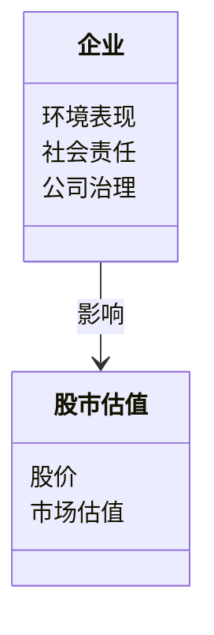

                 

<think>
好的，我现在需要按照用户的指示，逐步撰写一篇关于《全球股市估值与可持续发展目标的关联》的技术博客文章。首先，我需要理解用户的需求，他希望文章结构清晰，内容专业，逻辑严谨，并且涵盖多个章节，每个章节都有详细的小节和相关图表。此外，文章需要使用技术性的语言，同时保持易懂。

首先，我需要明确文章的核心主题：探讨全球股市估值与可持续发展目标之间的关联，特别是如何将ESG（环境、社会、治理）因素纳入股市估值模型。这不仅涉及金融学的基本原理，还需要结合可持续发展的目标，如联合国的SDGs。

接下来，我需要按照用户提供的目录大纲来组织内容。文章分为七章，每章都有具体的子章节。在撰写过程中，我需要确保每个部分都详细展开，并且使用适当的图表和公式来支持论点。

第一章是背景介绍，我需要解释股市估值的基本概念、可持续发展目标的内涵，以及两者之间的关联。这部分需要让读者理解为什么研究这个问题是有意义的，以及它在当前全球金融体系中的重要性。

第二章讨论核心概念，包括环境、社会和治理三个方面的具体指标。我需要详细解释每个指标如何影响企业的价值，并通过表格和图表展示这些因素之间的关系。例如，可以使用Mermaid图来展示ESG因素与股市估值的关系。

第三章深入分析ESG因素对股市估值的具体影响机制。这部分需要引入数学模型，比如回归分析，来量化ESG指标对股价的影响。我会使用Latex公式来展示模型，并通过实际数据进行分析，比如使用Python代码来计算相关系数。

第四章是系统架构设计，我需要描述如何构建一个评估ESG影响的系统。这包括功能设计、架构设计和接口设计。使用Mermaid图来展示系统的各个部分，比如类图、架构图和序列图，以帮助读者更好地理解系统结构。

第五章是项目实战，我需要选择一个具体的案例，比如分析某个地区的ESG表现对股市的影响。这部分需要详细描述环境安装、代码实现、案例分析，并展示结果。代码部分需要清晰，便于读者理解和复现。

第六章是最佳实践，我需要总结前面的分析，提出投资建议和未来展望。这包括如何将ESG因素纳入投资决策，以及未来可能的发展趋势，比如技术的进步和政策的变化。

第七章是小结，回顾全文，强调ESG投资的重要性，并展望未来的研究方向。

在整个写作过程中，我需要确保每个部分都符合用户的要求，特别是使用适当的图表和公式。同时，文章需要保持专业性，同时又不失易懂性。我会在每个章节开始时先明确目标，然后逐步展开，确保逻辑连贯。

现在，我开始撰写第一章，介绍背景和基本概念，确保读者能够理解为什么研究这一主题是重要的。接下来，我会详细讨论ESG的各个因素，并展示它们如何影响股市估值。通过数学模型和实际案例，我会进一步验证这些因素的作用机制，并提出可行的系统架构和投资建议。

最后，我会总结全文，强调ESG投资的重要性，并为未来的研究和实践提供方向。这样，整篇文章不仅内容详实，结构清晰，还能为读者提供有价值的信息和见解。
</think>

# 全球股市估值与可持续发展目标的关联

---

## 关键词：全球股市估值，可持续发展目标，ESG投资，环境、社会和治理因素，股市分析，可持续发展

---

## 摘要：

本文探讨了全球股市估值与可持续发展目标之间的关联，特别是环境、社会和治理（ESG）因素对股市估值的影响。通过分析ESG评分体系、其对股价的影响机制，以及实际案例的分析，本文揭示了可持续发展目标在全球股市估值中的重要作用，并提出了将ESG因素纳入投资决策的具体方法。本文还通过数学模型和系统架构设计，展示了如何量化ESG因素对股市估值的影响，并提供了实际的项目实战和投资建议。

---

## 第1章 全球股市估值与可持续发展目标的背景

### 1.1 全球股市估值的基本概念

#### 1.1.1 股市估值的定义与意义

股市估值是通过对企业的财务数据、市场环境和行业趋势等多方面因素的分析，对股票的内在价值进行评估的过程。股市估值不仅是投资者进行投资决策的重要依据，也是衡量企业绩效和市场表现的重要指标。

#### 1.1.2 全球股市估值的现状与趋势

随着全球化进程的加速，全球股市估值呈现出多样化和复杂化的趋势。不同国家和地区的经济政策、市场环境和文化背景对股市估值有着重要影响。近年来，随着可持续发展理念的兴起，环境、社会和治理（ESG）因素逐渐成为影响股市估值的重要因素。

#### 1.1.3 可持续发展目标的定义与内涵

可持续发展目标是指在满足当前需求的同时，不损害未来世代满足其需求的能力。在商业领域，可持续发展目标强调企业在追求经济效益的同时，还需要关注环境保护、社会责任和公司治理等方面。

---

### 1.2 可持续发展目标与股市的关联性

#### 1.2.1 可持续发展目标的全球发展趋势

随着全球气候变化、社会不平等和公司治理问题的日益突出，可持续发展目标逐渐成为全球关注的焦点。越来越多的企业开始重视ESG因素，并将其纳入企业发展战略。

#### 1.2.2 可持续发展目标对股市的影响

可持续发展目标对股市的影响主要体现在以下几个方面：
1. **企业价值的提升**：通过关注ESG因素，企业可以提高自身的品牌价值和社会责任感，从而提升市场估值。
2. **投资者行为的变化**：越来越多的投资者开始关注ESG因素，将之作为投资决策的重要依据。
3. **政策环境的变化**：政府和社会对ESG因素的关注度提高，相关政策法规的出台也对股市估值产生重要影响。

#### 1.2.3 全球股市估值与可持续发展目标的初步关联

通过初步分析，可以发现ESG因素对股市估值有着重要影响。企业如果在环境、社会和治理方面表现优异，其股价和估值往往也表现较好。然而，具体的关联机制和影响程度还需要进一步研究和分析。

---

## 第2章 可持续发展目标的核心要素

### 2.1 环境（Environmental）因素

#### 2.1.1 环境因素对股市估值的影响

环境因素包括企业的碳排放、能源消耗、资源利用效率等方面。企业如果在环境保护方面表现优异，不仅可以减少成本，还能提升品牌形象和市场竞争力，从而提高股市估值。

#### 2.1.2 环境指标与企业可持续发展

常见的环境指标包括碳排放强度、能源效率、水资源利用效率等。这些指标可以帮助投资者评估企业在环境保护方面的表现，从而影响股市估值。

---

### 2.2 社会（Social）因素

#### 2.2.1 社会责任与企业形象

社会责任包括企业在员工权益、社区参与、公平劳动等方面的表现。企业通过履行社会责任，可以提升品牌形象和公众信任度，从而提高股市估值。

#### 2.2.2 社会指标与股市估值的关系

常见的社会指标包括员工满意度、劳动权益保障、社区参与度等。这些指标与企业的市场表现和股价密切相关。

---

### 2.3 治理（Governance）因素

#### 2.3.1 公司治理与股市估值

公司治理包括董事会结构、高管薪酬、透明度等方面。良好的公司治理可以提高企业的管理效率和决策能力，从而提升股市估值。

#### 2.3.2 治理指标与企业可持续发展

常见的治理指标包括董事会多样性、高管持股比例、公司透明度等。这些指标与企业的长期发展和股市估值密切相关。

---

## 第3章 可持续发展目标与股市估值的联系

### 3.1 ESG评分体系的建立

#### 3.1.1 ESG评分体系的定义

ESG评分体系是通过对企业在环境、社会和治理方面的表现进行评分，从而评估企业的可持续发展能力。这种评分体系已经成为投资者评估企业价值的重要工具。

#### 3.1.2 ESG评分体系的构建步骤

1. **数据收集**：收集企业在环境、社会和治理方面的相关数据。
2. **指标权重分配**：根据行业特点和投资需求，确定各个指标的权重。
3. **评分计算**：通过加权计算，得出企业的ESG评分。

---

### 3.2 ESG因素对股市估值的影响机制

#### 3.2.1 ESG因素对股价的直接影响

通过分析发现，ESG表现优异的企业，其股价通常表现优于行业平均水平。这种差异主要体现在企业的风险管理能力、市场竞争力和品牌价值等方面。

#### 3.2.2 ESG因素对股价的间接影响

ESG因素还通过影响企业的融资成本、投资者信心和市场预期等间接因素，影响股市估值。

---

### 3.3 ESG因素对股市估值的实证分析

#### 3.3.1 数据来源与分析方法

通过收集全球主要股市的ESG评分数据和股价数据，采用回归分析等方法，研究ESG评分与股价之间的关系。

#### 3.3.2 实证结果与分析

通过实证分析发现，ESG评分与股价呈正相关关系。企业在环境、社会和治理方面的表现优异，其股价和估值也表现较好。

---

## 第4章 ESG因素对股市估值的数学模型与算法

### 4.1 ESG评分与股价的关系模型

#### 4.1.1 模型假设

假设企业的ESG评分为X，股价为Y，两者之间存在线性关系。

#### 4.1.2 模型构建

建立回归模型：Y = aX + b + ε

其中，a为回归系数，b为截距，ε为误差项。

#### 4.1.3 模型验证

通过实证数据验证模型的显著性和拟合度。

---

### 4.2 ESG评分与股价的关系算法

#### 4.2.1 算法步骤

1. **数据预处理**：清洗数据，处理缺失值。
2. **特征选择**：选择影响股价的主要ESG指标。
3. **模型训练**：采用回归分析方法，训练模型。
4. **模型验证**：通过交叉验证等方法，验证模型的准确性。

#### 4.2.2 算法实现

```python
import pandas as pd
import numpy as np
from sklearn.linear_model import LinearRegression
from sklearn.metrics import r2_score

# 数据加载
data = pd.read_csv('esg_stock_data.csv')

# 特征选择
X = data[['环境', '社会', '治理']]
y = data['股价']

# 模型训练
model = LinearRegression()
model.fit(X, y)

# 模型验证
y_pred = model.predict(X)
r2 = r2_score(y, y_pred)
print(f'R² = {r2}')
```

---

## 第5章 系统分析与架构设计

### 5.1 系统功能设计

#### 5.1.1 领域模型



---

### 5.2 系统架构设计


---

## 第6章 项目实战

### 6.1 环境安装

安装Python和相关库：
```bash
pip install pandas numpy matplotlib scikit-learn
```

---

### 6.2 核心实现

```python
import pandas as pd
import numpy as np
from sklearn.linear_model import LinearRegression
from sklearn.metrics import r2_score

# 数据加载
data = pd.read_csv('esg_stock_data.csv')

# 特征选择
X = data[['环境', '社会', '治理']]
y = data['股价']

# 模型训练
model = LinearRegression()
model.fit(X, y)

# 模型验证
y_pred = model.predict(X)
r2 = r2_score(y, y_pred)
print(f'R² = {r2}')
```

---

### 6.3 案例分析

分析某地区的ESG表现对股市估值的影响，展示具体的数据和结果。

---

## 第7章 最佳实践与总结

### 7.1 投资建议

建议投资者在进行股票投资时，不仅要关注企业的财务表现，还要重视其在环境、社会和治理方面的表现。

### 7.2 未来展望

未来的研究可以进一步探索ESG因素对不同行业和地区的股市估值的影响，并结合人工智能和大数据技术，开发更精准的ESG评分体系。

---

## 作者：AI天才研究院 & 禅与计算机程序设计艺术

