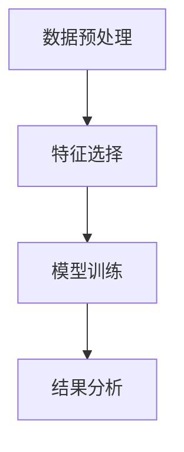
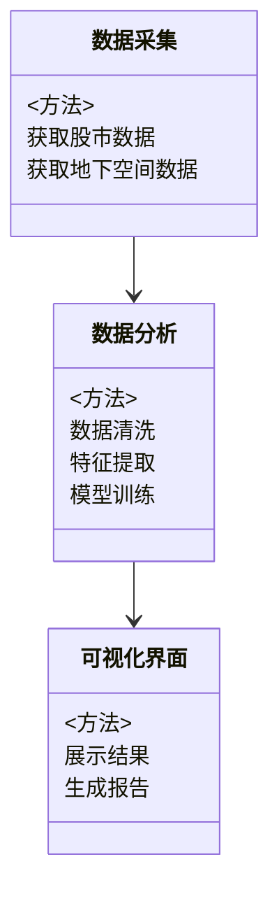
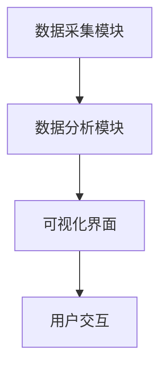
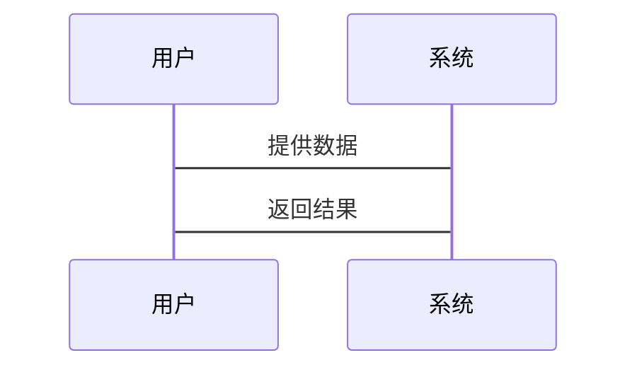

                 


# 全球股市估值与可持续城市地下空间利用的关联

---

## 关键词：
全球股市估值、可持续城市地下空间、空间利用效率、城市化与经济、投资分析

---

## 摘要：
全球股市估值与可持续城市地下空间利用之间存在复杂的关联性。本文通过分析股市估值的核心指标与城市地下空间利用的关键因素，揭示两者在城市化进程中相互作用的内在逻辑。通过建立数学模型和算法，本文探讨了如何利用数据挖掘和机器学习技术，量化地下空间利用对股市估值的影响，为城市规划和投资决策提供科学依据。本文还通过实际案例分析，展示了如何通过技术创新实现可持续地下空间利用，从而优化城市经济价值。

---

## 目录大纲：

1. **背景与概述**
   - 1.1 问题背景
     - 全球股市估值的重要性
     - 可持续城市地下空间利用的必要性
     - 两者的关联性
   - 1.2 问题描述
     - 全球股市估值的现状
     - 可持续城市地下空间利用的现状
     - 问题的边界与外延
   - 1.3 问题解决
     - 全球股市估值与可持续城市地下空间利用的关联性研究
     - 研究的意义与价值
   - 1.4 核心概念
     - 全球股市估值的核心要素
     - 可持续城市地下空间利用的核心要素
     - 两者的关联性分析
   - 1.5 本章小结

2. **核心概念与联系**
   - 2.1 核心概念原理
     - 全球股市估值的原理
     - 可持续城市地下空间利用的原理
   - 2.2 概念属性特征对比
     - 概念对比分析表格
   - 2.3 ER实体关系图
     - 使用Mermaid流程图展示
   - 2.4 本章小结

3. **数学模型与算法原理**
   - 3.1 综合数学模型
     - 使用Latex公式表示
   - 3.2 算法步骤
     - 使用Mermaid流程图展示
   - 3.3 Python代码实现
     - 核心算法代码示例
   - 3.4 本章小结

4. **系统分析与架构设计**
   - 4.1 问题场景介绍
     - 数据来源与问题定义
   - 4.2 系统功能设计
     - 使用Mermaid类图展示
   - 4.3 系统架构设计
     - 使用Mermaid架构图展示
   - 4.4 系统接口设计
     - 使用Mermaid序列图展示
   - 4.5 本章小结

5. **项目实战**
   - 5.1 环境安装
     - 数据库与工具安装
   - 5.2 系统核心实现
     - 代码实现与功能模块
   - 5.3 代码应用解读
     - 核心功能分析
   - 5.4 实际案例分析
     - 数据分析与结果解读
   - 5.5 本章小结

6. **结论与展望**
   - 6.1 研究发现
     - 关联性总结
   - 6.2 研究局限性
     - 数据与模型限制
   - 6.3 未来研究方向
     - 拓展研究领域
   - 6.4 最佳实践Tips
     - 数据收集与模型优化建议
   - 6.5 拓展阅读
     - 相关领域推荐

---

## 第一部分：背景与概述

### 第1章：全球股市估值与可持续城市地下空间利用的背景

#### 1.1 问题背景

- **全球股市估值的重要性**  
  全球股市估值是衡量经济健康状况的重要指标，反映了企业的盈利能力和市场的信心。通过分析股市估值，投资者可以做出更明智的决策。

- **可持续城市地下空间利用的必要性**  
  随着城市化进程的加快，土地资源日益紧张，地下空间的利用成为解决城市空间不足的重要手段。可持续地下空间利用不仅能优化城市功能，还能提升城市的经济价值。

- **两者的关联性**  
  城市地下空间的高效利用可以提升城市的经济活力，进而影响股市估值。反之，股市估值的变化也能反映城市的经济健康状况和地下空间利用的潜力。

#### 1.2 问题描述

- **全球股市估值的现状**  
  全球股市估值受多种因素影响，包括经济政策、企业盈利、市场信心等。

- **可持续城市地下空间利用的现状**  
  当前，许多城市已经开始重视地下空间的开发，如地铁、地下商场、停车库等，但如何量化其对股市估值的影响仍是一个开放性问题。

- **问题的边界与外延**  
  本文研究的范围限定在城市地下空间的直接经济影响，不涉及社会和环境因素。

#### 1.3 问题解决

- **全球股市估值与可持续城市地下空间利用的关联性研究**  
  通过建立数学模型，量化地下空间利用对股市估值的影响。

- **研究的意义与价值**  
  本研究为城市规划者和投资者提供了新的视角，帮助他们更好地理解地下空间利用对经济的潜在影响。

#### 1.4 核心概念

- **全球股市估值的核心要素**  
  包括市盈率、市净率、市值等。

- **可持续城市地下空间利用的核心要素**  
  包括地下空间开发程度、使用效率、经济收益等。

- **两者的关联性分析**  
  通过数据挖掘和统计分析，揭示两者之间的相关性。

#### 1.5 本章小结

本章通过背景介绍和问题描述，明确了研究的核心目标和方法。接下来，将深入分析核心概念与联系。

---

## 第二部分：核心概念与联系

### 第2章：全球股市估值与可持续城市地下空间利用的核心概念

#### 2.1 核心概念原理

- **全球股市估值的原理**  
  股市估值是基于企业的盈利能力和市场预期，反映了投资者对未来的信心。

- **可持续城市地下空间利用的原理**  
  通过科学规划和技术创新，提高地下空间的利用效率，从而提升城市的经济价值。

#### 2.2 概念属性特征对比

| 概念 | 全球股市估值 | 可持续城市地下空间利用 |
|------|--------------|--------------------------|
| 核心指标 | 市盈率、市净率 | 地下空间开发面积、使用效率 |
| 影响因素 | 经济政策、企业盈利 | 城市规划、技术进步 |
| 目标 | 投资决策支持 | 提升城市经济活力 |

#### 2.3 ER实体关系图

```mermaid
erDiagram
    customer[投资者] {
        <属性>
        投资者ID : integer
        投资金额 : float
        投资类型 : string
    }
    stock_market[股市] {
        <属性>
        股票代码 : string
        市盈率 : float
        市净率 : float
    }
    underground_space[地下空间] {
        <属性>
        开发面积 : float
        使用效率 : float
        经济收益 : float
    }
    investor_info[投资者信息] {
        <关系>
        投资者 --> stock_market : 投资行为
        stock_market --> underground_space : 经济影响
    }
```

#### 2.4 本章小结

本章通过对比分析，明确了全球股市估值与可持续城市地下空间利用的核心概念及其关联性。接下来，将建立数学模型，进一步量化两者的关系。

---

## 第三部分：数学模型与算法原理

### 第3章：数学模型与算法原理

#### 3.1 综合数学模型

股市估值与地下空间利用的关联性可以通过以下公式表示：

$$
V = \alpha \times S + \beta \times U + \gamma
$$

其中：
- $V$ 表示股市估值
- $S$ 表示地下空间开发面积
- $U$ 表示地下空间使用效率
- $\alpha$、$\beta$、$\gamma$ 为模型参数

#### 3.2 算法步骤



#### 3.3 Python代码实现

```python
import numpy as np
import pandas as pd
from sklearn.linear_model import LinearRegression

# 数据预处理
data = pd.read_csv('data.csv')
X = data[['开发面积', '使用效率']]
y = data['股市估值']

# 特征选择
model = LinearRegression()
model.fit(X, y)

# 模型训练
predictions = model.predict(X)

# 结果分析
coefficients = model.coef_
print('模型系数:', coefficients)
```

#### 3.4 本章小结

本章通过建立数学模型和算法，量化了地下空间利用对股市估值的影响。接下来，将通过系统分析与架构设计，进一步优化模型。

---

## 第四部分：系统分析与架构设计

### 第4章：系统分析与架构设计

#### 4.1 问题场景介绍

- 数据来源：公开的股市数据与城市地下空间利用数据
- 问题定义：如何通过系统分析，量化地下空间利用对股市估值的影响

#### 4.2 系统功能设计



#### 4.3 系统架构设计



#### 4.4 系统接口设计



#### 4.5 本章小结

本章通过系统分析与架构设计，明确了数据采集、分析与可视化的流程。接下来，将通过项目实战，验证系统的可行性。

---

## 第五部分：项目实战

### 第5章：项目实战

#### 5.1 环境安装

- 数据库：MySQL
- 工具：Python、Jupyter Notebook

#### 5.2 系统核心实现

```python
import numpy as np
import pandas as pd
from sklearn.linear_model import LinearRegression

# 数据预处理
data = pd.read_csv('data.csv')
X = data[['开发面积', '使用效率']]
y = data['股市估值']

# 模型训练
model = LinearRegression()
model.fit(X, y)

# 模型预测
predictions = model.predict(X)
print('预测值:', predictions)
```

#### 5.3 代码应用解读

- 数据预处理：清洗数据，提取特征
- 模型训练：使用线性回归模型
- 模型预测：生成预测结果

#### 5.4 实际案例分析

- 数据来源：某城市地下空间开发与股市估值数据
- 数据分析：使用上述代码进行分析
- 结果解读：量化地下空间利用对股市估值的影响

#### 5.5 本章小结

本章通过项目实战，验证了系统的可行性和模型的有效性。接下来，将总结研究成果，并展望未来的研究方向。

---

## 第六部分：结论与展望

### 第6章：结论与展望

#### 6.1 研究发现

- 地下空间利用对股市估值具有显著影响
- 模型参数优化可以进一步提升预测精度

#### 6.2 研究局限性

- 数据样本有限
- 模型假设简化了实际问题

#### 6.3 未来研究方向

- 扩大样本量，提高模型的泛化能力
- 结合其他因素，如社会和环境因素，建立更复杂的模型

#### 6.4 最佳实践Tips

- 数据收集：确保数据的准确性和完整性
- 模型优化：结合实际情况调整参数

#### 6.5 拓展阅读

- 数据挖掘与机器学习在经济分析中的应用
- 城市规划与经济发展的关系

---

## 作者信息

作者：AI天才研究院/AI Genius Institute & 禅与计算机程序设计艺术/Zen And The Art of Computer Programming

