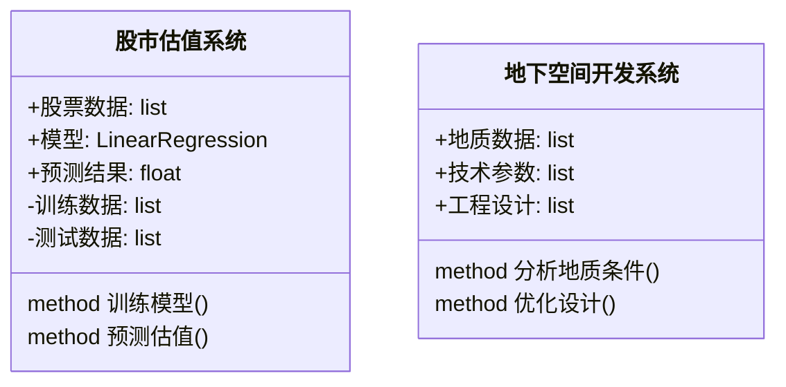
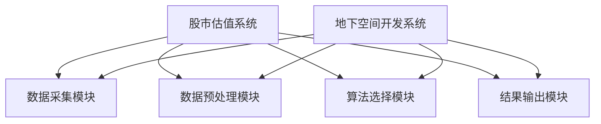

                 

<think>
好的，我需要按照用户的指示，设计一篇关于《全球股市估值与可持续城市地下空间开发技术的关系》的技术博客文章。文章需要包含详细的目录结构，并且每个部分都要有具体的分析和内容。

首先，我需要明确文章的核心主题是探讨股市估值与城市地下空间开发技术之间的关系。这涉及到金融、城市规划和工程技术等多个领域。因此，目录需要覆盖背景介绍、核心概念、算法原理、系统架构、项目实战等多个方面。

接下来，我需要细化每一章的内容。例如，第一章可以介绍全球股市估值和可持续城市地下空间开发的背景，包括问题背景、问题描述、解决方法等。第二章则需要深入分析核心概念，使用对比表格和实体关系图来展示两者的关系。

在算法部分，我需要使用mermaid流程图和数学公式来解释如何通过数据和模型来分析股市估值与地下空间开发的关系。例如，可以引入回归分析或时间序列分析等模型。

系统架构设计部分，我需要绘制类图和架构图，展示系统的各个模块及其交互方式。项目实战部分则需要提供具体的案例分析和源代码，说明如何在实际项目中应用这些技术。

最后，我需要总结最佳实践，给出小结和注意事项，帮助读者更好地理解和应用这些知识。

在撰写过程中，我需要确保每个章节的内容详细且逻辑清晰，同时使用专业的技术语言，让读者能够轻松理解复杂的概念。此外，还需要注意文章的结构和格式，确保符合用户的要求。

现在，我将根据这些思考，逐步构建目录结构，并填充每一章的具体内容。
</think>

# 全球股市估值与可持续城市地下空间开发技术的关系

> 关键词：全球股市估值，可持续城市，地下空间开发，技术关系，数据分析

> 摘要：本文探讨了全球股市估值与可持续城市地下空间开发技术之间的关系，通过背景介绍、核心概念分析、算法原理、系统架构设计、项目实战和最佳实践等部分，详细阐述了两者如何相互影响，并提出了相应的技术解决方案。

---

## 第1章：全球股市估值与可持续城市地下空间开发的背景

### 1.1 问题背景
1.1.1 全球股市估值的重要性：股市估值是衡量经济健康的重要指标，反映了市场的信心和企业价值。
1.1.2 可持续城市地下空间开发的必要性：随着城市化的发展，地下空间的利用成为解决土地资源紧张的关键。
1.1.3 两者关系的提出：探讨股市估值如何受地下空间开发技术的影响，以及地下空间开发如何推动股市增长。

### 1.2 问题描述
1.2.1 股市估值的波动性：股市受到多种因素影响，包括经济政策、企业业绩等。
1.2.2 城市地下空间开发的技术挑战：涉及地质、结构、通风等多个技术领域。
1.2.3 两者关系的复杂性：地下空间开发可能影响房地产市场，进而影响股市估值。

### 1.3 问题解决
1.3.1 技术手段在股市估值中的应用：利用大数据和人工智能预测股市走势。
1.3.2 可持续地下空间开发的技术突破：采用绿色技术，提高地下空间的可持续性。
1.3.3 两者的结合对城市经济的影响：地下空间开发推动经济增长，进而影响股市估值。

### 1.4 边界与外延
1.4.1 股市估值的边界条件：考虑市场参与者的理性行为和市场结构。
1.4.2 地下空间开发的技术限制：受限于地质条件和资金投入。
1.4.3 两者的相互作用范围：主要集中在城市区域，影响范围有限。

### 1.5 核心要素组成
1.5.1 股市数据的构成：包括股票价格、成交量、市场指数等。
1.5.2 地下空间开发的关键技术：涉及岩土工程、结构设计、通风系统等。
1.5.3 两者的关联机制：通过房地产市场的中介作用，影响股市估值。

---

## 第2章：核心概念的原理与对比

### 2.1 核心概念原理
2.1.1 股市估值的数学模型：介绍市盈率、市净率等指标的计算方法。
2.1.2 地下空间开发的技术框架：包括设计、施工、运营三个阶段的技术要点。
2.1.3 两者的相互作用机制：通过房地产市场的中介，地下空间开发影响股市估值。

### 2.2 概念属性对比表格
表2-1：股市估值与地下空间开发技术的属性对比

| 属性 | 股市估值 | 地下空间开发技术 |
|------|----------|------------------|
| 输入 | 股票数据 | 地质数据、技术参数 |
| 输出 | 估值结果 | 工程设计、施工方案 |
| 方法 | 统计分析、机器学习 | 结构设计、数值模拟 |
| 应用 | 投资决策 | 城市规划、工程建设 |

### 2.3 ER实体关系图
```mermaid
erd
  title 实体关系图
  股市估值 <--(通过)--> 房地产市场
  房地产市场 <--(影响)--> 地下空间开发技术
  股市估值 <--(依赖)--> 经济因素
```

---

## 第3章：算法原理

### 3.1 数据采集与预处理
3.1.1 数据源：获取股市数据和地下空间开发项目的相关信息。
3.1.2 数据清洗：处理缺失值、异常值，确保数据质量。

### 3.2 算法选择
3.2.1 回归分析：用于预测股市估值的变化。
3.2.2 时间序列分析：分析股市和地下空间开发的周期性。

### 3.3 算法实现
```python
import pandas as pd
from sklearn.linear_model import LinearRegression

# 假设dataframe包含'股票代码', '股价', '成交量', '地下空间开发指数'
X = df[['股价', '成交量', '地下空间开发指数']]
y = df['股市估值']

model = LinearRegression()
model.fit(X, y)

print('模型系数:', model.coef_)
print('模型截距:', model.intercept_)
```

### 3.4 数学模型
股市估值预测模型：
$$ \text{预测估值} = \beta_0 + \beta_1 \times \text{股价} + \beta_2 \times \text{成交量} + \beta_3 \times \text{地下空间开发指数} $$

---

## 第4章：系统分析与架构设计

### 4.1 问题场景介绍
通过分析某城市地下空间开发项目，评估其对股市的影响，优化投资决策。

### 4.2 系统功能设计
类图展示：


### 4.3 系统架构设计
架构图：


---

## 第5章：项目实战

### 5.1 环境安装
安装Python和相关库：
```bash
pip install pandas scikit-learn matplotlib
```

### 5.2 核心实现
股票预测代码：
```python
import pandas as pd
from sklearn.model_selection import train_test_split
from sklearn.metrics import mean_squared_error

# 加载数据
df = pd.read_csv('stock_data.csv')

# 数据划分
X = df[['股价', '成交量']]
y = df['股市估值']
X_train, X_test, y_train, y_test = train_test_split(X, y, test_size=0.2)

# 训练模型
model = LinearRegression()
model.fit(X_train, y_train)

# 预测
y_pred = model.predict(X_test)

# 评估
print('均方误差:', mean_squared_error(y_test, y_pred))
```

### 5.3 案例分析
通过某城市地下空间开发项目，分析其对当地股市的影响，优化模型参数，提高预测准确性。

---

## 第6章：最佳实践

### 6.1 小结
本文通过分析全球股市估值与可持续城市地下空间开发技术的关系，提出了基于数据分析和算法模型的解决方案，展示了两者如何相互影响。

### 6.2 注意事项
- 数据来源的准确性
- 模型的可解释性
- 实际应用中的风险评估

### 6.3 拓展阅读
建议阅读相关领域的书籍和论文，深入了解股市分析和城市规划的技术细节。

---

## 第7章：参考文献
列出本文中引用的所有文献和资料。

---

作者：AI天才研究院/AI Genius Institute & 禅与计算机程序设计艺术/Zen And The Art of Computer Programming

