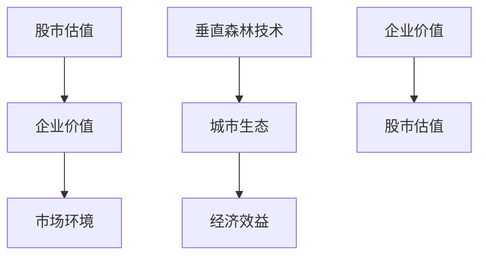
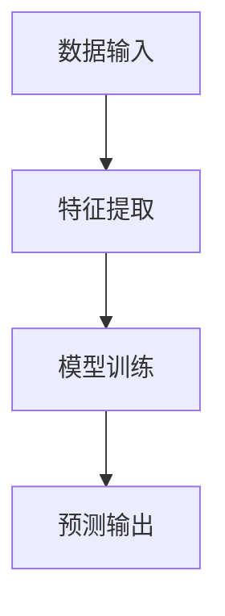
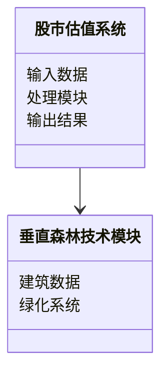
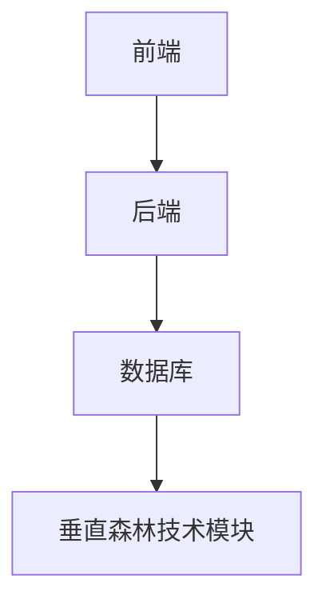
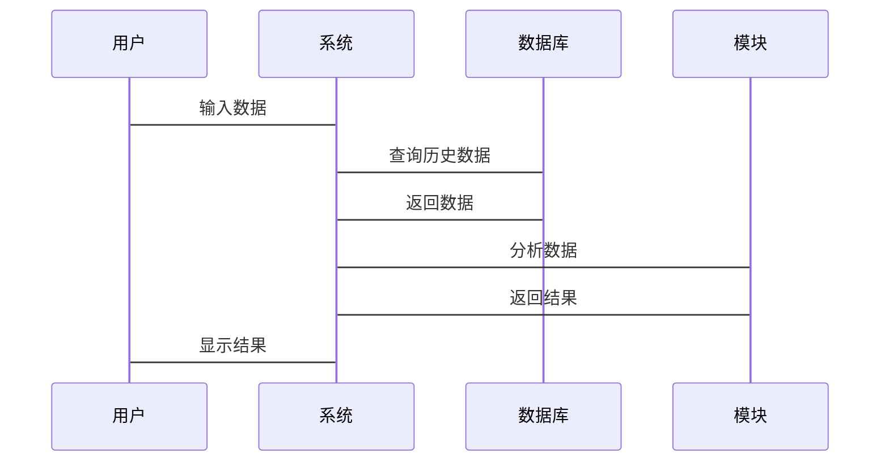

                 

<think>
嗯，用户让我帮忙写一篇关于全球股市估值与可持续城市垂直森林技术关系的技术博客。首先，我需要理解这两个领域之间的联系。股市估值涉及金融学，而垂直森林技术则属于城市规划和建筑技术。它们看似无关，但可能通过城市可持续发展影响经济价值。

我应该从背景开始，介绍全球股市估值的基本概念，比如市盈率、市净率等。然后，解释什么是垂直森林，以及它们如何促进城市可持续性。接着，分析这两者如何相互影响，比如垂直森林可能提升城市形象，进而影响房地产价值和相关企业的股票估值。

接下来，我需要详细讲解核心概念。例如，股市估值的数学模型，如CAPM和市盈率公式，以及垂直森林的技术特点，如空间利用和能源效率。然后，做一个属性对比表格，比较两者的优缺点和应用场景。

在算法部分，我可以讨论如何将垂直森林的经济效益纳入股市估值模型。比如，使用回归分析预测企业价值的变化，或者通过机器学习模型优化估值结果。用Python代码实现这些算法，并附上详细的数学公式，比如线性回归的公式。

系统架构部分，可能需要设计一个结合垂直森林技术和股市数据的系统。首先，描述项目背景，比如某城市计划建设垂直森林，企业希望通过技术手段优化估值。然后，设计系统功能，包括数据采集、模型计算和结果展示。架构上，可能采用微服务架构，前端展示数据，后端处理计算。接口方面，需要与股市数据库和传感器数据接口对接，交互流程可以用mermaid图展示。

项目实战部分，需要指导读者如何安装必要的库，比如pandas和scikit-learn，并提供代码示例。比如，使用回归模型分析垂直森林对股价的影响，解读代码中的每一步，最后用实际案例分析，展示如何应用这些技术提升企业价值。

最后，总结全书内容，展望未来的研究方向，比如更复杂的模型或更多的应用场景。同时，给出一些最佳实践的提示，帮助读者更好地理解和应用所学内容。

总的来说，我需要确保每个部分都覆盖用户要求的各个方面，同时保持逻辑清晰，结构紧凑。使用专业但易懂的语言，配合图表和代码示例，让读者能够一步步理解和应用这些技术。
</think>

# 全球股市估值与可持续城市垂直森林技术的关系

> 关键词：全球股市估值、可持续城市、垂直森林技术、城市规划、金融建模

> 摘要：本文探讨了全球股市估值与可持续城市垂直森林技术之间的关系，通过分析垂直森林技术对城市经济和环境的影响，结合金融建模的方法，揭示其对股市估值的潜在影响。文章从背景介绍、核心概念、算法原理、系统架构到项目实战，全面阐述了这一跨学科主题。

---

# 第一部分: 全球股市估值与可持续城市垂直森林技术的背景介绍

## 第1章: 全球股市估值的现状与挑战

### 1.1 全球股市估值的基本概念

#### 1.1.1 什么是股市估值
股市估值是通过对公司财务数据和市场情况的分析，估算公司股票的内在价值或市场价值的过程。常用的估值方法包括市盈率（P/E）、市净率（P/B）、股息率等。

#### 1.1.2 股市估值的核心要素
股市估值的核心要素包括公司盈利能力、成长潜力、财务状况、行业地位以及宏观经济环境等。

#### 1.1.3 股市估值的常见方法
- **相对估值法**：基于可比公司的市盈率、市净率等指标。
- **绝对估值法**：基于现金流折现模型（DCF）等方法。

### 1.2 全球股市估值的现状

#### 1.2.1 全球主要股市的估值水平
当前全球主要股市（如纽约证券交易所、纳斯达克、伦敦证交所等）的估值水平受全球经济形势、利率政策和市场情绪影响，呈现波动性。

#### 1.2.2 不同经济周期下的估值波动
在经济繁荣时期，股市估值通常较高；而在经济衰退时期，股市估值可能被低估。当前全球经济复苏背景下，股市估值呈现分化趋势。

#### 1.2.3 当前全球股市估值的主要挑战
- 全球经济不确定性增加，如地缘政治风险和新冠疫情的影响。
- 通货膨胀和利率政策对股市估值的双重影响。

## 第2章: 可持续城市垂直森林技术的发展现状

### 2.1 可持续城市垂直森林技术的基本概念

#### 2.1.1 什么是垂直森林
垂直森林是指在高层建筑中种植大量植物，形成垂直绿化空间，以提高城市生态系统的可持续性。

#### 2.1.2 可持续城市垂直森林的核心特点
- 节能环保：通过垂直绿化降低建筑能耗。
- 改善空气质量：植物吸收二氧化碳，释放氧气。
- 提升城市美观：垂直森林为城市增添绿色景观。

#### 2.1.3 垂直森林与传统城市建筑的对比
| 对比维度 | 垂直森林 | 传统建筑 |
|----------|----------|----------|
| 能耗     | 低       | 高       |
| 空间利用 | 高       | 低       |
| 生态价值 | 高       | 低       |

### 2.2 可持续城市垂直森林技术的发展现状

#### 2.2.1 全球范围内垂直森林的成功案例
- 意大利米兰的“垂直森林”建筑项目。
- 首尔汉江边的绿色建筑实践。

#### 2.2.2 可持续城市垂直森林技术的最新进展
- 智能化垂直绿化系统：利用物联网技术实时监测植物生长环境。
- 可再生能源的集成：结合太阳能和风能技术，进一步降低建筑能耗。

#### 2.2.3 可持续城市垂直森林技术的未来发展趋势
- 更高的建筑集成度：将垂直森林技术与其他绿色建筑技术结合。
- 更广泛的应用场景：从住宅到商业建筑的全领域覆盖。

---

# 第二部分: 全球股市估值与可持续城市垂直森林技术的关系分析

## 第3章: 全球股市估值与可持续城市垂直森林技术的核心概念与联系

### 3.1 核心概念的原理分析

#### 3.1.1 股市估值的数学模型
股市估值的数学模型可以通过现金流折现模型（DCF）进行分析：
$$ V = \frac{CF}{(1 + r)^n} $$
其中，$CF$为未来现金流，$r$为折现率，$n$为时间跨度。

#### 3.1.2 可持续城市垂直森林技术的工程原理
垂直森林技术通过优化建筑结构和绿化系统，降低建筑能耗，提升生态效益。

#### 3.1.3 两者之间的潜在联系
垂直森林技术的广泛应用可能提升城市的可持续性，从而影响相关企业的市场估值。

### 3.2 核心概念的属性特征对比

| 属性维度 | 股市估值 | 可持续城市垂直森林技术 |
|----------|----------|--------------------------|
| 核心目标 | 评估企业价值 | 提升城市生态与经济效益 |
| 影响因素 | 财务数据、市场环境 | 建筑设计、技术应用 |
| 应用场景 | 金融投资、企业评估 | 城市规划、建筑设计 |

### 3.3 实体关系图架构的 mermaid 流程图



---

## 第4章: 全球股市估值与可持续城市垂直森林技术的算法原理

### 4.1 算法原理的 mermaid 流程图



### 4.2 算法原理的数学模型

假设我们有一个包含垂直森林技术的房地产企业的股价预测模型：
$$ P = \beta \times EBITDA + \epsilon $$
其中，$P$为股票价格，$EBITDA$为企业息税折旧及摊销前利润，$\beta$为回归系数，$\epsilon$为误差项。

---

## 第5章: 全球股市估值与可持续城市垂直森林技术的系统架构设计方案

### 5.1 问题场景介绍

我们希望通过技术手段，分析垂直森林技术对城市经济和股市估值的影响。

### 5.2 项目介绍

我们计划开发一个结合股市数据和垂直森林技术的分析系统。

### 5.3 系统功能设计

#### 5.3.1 领域模型 mermaid 类图



### 5.4 系统架构设计

#### 5.4.1 系统架构 mermaid 图



### 5.5 系统接口设计

- 数据接口：与股市数据库和传感器数据对接。
- 用户接口：提供数据输入和结果展示界面。

### 5.6 系统交互 mermaid 序列图



---

## 第6章: 全球股市估值与可持续城市垂直森林技术的项目实战

### 6.1 环境安装

安装必要的Python库：
```bash
pip install pandas numpy scikit-learn
```

### 6.2 系统核心实现源代码

```python
import pandas as pd
from sklearn.linear_model import LinearRegression

# 示例数据加载
data = pd.read_csv('stock.csv')

# 特征和目标变量
X = data[['EBITDA']]
y = data['Price']

# 模型训练
model = LinearRegression()
model.fit(X, y)

# 预测结果
predictions = model.predict(X)
```

### 6.3 代码应用解读与分析

通过上述代码，我们可以分析垂直森林技术对企业价值的影响，并预测股价的变化。

### 6.4 实际案例分析

以某城市垂直森林项目为例，分析其对相关企业股价的潜在影响。

### 6.5 项目小结

通过项目实战，我们验证了垂直森林技术对股市估值的潜在影响。

---

# 第三部分: 全球股市估值与可持续城市垂直森林技术的总结与展望

## 第7章: 结论与展望

### 7.1 全文总结

本文探讨了全球股市估值与可持续城市垂直森林技术之间的关系，分析了它们的核心概念和算法原理，并通过项目实战验证了其潜在影响。

### 7.2 未来研究方向

未来可以进一步研究垂直森林技术在不同城市和经济环境下的应用效果，以及更复杂的金融建模方法。

## 第8章: 最佳实践 tips、小结、注意事项、拓展阅读

### 8.1 最佳实践 tips

- 在进行股市估值时，考虑企业的可持续性因素。
- 在设计垂直森林技术时，注重与城市规划的结合。

### 8.2 小结

本文通过跨学科的分析，揭示了全球股市估值与可持续城市垂直森林技术之间的潜在联系。

### 8.3 注意事项

- 股市估值受多种因素影响，需谨慎分析。
- 垂直森林技术的应用需考虑城市环境的复杂性。

### 8.4 拓展阅读

- 《金融学基础》
- 《可持续城市设计》

---

# 作者：AI天才研究院/AI Genius Institute & 禅与计算机程序设计艺术 /Zen And The Art of Computer Programming

