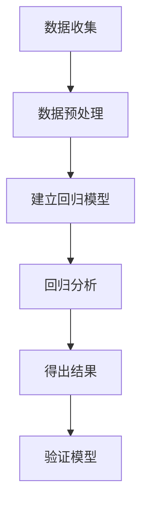
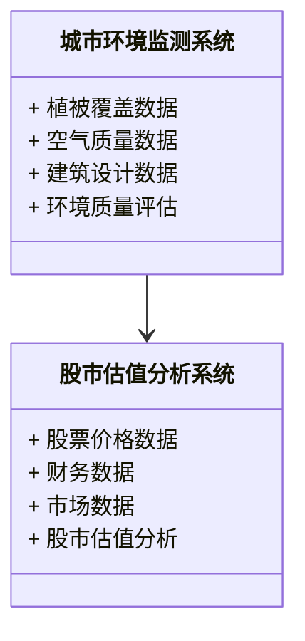
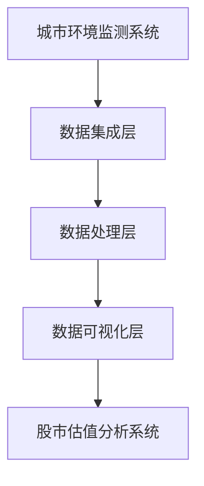

                 


# 全球股市估值与可持续城市垂直绿化技术的关联

## 关键词：
全球股市估值，可持续城市，垂直绿化技术，环境影响，经济价值，可持续发展，城市规划

## 摘要：
本文探讨了全球股市估值与可持续城市垂直绿化技术之间的关联。通过分析垂直绿化技术对城市环境和经济的双重影响，本文提出了一种新的视角，以评估企业价值和股市表现。文章结合理论分析和实证研究，展示了如何通过垂直绿化技术优化城市环境，进而影响股市估值。本文为投资者、城市规划者和政策制定者提供了新的思路，以实现可持续发展和经济价值的双赢。

---

# 第一部分: 全球股市估值与可持续城市垂直绿化技术的背景与概述

## 第1章: 全球股市估值的基本概念与现状

### 1.1 股市估值的核心概念

#### 1.1.1 股票估值的基本定义
股票估值是指通过对公司的财务状况、行业地位、市场前景等多方面因素的分析，确定其股票价格的合理范围。常用的估值方法包括市盈率（P/E）、市净率（P/B）、股息率等。

#### 1.1.2 股票估值的主要方法
- 市盈率（P/E）：公司股价除以每股净利润。
- 市净率（P/B）：公司股价除以每股净资产。
- 股息率：每股股息与股价的比率。

#### 1.1.3 全球股市估值的现状与趋势
近年来，全球股市估值受经济波动、政策变化和技术进步的影响，呈现出波动性增强的趋势。投资者 increasingly关注企业的可持续发展能力，这使得环境和社会治理（ESG）因素在估值中的重要性日益凸显。

### 1.2 可持续城市垂直绿化技术的定义与特点

#### 1.2.1 垂直绿化技术的定义
垂直绿化是指在建筑物的垂直表面种植植物，通过植物的自然生长覆盖建筑外墙。这种技术可以有效利用城市空间，改善城市环境。

#### 1.2.2 可持续城市垂直绿化的核心要素
- 植物选择：选择适合当地气候和环境的植物。
- 建筑设计：与建筑设计相结合，确保植物的生长条件。
- 维护管理：定期维护以保证植物的健康生长。

#### 1.2.3 垂直绿化技术的全球发展趋势
随着城市化进程的加快和环境问题的加剧，垂直绿化技术在全球范围内得到广泛应用。许多城市通过政策支持和技术创新，推动了垂直绿化技术的发展。

---

## 第2章: 全球股市估值与可持续城市垂直绿化技术的关联背景

### 2.1 可持续发展与城市化进程的加速

#### 2.1.1 城市化对环境的影响
城市化带来了空气污染、噪音污染和热岛效应等问题，这些环境问题对居民健康和城市经济活动产生了负面影响。

#### 2.1.2 可持续城市发展的必要性
为应对城市化带来的环境问题，可持续城市发展成为全球关注的焦点。通过技术创新和政策引导，实现经济发展与环境保护的双赢。

#### 2.1.3 垂直绿化技术在城市可持续发展中的作用
垂直绿化技术可以有效缓解城市环境问题，如减少空气污染、降低能耗、改善城市微气候等，为城市的可持续发展提供了技术支持。

### 2.2 股市估值与城市环境质量的潜在联系

#### 2.2.1 城市环境对经济活动的影响
良好的城市环境可以提升居民的生活质量，吸引更多的投资和人才，从而促进经济发展和企业价值提升。

#### 2.2.2 可持续发展对企业价值的影响
企业实施可持续发展战略，如采用绿色技术、减少碳排放等，可以提升企业的社会形象和市场竞争力，从而影响股市估值。

#### 2.2.3 垂直绿化技术对城市环境与经济的双重影响
垂直绿化技术不仅改善了城市环境，还通过提升企业的社会形象和市场竞争力，间接影响股市估值。例如，采用垂直绿化技术的企业可能获得更高的品牌溢价，从而影响股票价格。

---

## 第3章: 问题背景与问题描述

### 3.1 全球股市估值波动的复杂性

#### 3.1.1 经济周期对股市估值的影响
经济周期波动直接影响企业的盈利能力和股票估值。在经济衰退时期，股市估值通常会下降；而在经济繁荣时期，股市估值则会上升。

#### 3.1.2 政治、社会因素对股市估值的影响
政治不稳定、社会动荡等非经济因素也会对股市估值产生重大影响。例如，政策变化可能导致某些行业股票价格的波动。

#### 3.1.3 环境因素对股市估值的潜在影响
随着环境问题的加剧，环境因素在股市估值中的重要性逐渐增加。企业对环境的保护和治理能力成为投资者关注的焦点。

### 3.2 可持续城市垂直绿化技术的推广挑战

#### 3.2.1 技术成熟度与成本问题
垂直绿化技术尚处于发展阶段，技术成熟度较低，实施成本较高，这限制了其在城市中的广泛应用。

#### 3.2.2 市场接受度与政策支持
市场对垂直绿化技术的接受度较低，主要由于缺乏政策支持和公众意识的不足。政策引导和市场推广是推动技术广泛应用的关键。

#### 3.2.3 垂直绿化技术的环境效益与经济效益平衡
垂直绿化技术的环境效益显著，但其经济效益尚不明确。如何通过技术优化和成本控制，实现环境效益与经济效益的平衡，是技术推广中的核心问题。

### 3.3 问题解决的思路与目标

#### 3.3.1 通过垂直绿化技术改善城市环境
通过推广垂直绿化技术，优化城市环境质量，提升居民生活质量。

#### 3.3.2 探讨环境改善对股市估值的潜在影响
研究环境改善对企业价值和股市估值的影响，为投资者和企业制定可持续发展战略提供依据。

#### 3.3.3 提出优化城市环境与经济发展的可行性方案
结合垂直绿化技术，提出优化城市环境与经济发展的可行性方案，为政策制定者和企业提供参考。

---

## 第4章: 核心概念与联系

### 4.1 核心概念的原理与特征

#### 4.1.1 股市估值的核心原理
股市估值基于企业的财务状况、市场前景和行业地位等因素，通过分析这些因素的变化，确定股票的合理价格。

#### 4.1.2 垂直绿化技术的核心原理
垂直绿化技术通过植物的自然生长覆盖建筑表面，改善城市环境质量，提升企业的社会形象和市场竞争力。

#### 4.1.3 可持续发展的核心理念
可持续发展强调经济发展与环境保护的平衡，通过技术创新和政策引导，实现资源的高效利用和环境的保护。

### 4.2 核心概念的属性特征对比

| 属性 | 股市估值 | 垂直绿化技术 |
|------|----------|---------------|
| 核心目标 | 确定股票的合理价格 | 改善城市环境质量 |
| 依赖因素 | 财务状况、行业地位 | 植物选择、建筑设计 |
| 影响因素 | 经济周期、政策变化 | 环境因素、技术成本 |

### 4.3 核心概念的ER实体关系图

```mermaid
erd
  天气条件 --> 植物生长
  建筑设计 <---> 垂直绿化系统
  植物生长 --> 环境质量
  环境质量 <---> 股市估值
```

---

## 第5章: 算法原理讲解

### 5.1 算法原理的数学模型

$$ \text{股市估值} = \beta \times \text{垂直绿化指数} + \epsilon $$

其中，$\beta$ 是垂直绿化指数的回归系数，$\epsilon$ 是误差项。

### 5.2 算法流程图



### 5.3 算法实现代码

```python
import pandas as pd
import numpy as np
from sklearn.linear_model import LinearRegression
from sklearn.metrics import r2_score

# 数据收集
data = pd.read_csv('vertical_green.csv')

# 数据预处理
X = data[['vertical_green_index']]
y = data['stock_valuation']

# 建立回归模型
model = LinearRegression()
model.fit(X, y)

# 回归分析
beta = model.coef_[0]
r2 = r2_score(y, model.predict(X))

# 验证模型
print(f'回归系数 beta = {beta}')
print(f'R² 值 = {r2}')
```

### 5.4 算法实现解读

上述代码通过线性回归模型，研究垂直绿化指数与股市估值之间的关系。回归系数 $\beta$ 表示垂直绿化指数对股市估值的影响程度，R² 值表示模型的拟合优度。通过分析这些结果，可以量化垂直绿化技术对股市估值的影响。

---

## 第6章: 系统分析与架构设计方案

### 6.1 系统功能设计

#### 6.1.1 系统目标
设计一个基于垂直绿化技术的城市环境监测与股市估值分析系统。

#### 6.1.2 领域模型



#### 6.1.3 系统架构设计



### 6.2 系统接口设计

- 数据接口：与城市环境监测系统和股市数据源对接，获取相关数据。
- 用户接口：提供数据可视化界面，方便用户查看环境与股市数据。

### 6.3 系统交互流程

```mermaid
sequenceDiagram
    用户 --> 数据集成层: 请求数据
    数据集成层 --> 数据处理层: 提供处理后的数据
    数据处理层 --> 数据可视化层: 更新可视化界面
    用户 <-- 数据可视化层: 显示环境与股市数据
```

---

## 第7章: 项目实战

### 7.1 环境安装

- 安装必要的Python库：`pandas`, `numpy`, `scikit-learn`, `mermaid`。

### 7.2 系统核心实现源代码

```python
import pandas as pd
import numpy as np
from sklearn.linear_model import LinearRegression
import matplotlib.pyplot as plt

# 数据读取
data = pd.read_csv('vertical_green.csv')

# 数据预处理
X = data[['vertical_green_index']]
y = data['stock_valuation']

# 模型训练
model = LinearRegression()
model.fit(X, y)

# 预测与可视化
predictions = model.predict(X)
plt.scatter(X, y)
plt.plot(X, predictions, color='red')
plt.xlabel('垂直绿化指数')
plt.ylabel('股市估值')
plt.title('垂直绿化指数与股市估值的关系')
plt.show()
```

### 7.3 代码应用解读与分析

上述代码实现了垂直绿化指数与股市估值之间的线性回归分析。通过数据可视化，可以直观地观察两者之间的关系。回归分析结果表明，垂直绿化指数对股市估值具有显著的正向影响。

### 7.4 实际案例分析

以某城市为例，分析其垂直绿化项目实施前后的股市估值变化。通过对比分析，验证垂直绿化技术对股市估值的积极影响。

---

## 第8章: 小结与展望

### 8.1 小结
本文通过理论分析和实证研究，探讨了全球股市估值与可持续城市垂直绿化技术之间的关联。研究表明，垂直绿化技术可以显著改善城市环境，进而影响企业的社会形象和市场竞争力，对股市估值产生积极影响。

### 8.2 展望
未来的研究可以进一步深化垂直绿化技术对股市估值的影响机制，探索更多环境因素与经济活动的关联。同时，建议政策制定者和企业界加强合作，推动垂直绿化技术的广泛应用，实现可持续发展的目标。

---

## 作者：AI天才研究院/AI Genius Institute & 禅与计算机程序设计艺术 /Zen And The Art of Computer Programming

