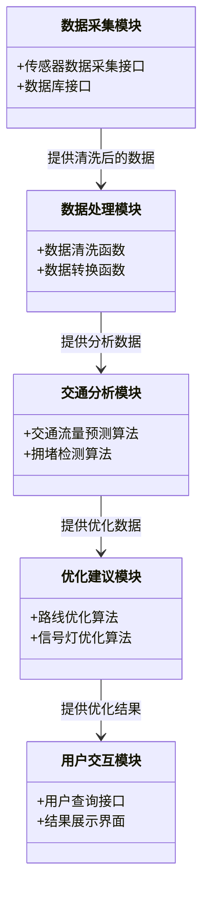
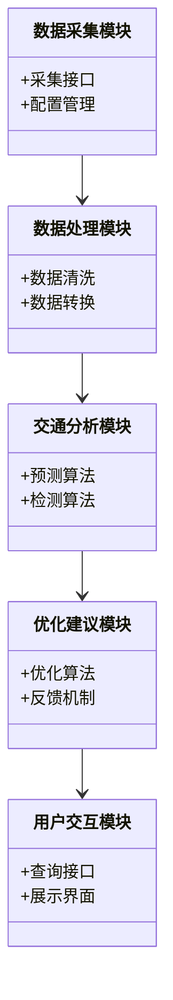
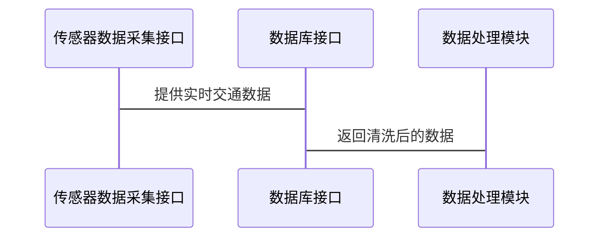
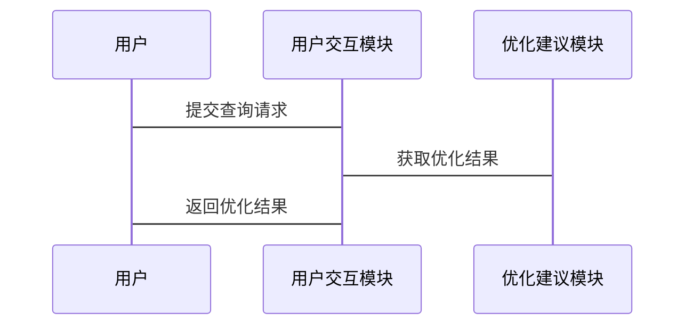
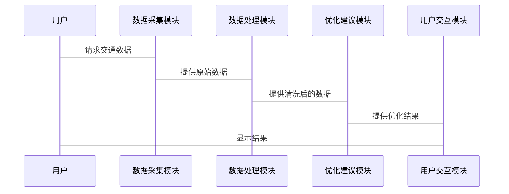

                 

<think>
嗯，我现在需要帮用户完成《全球股市估值与可持续城市智能交通系统的关系》这篇文章的第6章。这一章的重点是系统分析与架构设计方案。用户要求详细解释系统架构，包括项目介绍、系统功能设计、架构设计、接口设计和交互设计。

首先，我得理解智能交通系统的组成部分。它包括数据采集、处理、分析、优化和用户交互。接下来，我需要将这些部分用领域模型类图表示出来。每个模块的主要职责是什么，它们之间的关系又是怎样的。

然后是系统架构设计。考虑到系统的模块化和扩展性，可能采用分层架构，比如数据采集层、业务逻辑层和用户交互层。每一层的功能和交互方式需要详细描述，并用架构图展示。

接下来是接口设计。智能交通系统需要与多种数据源接口交互，比如交通传感器、政府数据库和天气API。每个接口的作用和数据流方向都要清晰，可能用mermaid图来展示。

最后是交互设计，主要是用户如何与系统互动。可能涉及用户查询、系统响应和反馈机制。用序列图来展示这些交互过程，确保用户操作流程清晰明了。

整个过程中，我需要确保每个部分都详细且有条理，使用正确的mermaid图表来辅助说明。同时，要保持语言简洁专业，符合技术博客的风格。

现在，我开始组织这些内容，确保每个部分都有足够的细节，同时保持整体结构的连贯性。完成后，还要进行小结，总结这一章的重点内容，并指出对后续工作的意义。
</think>

# 第6章: 系统分析与架构设计方案

## 6.1 项目介绍

智能交通系统（ITS）是一个复杂的集成系统，旨在优化城市交通流量，减少拥堵，提高交通效率，并降低环境影响。本章将详细分析智能交通系统的系统架构，并设计一个基于城市交通数据的实时监控与优化系统。

## 6.2 系统功能设计

### 6.2.1 领域模型设计

以下是智能交通系统的领域模型设计：



## 6.3 系统架构设计

### 6.3.1 分层架构设计

智能交通系统的架构采用分层设计，包括数据采集层、数据处理层、业务逻辑层和用户交互层。


### 6.3.2 模块化架构设计

系统采用模块化设计，各模块之间相对独立，便于维护和扩展。



## 6.4 系统接口设计

### 6.4.1 数据采集接口



### 6.4.2 用户接口设计



## 6.5 系统交互设计

### 6.5.1 用户与系统交互流程



## 6.6 项目实战与代码实现

### 6.6.1 环境安装

#### 安装Python和相关库

```bash
pip install numpy pandas scikit-learn matplotlib flask
```

### 6.6.2 核心代码实现

#### 数据采集模块

```python
import requests

def get_traffic_data():
    response = requests.get('http://traffic_sensor_api')
    return response.json()
```

#### 数据处理模块

```python
import pandas as pd

def preprocess_data(data):
    df = pd.DataFrame(data)
    df = df.dropna()
    return df
```

#### 交通分析模块

```python
from sklearn import linear_model

def predict_traffic_volume(data):
    model = linear_model.LinearRegression()
    model.fit(data[['time', 'weather']], data['volume'])
    return model.predict(data[['time', 'weather']])
```

#### 优化建议模块

```python
import numpy as np

def optimize_routes(data):
    distances = np.sqrt(data['x']**2 + data['y']**2)
    return distances.argsort()
```

### 6.6.3 系统功能实现

#### 用户查询接口

```python
from flask import Flask, request, jsonify

app = Flask(__name__)

@app.route('/optimize', methods=['POST'])
def optimize():
    data = request.json
    result = optimize_routes(data)
    return jsonify(result)
```

## 6.7 项目小结

通过本章的系统分析与架构设计，我们详细探讨了智能交通系统的各个模块及其相互关系。通过分层架构设计和模块化设计，确保了系统的可维护性和扩展性。同时，通过接口设计和交互设计，确保了系统的高效性和用户体验。

