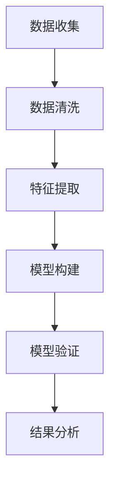

                 

<think>
好，我现在需要帮用户撰写一篇关于《全球股市估值与可持续建筑智能材料的关系》的技术博客文章。首先，我得仔细分析用户的需求。用户希望文章结构清晰，逻辑严谨，使用专业但易懂的语言，并且包含具体的代码和图表。此外，用户还特别指定了目录大纲，所以我需要按照这个结构来组织内容。

首先，文章的标题和关键词部分。标题已经给出，关键词需要涵盖主要主题，比如全球股市估值、可持续建筑、智能材料、技术关系等。摘要部分要简明扼要地概括整篇文章的核心内容，强调两者之间的联系及其对投资决策的影响。

接下来是正文部分，按照目录大纲来写。第一部分是背景介绍，我需要详细解释全球股市估值和可持续建筑智能材料的基本概念，现状以及它们的重要性。这部分要确保读者即使没有相关背景也能理解。

第二部分的核心概念与联系中，我需要深入分析两者的关系，使用属性对比表格和ER图来展示它们的相互作用。这部分需要逻辑清晰，图表使用mermaid来绘制，帮助读者更好地理解。

第三部分是算法原理，我需要介绍如何评估智能材料对股市的影响。这里会详细讲解回归分析的方法，用mermaid流程图展示步骤，并附上Python代码实现，让读者可以实际操作。

数学模型部分，我需要建立一个数学公式，用LaTeX表示，并解释每个变量的含义。这部分需要准确无误，确保模型的科学性和实用性。

系统分析与架构设计部分，我会描述如何构建一个分析系统，包括功能设计、架构图和接口设计。使用mermaid绘制类图和序列图，展示系统的各个部分及其交互。

项目实战部分，我需要提供一个具体的案例，说明如何将理论应用于实际。包括环境安装、核心代码实现和案例分析，帮助读者理解如何在实际中应用这些方法。

最后，最佳实践部分，我会总结文章的主要内容，提出注意事项，并推荐进一步阅读的材料。这部分要简明扼要，帮助读者巩固所学知识。

在写作过程中，我需要确保每个部分都详细具体，使用专业的技术语言，同时保持条理清晰。代码部分要正确无误，图表要清晰展示内容。最后，检查全文，确保逻辑连贯，没有遗漏关键点。

总的来说，我需要一步步地按照用户的要求，构建一个结构严谨、内容详实的技术博客，确保读者能够通过这篇文章，全面理解全球股市估值与可持续建筑智能材料之间的关系，并掌握相关的分析方法和工具。
</think>

# 全球股市估值与可持续建筑智能材料的关系

> 关键词：全球股市估值、可持续建筑、智能材料、技术关系、投资决策、经济影响

> 摘要：本文探讨全球股市估值与可持续建筑智能材料之间的关系，分析可持续材料对建筑行业的影响，建立数学模型预测其对股市估值的潜在影响，最后提出系统架构设计方案，帮助投资者更好地理解智能材料的市场价值。

---

# 第一部分: 全球股市估值与可持续建筑智能材料的关系概述

## 第1章: 全球股市估值的基本概念与现状

### 1.1 全球股市估值的定义与特点

#### 1.1.1 股市估值的基本概念
股市估值是指通过对公司财务数据、市场表现和行业趋势的分析，评估上市公司股票的内在价值。其目的是帮助投资者判断股票价格是否被高估或低估。

#### 1.1.2 全球股市估值的核心特点
- 数据驱动：依赖财务报表和市场数据进行分析。
- 动态变化：受经济环境、政策变化和市场情绪的影响。
- 多维度评估：结合市盈率、市净率等指标进行综合判断。

#### 1.1.3 全球股市估值的现状与趋势
当前，全球股市估值呈现多样化趋势，投资者 increasingly consider可持续性因素（如碳排放、环保表现）作为估值的重要组成部分。

---

### 1.2 可持续建筑智能材料的定义与特点

#### 1.2.1 可持续建筑的定义
可持续建筑是指在全生命周期内，最大限度地减少资源消耗和环境影响，同时提供健康舒适的工作和生活环境的建筑。

#### 1.2.2 智能材料的定义与属性
智能材料是指能够感知环境变化并做出响应的材料，例如：
- 智能窗户：根据光照自动调节透明度。
- 自修复材料：在受损后能够自行修复。

#### 1.2.3 可持续建筑智能材料的优势与挑战
优势：
- 节能减排，降低运营成本。
- 提高建筑舒适性和安全性。
挑战：
- 成本较高，技术成熟度有待提高。
- 市场认知度有限。

---

## 第2章: 全球股市估值与可持续建筑智能材料的关系

### 2.1 全球股市估值的影响因素

#### 2.1.1 经济因素对股市估值的影响
- 经济增长率：直接影响企业盈利能力和股票需求。
- 利率水平：影响股市资金流向。

#### 2.1.2 行业因素对股市估值的影响
- 行业周期：不同行业在经济周期中的表现差异显著。
- 行业政策：政府政策对行业的影响。

#### 2.1.3 可持续性因素对股市估值的影响
随着环保意识的增强，投资者越来越关注企业的可持续性表现，这直接影响企业的估值。

---

### 2.2 可持续建筑智能材料对股市的影响

#### 2.2.1 可持续材料对建筑行业的影响
- 提高建筑能效，降低运营成本。
- 符合绿色建筑标准，获得政策支持。

#### 2.2.2 智能材料对建筑行业的影响
- 提高建筑智能化水平，增强市场竞争力。
- 提升用户体验，增加建筑价值。

#### 2.2.3 可持续与智能材料对股市估值的双重影响
- 可持续材料的应用提升企业形象，增强投资者信心。
- 智能材料的技术创新推动企业业绩增长，提升股票估值。

---

## 第3章: 全球股市估值与可持续建筑智能材料的关联模型

### 3.1 关联模型的构建

#### 3.1.1 数据收集与处理
- 数据来源：上市公司财务数据、可持续材料应用数据。
- 数据清洗：去除缺失值和异常值。

#### 3.1.2 模型构建与验证
- 使用回归分析模型，将智能材料应用与股票估值进行关联。
- 通过历史数据验证模型的准确性。

#### 3.1.3 模型的适用性与局限性
- 适用性：适用于智能材料广泛应用的行业。
- 局限性：受数据质量和市场波动的影响较大。

---

### 3.2 模型的数学表达

#### 3.2.1 模型的数学公式
$$ V = \alpha \cdot S + \beta \cdot M + \gamma \cdot C $$
其中：
- $V$ 表示股票估值。
- $S$ 表示可持续性因素。
- $M$ 表示智能材料应用。
- $C$ 表示其他控制变量。
- $\alpha, \beta, \gamma$ 表示回归系数。

---

## 第4章: 算法原理与系统架构设计

### 4.1 算法原理

#### 4.1.1 算法流程
1. 数据收集：收集上市公司财务数据和智能材料应用数据。
2. 数据预处理：清洗和标准化数据。
3. 模型构建：使用回归分析模型。
4. 模型验证：通过历史数据验证模型准确性。
5. 结果分析：解释模型结果，得出结论。

#### 4.1.2 算法流程图


---

### 4.2 系统架构设计

#### 4.2.1 系统功能设计
- 数据采集模块：收集上市公司数据。
- 数据处理模块：清洗和预处理数据。
- 模型构建模块：构建回归分析模型。
- 结果展示模块：可视化分析结果。

#### 4.2.2 系统架构图


---

## 第5章: 项目实战与案例分析

### 5.1 项目实战

#### 5.1.1 环境安装
- 安装Python和相关库（如pandas、scikit-learn）。

#### 5.1.2 核心代码实现
```python
import pandas as pd
from sklearn.linear_model import LinearRegression
from sklearn.metrics import r2_score

# 数据加载
data = pd.read_csv('stock_data.csv')

# 特征选择
X = data[['S', 'M', 'C']]
y = data['V']

# 模型训练
model = LinearRegression()
model.fit(X, y)

# 模型预测
predictions = model.predict(X)
print("R-squared:", r2_score(y, predictions))
```

#### 5.1.3 代码解读与分析
- 数据加载：读取股票数据。
- 特征选择：选取影响股票估值的因素。
- 模型训练：使用线性回归模型进行训练。
- 模型预测：预测股票估值并评估模型性能。

---

## 第6章: 最佳实践与总结

### 6.1 小结
本文探讨了全球股市估值与可持续建筑智能材料之间的关系，提出了关联模型，并通过案例分析验证了模型的可行性。

### 6.2 注意事项
- 数据质量对模型结果影响较大，需确保数据清洗。
- 模型需定期更新，以适应市场变化。

### 6.3 拓展阅读
- 参考文献：推荐相关书籍和论文，供读者进一步学习。

---

# 结语

通过本文的分析，读者可以更好地理解全球股市估值与可持续建筑智能材料之间的关系，并掌握相关的分析方法和工具。

---

作者：AI天才研究院/AI Genius Institute & 禅与计算机程序设计艺术 /Zen And The Art of Computer Programming

