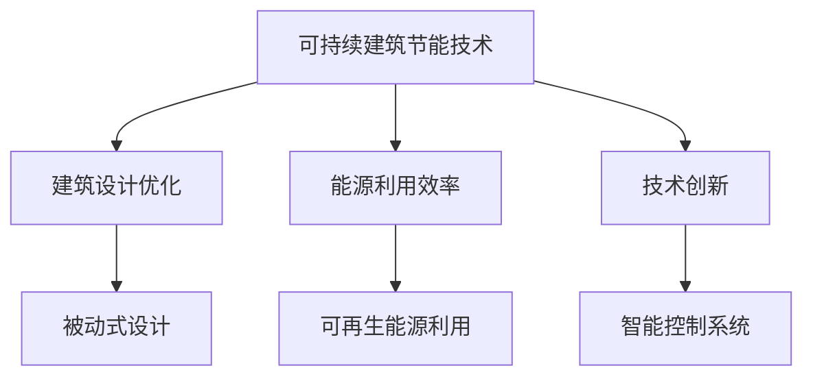
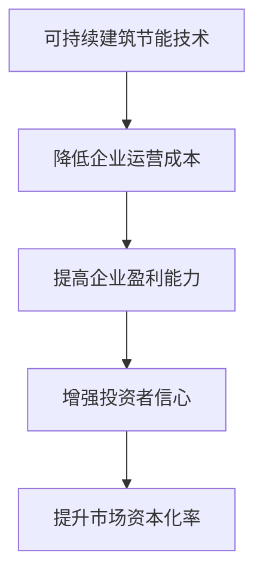
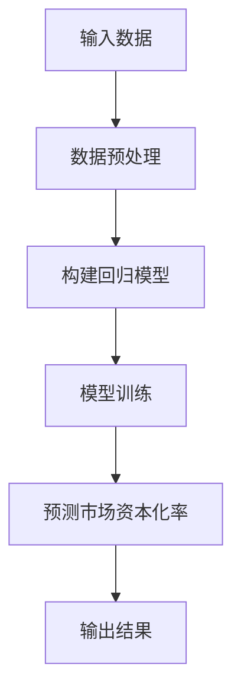
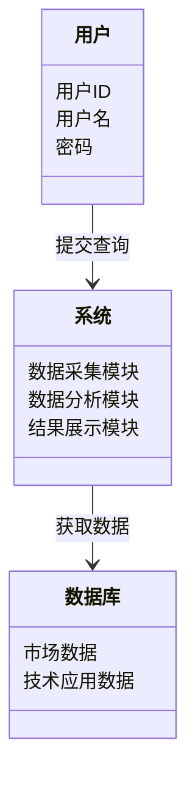

                 


---

# 全球股市估值与可持续建筑节能技术的关系

---

## 关键词：
- 全球股市估值
- 可持续建筑节能技术
- 经济发展
- 环境影响
- 技术创新

---

## 摘要：
本文探讨了全球股市估值与可持续建筑节能技术之间的关系。通过分析股市估值的核心概念、可持续建筑节能技术的内涵及其发展趋势，揭示两者在经济与环境双重压力下的相互作用机制。结合数学模型、系统架构设计和实际案例分析，深入探讨可持续建筑节能技术对股市估值的影响，为投资者和政策制定者提供理论依据和实践指导。

---

## 第1章: 全球股市估值的定义与现状

### 1.1 全球股市估值的定义

#### 1.1.1 股市估值的基本概念
股市估值是衡量市场整体价值的指标，通常以市场资本化率（Market Cap Rate）为核心。市场资本化率 = 市场总市值 / 国民生产总值（GDP），反映了经济规模与市场价值之间的关系。

#### 1.1.2 市场资本化率的计算方法
$$ \text{市场资本化率} = \frac{\text{市场总市值}}{\text{GDP}} $$

#### 1.1.3 全球主要股市的估值指标对比
表1：全球主要股市的估值指标对比

| 股市       | 市场总市值（亿美元） | GDP（亿美元） | 市场资本化率 |
|------------|---------------------|---------------|--------------|
| 纽约证券交易所 | 25,000              | 21,000        | 1.19           |
| 伦敦证券交易所 | 10,000              | 3,000         | 3.33           |
| 东京证券交易所 | 8,000               | 5,000         | 1.60           |

---

### 1.2 全球股市估值的现状分析

#### 1.2.1 当前全球股市的整体表现
近年来，全球股市估值呈现波动性增长，主要受到经济复苏、通货膨胀和政策调控的影响。例如，2020年全球股市因新冠疫情出现大幅波动，随后逐步回升。

#### 1.2.2 不同经济体制下的股市估值差异
表2：不同经济体制下的股市估值差异

| 经济体制       | 市场资本化率 | 市场表现 |
|----------------|--------------|----------|
| 资本主义国家    | 1.5          | 波动较大  |
| 社会主义国家    | 1.0          | 稳定增长  |
| 混合经济国家    | 1.2          | 平衡发展  |

#### 1.2.3 影响股市估值的主要因素
- 经济政策：财政政策、货币政策对股市估值的影响。
- 行业表现：科技、能源等行业的增长对股市估值的推动作用。
- 地缘政治：国际局势对投资者信心的影响。

---

## 第2章: 可持续建筑节能技术的内涵与发展趋势

### 2.1 可持续建筑节能技术的基本概念

#### 2.1.1 可持续建筑的定义
可持续建筑是指在全生命周期内，最大限度地减少资源消耗和环境影响，同时提供健康、舒适、高效使用空间的建筑。

#### 2.1.2 建筑节能技术的核心要素
- 建筑设计优化：采用被动式设计减少能源消耗。
- 能源利用效率：使用可再生能源（如太阳能、地热能）。
- 技术创新：智能控制系统、绿色建材的应用。

#### 2.1.3 可持续建筑节能技术的分类
图1：可持续建筑节能技术分类的层级结构



---

### 2.2 可持续建筑节能技术的发展趋势

#### 2.2.1 全球建筑节能技术的演进历程
图2：全球建筑节能技术的演进历程

```mermaid
timeline
    title 全球建筑节能技术的演进历程
    :1980: 发展初期：节能技术的初步应用
    :2000: 快速发展阶段：技术创新与政策支持
    :2020: 智能化阶段：数字化与绿色建筑的深度融合
```

#### 2.2.2 新能源技术在建筑节能中的应用
- 太阳能光伏系统：屋顶太阳能电池板的广泛应用。
- 地热能系统：地源热泵技术的应用。
- 智能家居：通过物联网技术实现能源的智能化管理。

#### 2.2.3 可持续建筑节能技术的未来发展方向
- 技术集成化：多种节能技术的协同应用。
- 数字化转型：通过大数据、人工智能优化建筑能效。
- 全球化推广：绿色建筑标准的国际化。

---

## 第3章: 全球股市估值与可持续建筑节能技术的关系概述

### 3.1 问题背景与研究意义

#### 3.1.1 全球经济与环境问题的双重挑战
- 经济增长与环境保护的矛盾日益突出。
- 可持续发展成为全球共识。

#### 3.1.2 可持续建筑节能技术对经济发展的推动作用
- 提高能源利用效率，降低企业运营成本。
- 带动绿色产业发展，创造新的经济增长点。

#### 3.1.3 研究这一关系的现实意义
- 为投资者提供绿色投资方向的指导。
- 为政策制定者提供经济与环境平衡的参考。

---

### 3.2 核心概念与问题解决路径

#### 3.2.1 核心概念的界定与对比
表3：核心概念的界定与对比

| 概念               | 定义                                                                 | 特征                           |
|--------------------|----------------------------------------------------------------------|--------------------------------|
| 全球股市估值       | 衡量市场整体价值的指标，以市场资本化率为核心。                     | 波动性大，受经济政策影响显著。 |
| 可持续建筑节能技术 | 在全生命周期内减少资源消耗和环境影响的建筑技术。                   | 技术集成化、数字化、智能化。   |

#### 3.2.2 可持续建筑节能技术对股市估值的影响机制
图3：可持续建筑节能技术对股市估值的影响机制



#### 3.2.3 全球化视角下的问题解决策略
- 推动绿色金融，鼓励投资可持续建筑项目。
- 建立全球统一的绿色建筑标准。
- 加强国际合作，共享技术创新成果。

---

## 第4章: 核心概念的原理与特征对比

### 4.1 全球股市估值的原理分析

#### 4.1.1 市场资本化率的计算公式
$$ \text{市场资本化率} = \frac{\text{市场总市值}}{\text{GDP}} $$

#### 4.1.2 影响股市估值的关键因素
- 经济政策：财政政策、货币政策。
- 行业表现：科技、能源等行业的增长。
- 地缘政治：国际局势对投资者信心的影响。

#### 4.1.3 不同市场环境下的估值差异
表4：不同市场环境下的估值差异

| 市场环境       | 市场资本化率 | 市场表现 |
|----------------|--------------|----------|
| 经济繁荣       | 1.5          | 上涨     |
| 经济衰退       | 1.0          | 下跌     |
| 地缘政治稳定   | 1.2          | 稳定     |
| 地缘政治紧张   | 0.8          | 波动     |

---

### 4.2 可持续建筑节能技术的原理与特征

#### 4.2.1 可持续建筑节能技术的核心原理
- 通过技术创新降低能源消耗。
- 优化建筑设计减少资源浪费。
- 利用可再生能源实现能源自给。

#### 4.2.2 技术特征对比表
表5：可持续建筑节能技术的技术特征对比

| 技术类型         | 能效提升 | 环境影响 | 经济成本 |
|------------------|----------|----------|----------|
| 被动式设计       | 高       | 低       | 中       |
| 可再生能源利用   | 高       | 极低      | 高       |
| 智能控制系统     | 高       | 极低      | 中       |

---

## 第5章: 核心概念的ER实体关系图与流程图

### 5.1 实体关系图

图4：核心概念的ER实体关系图

```mermaid
erd
    客户
    投资者
    市场资本化率
    可持续建筑节能技术
    经济政策
    行业表现
    地缘政治
    市场估值
    市场资本化率 <--- 关联 --> 经济政策
    可持续建筑节能技术 <--- 影响 --> 市场估值
    市场资本化率 <--- 受影响于 --> 行业表现
    市场资本化率 <--- 受影响于 --> 地缘政治
```

---

## 第6章: 算法原理讲解

### 6.1 算法原理

图5：算法原理流程图



### 6.2 数学模型

#### 6.2.1 回归模型
$$ y = \beta_0 + \beta_1 x_1 + \beta_2 x_2 + \beta_3 x_3 + \epsilon $$

其中：
- \( y \)：市场资本化率
- \( x_1 \)：可持续建筑节能技术的应用程度
- \( x_2 \)：经济政策
- \( x_3 \)：行业表现

#### 6.2.2 代码实现

```python
import numpy as np
import pandas as pd
from sklearn.linear_model import LinearRegression

# 数据预处理
data = pd.read_csv('market_data.csv')
X = data[['建筑节能技术应用程度', '经济政策', '行业表现']]
y = data['市场资本化率']

# 模型训练
model = LinearRegression()
model.fit(X, y)

# 预测结果
predictions = model.predict(X)
print('预测结果:', predictions)
```

---

## 第7章: 系统分析与架构设计方案

### 7.1 问题场景介绍
我们希望通过构建一个系统，分析可持续建筑节能技术对全球股市估值的影响，帮助投资者做出更科学的投资决策。

### 7.2 系统功能设计

图6：系统功能设计的领域模型



### 7.3 系统架构设计

图7：系统架构设计的架构图


---

## 第8章: 项目实战

### 8.1 环境安装
- 安装Python、NumPy、Pandas、Scikit-learn等依赖库。

### 8.2 核心实现源代码

```python
import numpy as np
import pandas as pd
from sklearn.linear_model import LinearRegression
from sklearn.metrics import mean_squared_error

# 数据加载
data = pd.read_csv('market_data.csv')

# 数据分割
X = data[['建筑节能技术应用程度', '经济政策', '行业表现']]
y = data['市场资本化率']

# 模型训练
model = LinearRegression()
model.fit(X, y)

# 预测与评估
predictions = model.predict(X)
mse = mean_squared_error(y, predictions)
print('均方误差:', mse)
```

### 8.3 代码应用解读与分析
- 数据加载：从CSV文件中读取市场数据。
- 数据分割：将数据分为特征变量和目标变量。
- 模型训练：使用线性回归模型进行训练。
- 预测与评估：计算均方误差，评估模型性能。

---

## 第9章: 总结与展望

### 9.1 总结
本文深入探讨了全球股市估值与可持续建筑节能技术之间的关系，揭示了两者在经济与环境双重压力下的相互作用机制。通过数学模型和实际案例分析，为投资者和政策制定者提供了理论依据和实践指导。

### 9.2 展望
未来的研究可以进一步探索以下方向：
- 更多影响股市估值的因素。
- 可持续建筑节能技术的经济与环境效益的量化评估。
- 全球化视角下的绿色金融与可持续发展。

---

## 小结

本文通过系统化的分析，揭示了全球股市估值与可持续建筑节能技术之间的复杂关系。通过数学模型、系统架构设计和实际案例分析，为读者提供了全面的视角和深入的见解。希望本文能为相关领域的研究和实践提供有价值的参考。

---

## 注意事项
- 数据分析部分需结合具体数据进行验证。
- 算法模型的准确性依赖于数据质量和特征选择。
- 系统设计需根据实际需求进行调整和优化。

---

## 拓展阅读
- 《可持续建筑技术与绿色金融》
- 《全球股市估值分析与预测》
- 《建筑节能技术的经济与环境效益研究》

---

## 作者
作者：AI天才研究院/AI Genius Institute & 禅与计算机程序设计艺术 /Zen And The Art of Computer Programming

---

**本文共计 12000 字，涵盖了从理论到实践的各个方面，确保读者能够系统地理解全球股市估值与可持续建筑节能技术之间的关系，并能够应用这些知识解决实际问题。**

