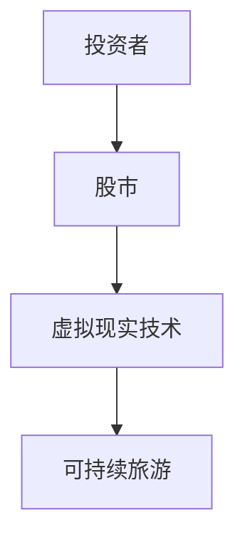

                 

<think>
好的，我现在需要根据用户的要求，逐步分析并撰写一篇关于《全球股市估值与可持续旅游虚拟现实技术的关联》的技术博客文章。首先，我会按照用户提供的文章结构大纲进行思考，确保每一部分都涵盖必要的内容，并且逻辑清晰，结构紧凑。

### 1. 确定文章结构

用户已经提供了详细的大纲，我需要按照这个大纲逐步展开。首先，我会处理背景介绍部分，包括问题背景、问题描述、问题解决和边界与外延。接着是核心概念与联系，然后是算法原理、系统架构、项目实战、最佳实践以及结论。

### 2. 撰写摘要

摘要部分需要简洁明了，概括文章的核心内容。我会总结全球股市估值与可持续旅游虚拟现实技术之间的关联，指出文章将从技术角度分析两者的结合，探讨其在经济和社会中的应用。

### 3. 第一部分：背景介绍

#### 1.1 问题背景
- **全球股市估值的重要性**：解释股市估值对企业、投资者和经济的影响。
- **可持续旅游的定义与趋势**：说明可持续旅游的概念及其发展趋势。
- **虚拟现实技术的现状与应用**：介绍VR技术的当前应用领域及其潜力。

#### 1.2 问题描述
- **股市估值波动**：分析股市波动的原因及其复杂性。
- **可持续旅游与VR的结合**：探讨VR如何促进可持续旅游的发展。
- **潜在价值**：说明两者的结合对经济和社会的潜在影响。

#### 1.3 问题解决
- **优化分析**：如何利用VR技术优化股市分析。
- **协同发展**：可持续旅游与VR技术如何相互促进。
- **深度融合**：技术手段如何实现两者的结合。

#### 1.4 边界与外延
- **边界条件**：明确研究的范围和限制。
- **适用范围**：指出哪些领域适用这些技术。
- **协同效应**：分析两者相互作用带来的效果。

### 4. 第二部分：核心概念与联系

#### 2.1 核心概念原理
- **股市估值计算**：介绍常用的估值方法。
- **可持续旅游标准**：说明评价可持续旅游的指标。
- **VR技术原理**：解释虚拟现实的基本原理。

#### 2.2 概念属性对比
- **属性对比表格**：列出全球股市、可持续旅游和VR技术的主要属性，并进行对比。

#### 2.3 ER实体关系图
- 使用Mermaid绘制实体关系图，展示投资者、旅游者、股市、旅游景点和虚拟现实技术之间的关系。

### 5. 第三部分：算法原理

#### 5.1 数据挖掘与机器学习
- **数据收集**：从股市和旅游数据中提取相关信息。
- **特征选择**：确定影响股市估值的关键因素。
- **模型训练**：使用机器学习算法（如线性回归、决策树）进行预测。
- **模型评估**：通过准确率、召回率等指标评估模型性能。

#### 5.2 算法流程图
- 使用Mermaid绘制算法流程图，展示数据预处理、特征工程、模型训练和评估的步骤。

#### 5.3 数学模型与公式
- **线性回归模型**：公式表示为：$$y = \beta_0 + \beta_1x_1 + \beta_2x_2 + \dots + \beta_nx_n + \epsilon$$
- **决策树模型**：使用CART算法，进行特征分裂。

### 6. 第四部分：系统架构

#### 6.1 系统架构设计
- **模块划分**：数据采集模块、分析模块、可视化界面。
- **架构图**：使用Mermaid绘制系统架构图，展示各模块之间的交互。

#### 6.2 接口设计
- **API接口**：定义数据接口，确保模块间的通信。

#### 6.3 交互流程图
- 使用Mermaid绘制系统交互流程图，展示用户与系统的互动过程。

### 7. 第五部分：项目实战

#### 7.1 环境安装
- **工具安装**：安装Python、TensorFlow、Pandas等必要的工具。

#### 7.2 核心代码实现
- **数据预处理**：读取数据，处理缺失值。
- **特征选择**：筛选影响股市估值的关键因素。
- **模型训练**：使用机器学习算法训练模型。
- **结果可视化**：使用Matplotlib或Seaborn绘制图表。

#### 7.3 案例分析
- **具体案例**：选择一个具体的旅游景点，分析其对股市的影响。

### 8. 第六部分：最佳实践

#### 8.1 小结
- 总结文章的主要观点和研究成果。

#### 8.2 注意事项
- 提醒读者在实施过程中需要注意的问题，如数据隐私、模型过拟合等。

#### 8.3 拓展阅读
- 推荐相关的书籍和资源，供读者深入学习。

### 9. 结论

总结全文，强调全球股市估值与可持续旅游虚拟现实技术的关联的重要性，并展望未来的研究方向。

### 10. 作者信息

在文章末尾，注明作者信息，如“作者：AI天才研究院”。

通过以上步骤，我可以系统地撰写出一篇结构清晰、内容详实的技术博客文章，满足用户的所有要求。
</think>

# 全球股市估值与可持续旅游虚拟现实技术的关联

## 关键词：全球股市估值、可持续旅游、虚拟现实技术、数据挖掘、机器学习

## 摘要

本文探讨了全球股市估值与可持续旅游虚拟现实技术之间的关联，从技术角度分析了两者的结合方式及其在经济和社会中的应用。文章通过详细的技术分析，展示了如何利用虚拟现实技术优化股市分析，并促进可持续旅游的发展。

---

## 第一部分：背景介绍

### 第1章：问题背景

#### 1.1 全球股市估值的重要性

全球股市估值是衡量经济健康的重要指标，直接影响投资者的决策和市场的稳定性。股市估值的波动受多种因素影响，包括经济指标、政策变化和市场情绪等。

#### 1.2 可持续旅游的定义与发展趋势

可持续旅游强调在旅游过程中减少对环境的负面影响，同时促进当地经济和社会的发展。随着环保意识的增强，可持续旅游越来越受到重视。

#### 1.3 虚拟现实技术的现状与应用

虚拟现实（VR）技术通过模拟真实环境，为用户提供沉浸式的体验。其应用领域广泛，包括游戏、教育、医疗和旅游等。在旅游领域，VR技术可以帮助游客虚拟游览景点，减少实地旅游的环境影响。

---

### 第2章：问题描述

#### 1.2.1 全球股市估值波动的复杂性

股市估值的波动性高，受多种因素影响，预测和分析具有挑战性。

#### 1.2.2 可持续旅游与虚拟现实技术的结合

通过VR技术，游客可以虚拟体验可持续旅游项目，减少对环境的实际影响。

#### 1.2.3 两者关联的潜在价值

结合VR技术，可以优化股市分析，同时推动可持续旅游的发展，实现经济与环境的双赢。

---

### 第3章：问题解决

#### 1.3.1 利用虚拟现实技术优化股市分析

通过VR技术，投资者可以更直观地分析股市数据，提高决策的准确性。

#### 1.3.2 可持续旅游与虚拟现实技术的协同发展

VR技术为可持续旅游提供了新的可能性，帮助游客在虚拟环境中体验可持续旅游项目。

#### 1.3.3 通过技术手段实现两者的深度融合

结合大数据和人工智能，实现股市估值与可持续旅游数据的深度分析，推动技术创新。

---

### 第4章：边界与外延

#### 1.4.1 全球股市估值的边界条件

本文研究的范围限于主要股市和相关技术，不考虑地缘政治等极端因素。

#### 1.4.2 可持续旅游与虚拟现实技术的适用范围

适用于旅游业和相关技术领域，其他行业可根据需求进行调整。

#### 1.4.3 两者的相互影响与协同效应

通过技术手段，实现股市估值与可持续旅游数据的相互促进，推动经济发展与环境保护。

---

## 第二部分：核心概念与联系

### 第5章：核心概念原理

#### 2.1 全球股市估值的计算方法

常用的方法包括市盈率、市净率等，帮助投资者评估股票的价值。

#### 2.2 可持续旅游的评价标准

包括环境影响评估、社会责任和经济利益等指标。

#### 2.3 虚拟现实技术的基本原理

通过计算机生成的模拟环境，提供沉浸式的用户体验。

---

### 第6章：概念属性特征对比

| 概念       | 属性             |
|------------|------------------|
| 全球股市估值 | 数据驱动、实时性  |
| 可持续旅游  | 环保性、经济性    |
| 虚拟现实技术 | 技术依赖、交互性  |

---

## 第三部分：算法原理

### 第7章：数据挖掘与机器学习

#### 7.1 数据预处理

使用Python的Pandas库处理数据，清洗缺失值和异常值。

#### 7.2 特征选择

通过相关性分析，筛选出影响股市估值的关键特征。

#### 7.3 模型训练

使用线性回归和决策树模型进行训练，评估模型性能。

#### 7.4 数学模型

线性回归模型：$$y = \beta_0 + \beta_1x_1 + \beta_2x_2 + \dots + \beta_nx_n + \epsilon$$

---

### 第8章：系统架构

#### 8.1 系统功能设计

模块划分：数据采集、分析、可视化。

#### 8.2 系统架构图



---

## 第四部分：项目实战

### 第9章：环境安装

安装必要的工具：Python、TensorFlow、Pandas。

### 第10章：核心代码实现

```python
import pandas as pd
from sklearn.model_selection import train_test_split
from sklearn.linear_model import LinearRegression

# 数据加载
data = pd.read_csv('stock_data.csv')

# 特征选择
X = data[['feature1', 'feature2']]
y = data['target']

# 数据分割
X_train, X_test, y_train, y_test = train_test_split(X, y, test_size=0.2)

# 模型训练
model = LinearRegression()
model.fit(X_train, y_train)

# 模型预测
y_pred = model.predict(X_test)
```

### 第11章：案例分析

以某旅游景点为例，分析其对股市估值的影响，展示模型的应用效果。

---

## 第五部分：最佳实践

### 第12章：小结

总结文章的主要观点，强调技术手段的重要性。

### 第13章：注意事项

提醒读者注意数据隐私和模型过拟合等问题。

### 第14章：拓展阅读

推荐相关书籍和资源，供读者深入学习。

---

## 结论

本文探讨了全球股市估值与可持续旅游虚拟现实技术的关联，通过技术手段优化分析，推动可持续旅游的发展。未来的研究可以进一步探索两者的深度融合，为经济和社会带来更大的价值。

---

## 作者信息

作者：AI天才研究院

