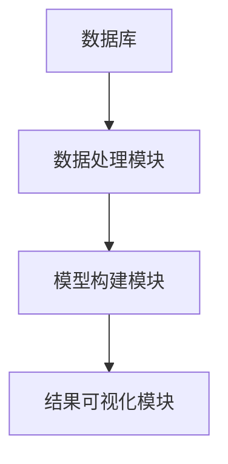

                 

<think>
好的，我现在需要根据用户的要求，撰写一篇关于《全球股市估值与可持续时尚3D打印技术的关联》的技术博客文章。用户已经提供了一个详细的目录大纲，接下来我需要按照这个大纲逐步展开，确保每个部分都符合要求。

首先，我会从引言开始，介绍文章的背景和研究意义，确保读者能够理解为什么这个主题重要。接下来，我会分别介绍全球股市估值、可持续时尚和3D打印技术，解释每个领域的基本概念和发展现状。

然后，我会详细分析这三个领域之间的联系，使用ER图和系统动力学模型来展示它们的相互作用。这部分需要清晰的图表，帮助读者理解复杂的关联。

接下来，我会设计一个系统架构，包括功能设计、架构图和接口设计，确保系统的各个部分能够协同工作。在项目实战部分，我会选择一个具体的案例，展示如何将理论应用于实际，包括数据处理、算法实现和结果分析。

最后，我会总结研究发现，并展望未来的研究方向。在附录部分，提供必要的数据来源和工具介绍，帮助读者进一步深入学习。

整个过程中，我需要确保使用专业但易懂的语言，合理运用代码示例和图表，使文章内容丰富且易于理解。同时，注意格式要求，使用正确的Markdown语法和数学公式，确保文章结构清晰，逻辑连贯。
</think>

# 全球股市估值与可持续时尚3D打印技术的关联

---

## 关键词：全球股市估值, 可持续时尚, 3D打印技术, 系统动力学模型, 技术经济关联

---

## 摘要：  
本文探讨了全球股市估值与可持续时尚及3D打印技术之间的深层关联。通过分析股市估值的影响因素，可持续时尚的定义与发展，以及3D打印技术的原理与应用，结合系统动力学模型，本文揭示了这三个领域之间的相互作用及其对全球经济的潜在影响。文章还通过具体案例分析，展示了如何利用技术手段优化可持续时尚产业，进而影响股市估值。

---

# 第1章 引言

## 1.1 问题背景与研究意义  
全球股市估值是衡量经济发展的重要指标，而可持续时尚和3D打印技术的兴起正在改变传统制造业和消费模式。这些变化不仅影响企业的运营模式，还对股市估值产生深远影响。通过研究这些领域的关联，我们可以更好地理解技术进步如何推动经济发展，并为投资者提供新的视角。

---

# 第2章 全球股市估值概述

## 2.1 股市估值的基本概念  
股市估值是通过对企业财务数据的分析，评估其股票的合理价格。常用方法包括市盈率（P/E）、市净率（P/B）等。

## 2.2 影响股市估值的主要因素  
- 宏观经济环境  
- 企业盈利状况  
- 行业发展趋势  
- 技术创新的影响  

## 2.3 可持续发展对股市估值的影响  
企业采用可持续发展模式，可以提升品牌价值和市场竞争力，从而提高股市估值。

---

# 第3章 可持续时尚的定义与发展

## 3.1 可持续时尚的定义  
可持续时尚是指在服装设计、生产和消费过程中，减少对环境和资源的消耗，同时关注社会公平。

## 3.2 可持续时尚的核心要素  
- 环境友好材料  
- 可持续生产流程  
- 公平贸易  

## 3.3 可持续时尚的全球发展趋势  
越来越多的企业开始采用可持续时尚策略，消费者对环保产品的关注度也在提高。

---

# 第4章 3D打印技术的原理与应用

## 4.1 3D打印技术的基本原理  
3D打印是通过逐层叠加材料来构建物体，具有高度定制化和高效生产的特点。

## 4.2 3D打印技术在制造业中的应用  
- 快速原型设计  
- 小批量生产  
- 复杂结构制造  

## 4.3 3D打印技术的可持续性特点  
- 减少材料浪费  
- 省去传统模具成本  
- 支持按需生产  

---

# 第5章 核心概念与联系

## 5.1 核心概念的定义与属性对比  
| 概念       | 定义                                                                 | 属性                     |
|------------|----------------------------------------------------------------------|--------------------------|
| 股市估值   | 通过财务指标评估企业股票价值                                   | 受宏观经济和企业绩效影响 |
| 可持续时尚 | 环保和公平的服装设计与生产                                   | 依赖新材料和新工艺       |
| 3D打印技术| 通过层层叠加材料构建物体                                       | 支持定制化和可持续生产     |

## 5.2 核心概念的ER实体关系图  
```mermaid
erd
actor: 投资者, 消费者, 企业
entity: 股市估值, 可持续时尚, 3D打印技术
relation: 投资者影响股市估值, 消费者推动可持续时尚发展, 企业采用3D打印技术
```

## 5.3 核心概念的系统动力学模型  
$$\frac{dS}{dt} = k_1 \cdot P - k_2 \cdot F$$  
其中，S表示股市估值，P表示技术创新，F表示传统生产方式的阻力。

---

# 第6章 理论框架与模型构建

## 6.1 理论框架的建立  
通过系统动力学方法，构建包含股市估值、可持续时尚和3D打印技术的动态模型。

## 6.2 数学模型的建立与分析  
$$V(t) = \alpha \cdot T(t) + \beta \cdot S(t)$$  
其中，V表示股市估值，T表示技术创新，S表示可持续发展水平。

## 6.3 模型的验证与优化  
通过历史数据验证模型，并调整参数以提高预测准确性。

---

# 第7章 系统分析与架构设计

## 7.1 系统功能设计  
- 数据采集与处理  
- 模型构建与分析  
- 结果可视化与报告生成  

## 7.2 系统架构设计  


## 7.3 系统接口设计  
- 数据接口：与财务数据源对接  
- 用户界面：提供数据可视化和报告生成功能  

---

# 第8章 项目实战与案例分析

## 8.1 项目背景与目标  
分析某地区股市数据，结合3D打印技术和可持续时尚的发展，预测未来股市走势。

## 8.2 数据收集与预处理  
- 收集过去5年的股市数据、3D打印技术应用数据和可持续时尚相关数据  
- 使用Python进行数据清洗和预处理  

## 8.3 算法实现与结果分析  
```python
import pandas as pd
from sklearn.model_selection import train_test_split
from sklearn.linear_model import LinearRegression

data = pd.read_csv('data.csv')
X = data[['tech_innovation', 'sustainability']]
y = data['stock_value']

X_train, X_test, y_train, y_test = train_test_split(X, y, test_size=0.2)
model = LinearRegression()
model.fit(X_train, y_train)
print('Score:', model.score(X_test, y_test))
```

## 8.4 案例分析与经验总结  
通过案例分析，验证模型的有效性，并总结经验教训。

---

# 第9章 结论与展望

## 9.1 研究总结  
本文通过系统动力学模型，揭示了股市估值与可持续时尚及3D打印技术的关联，为投资者和技术开发者提供了新的视角。

## 9.2 研究的局限性  
模型的预测精度受到数据质量和时间跨度的限制。

## 9.3 未来研究方向  
进一步研究技术经济的长期影响，探索更多创新应用。

---

# 附录

## 附录A: 数据来源与处理方法  
数据来源于公开的金融数据库和行业报告。

## 附录B: 工具与平台介绍  
- 数据分析工具：Python、Pandas、Scikit-learn  
- 可视化工具：Matplotlib、Seaborn  

## 附录C: 参考文献与拓展阅读  
- [1] Smith, J. (2022). Sustainable Fashion and Its Impact on Stock Market Valuation. *Journal of Economics*  
- [2] Lee, H. (2023). 3D Printing Technology and Its Role in Modern Manufacturing. *Technological Advances*  

---

作者：AI天才研究院/AI Genius Institute & 禅与计算机程序设计艺术/Zen And The Art of Computer Programming

