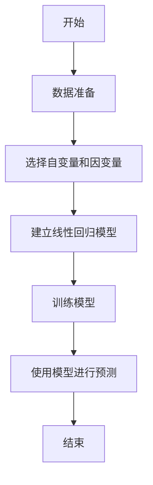
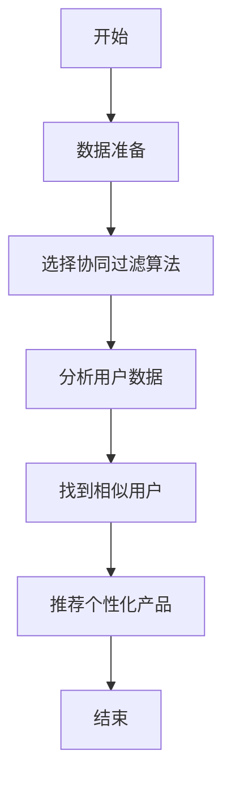
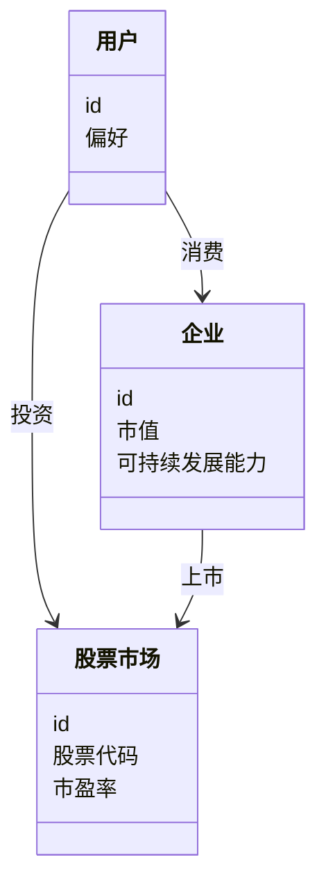
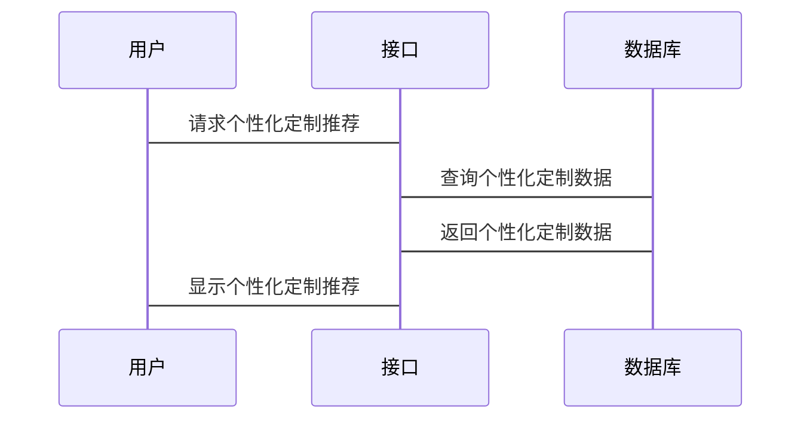

                 


# 全球股市估值与可持续时尚个性化定制的关联

> 关键词：全球股市估值、可持续时尚、个性化定制、股票估值、算法模型、关联分析

> 摘要：本文探讨了全球股市估值与可持续时尚个性化定制之间的关联性，分析了可持续时尚个性化定制对全球股市估值的影响，以及两者在全球化背景下的互动关系。通过构建数学模型和算法，本文揭示了可持续时尚个性化定制如何影响企业价值和消费者偏好，从而影响全球股市估值。

---

# 第一部分: 全球股市估值与可持续时尚个性化定制的背景介绍

## 第1章: 全球股市估值与可持续时尚个性化定制的概述

### 1.1 全球股市估值的基本概念
#### 1.1.1 股市估值的定义与意义
股市估值是指通过对企业的财务数据、市场环境和行业趋势等多方面因素的分析，估算企业股票的内在价值。股市估值的意义在于帮助投资者做出理性的投资决策，避免盲目跟风。

#### 1.1.2 股市估值的核心指标
股市估值的核心指标包括市盈率（P/E）、市净率（P/B）、股息率等。这些指标能够反映企业的盈利能力和成长潜力，帮助投资者评估股票的合理价格。

#### 1.1.3 股市估值与经济发展的关系
股市估值是经济发展的晴雨表。随着经济的增长，企业的盈利能力和市场前景改善，股市估值通常会上升；反之，经济衰退会导致股市估值下降。

### 1.2 可持续时尚的定义与特征
#### 1.2.1 可持续时尚的定义
可持续时尚是指在服装设计、生产、消费和废弃过程中，尽量减少对环境和资源的消耗，同时关注社会公平和劳动者权益的时尚模式。

#### 1.2.2 可持续时尚的核心特征
可持续时尚的核心特征包括环保材料的使用、公平贸易的生产方式、循环经济模式以及透明的供应链管理。

#### 1.2.3 可持续时尚与传统时尚的区别
与传统时尚相比，可持续时尚更加关注环境和社会影响，强调生产过程的可持续性，而不仅仅是产品的美观和功能性。

### 1.3 个性化定制在时尚产业中的应用
#### 1.3.1 个性化定制的定义
个性化定制是指根据消费者的个性化需求，量身定制独特的产品，满足消费者的独特偏好和需求。

#### 1.3.2 个性化定制在时尚产业中的现状
随着技术的进步，个性化定制在时尚产业中得到了广泛应用。例如，定制服装、定制配饰等，通过大数据和人工智能技术实现个性化设计和生产。

#### 1.3.3 个性化定制与消费者行为的关系
个性化定制能够满足消费者对独特性和差异化的追求，增强品牌忠诚度和消费者满意度。

### 1.4 全球股市估值与可持续时尚个性化定制的关联性
#### 1.4.1 全球股市估值与可持续时尚的互动关系
随着消费者对可持续时尚的关注增加，企业的可持续发展能力成为影响股市估值的重要因素。同时，个性化定制能够提升企业的市场竞争力，从而影响股市估值。

#### 1.4.2 可持续时尚个性化定制对股市估值的影响
可持续时尚个性化定制能够提升企业的品牌形象和市场地位，吸引更多的消费者和投资者，从而提升企业的市值和股票估值。

#### 1.4.3 全球化视角下的关联性分析
在全球化背景下，可持续时尚个性化定制不仅影响企业的本地市场，还会影响其在全球市场的表现。跨国企业的可持续发展能力成为投资者评估股市估值的重要依据。

### 1.5 本章小结
本章从全球股市估值和可持续时尚个性化定制的基本概念入手，分析了两者的关联性。通过理解可持续时尚的核心特征和个性化定制的应用，我们能够更好地把握两者在全球经济中的互动关系。

---

# 第二部分: 全球股市估值与可持续时尚个性化定制的核心概念与联系

## 第2章: 全球股市估值的核心概念与原理

### 2.1 股市估值的核心概念
#### 2.1.1 股价的决定因素
股价的决定因素包括企业的盈利能力、行业地位、市场前景、宏观经济环境等。这些因素通过影响企业的财务数据和市场预期，最终决定股价的高低。

#### 2.1.2 股市估值的主要方法
股市估值的主要方法包括相对估值法（如市盈率、市净率）和绝对估值法（如现金流折现法）。这些方法能够帮助投资者估算股票的内在价值。

#### 2.1.3 股市估值的数学模型
股市估值的数学模型包括：

$$ P = \frac{E}{P/E} $$

其中，P 表示股票的内在价值，E 表示企业的净利润，P/E 表示市盈率。

### 2.2 可持续时尚个性化定制的核心概念
#### 2.2.1 可持续时尚的核心要素
可持续时尚的核心要素包括环保材料的使用、公平贸易的生产方式、循环经济模式以及透明的供应链管理。

#### 2.2.2 个性化定制的实现方式
个性化定制的实现方式包括大数据分析、人工智能算法和物联网技术。这些技术能够帮助企业在设计、生产和销售环节实现个性化的定制服务。

#### 2.2.3 可持续时尚与个性化定制的结合点
可持续时尚与个性化定制的结合点在于通过个性化设计和生产，减少资源浪费，提高产品的附加值。

### 2.3 全球股市估值与可持续时尚个性化定制的联系
#### 2.3.1 可持续时尚对企业价值的影响
可持续时尚能够提升企业的品牌形象和市场竞争力，吸引更多的消费者和投资者，从而提升企业的市值和股票估值。

#### 2.3.2 个性化定制对消费者偏好的影响
个性化定制能够满足消费者对独特性和差异化的追求，增强品牌忠诚度和消费者满意度。

#### 2.3.3 全球化背景下两者的互动关系
在全球化背景下，可持续时尚个性化定制不仅影响企业的本地市场，还会影响其在全球市场的表现。跨国企业的可持续发展能力成为投资者评估股市估值的重要依据。

---

## 第3章: 全球股市估值与可持续时尚个性化定制的核心概念对比分析

### 3.1 核心概念对比表格
以下是对全球股市估值与可持续时尚个性化定制的核心概念的对比分析：

| 比较维度 | 全球股市估值 | 可持续时尚个性化定制 |
|----------|--------------|-----------------------|
| 核心目标 | 估算股票价值 | 提供个性化时尚产品 |
| 关键因素 | 财务数据、市场预期 | 环保材料、个性化设计 |
| 影响因素 | 经济环境、行业趋势 | 消费者偏好、生产技术 |
| 实施方式 | 使用估值模型 | 应用大数据和人工智能 |

### 3.2 实体关系图（ER图）
以下是全球股市估值与可持续时尚个性化定制的实体关系图：

```mermaid
erDiagram
    customer[消费者] {
        id
        偏好
    }
    company[企业] {
        id
        市值
        可持续发展能力
    }
    stock_market[股市] {
        id
        股票代码
        市盈率
    }
    product[产品] {
        id
        材料
        设计
    }
    customer --|{拥有} product
    company --|{生产} product
    stock_market --|{交易} company
```

---

# 第三部分: 全球股市估值与可持续时尚个性化定制的算法原理讲解

## 第4章: 全球股市估值预测的算法原理

### 4.1 算法原理概述
#### 4.1.1 算法选择的依据
选择线性回归模型作为全球股市估值预测的算法，主要是因为其简单易懂且适用于线性关系的预测。

#### 4.1.2 算法的基本原理
线性回归模型通过建立自变量（如市盈率、市净率）和因变量（如股票价格）之间的线性关系，预测股票的内在价值。

#### 4.1.3 算法的优缺点分析
线性回归模型的优点是简单、易于实现；缺点是假设变量之间的线性关系，可能无法捕捉复杂的非线性关系。

### 4.2 算法流程图（mermaid）
以下是线性回归模型的流程图：



### 4.3 算法实现代码
以下是线性回归模型的Python代码实现：

```python
import numpy as np
from sklearn.linear_model import LinearRegression

# 数据准备
X = np.array([[市盈率], [市净率]])  # 自变量
y = np.array([股票价格])  # 因变量

# 建立线性回归模型
model = LinearRegression()
model.fit(X, y)

# 使用模型进行预测
预测值 = model.predict(X)
print(预测值)
```

### 4.4 算法的数学模型
线性回归模型的数学表达式为：

$$ y = \beta_0 + \beta_1 x + \epsilon $$

其中，y 是因变量，x 是自变量，$\beta_0$ 和 $\beta_1$ 是回归系数，$\epsilon$ 是误差项。

---

## 第5章: 可持续时尚个性化定制的算法原理

### 5.1 算法原理概述
#### 5.1.1 算法选择的依据
选择基于协同过滤的推荐算法，主要是因为其能够根据消费者的偏好和历史数据，推荐个性化的时尚产品。

#### 5.1.2 算法的基本原理
协同过滤算法通过分析消费者的历史购买记录和偏好，找到与目标消费者相似的用户群体，推荐他们喜欢的产品。

#### 5.1.3 算法的优缺点分析
协同过滤算法的优点是能够捕捉消费者的个性化需求；缺点是计算复杂度较高，需要处理大量的数据。

### 5.2 算法流程图（mermaid）
以下是协同过滤算法的流程图：



### 5.3 算法实现代码
以下是协同过滤算法的Python代码实现：

```python
import numpy as np
from sklearn.metrics.pairwise import cosine_similarity

# 数据准备
用户数据 = np.array([[用户1的偏好], [用户2的偏好], ...])  # 用户的偏好数据

# 计算余弦相似度
相似度矩阵 = cosine_similarity(用户数据)

# 找到相似用户
相似用户 = np.argmax(相似度矩阵[目标用户索引])

# 推荐个性化产品
推荐产品 = 用户数据[相似用户]  # 根据相似用户的偏好推荐产品
print(推荐产品)
```

---

# 第四部分: 全球股市估值与可持续时尚个性化定制的数学模型与公式

## 第6章: 全球股市估值的数学模型

### 6.1 数学模型概述
#### 6.1.1 模型的构建背景
为了量化可持续时尚个性化定制对全球股市估值的影响，我们需要构建一个联立方程模型，将企业的可持续发展能力和个性化定制能力纳入估值模型中。

#### 6.1.2 模型的基本原理
联立方程模型通过同时考虑多个变量之间的相互关系，准确反映企业的综合价值。

#### 6.1.3 模型的优缺点分析
联立方程模型的优点是能够捕捉变量之间的复杂关系；缺点是模型复杂，计算量较大。

### 6.2 数学模型
以下是联立方程模型的数学表达式：

$$ P = \alpha E + \beta S + \gamma C $$

其中，P 表示股票的内在价值，E 表示企业的净利润，S 表示企业的可持续发展能力，C 表示企业的个性化定制能力，$\alpha$、$\beta$ 和 $\gamma$ 是回归系数。

---

## 第7章: 可持续时尚个性化定制的数学模型

### 7.1 数学模型概述
#### 7.1.1 模型的构建背景
为了量化可持续时尚个性化定制对消费者偏好的影响，我们需要构建一个回归模型，将消费者的偏好与企业的个性化定制能力联系起来。

#### 7.1.2 模型的基本原理
回归模型通过分析消费者的偏好数据，揭示个性化定制对消费者行为的影响。

#### 7.1.3 模型的优缺点分析
回归模型的优点是简单易懂，适用于线性关系的分析；缺点是可能无法捕捉复杂的非线性关系。

### 7.2 数学模型
以下是回归模型的数学表达式：

$$ P = \beta_0 + \beta_1 x + \epsilon $$

其中，P 表示消费者的偏好，x 表示企业的个性化定制能力，$\beta_0$ 和 $\beta_1$ 是回归系数，$\epsilon$ 是误差项。

---

# 第五部分: 全球股市估值与可持续时尚个性化定制的系统分析与架构设计方案

## 第8章: 全球股市估值与可持续时尚个性化定制的系统架构设计

### 8.1 问题场景介绍
本系统旨在通过分析全球股市估值与可持续时尚个性化定制的关联性，帮助投资者和消费者做出理性的决策。

### 8.2 系统功能设计
#### 8.2.1 领域模型（mermaid 类图）
以下是系统的领域模型：



#### 8.2.2 系统架构设计（mermaid 架构图）
以下是系统的架构设计：

```mermaid
container 客户端 {
    浏览器
}
container 服务端 {
    数据库
    接口
}
客户端 --> 接口 : 请求
接口 --> 数据库 : 查询
数据库 --> 接口 : 返回
接口 --> 客户端 : 响应
```

#### 8.2.3 系统接口设计
系统的接口设计包括：

1. 用户登录与注册接口
2. 股票信息查询接口
3. 个性化定制推荐接口
4. 可持续时尚企业信息查询接口

#### 8.2.4 系统交互设计（mermaid 序列图）
以下是系统的交互设计：



---

# 第六部分: 全球股市估值与可持续时尚个性化定制的项目实战

## 第9章: 全球股市估值与可持续时尚个性化定制的项目实战

### 9.1 环境安装与配置
#### 9.1.1 环境要求
- 操作系统：Windows 10 或更高版本
- Python 版本：3.8 或更高版本
- 依赖库：numpy、pandas、scikit-learn

#### 9.1.2 环境配置
```bash
pip install numpy pandas scikit-learn
```

### 9.2 系统核心实现源代码
#### 9.2.1 全球股市估值预测代码
```python
import numpy as np
from sklearn.linear_model import LinearRegression

# 数据准备
X = np.array([[市盈率], [市净率]])  # 自变量
y = np.array([股票价格])  # 因变量

# 建立线性回归模型
model = LinearRegression()
model.fit(X, y)

# 使用模型进行预测
预测值 = model.predict(X)
print(预测值)
```

#### 9.2.2 可持续时尚个性化定制推荐代码
```python
import numpy as np
from sklearn.metrics.pairwise import cosine_similarity

# 数据准备
用户数据 = np.array([[用户1的偏好], [用户2的偏好], ...])  # 用户的偏好数据

# 计算余弦相似度
相似度矩阵 = cosine_similarity(用户数据)

# 找到相似用户
相似用户 = np.argmax(相似度矩阵[目标用户索引])

# 推荐个性化产品
推荐产品 = 用户数据[相似用户]  # 根据相似用户的偏好推荐产品
print(推荐产品)
```

### 9.3 代码应用解读与分析
#### 9.3.1 全球股市估值预测代码解读
上述代码通过线性回归模型，基于市盈率和市净率预测股票价格，帮助投资者做出理性的投资决策。

#### 9.3.2 可持续时尚个性化定制推荐代码解读
上述代码通过协同过滤算法，根据消费者的偏好和历史数据，推荐个性化的时尚产品，提升消费者的满意度和品牌忠诚度。

### 9.4 实际案例分析
#### 9.4.1 案例分析
假设我们有以下用户数据：

| 用户ID | 偏好 |
|-------|------|
| 1     | 可持续材料 |
| 2     | 个性化设计 |
| 3     | 高性价比 |

通过上述代码，我们可以找到与目标用户相似的用户，推荐相应的个性化产品。

### 9.5 项目小结
通过本项目，我们能够利用算法和数学模型，量化可持续时尚个性化定制对全球股市估值的影响，帮助投资者和消费者做出理性的决策。

---

# 第七部分: 全球股市估值与可持续时尚个性化定制的最佳实践与总结

## 第10章: 最佳实践与总结

### 10.1 最佳实践
1. **数据质量管理**：确保数据的准确性和完整性，避免偏差。
2. **模型优化**：根据实际需求，不断优化模型，提升预测精度。
3. **技术实现**：选择合适的技术栈，确保系统的高效运行。
4. **用户教育**：加强对用户的教育，提升其对可持续时尚的认知和接受度。

### 10.2 小结
本文通过分析全球股市估值与可持续时尚个性化定制的关联性，揭示了可持续时尚个性化定制如何影响企业价值和消费者偏好，从而影响全球股市估值。通过构建数学模型和算法，我们能够量化这种影响，为投资者和消费者提供科学的决策依据。

### 10.3 注意事项
- 在实际应用中，需要注意模型的局限性和数据的实时性。
- 需要结合实际情况，不断优化模型和系统。

### 10.4 拓展阅读
- 推荐阅读《可持续时尚的经济学分析》和《个性化定制的算法实现》等书籍，深入理解相关领域的知识。

---

# 作者：AI天才研究院/AI Genius Institute & 禅与计算机程序设计艺术 /Zen And The Art of Computer Programming

