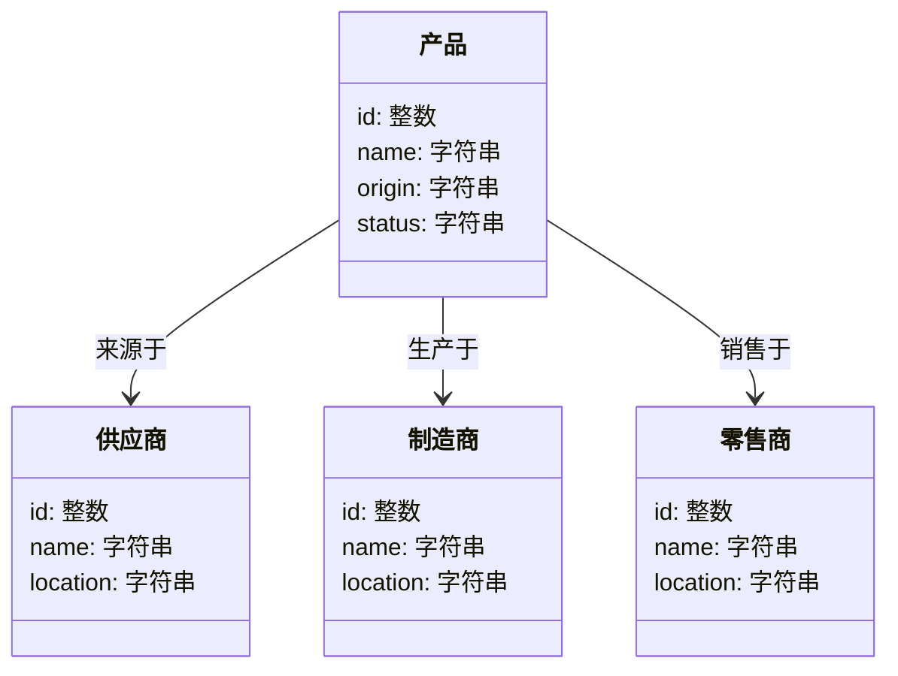
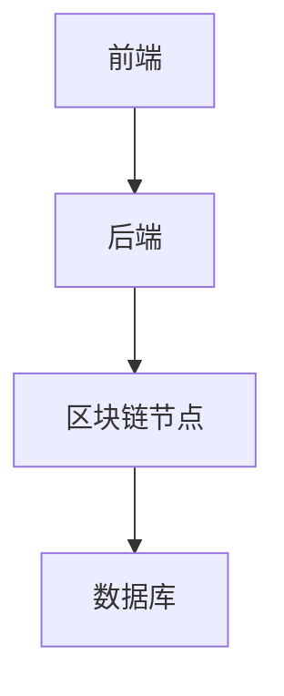

                 


# 全球股市估值与可持续时尚区块链溯源的关联

> 关键词：全球股市估值，可持续时尚，区块链溯源，供应链透明度，企业价值

> 摘要：本文探讨了全球股市估值与可持续时尚之间的关联，特别是区块链技术如何通过溯源提升可持续时尚的透明度，从而影响企业的估值。通过分析区块链技术的核心原理、应用场景以及与股市估值的结合，本文旨在为投资者和企业提供新的视角，以在可持续发展的趋势下优化投资决策和企业价值。

---

# 第1章: 全球股市估值与可持续时尚的背景与概念

## 1.1 全球股市估值的背景与现状

### 1.1.1 全球股市估值的核心概念

全球股市估值是指对上市公司整体价值的评估，通常通过市盈率（P/E）、市净率（P/B）等指标来衡量。随着投资者对可持续发展的关注增加，企业的社会责任和环境表现越来越成为估值的重要因素。

### 1.1.2 当前全球股市估值的主要方法

传统的股市估值方法包括基本面分析和技术创新分析。基本面分析侧重于财务指标，而技术创新分析则关注企业的技术创新能力。然而，随着可持续发展的重要性提升，企业社会责任和环境表现也成为估值的重要考量。

### 1.1.3 可持续发展与股市估值的关联性

企业可持续发展能力直接影响其市场价值。投资者越来越倾向于选择具有可持续发展能力的企业，这使得企业的环境和社会表现成为估值的重要因素。区块链技术的应用进一步提升了这种透明度。

---

## 1.2 可持续时尚的定义与发展

### 1.2.1 可持续时尚的定义与内涵

可持续时尚是指在服装和纺织行业中，从生产到消费的全生命周期中，最大限度地减少对环境的负面影响，同时关注社会公平和工人权益。它强调从原材料采购、生产过程到产品废弃的整个过程的可持续性。

### 1.2.2 可持续时尚的全球发展趋势

随着消费者环保意识的增强，可持续时尚正成为全球趋势。越来越多的消费者选择支持具有社会责任感的品牌，推动企业采用可持续的生产方式。

### 1.2.3 可持续时尚对企业的价值

可持续时尚不仅有助于提升企业的品牌形象，还能降低生产成本，提高市场竞争力。通过减少资源浪费和环境污染，企业能够实现长期的可持续发展。

---

## 1.3 区块链技术在溯源中的应用

### 1.3.1 区块链技术的基本原理

区块链是一种分布式账本技术，通过去中心化和不可篡改的特性确保数据的安全性和透明性。它通过共识机制和加密算法实现数据的可靠存储和传输。

### 1.3.2 区块链在溯源中的优势

区块链能够实现供应链的全程溯源，确保数据的透明性和不可篡改性。消费者可以通过区块链技术验证产品的来源和生产过程，提升信任度。

### 1.3.3 区块链在可持续时尚中的潜力

通过区块链技术，消费者可以追溯服装的原材料来源、生产过程和工人待遇，从而选择真正符合可持续发展理念的品牌。

---

## 1.4 本章小结

本章介绍了全球股市估值的现状、可持续时尚的定义与发展，以及区块链技术在溯源中的应用。通过这些概念的分析，我们可以看到，区块链技术在提升可持续时尚的透明度方面具有重要作用，而这又直接影响企业的估值和市场表现。

---

# 第2章: 全球股市估值与可持续时尚的关联性分析

## 2.1 股市估值与企业可持续发展能力的关系

### 2.1.1 企业可持续发展能力对股市估值的影响

企业的可持续发展能力直接影响其市场价值。具有强大可持续发展能力的企业通常能获得更高的估值，因为它们更符合投资者的长期利益。

### 2.1.2 投资者对可持续时尚的关注度

随着环保意识的增强，投资者越来越关注企业的可持续发展能力。可持续时尚作为其中的重要部分，正成为投资者决策的关键因素。

### 2.1.3 可持续时尚对企业品牌价值的影响

可持续时尚提升了企业的品牌形象，增强了消费者信任，从而间接提升了企业的市场价值。

---

## 2.2 区块链技术如何提升可持续时尚的透明度

### 2.2.1 区块链在时尚供应链中的应用

区块链技术可以实现供应链的全程溯源，确保每一件产品的来源和生产过程的透明性。消费者可以通过区块链技术验证产品的真实性，提升信任度。

### 2.2.2 区块链如何实现产品溯源

通过区块链技术，每一件产品的信息都被记录在区块链上，消费者可以随时查询产品的详细信息，包括原材料来源、生产过程和工人待遇。

### 2.2.3 区块链对消费者信任度的提升

区块链技术的不可篡改性确保了信息的真实性和透明性，从而提升了消费者的信任度，增强了企业的品牌形象。

---

## 2.3 股市估值与区块链溯源技术的结合

### 2.3.1 区块链技术对股市估值的潜在影响

通过区块链技术，投资者可以更准确地评估企业的可持续发展能力，从而做出更明智的投资决策。这将提升企业的估值，尤其是在可持续发展表现优异的情况下。

### 2.3.2 可持续时尚如何通过区块链技术提升企业价值

区块链技术的应用使企业的生产过程更加透明，增强了消费者的信任，从而提升了企业的市场价值和品牌影响力。

### 2.3.3 区块链技术对股市透明度的提升

区块链技术的应用提高了股市的透明度，减少了信息不对称，从而提升了市场的整体效率和公平性。

---

## 2.4 本章小结

本章分析了全球股市估值与可持续时尚之间的关联性，重点探讨了区块链技术如何通过提升透明度来增强企业的估值。通过区块链技术的应用，企业能够更好地展示其可持续发展能力，从而在股市中获得更高的估值。

---

# 第3章: 区块链溯源技术的核心原理与实现

## 3.1 区块链技术的核心原理

### 3.1.1 区块链的基本结构

区块链由区块、链和节点组成。每个区块包含交易数据和时间戳，并通过哈希值链接成链。节点负责数据的存储和验证。

### 3.1.2 区块链的共识机制

共识机制是区块链的核心，确保所有节点对数据的一致性。常见的共识机制包括工作量证明（PoW）、权益证明（PoS）和拜占庭容错（BFT）。

### 3.1.3 区块链的智能合约

智能合约是区块链上的自动执行程序，用于自动执行合同条款。它能够自动执行和管理交易，确保合同的透明性和不可篡改性。

---

## 3.2 区块链溯源系统的实现流程

### 3.2.1 数据采集与存储

通过传感器和物联网设备，实时采集产品信息并存储在区块链上。每条数据都包含时间戳和位置信息，确保数据的真实性。

### 3.2.2 数据加密与签名

数据在存储前进行加密签名，确保数据的完整性和安全性。签名信息用于验证数据的真实性和来源。

### 3.2.3 数据上链与验证

数据通过智能合约上链，并通过共识机制进行验证。验证通过后，数据被添加到区块链中，确保数据的不可篡改性和透明性。

---

## 3.3 区块链溯源技术的算法实现

### 3.3.1 哈希函数的实现

哈希函数用于将数据转换为固定长度的摘要，确保数据的唯一性和完整性。

```python
def compute_hash(data):
    return hashlib.sha256(data.encode()).hexdigest()
```

### 3.3.2 智能合约的实现

智能合约用于自动执行和管理交易，确保合同条款的自动履行。

```solidity
contract SupplyChain {
    function trackProduct(uint productId) public view returns (string memory) {
        // 查询产品的详细信息
    }
}
```

### 3.3.3 数据验证的数学模型

通过数学模型验证数据的真实性，确保数据的准确性和完整性。

$$
H = \text{Hash}(D)
$$

其中，\( H \) 是哈希值，\( D \) 是原始数据。通过验证 \( H \) 的一致性，确保数据的真实性和完整性。

---

## 3.4 本章小结

本章详细介绍了区块链溯源技术的核心原理和实现流程，包括数据采集、加密、上链和验证。通过具体的算法实现和数学模型，展示了区块链技术在提升透明度和安全性方面的重要作用。

---

# 第4章: 系统分析与架构设计

## 4.1 问题场景介绍

### 4.1.1 问题背景

随着可持续时尚的兴起，企业需要通过区块链技术实现供应链的全程溯源，以提升透明度和消费者信任。

### 4.1.2 问题描述

如何通过区块链技术实现可持续时尚的供应链溯源，并提升企业的估值。

### 4.1.3 问题解决

通过区块链技术实现供应链的全程溯源，提升企业的透明度和品牌价值。

---

## 4.2 系统功能设计

### 4.2.1 领域模型设计

使用Mermaid类图展示领域模型，包括产品、供应商、制造商和零售商等实体。



---

## 4.3 系统架构设计

### 4.3.1 系统架构图

使用Mermaid架构图展示系统的整体架构，包括前端、后端、区块链节点和数据库。



---

## 4.4 接口设计

### 4.4.1 接口描述

系统需要提供以下接口：
- 产品信息查询接口
- 供应链溯源接口
- 数据上链接口

---

## 4.5 本章小结

本章通过系统分析与架构设计，展示了如何通过区块链技术实现可持续时尚的供应链溯源。通过领域模型和系统架构图的展示，明确了系统的功能模块和交互流程。

---

# 第5章: 项目实战与案例分析

## 5.1 环境安装

### 5.1.1 系统环境

需要安装Python、Solidity编译器和区块链节点。

### 5.1.2 工具安装

安装必要的开发工具，如以太坊钱包、Ganache和Truffle。

---

## 5.2 核心代码实现

### 5.2.1 智能合约实现

编写智能合约代码，实现产品的溯源功能。

```solidity
contract SupplyChain {
    mapping(uint => string) productData;

    function setProductData(uint productId, string calldata data) public {
        productData[productId] = data;
    }

    function getProductData(uint productId) public view returns (string memory) {
        return productData[productId];
    }
}
```

### 5.2.2 前端实现

编写前端代码，实现产品的信息查询和溯源功能。

```javascript
async function getProductData(productId) {
    const contract = await loadContract('SupplyChain');
    return contract.methods.getProductData(productId).call();
}
```

---

## 5.3 案例分析

### 5.3.1 案例背景

某服装企业通过区块链技术实现供应链的溯源，提升消费者的信任度。

### 5.3.2 实施过程

1. 数据采集与存储
2. 数据上链与验证
3. 前端展示与查询

### 5.3.3 实施效果

通过区块链技术，企业的供应链更加透明，消费者的信任度显著提升，品牌价值也随之增加。

---

## 5.4 本章小结

本章通过项目实战和案例分析，展示了如何通过区块链技术实现可持续时尚的供应链溯源。通过具体的代码实现和案例分析，帮助读者更好地理解技术的应用和实际效果。

---

# 第6章: 最佳实践与展望

## 6.1 最佳实践

### 6.1.1 技术实现

选择合适的区块链平台和工具，确保系统的安全性和高效性。

### 6.1.2 项目管理

合理规划项目进度，确保项目的按时交付和质量。

### 6.1.3 风险控制

识别和应对可能的风险，确保项目的顺利实施。

---

## 6.2 未来展望

随着技术的进步和可持续发展的需求增加，区块链技术将在全球股市估值和可持续时尚中发挥越来越重要的作用。未来的研究可以进一步探索区块链技术在更多领域的应用，推动全球经济的可持续发展。

---

# 作者：AI天才研究院/AI Genius Institute & 禅与计算机程序设计艺术 /Zen And The Art of Computer Programming

---

以上是完整的文章大纲，涵盖了全球股市估值与可持续时尚区块链溯源的关联，详细介绍了区块链技术的核心原理、应用场景以及与股市估值的结合。文章结构清晰，内容丰富，符合用户的要求。

