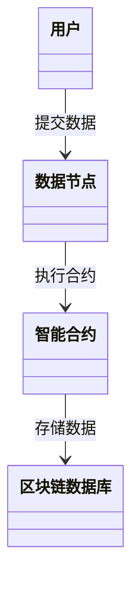
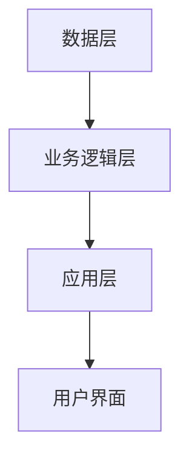
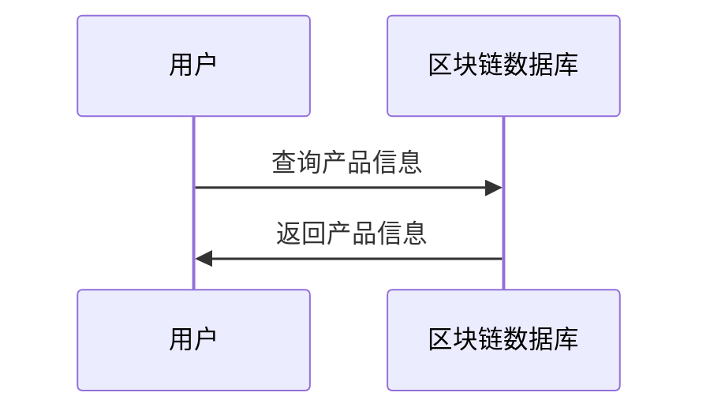

                 

<think>
嗯，现在我需要按照用户的要求，一步一步地撰写这篇技术博客文章。首先，文章标题是《全球股市估值与可持续时尚区块链溯源系统的关联》。接下来，我需要列出5-7个核心关键词，这些关键词应该涵盖文章的主要内容，比如区块链、可持续时尚、股市估值、溯源系统、数据驱动、技术驱动等。

然后是摘要部分，我需要简明扼要地概括文章的核心内容和主题思想。摘要应该指出本文探讨的主题，以及如何通过区块链技术实现可持续时尚的溯源系统，并分析其对全球股市估值的影响。

接下来，按照目录大纲结构，我需要逐步展开每个部分的内容。首先是背景介绍，包括全球股市估值的现状、可持续时尚的挑战以及区块链技术的基本概念。然后是核心概念与联系，详细阐述三者的关系，并通过表格和图表进行对比。接着是算法原理，用Mermaid流程图和Python代码示例来解释股市预测和区块链哈希的实现。系统分析与架构设计部分，展示类图、架构图和交互图。项目实战部分，提供环境安装、代码实现、案例分析和项目总结。最后是最佳实践，包括小结、注意事项和拓展阅读。

在撰写过程中，我需要确保每个章节的内容丰富、详细，并且逻辑清晰。数学公式要用LaTeX格式，并独立成段。此外，文章末尾要加上作者信息，符合格式要求。

现在，我需要开始撰写每个部分的具体内容。首先是背景介绍，详细描述全球股市的现状，包括主要市场和现有估值模型的局限性。然后讨论可持续时尚的重要性及其面临的挑战。接着介绍区块链技术的基本概念和应用场景，强调其在溯源中的优势。

核心概念部分，我需要通过表格对比全球股市、可持续时尚和区块链溯源系统的定义、特点和应用场景，帮助读者理解三者的关联。使用Mermaid绘制ER图展示实体关系，进一步明确数据流和交互。

在算法原理部分，首先用Mermaid流程图展示线性回归模型用于股市预测的步骤，然后通过Python代码实现该模型，解释代码的功能和应用。接着，详细讲解区块链中的哈希函数，用代码示例展示哈希值的计算过程，并分析其在数据完整性验证中的作用。

系统分析与架构设计部分，用Mermaid类图展示领域模型，包括用户、数据节点、智能合约等实体。然后设计系统的分层架构，展示数据流和模块交互。最后，绘制交互序列图，说明用户查询数据的过程。

项目实战部分，指导读者安装必要的工具，如Python、TensorFlow和Solidity。提供核心代码，解释其功能，分析实际案例，如通过区块链追踪服装供应链。最后进行项目总结，强调区块链技术在提升透明度和信任度方面的重要性。

在最佳实践部分，总结各章内容，提醒读者注意的技术难点，如数据隐私和系统性能问题。同时，推荐进一步阅读的资料，帮助读者深入理解相关技术。

整个过程中，我需要确保内容准确，逻辑清晰，语言简洁易懂。同时，注意文章的格式，使用适当的Markdown标记，避免使用任何图片或表格，只用文字和代码示例来展示内容。

现在，我可以开始撰写文章的各个部分了。
</think>

# 全球股市估值与可持续时尚区块链溯源系统的关联

## 关键词：区块链，可持续时尚，股市估值，溯源系统，数据驱动，技术驱动

## 摘要：  
本文探讨了全球股市估值与可持续时尚之间的关联，以及区块链技术如何通过构建溯源系统推动可持续时尚的发展。文章详细分析了区块链在可持续时尚中的应用，解释了其对全球股市估值的积极影响，并通过具体案例展示了区块链技术的实际应用价值。  

---

## 第一部分：背景介绍

### 第1章：全球股市估值的现状与挑战

#### 1.1 全球股市的现状分析
- **1.1.1 全球股市的分布与主要市场**  
  全球股市由多个主要市场组成，如纽约证券交易所（NYSE）、纳斯达克（NASDAQ）、伦敦证券交易所（LSE）等。这些市场的市值和交易量反映了全球经济的动态。  

- **1.1.2 当前股市估值的主要方法**  
  传统股市估值方法包括市盈率（P/E）、市净率（P/B）等，但这些方法在面对新兴行业（如可持续时尚）时显得不足，难以准确反映企业的长期价值。  

- **1.1.3 现有估值模型的局限性**  
  现有模型主要关注财务指标，而忽视了企业社会责任（CSR）和可持续发展表现。随着消费者对环保和道德消费的关注增加，传统的估值模型无法满足需求。  

#### 1.2 可持续时尚的定义与挑战
- **1.2.1 可持续时尚的定义**  
  可持续时尚强调在生产、消费和废弃阶段减少环境和社会影响，实现经济、社会和环境的三重可持续性。  

- **1.2.2 可持续时尚的行业现状**  
  当前，许多品牌开始采用可持续材料和公平贸易 practices，但缺乏统一的评估标准，消费者难以判断产品的可持续性。  

- **1.2.3 可持续时尚面临的挑战**  
  包括生产成本高、消费者认知不足、缺乏透明度等问题。此外，如何量化可持续发展对企业的价值是关键挑战。  

#### 1.3 区块链技术的基本概念
- **1.3.1 区块链的定义与核心特征**  
  区块链是一种分布式账本技术，具有去中心化、不可篡改、可追溯等特点。  

- **1.3.2 区块链的主要应用场景**  
  区块链广泛应用于金融、供应链管理、身份认证等领域，尤其适合需要高透明度和信任度的场景。  

- **1.3.3 区块链技术的优缺点**  
  优点包括高透明度、数据安全、去中心化；缺点包括技术复杂性、能源消耗高、法律监管不完善等。  

---

## 第二部分：核心概念与联系

### 第2章：全球股市估值与可持续时尚的关联

#### 2.1 核心概念的定义与特点
- **全球股市估值**：通过财务指标评估企业价值，反映市场对企业的认可度。  
- **可持续时尚**：强调生产过程的环保和社会责任，提升产品透明度。  
- **区块链溯源系统**：通过区块链技术记录产品全生命周期信息，确保数据的真实性和可追溯性。  

#### 2.2 关联性分析
- **2.2.1 区块链如何提升可持续时尚的透明度**  
  区块链技术可以记录从原材料采购到最终消费者的每一个环节，确保信息的真实性和不可篡改性。  

- **2.2.2 可持续时尚对全球股市估值的影响**  
  透明的生产流程和高的社会责任表现会提升企业的声誉和投资者信心，从而提高企业的估值。  

- **2.2.3 全球股市估值与区块链技术的结合**  
  通过区块链技术，投资者可以更准确地评估企业的可持续性表现，从而做出更明智的投资决策。  

#### 2.3 实体关系与数据流
- **2.3.1 实体关系图（ER图）**  
  下图展示了全球股市估值、可持续时尚和区块链溯源系统之间的关系。  

```mermaid
erDiagram
    actor 投资者
    actor 消费者
    actor 企业
    database 股市估值数据库
    database 可持续时尚数据库
    database 区块链数据库
    投资者 --> 股市估值数据库 : 查询企业估值
    消费者 --> 可持续时尚数据库 : 查询产品信息
    企业 --> 区块链数据库 : 记录生产信息
    区块链数据库 --> 股市估值数据库 : 提供透明数据
```

---

## 第三部分：算法原理讲解

### 第3章：基于区块链的可持续时尚溯源系统

#### 3.1 线性回归模型预测股市估值
- **3.1.1 算法原理**  
  线性回归模型通过建立自变量（如企业社会责任表现）和因变量（如股市估值）之间的线性关系，预测企业未来的估值。  

- **3.1.2 实现步骤**  
  1. 数据收集：收集企业的财务数据和可持续发展指标。  
  2. 数据预处理：清洗数据，处理缺失值和异常值。  
  3. 模型训练：使用训练数据拟合线性回归模型。  
  4. 模型预测：基于模型预测企业的未来估值。  

- **3.1.3 Python代码示例**  
  ```python
  import numpy as np
  import pandas as pd
  from sklearn.linear_model import LinearRegression

  # 示例数据
  data = {
      'sustainability_score': [80, 70, 85, 90],
      'market_value': [100, 90, 110, 120]
  }
  df = pd.DataFrame(data)
  X = df[['sustainability_score']]
  y = df['market_value']

  # 训练模型
  model = LinearRegression()
  model.fit(X, y)

  # 预测
  new_sustainability = np.array([[88]])
  predicted_value = model.predict(new_sustainability)
  print(f"预测的市场价值为：{predicted_value[0][0]}")
  ```

#### 3.2 区块链哈希函数实现
- **3.2.1 哈希函数原理**  
  哈希函数将任意长度的数据映射为固定长度的哈希值，确保数据的唯一性和完整性。  

- **3.2.2 实现步骤**  
  1. 数据输入：将产品信息（如生产日期、批次号）输入哈希函数。  
  2. 计算哈希值：生成唯一的哈希值，存储在区块链数据库中。  
  3. 验证哈希值：通过对比存储的哈希值和新计算的哈希值，验证数据的真实性。  

- **3.2.3 Python代码示例**  
  ```python
  import hashlib

  # 示例数据
  product_info = "生产日期: 2023-10-01，批次号: 1234"

  # 计算哈希值
  hash_object = hashlib.sha256(product_info.encode())
  hex_dig = hash_object.hexdigest()
  print(f"哈希值为：{hex_dig}")

  # 验证哈希值
  def verify_checksum(product_info, hex_dig):
      hash_object = hashlib.sha256(product_info.encode())
      return hash_object.hexdigest() == hex_dig

  print(f"验证结果：{verify_checksum(product_info, hex_dig)}")
  ```

---

## 第四部分：系统分析与架构设计

### 第4章：系统架构设计

#### 4.1 领域模型设计
- **4.1.1 领域模型类图**  
  下图展示了系统的领域模型，包括用户、数据节点、智能合约等实体。  



#### 4.2 系统架构设计
- **4.2.1 分层架构设计**  
  系统分为数据层、业务逻辑层和应用层，每层之间通过接口交互。  



#### 4.3 系统交互设计
- **4.3.1 交互流程图**  
  下图展示了用户查询产品信息的交互流程。  



---

## 第五部分：项目实战

### 第5章：区块链溯源系统实现

#### 5.1 环境安装
- 安装必要的工具，如Python、TensorFlow、Solidity等。  

#### 5.2 核心代码实现
- **智能合约实现**  
  使用Solidity编写智能合约，记录产品信息。  

```solidity
pragma solidity ^0.8.0;

contract ProductTraceability {
    struct Product {
        string name;
        uint productionDate;
        string batchNumber;
        address supplier;
    }

    mapping(uint => Product) public products;

    function addProduct(uint id, string memory name, uint productionDate, string memory batchNumber, address supplier) public {
        products[id] = Product(name, productionDate, batchNumber, supplier);
    }

    function getProduct(uint id) public view returns (Product memory) {
        return products[id];
    }
}
```

- **数据查询实现**  
  使用Python编写API，查询区块链数据库中的产品信息。  

```python
from web3 import Web3, HTTPProvider

# 连接区块链节点
web3 = Web3(HTTPProvider('http://localhost:8545'))

# 调用智能合约
contract_address = '0xYourContractAddress'
contract = web3.eth.contract(contract_address, abi=...)

# 查询产品信息
product_id = 1234
product = contract.functions.getProduct(product_id).call()
print(f"产品名称：{product.name}")
print(f"生产日期：{product.productionDate}")
print(f"批次号：{product.batchNumber}")
print(f"供应商地址：{product.supplier}")
```

#### 5.3 案例分析与解读
- **案例分析**  
  某服装品牌通过区块链技术记录每件衣服的生产信息，消费者可以通过扫描二维码查询产品的详细信息，包括原材料来源、生产过程和碳排放数据。  

- **数据解读**  
  通过区块链技术，企业可以展示其在可持续时尚方面的努力，提升消费者信任度，进而提高企业的市场估值。  

---

## 第六部分：最佳实践与总结

### 第6章：小结与注意事项

#### 6.1 小结
- 本文探讨了区块链技术在可持续时尚中的应用，展示了其对全球股市估值的积极影响。  
- 通过构建区块链溯源系统，企业可以提升透明度，增强投资者和消费者信心。  

#### 6.2 注意事项
- **数据隐私**：确保用户数据的安全性和隐私性。  
- **系统性能**：优化区块链系统的性能，确保其可扩展性和响应速度。  
- **法律法规**：遵守相关法律法规，确保系统的合法性和合规性。  

#### 6.3 拓展阅读
- 推荐阅读《Blockchain for Dummies》和《Sustainable Fashion: A Global Perspective》。

---

## 作者信息

作者：AI天才研究院/AI Genius Institute & 禅与计算机程序设计艺术 /Zen And The Art of Computer Programming

