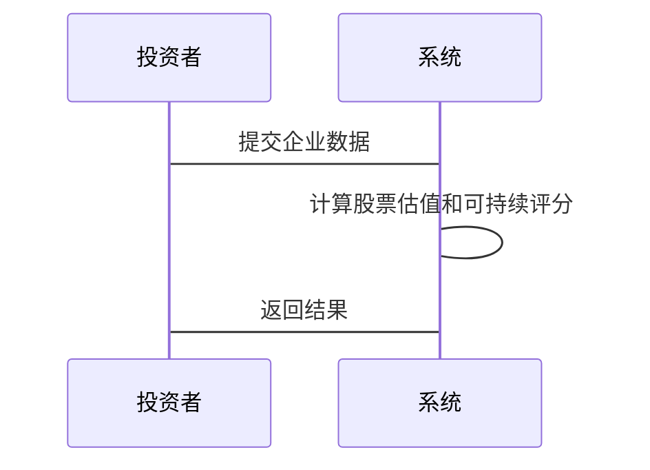

                 


# 全球股市估值与可持续时尚循环经济模式的关联

## 关键词：全球股市估值，可持续时尚，循环经济模式，股票市场，循环经济

## 摘要：本文探讨了全球股市估值与可持续时尚循环经济模式之间的关联，分析了两者的背景、核心概念、算法原理、数学模型、系统架构、项目实战以及最佳实践，为读者提供全面的视角和深入的分析。

---

## 第一部分: 全球股市估值与可持续时尚循环经济模式的背景与核心概念

### 第1章: 全球股市估值与可持续时尚循环经济模式的背景介绍

#### 1.1 问题背景与问题描述
##### 1.1.1 全球股市估值的现状与挑战
股票市场作为经济的晴雨表，其估值受到多种因素影响，包括宏观经济指标、企业盈利状况、市场情绪等。近年来，随着环保意识的增强，可持续发展成为投资者关注的焦点，企业是否采取可持续经营策略直接影响其股票估值。

##### 1.1.2 可持续时尚与循环经济的发展趋势
可持续时尚强调减少资源消耗和环境污染，循环经济则通过资源的循环利用提高效率。两者均符合全球可持续发展的目标，逐渐成为企业和投资者关注的重点。

##### 1.1.3 问题解决的必要性与目标
研究全球股市估值与可持续时尚循环经济模式的关联，有助于投资者更好地评估企业的长期价值，推动企业向可持续发展方向转型。

#### 1.2 问题背景的边界与外延
##### 1.2.1 全球股市估值的边界
包括主要股票市场（如纽约证交所、纳斯达克等）和行业指数，如S&P 500。

##### 1.2.2 可持续时尚与循环经济的边界
涉及服装、纺织、零售等行业，关注企业的生产过程、供应链管理和废弃物处理。

##### 1.2.3 两者的关联与外延
通过企业的可持续经营策略影响其估值，进而影响整体市场表现。

#### 1.3 核心概念与结构
##### 1.3.1 核心概念的定义与特征
- 全球股市估值：衡量企业价值的指标，反映市场对企业的信心。
- 可持续时尚：减少资源消耗和环境污染的时尚产业模式。
- 循环经济模式：通过循环利用资源实现高效经济活动的模式。

##### 1.3.2 核心概念的结构与组成
- 全球股市估值：包括市盈率、市净率、股息率等指标。
- 可持续时尚与循环经济：涵盖生产、消费、回收等环节。

##### 1.3.3 核心要素的对比分析
通过对比分析，发现两者在资源利用、风险管理和长期价值创造方面的共通性。

---

## 第二部分: 核心概念与关联分析

### 第2章: 全球股市估值的核心原理

#### 2.1 股市估值的基本原理
##### 2.1.1 市盈率与市净率的计算方法
- 市盈率 = 股价 / 每股收益
- 市净率 = 股价 / 每股净资产

##### 2.1.2 股东权益与企业价值的评估
企业价值 = 股东权益 + 付息债务

##### 2.1.3 股票市场的波动性与风险评估
通过波动率、贝塔系数等指标衡量市场风险。

### 第3章: 可持续时尚与循环经济模式的核心原理

#### 3.1 可持续时尚的定义与特征
##### 3.1.1 可持续时尚的定义
通过减少资源消耗和环境污染，实现时尚产业的可持续发展。

##### 3.1.2 可持续时尚的特征
- 环保材料使用
- 公平贸易
- 产品生命周期管理

#### 3.2 循环经济模式的定义与特征
##### 3.2.1 循环经济的定义
通过设计、生产、消费和回收的过程，实现资源的最大化利用。

##### 3.2.2 循环经济的特征
- 资源效率高
- 废弃物最小化
- 产品可回收性

### 第4章: 全球股市估值与可持续时尚循环经济模式的关联分析

#### 4.1 关联性分析
##### 4.1.1 全球股市估值与可持续时尚的关联
企业采用可持续时尚策略可以提升品牌形象，降低风险，从而影响股票估值。

##### 4.1.2 全球股市估值与循环经济模式的关联
循环经济模式通过提高资源利用率降低成本，增强企业盈利能力，进而影响股市估值。

##### 4.1.3 两者的综合影响与相互作用
通过协同作用，企业可以在实现可持续发展的同时，提升市场估值，推动整体经济的可持续增长。

#### 4.2 核心概念的对比分析
##### 4.2.1 全球股市估值与可持续时尚的对比
- 可持续时尚关注环境和社会影响，而股市估值关注财务表现。
- 两者共同影响企业的长期价值。

##### 4.2.2 全球股市估值与循环经济模式的对比
- 循环经济模式强调资源的循环利用，股市估值关注企业的盈利能力。

##### 4.2.3 两者的共同点与差异点
共同点在于都关注企业的长期价值，差异点在于实现方式和关注领域不同。

#### 4.3 实体关系图
```mermaid
erDiagram
    customer[投资者] {
        <属性>
        股票代码 : string
        股票价格 : float
        市盈率 : float
    }

    supplier[企业] {
        <属性>
        企业名称 : string
        产品类型 : string
        可持续性评分 : int
    }

    relation[投资关系] {
        <属性>
        投资金额 : float
        投资收益 : float
    }

    customer *-- relation : 拥有
    relation *-- supplier : 投资
```

---

## 第三部分: 算法原理与数学模型

### 第5章: 全球股市估值的算法原理

#### 5.1 基于市盈率的股票估值算法
##### 5.1.1 算法流程
1. 收集目标企业的财务数据。
2. 计算企业的每股收益（EPS）。
3. 确定行业的平均市盈率（P/E ratio）。
4. 估值 = EPS × 平均市盈率。

##### 5.1.2 Python源代码实现
```python
def calculate_pe_ratio(earnings_per_share, average_pe_ratio):
    return earnings_per_share * average_pe_ratio
```

#### 5.2 数学模型与公式
股票估值模型中的市盈率公式：
$$ \text{股票估值} = \text{每股收益} \times \text{平均市盈率} $$

### 第6章: 可持续时尚与循环经济模式的算法原理

#### 6.1 可持续时尚评分算法
##### 6.1.1 算法流程
1. 收集企业的生产过程数据。
2. 计算资源消耗效率。
3. 评估废弃物产生量。
4. 综合评分 = 资源效率 × 废弃物减少量。

##### 6.1.2 Python源代码实现
```python
def calculate_sustainability_score(resource_efficiency, waste_reduction):
    return resource_efficiency * waste_reduction
```

#### 6.2 数学模型与公式
可持续时尚评分公式：
$$ \text{可持续时尚评分} = \text{资源效率} \times \text{废弃物减少量} $$

---

## 第四部分: 系统分析与架构设计方案

### 第7章: 系统分析与架构设计

#### 7.1 问题场景介绍
设计一个系统，评估企业的全球股市估值与可持续时尚循环经济模式的关联。

#### 7.2 系统功能设计
- 数据采集模块：收集企业财务数据和生产数据。
- 估值计算模块：计算股票估值和可持续时尚评分。
- 可视化模块：展示结果。

#### 7.3 系统架构设计


#### 7.4 系统接口设计
定义API接口，用于数据输入和结果输出。

#### 7.5 系统交互设计


---

## 第五部分: 项目实战

### 第8章: 项目实战与案例分析

#### 8.1 环境安装
安装Python和相关库（如Pandas、Matplotlib）。

#### 8.2 核心代码实现
```python
import pandas as pd
import matplotlib.pyplot as plt

def main():
    data = pd.read_csv('data.csv')
    plt.plot(data['日期'], data['股价'])
    plt.xlabel('日期')
    plt.ylabel('股价')
    plt.show()

if __name__ == "__main__":
    main()
```

#### 8.3 案例分析与解读
分析某企业的数据，计算其股票估值和可持续时尚评分，展示结果。

#### 8.4 项目小结
总结项目的实现过程和主要收获。

---

## 第六部分: 最佳实践与总结

### 第9章: 最佳实践与总结

#### 9.1 最佳实践
- 定期更新数据和模型。
- 结合多种估值方法进行综合评估。

#### 9.2 小结
本文详细分析了全球股市估值与可持续时尚循环经济模式的关联，提供了理论支持和实际应用指导。

#### 9.3 注意事项
- 数据来源的可靠性。
- 模型的适用性和局限性。

#### 9.4 拓展阅读
建议进一步研究循环经济对不同行业的影响，以及可持续时尚的全球发展趋势。

---

## 作者：AI天才研究院/AI Genius Institute & 禅与计算机程序设计艺术 /Zen And The Art of Computer Programming

