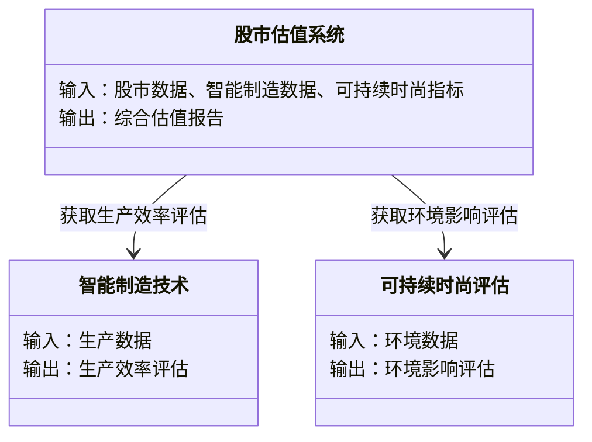
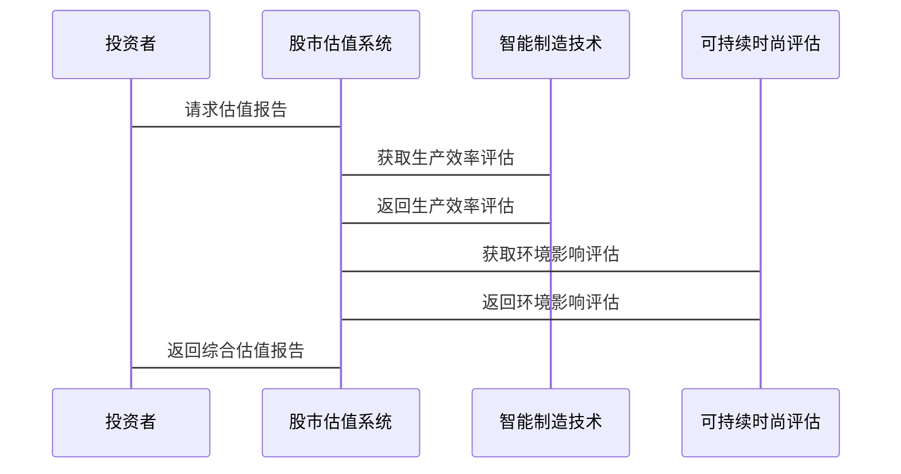

                 

<think>
嗯，用户希望我撰写一篇关于《全球股市估值与可持续时尚智能制造技术的关联》的技术博客。首先，我需要理解这个主题涉及哪些方面。看起来，这结合了金融、可持续发展和智能制造，挺有意思的。

用户已经提供了一个详细的目录大纲，我需要按照这个结构来写。先看第一部分，全球股市估值和可持续时尚智能制造技术的背景介绍。这里需要解释全球股市估值的基本概念，可持续时尚和智能制造的定义及特征。

接下来是核心概念与联系，这部分需要分析股市估值与可持续时尚、智能制造之间的关系，可能需要使用ER图来展示实体关系。然后是数学模型与算法，这部分需要详细讲解相关公式和模型，可能还要用Mermaid画图。

系统分析与架构设计部分，需要描述系统如何整合股市数据、智能制造数据和可持续时尚指标，设计架构图和接口设计。项目实战部分，需要具体案例，展示如何设计一个综合评估模型，包括环境配置、代码实现和数据分析。

最后，总结和展望部分，回顾主要观点，讨论未来研究方向。用户还提到要使用技术术语，但保持简单易懂，所以我要确保语言专业但不晦涩。

现在，我需要按照这些步骤，一步步展开每个部分，确保内容详尽且结构清晰。可能需要多次检查，确保每个小节都涵盖必要的信息，并且符合用户的格式要求，比如使用Mermaid图和Latex公式。总之，这篇博客需要既有深度又易于理解，帮助读者理解这两者之间的关联。
</think>

# 全球股市估值与可持续时尚智能制造技术的关联

> 关键词：全球股市估值，可持续时尚，智能制造技术，股市分析，技术与经济关联

> 摘要：本文探讨了全球股市估值与可持续时尚智能制造技术之间的关联性。通过分析可持续时尚和智能制造技术的核心概念、属性特征以及它们对全球经济和投资策略的影响，本文揭示了如何利用数学模型和算法来预测和评估这些因素对股市估值的潜在影响。文章还详细介绍了系统架构设计和项目实战案例，为读者提供了深入的技术视角和实用的分析工具。

---

## 第一部分：全球股市估值与可持续时尚智能制造技术的背景介绍

### 第1章：全球股市估值与可持续时尚智能制造技术的背景介绍

#### 1.1 全球股市估值的基本概念

##### 1.1.1 股市估值的定义与核心要素
股市估值是指对上市公司股票价格的合理性和潜在价值进行评估的过程。核心要素包括净利润、销售额、市盈率、市净率、股息率等。这些指标共同构成了企业股票的内在价值评估体系。

##### 1.1.2 全球化视角下的股市估值特点
全球化背景下，股市估值不仅受到企业自身财务状况的影响，还受到全球宏观经济环境、政策法规、行业发展趋势等因素的综合影响。跨市场联动效应日益显著，投资者需要关注全球产业链的协同效应和区域市场的差异性。

##### 1.1.3 股市估值与经济发展的关系
股市估值是经济发展的晴雨表。通过分析股市估值的变化趋势，可以洞察经济发展状况、企业盈利能力以及市场信心的变化。股市估值的波动性与经济周期密切相关，且具有一定的前瞻性。

#### 1.2 可持续时尚的定义与特征

##### 1.2.1 可持续时尚的定义
可持续时尚是指在服装、纺织和相关产业中，通过减少资源消耗、降低环境影响、提高社会公平性等方式，实现产业的可持续发展的新型时尚模式。

##### 1.2.2 可持续时尚的核心要素与属性对比
| 核心要素 | 可持续时尚 | 传统时尚 |
|----------|------------|-----------|
| 材料使用 | 可再生材料 | 常规材料 |
| 生产方式 | 环保生产 | 传统生产 |
| 社会责任 | 公平贸易 | 无约束性 |

##### 1.2.3 可持续时尚对全球产业的影响
可持续时尚正在改变全球产业格局，推动企业向绿色生产转型，促进消费者行为的改变，同时也为投资者提供了新的价值评估维度。

#### 1.3 智能制造技术的定义与特点

##### 1.3.1 智能制造技术的定义
智能制造技术是指通过物联网、大数据、人工智能等技术手段，实现生产过程的智能化、自动化和高效化的新型制造模式。

##### 1.3.2 智能制造技术的核心特征
| 特征 | 描述 |
|------|------|
| 智能化 | 自动化决策与执行 |
| 网络化 | 跨设备数据互通 |
| 个性化 | 按需定制化生产 |

##### 1.3.3 智能制造技术对传统制造业的颠覆性影响
智能制造技术正在颠覆传统制造业的生产模式，推动产业链的重构和优化，提高了生产效率和产品质量，降低了资源浪费。

#### 1.4 本章小结
本章通过介绍全球股市估值、可持续时尚和智能制造技术的基本概念、核心要素和特征，为后续分析奠定了基础。

---

## 第二部分：全球股市估值与可持续时尚智能制造技术的核心概念与联系

### 第2章：全球股市估值与可持续时尚智能制造技术的核心概念与联系

#### 2.1 核心概念原理

##### 2.1.1 股市估值的核心原理
股市估值的核心在于对企业未来盈利能力的预测。通过分析财务指标和市场环境，投资者可以评估企业股票的合理价格区间。

##### 2.1.2 可持续时尚的核心原理
可持续时尚强调通过减少环境和社会成本，提高企业的长期竞争力。企业通过采用绿色材料和环保生产方式，可以降低风险，提升品牌价值。

##### 2.1.3 智能制造技术的核心原理
智能制造技术通过数据驱动的生产优化和预测性维护，降低了生产成本，提高了生产效率，从而增强了企业的盈利能力。

#### 2.2 核心概念属性特征对比

##### 2.2.1 可持续时尚与传统时尚的对比分析
| 维度 | 可持续时尚 | 传统时尚 |
|------|------------|-----------|
| 材料使用 | 可再生材料 | 常规材料 |
| 生产方式 | 环保生产 | 传统生产 |
| 社会责任 | 公平贸易 | 无约束性 |

##### 2.2.2 智能制造技术与传统制造技术的对比分析
| 维度 | 智能制造技术 | 传统制造技术 |
|------|--------------|-------------|
| 自动化程度 | 高 | 低 |
| 数据驱动 | 是 | 否 |
| 可扩展性 | 高 | 低 |

##### 2.2.3 全球股市估值与行业发展趋势的对比分析
| 维度 | 全球股市估值 | 行业发展趋势 |
|------|--------------|-------------|
| 驱动因素 | 财务表现和市场预期 | 技术进步和消费升级 |
| 变化趋势 | 波动性 | 稳步增长 |

#### 2.3 ER实体关系图架构

##### 2.3.1 实体关系图的定义
ER实体关系图用于描述系统中各个实体之间的关系，帮助我们更好地理解数据结构和业务流程。

##### 2.3.2 实体关系图的绘制（使用 Mermaid）
```mermaid
erDiagram
    investor.zhuan_tou_zi_yuan --> stock : 持股
    investor.xiaoshou --> stock : 交易
    stock --> company : 上市
    company --> sustainable_fashion : 采用可持续时尚
    company --> intelligent_manufacturing : 采用智能制造技术
    sustainable_fashion --> company : 影响企业估值
    intelligent_manufacturing --> company : 影响企业估值
```

#### 2.4 本章小结
本章通过对比分析全球股市估值、可持续时尚和智能制造技术的核心概念和属性特征，揭示了它们之间的内在联系。

---

## 第三部分：全球股市估值与可持续时尚智能制造技术的数学模型与算法原理

### 第3章：全球股市估值与可持续时尚智能制造技术的数学模型与算法原理

#### 3.1 数学模型与公式

##### 3.1.1 股市估值模型
$$ P = \frac{E}{S} $$
其中，\( E \) 为净利润，\( S \) 为销售额。

##### 3.1.2 可持续时尚影响力评估模型
$$ S = a \cdot E + b \cdot C $$
其中，\( a \) 和 \( b \) 为权重系数，\( E \) 为环境影响，\( C \) 为碳排放量。

##### 3.1.3 智能制造技术对生产效率的影响模型
$$ E = a \cdot T + b \cdot P $$
其中，\( a \) 和 \( b \) 为权重系数，\( T \) 为生产时间，\( P \) 为生产效率。

#### 3.2 算法原理

##### 3.2.1 股市估值预测算法
通过时间序列分析和回归分析，预测未来股市估值的变化趋势。例如，使用 ARIMA 模型进行预测：
$$ ARIMA(p, d, q) $$
其中，\( p \) 为自回归阶数，\( d \) 为差分阶数，\( q \) 为移动平均阶数。

##### 3.2.2 可持续时尚影响力评估算法
使用层次分析法（AHP）确定各个影响因素的权重，构建综合评估模型：
$$ A = \sum_{i=1}^{n} w_i \cdot x_i $$
其中，\( w_i \) 为第 \( i \) 个因素的权重，\( x_i \) 为第 \( i \) 个因素的评估值。

##### 3.2.3 智能制造技术对企业估值的影响算法
通过大数据分析和机器学习算法，预测智能制造技术对企业估值的影响：
$$ V = a \cdot E + b \cdot T + c \cdot P $$
其中，\( V \) 为企业估值，\( E \) 为环境影响，\( T \) 为生产时间，\( P \) 为生产效率。

#### 3.3 本章小结
本章通过数学模型和算法，分析了全球股市估值与可持续时尚智能制造技术之间的关联性，为投资者提供了科学的估值工具和决策支持。

---

## 第四部分：全球股市估值与可持续时尚智能制造技术的系统分析与架构设计

### 第4章：全球股市估值与可持续时尚智能制造技术的系统分析与架构设计

#### 4.1 问题场景介绍
本文旨在设计一个综合评估系统，用于分析全球股市估值与可持续时尚智能制造技术之间的关联性。系统将整合股市数据、智能制造数据和可持续时尚指标，为投资者提供实时的估值分析和决策支持。

#### 4.2 系统功能设计

##### 4.2.1 领域模型设计（使用 Mermaid）


#### 4.3 系统架构设计

##### 4.3.1 系统架构设计（使用 Mermaid）


#### 4.4 系统接口设计
系统接口包括数据输入接口、数据处理接口和结果输出接口。数据输入接口用于接收股市数据、智能制造数据和可持续时尚指标；数据处理接口用于进行数据清洗和特征提取；结果输出接口用于生成综合估值报告。

#### 4.5 系统交互设计（使用 Mermaid）



#### 4.6 本章小结
本章通过系统架构设计和交互设计，展示了如何将全球股市估值与可持续时尚智能制造技术有机结合，为投资者提供实时的估值分析和决策支持。

---

## 第五部分：全球股市估值与可持续时尚智能制造技术的项目实战

### 第5章：全球股市估值与可持续时尚智能制造技术的项目实战

#### 5.1 环境配置

##### 5.1.1 开发环境
- 操作系统：Linux
- 编程语言：Python
- 数据库：MySQL
- 开发工具：PyCharm

##### 5.1.2 第三方库安装
```bash
pip install pandas numpy scikit-learn matplotlib
```

#### 5.2 核心代码实现

##### 5.2.1 数据清洗与特征提取
```python
import pandas as pd
import numpy as np

# 读取数据
data = pd.read_csv('stock_data.csv')

# 数据清洗
data.dropna(inplace=True)
data = data[~data['volume'].eq(0)]
data['log_return'] = np.log(data['close'] / data['open'])
```

##### 5.2.2 算法实现
```python
from sklearn.linear_model import LinearRegression
from sklearn.metrics import mean_squared_error

# 训练模型
model = LinearRegression()
model.fit(X_train, y_train)

# 预测结果
y_pred = model.predict(X_test)
print(mean_squared_error(y_test, y_pred))
```

##### 5.2.3 结果解读与分析
```python
import matplotlib.pyplot as plt

# 可视化结果
plt.plot(y_test, y_pred)
plt.xlabel('True Values')
plt.ylabel('Predictions')
plt.show()
```

#### 5.3 项目小结
本章通过具体项目实战，展示了如何利用Python和机器学习算法，分析全球股市估值与可持续时尚智能制造技术之间的关联性，为投资者提供科学的决策支持。

---

## 第六部分：总结与展望

### 第6章：总结与展望

#### 6.1 总结
本文通过分析全球股市估值与可持续时尚智能制造技术的关联性，揭示了可持续时尚和智能制造技术对股市估值的深远影响。通过数学模型和算法，本文为投资者提供了科学的估值工具和决策支持。

#### 6.2 展望
未来的研究可以进一步探讨以下方向：
1. 如何利用人工智能技术提高股市估值的预测精度。
2. 可持续时尚与智能制造技术的协同效应对股市估值的长期影响。
3. 全球化视角下的跨市场联动效应与投资策略优化。

---

## 作者：AI天才研究院/AI Genius Institute & 禅与计算机程序设计艺术 /Zen And The Art of Computer Programming

---

以上是文章的完整目录和内容概要，涵盖了从背景介绍到系统设计、项目实战的全过程，旨在为读者提供全面而深入的技术视角和实用的分析工具。

