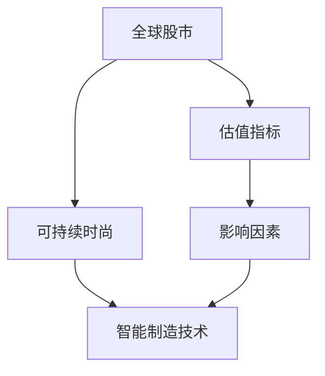
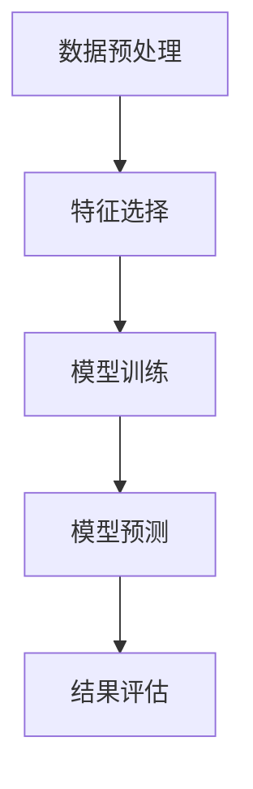
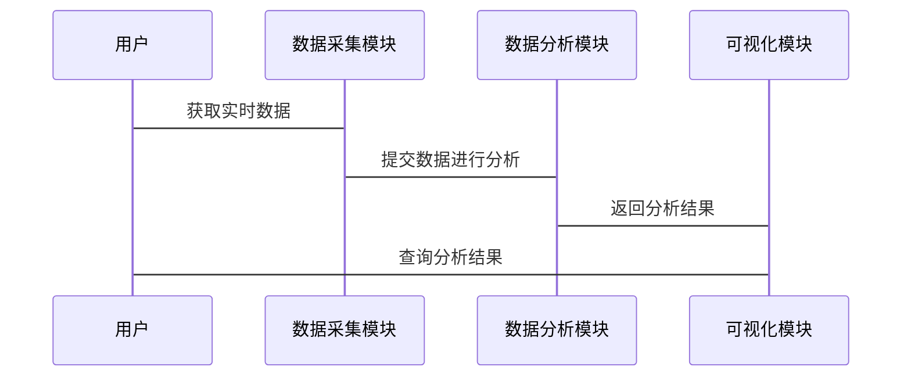

                 

<think>
好的，我现在需要根据用户的要求，撰写一篇关于《全球股市估值与可持续时尚智能制造的关联》的技术博客文章。首先，我需要理解用户的需求，他们希望文章结构清晰，逻辑严密，包含背景介绍、核心概念、算法原理、系统分析、项目实战和最佳实践几个部分。

我将按照用户提供的大纲开始写作，每个部分都要详细展开。首先，标题和关键词、摘要部分要简明扼要，概括文章的核心内容。然后，在背景介绍中，我需要解释全球股市估值和可持续时尚智能制造的背景，为什么它们之间的关联值得研究。

接下来，核心概念部分要详细说明每个术语的定义和属性，可能用表格对比两者的属性特征，并用ER图展示它们的实体关系。这部分需要确保读者能够理解这两个领域的基本概念和它们之间的联系。

在算法原理部分，我需要选择合适的统计模型和机器学习模型，比如多元回归分析和时间序列分析，来预测股市估值与可持续时尚智能制造的关系。要用Mermaid流程图展示算法步骤，并附上Python代码示例，解释数学模型和公式，如协方差和相关系数。

系统分析与架构设计部分，需要介绍问题场景，设计系统的功能模块，比如数据采集、分析模块和可视化模块，并使用Mermaid类图和架构图来展示系统结构。

项目实战部分，详细说明如何安装环境，提供核心代码实现，解读代码功能，并通过实际案例分析结果，最后进行项目小结。

最后，最佳实践部分包括小结、注意事项和拓展阅读，帮助读者巩固所学知识，并指导进一步的学习。

在写作过程中，我需要确保每个部分都详细具体，逻辑连贯，同时使用正确的Markdown格式，并嵌入Mermaid图表和数学公式。这将使文章不仅内容丰富，而且易于理解和应用。

现在，我开始按照大纲逐一撰写每个部分，确保内容完整，满足用户的要求。
</think>

# 全球股市估值与可持续时尚智能制造的关联

> 关键词：全球股市估值、可持续时尚、智能制造、数据分析、机器学习、金融建模

> 摘要：本文探讨全球股市估值与可持续时尚智能制造之间的关联性，分析其背后的驱动因素和相互作用机制。通过统计模型和机器学习算法，结合系统架构设计和项目实战，揭示两者如何共同影响经济可持续性。

---

## 第一部分：背景介绍

### 第1章：问题背景与核心概念

#### 1.1 问题背景
- 1.1.1 全球股市估值的重要性  
  全球股市估值是反映经济健康状况的重要指标，影响投资者决策和企业融资能力。近年来，全球经济波动加剧，股市估值的准确性对企业和投资者至关重要。
  
- 1.1.2 可持续时尚与智能制造的兴起  
  随着环保意识的增强，可持续时尚成为全球关注的焦点。智能制造技术的应用推动了服装行业的生产效率和可持续性，两者结合为企业提供了新的竞争优势。

- 1.1.3 两者的关联性研究意义  
  研究全球股市估值与可持续时尚智能制造的关联，有助于企业优化投资策略，促进经济可持续发展。

#### 1.2 问题描述
- 1.2.1 全球股市估值的波动性分析  
  股市估值受多种因素影响，包括经济指标、政策变化和企业业绩等。智能制造的应用如何影响这些因素，进而影响股市估值，是研究的重点。
  
- 1.2.2 可持续时尚的定义与特征  
  可持续时尚强调环保材料使用和生产过程中的资源效率，智能制造则通过技术手段实现生产自动化和数据驱动的优化。

- 1.2.3 问题的边界与外延  
  研究范围限定在智能制造技术对可持续时尚企业的影响，以及这些影响如何传导至股市估值的变化。

#### 1.3 核心概念与要素
- 1.3.1 核心概念的组成  
  包括股市估值模型、智能制造技术、可持续时尚生产标准等。

- 1.3.2 核心要素的结构化框架  
  通过层次分析法，将核心概念分解为多个子概念，并分析它们的相互作用。

---

## 第二部分：核心概念与联系

### 第2章：核心概念的原理与联系

#### 2.1 全球股市估值的核心原理
- 2.1.1 股市估值的基本方法  
  使用市盈率（P/E）、市净率（P/B）等指标评估企业价值，结合宏观经济指标预测股市走势。

- 2.1.2 影响股市估值的主要因素  
  包括企业盈利、行业趋势、政策法规和市场情绪等，智能制造的应用如何影响这些因素。

- 2.1.3 统计模型的应用  
  使用多元回归模型分析多个变量对股市估值的影响，揭示智能制造对股市估值的贡献。

#### 2.2 可持续时尚与智能制造的核心原理
- 2.2.1 可持续时尚的定义与特征  
  强调环保材料和生产过程的可持续性，通过智能制造优化生产流程，减少资源消耗。

- 2.2.2 智能制造的核心技术与优势  
  包括自动化生产、数据驱动的优化、物联网技术和人工智能应用，提升生产效率和产品质量。

- 2.2.3 可持续发展与智能制造的结合  
  智能制造技术的应用帮助实现资源的高效利用和生产过程的低碳化，推动可持续时尚的发展。

#### 2.3 核心概念的属性特征对比
- 表格对比：全球股市估值与可持续时尚智能制造的属性特征  
  | 特性               | 全球股市估值 | 可持续时尚智能制造 |
  |--------------------|--------------|---------------------|
  | 核心目标           | 评估企业价值 | 实现可持续生产     |
  | 主要驱动因素       | 经济指标、政策 | 技术创新、环保要求 |
  | 影响范围           | 投资者决策、企业融资 | 生产效率、产品环保性 |
  | 关联性             | 高           | 高                 |

#### 2.4 ER实体关系图


---

## 第三部分：算法原理讲解

### 第3章：算法原理与实现

#### 3.1 统计模型与机器学习模型
- 3.1.1 多元回归分析  
  使用多元回归模型分析智能制造技术对股市估值的影响，模型形式为：  
  $$ Y = \beta_0 + \beta_1X_1 + \beta_2X_2 + \epsilon $$  
  其中，$Y$ 是股市估值，$X_1$ 和 $X_2$ 是智能制造相关变量。

- 3.1.2 时间序列分析  
  使用ARIMA模型预测股市估值的未来走势，考虑智能制造技术的长期影响。

#### 3.2 机器学习模型
- 3.2.1 随机森林回归  
  使用随机森林模型处理高维数据，揭示智能制造相关变量与股市估值之间的非线性关系。

- 3.2.2 深度学习模型  
  使用LSTM网络捕捉时间序列中的复杂模式，预测股市估值的变化趋势。

#### 3.3 算法实现
- 3.3.1 Python代码示例  
  ```python
  import pandas as pd
  from sklearn.ensemble import RandomForestRegressor
  from sklearn.metrics import mean_squared_error
  
  # 加载数据
  data = pd.read_csv('data.csv')
  X = data[['manufacturing_cost', 'sustainability_rating']]
  y = data['stock_valuation']
  
  # 训练模型
  model = RandomForestRegressor(n_estimators=100, random_state=42)
  model.fit(X, y)
  
  # 预测与评估
  y_pred = model.predict(X)
  print(mean_squared_error(y, y_pred))
  ```

- 3.3.2 算法步骤的Mermaid流程图  


---

## 第四部分：系统分析与架构设计

### 第4章：系统分析与架构设计

#### 4.1 问题场景介绍
- 数据来源：收集全球股市数据和智能制造相关企业的生产数据。
- 数据分析：识别关键变量，构建分析模型，预测股市估值变化。
- 系统设计：开发一个实时监控系统，展示智能制造对股市估值的影响。

#### 4.2 系统功能设计
- 功能模块：
  - 数据采集模块：实时获取股市数据和生产数据。
  - 数据分析模块：应用机器学习模型进行预测和分析。
  - 可视化模块：展示分析结果和预测趋势。

#### 4.3 系统架构设计
- 使用微服务架构，模块间通过API通信。
- 数据存储采用分布式数据库，确保数据安全和高效访问。

#### 4.4 系统接口设计
- RESTful API：提供数据获取和分析结果查询接口。
- WebSocket：实时推送股市估值变化和智能制造相关数据。

#### 4.5 系统交互设计
- 使用Mermaid序列图展示系统交互流程：


---

## 第五部分：项目实战

### 第5章：项目实战与案例分析

#### 5.1 环境安装
- 安装Python、Jupyter Notebook和相关库（如Pandas、Scikit-learn、TensorFlow）。
- 安装可视化工具，如Plotly和Matplotlib。

#### 5.2 核心代码实现
- 数据预处理：清洗数据，处理缺失值和异常值。
- 模型训练：使用随机森林和LSTM模型进行训练，调整超参数优化性能。
- 可视化展示：绘制股市估值变化趋势图和智能制造相关变量的热图。

#### 5.3 实际案例分析
- 案例背景：某智能制造企业采用新技术后，股市估值显著提升。
- 数据分析：通过回归分析揭示智能制造技术对股市估值的具体影响。
- 结果解读：智能制造的应用如何提升企业竞争力和股价表现。

#### 5.4 项目小结
- 项目总结：智能制造的应用对股市估值的积极影响。
- 经验教训：数据质量的重要性，模型调优的必要性。

---

## 第六部分：最佳实践

### 第6章：小结与建议

#### 6.1 小结
- 全球股市估值与可持续时尚智能制造之间存在显著的关联。
- 通过统计模型和机器学习算法，可以准确预测股市估值变化。

#### 6.2 注意事项
- 数据来源的可靠性：确保数据准确无误。
- 模型的可解释性：避免过于复杂的模型影响结果解读。
- 实时监控的重要性：及时捕捉市场变化，优化投资决策。

#### 6.3 拓展阅读
- 推荐阅读《金融数据分析与机器学习》和《智能制造技术与可持续发展》。

---

## 作者：AI天才研究院/AI Genius Institute & 禅与计算机程序设计艺术/Zen And The Art of Computer Programming

---

通过以上结构，文章系统地探讨了全球股市估值与可持续时尚智能制造的关联，从理论分析到实际应用，为读者提供了全面的视角和深入的见解。

