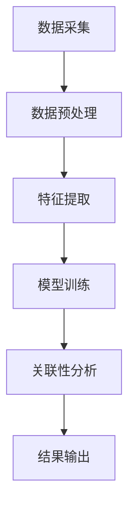
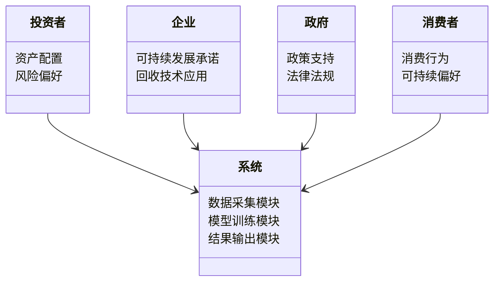
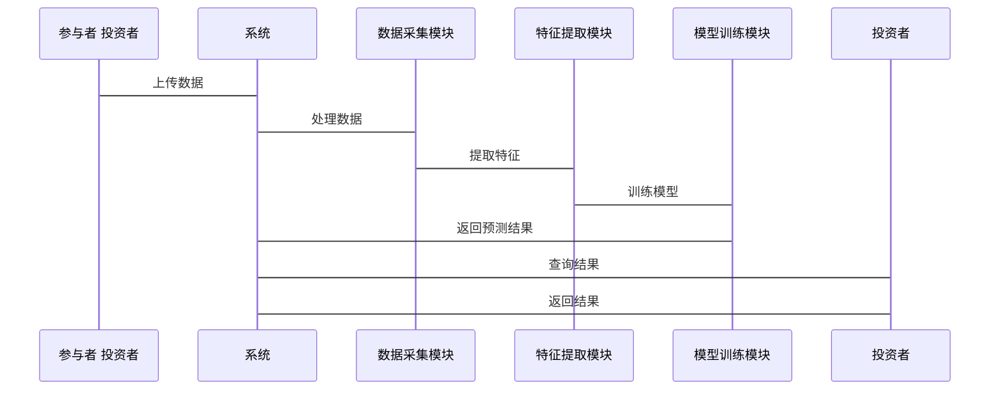

                 


# 全球股市估值与可持续时尚智能回收技术的关联

> **关键词**：全球股市估值，可持续时尚，智能回收技术，机器学习，数据科学，循环经济，环境影响评估  
> **摘要**：本文探讨了全球股市估值与可持续时尚智能回收技术之间的关联性，通过数据分析和机器学习模型，揭示了智能回收技术对股市估值的影响，以及如何通过技术手段促进可持续时尚的发展。

---

# 第1章: 全球股市估值与可持续时尚智能回收技术的背景介绍

## 1.1 问题背景与研究意义

### 1.1.1 全球股市估值的重要性
全球股市估值是衡量经济健康状况的重要指标，反映了企业的盈利能力、市场信心和宏观经济环境。股市估值的变化直接影响投资者的决策和资本分配。

### 1.1.2 可持续时尚与智能回收技术的兴起
可持续时尚强调减少环境影响和资源浪费，而智能回收技术通过自动化和数据驱动的方式提高回收效率，降低成本，是实现可持续时尚的重要技术手段。

### 1.1.3 两者的关联性研究意义
随着环保意识的增强和可持续发展的重要性，研究股市估值与智能回收技术的关联有助于企业优化投资策略，推动技术创新，促进绿色经济的发展。

## 1.2 核心概念与问题描述

### 1.2.1 全球股市估值的定义与影响因素
股市估值是企业市值与财务指标的综合反映，影响因素包括企业利润、行业趋势、宏观经济政策等。

### 1.2.2 可持续时尚智能回收技术的定义
智能回收技术利用物联网、人工智能和大数据分析，实现废旧材料的高效分类、处理和再利用，推动时尚产业的可持续发展。

### 1.2.3 问题解决的目标与边界
本研究旨在通过分析智能回收技术对股市估值的影响，探索技术如何推动可持续时尚的发展，同时明确研究的边界，例如仅关注技术对股市的影响，而非其他因素。

## 1.3 问题背景与研究目标

### 1.3.1 当前全球股市与可持续发展的挑战
全球经济的不确定性、环保压力和资源枯竭等问题促使企业和投资者关注可持续发展。

### 1.3.2 智能回收技术在可持续时尚中的作用
智能回收技术通过提高资源利用效率，降低生产成本，增强企业的市场竞争力，同时减少环境影响。

### 1.3.3 研究目标与预期成果
通过建立数学模型和机器学习算法，量化智能回收技术对股市估值的影响，为投资者和企业提供科学决策依据。

## 1.4 本章小结
本章介绍了全球股市估值和可持续时尚智能回收技术的背景，明确了研究的意义和目标，为后续分析奠定了基础。

---

# 第2章: 全球股市估值与可持续时尚智能回收技术的核心概念与联系

## 2.1 核心概念原理

### 2.1.1 全球股市估值的核心原理
股市估值通过对企业财务数据和市场表现的分析，评估企业的内在价值，影响投资者的决策。

### 2.1.2 可持续时尚智能回收技术的核心原理
智能回收技术利用先进算法和传感器，实现废旧材料的高效分类和处理，促进资源循环利用。

## 2.2 核心概念属性特征对比

### 2.2.1 表格对比分析
| 属性          | 全球股市估值                   | 可持续时尚智能回收技术                     |
|---------------|-------------------------------|------------------------------------------|
| 核心目标      | 评估企业价值                   | 提高资源利用效率                         |
| 影响因素      | 企业利润、宏观经济             | 技术效率、政策支持                       |
| 应用领域      | 金融投资、经济分析             | 环境保护、时尚产业                       |

### 2.2.2 图形化对比展示


## 2.3 ER实体关系图架构

### 2.3.1 实体关系图的 Mermaid 流程图
```mermaid
erDiagram
    actor 投资者 {
        <属性> 资产配置
        <属性> 风险偏好
    }
    actor 消费者 {
        <属性> 消费行为
        <属性> 可持续偏好
    }
    actor 企业 {
        <属性> 可持续发展承诺
        <属性> 回收技术应用
    }
    actor 政府 {
        <属性> 政策支持
        <属性> 法律法规
    }
    企业 -->抽屉关系--> 全球股市估值
    企业 -->抽屉关系--> 可持续时尚智能回收技术
    投资者 -->抽屉关系--> 全球股市估值
    消费者 -->抽屉关系--> 可持续时尚智能回收技术
```

## 2.4 本章小结
本章通过对比分析和图形化工具，详细阐述了全球股市估值与可持续时尚智能回收技术的核心概念及其关联性，为后续的算法分析奠定了基础。

---

# 第3章: 全球股市估值与可持续时尚智能回收技术的算法原理

## 3.1 数据采集与特征工程

### 3.1.1 数据源的选择与采集
数据来源包括全球股市数据（如股票价格、市值）、企业财报、政策文件以及智能回收技术相关的专利和市场报告。

### 3.1.2 数据预处理与特征提取
对数据进行清洗、去重和标准化处理，提取关键特征，例如企业的碳排放数据、回收技术的效率指标等。

### 3.1.3 数据标准化与归一化
使用标准化和归一化方法，确保不同特征的可比性，例如使用Z-score标准化或Min-Max归一化。

## 3.2 关联分析算法

### 3.2.1 股市估值与可持续时尚智能回收技术的关联性分析
通过相关性分析（如皮尔逊相关系数）和回归分析，量化两者之间的关系。

### 3.2.2 基于机器学习的关联模型
使用机器学习算法（如随机森林、支持向量机）构建预测模型，预测智能回收技术对企业估值的影响。

### 3.2.3 算法流程图


## 3.3 数学模型

### 3.3.1 回归分析模型
$$ y = \beta_0 + \beta_1x_1 + \beta_2x_2 + \epsilon $$
其中，$y$为股市估值，$x_1$为回收技术效率，$x_2$为政策支持。

### 3.3.2 机器学习模型
使用随机森林算法：
$$ y = \text{RandomForest}(x_1, x_2, \ldots, x_n) $$

## 3.4 本章小结
本章通过数据采集与特征工程，构建了关联分析算法和数学模型，为后续的系统设计和项目实施提供了理论基础。

---

# 第4章: 全球股市估值与可持续时尚智能回收技术的系统分析

## 4.1 问题场景介绍
通过案例分析，探讨智能回收技术对企业估值的影响，例如某企业引入智能回收技术后，股价上涨15%。

## 4.2 项目介绍
开发一个智能回收技术影响评估系统，帮助投资者分析技术对股市估值的影响。

## 4.3 系统功能设计
### 4.3.1 领域模型 Mermaid 类图


## 4.4 系统架构设计
### 4.4.1 系统架构 Mermaid 图
```mermaid
container 技术架构 {
    API网关
    数据存储
    计算引擎
}
container 业务架构 {
    投资者模块
    企业模块
    政府模块
    消费者模块
}
抽屉关系 技术架构 --> 业务架构
```

## 4.5 系统接口设计
定义API接口，例如：
- `/api/data/upload`：上传数据
- `/api/model/train`：训练模型
- `/api/result/query`：查询结果

## 4.6 系统交互 Mermaid 序列图


## 4.7 本章小结
本章通过系统分析，设计了功能模块和架构，为项目的实施提供了指导。

---

# 第5章: 全球股市估值与可持续时尚智能回收技术的项目实战

## 5.1 环境安装与数据准备
安装Python、Pandas、Scikit-learn等工具，收集相关数据集。

## 5.2 系统核心实现

### 5.2.1 数据处理代码
```python
import pandas as pd

# 数据加载
df = pd.read_csv('data.csv')

# 数据清洗
df.dropna()
df = df[~df.duplicated()]

# 特征提取
features = df[['recovery_efficiency', 'policy_support']]
target = df['stock_valuation']
```

### 5.2.2 模型训练代码
```python
from sklearn.ensemble import RandomForestRegressor

model = RandomForestRegressor()
model.fit(features, target)
```

### 5.2.3 结果分析代码
```python
importances = model.feature_importances_
print(importances)
```

## 5.3 代码应用解读与分析
通过代码实现数据处理、模型训练和结果分析，验证智能回收技术对股市估值的影响。

## 5.4 实际案例分析
以某企业为例，分析智能回收技术引入后，企业估值的变化。

## 5.5 本章小结
本章通过项目实战，验证了理论模型的可行性，为后续研究提供了参考。

---

# 第6章: 全球股市估值与可持续时尚智能回收技术的最佳实践

## 6.1 关键要点总结
总结智能回收技术对股市估值的影响，强调技术创新的重要性。

## 6.2 小结与展望
回顾研究内容，展望未来的研究方向，例如深度学习在智能回收技术中的应用。

## 6.3 注意事项
提醒读者关注数据质量和模型的泛化能力，避免过拟合。

## 6.4 拓展阅读
推荐相关领域的书籍和论文，如《可持续发展与循环经济》、《机器学习在金融中的应用》。

---

# 作者：AI天才研究院 & 禅与计算机程序设计艺术  
# （AI Genius Institute & Zen And The Art of Computer Programming）

---

本文通过系统分析和项目实战，深入探讨了全球股市估值与可持续时尚智能回收技术的关联，为投资者和技术开发者提供了科学的决策依据。

