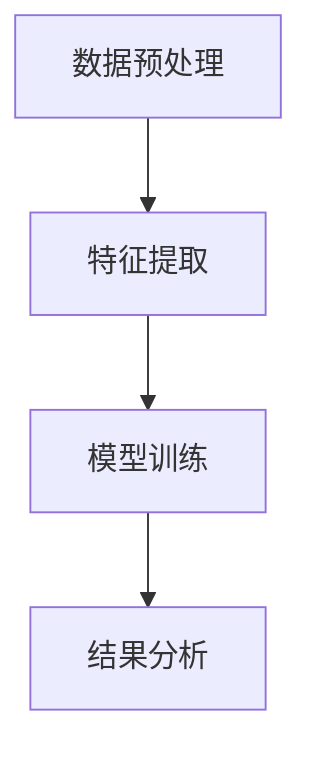
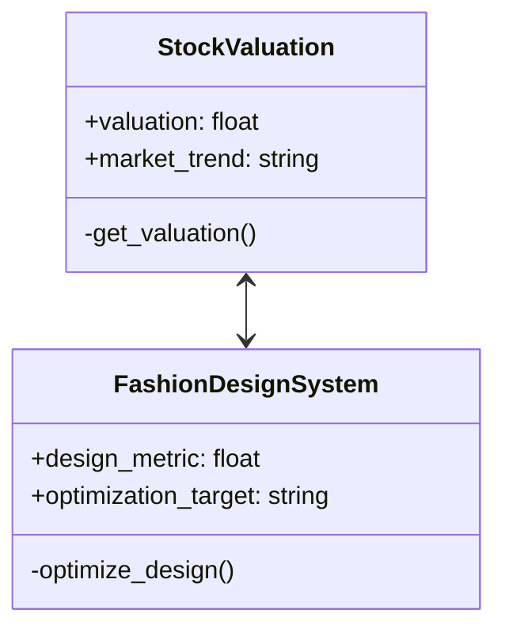
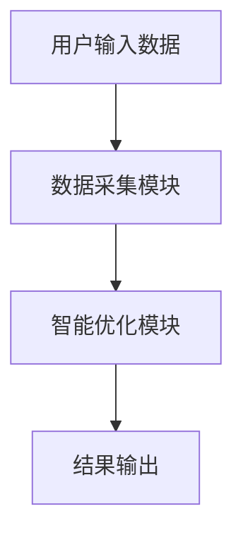
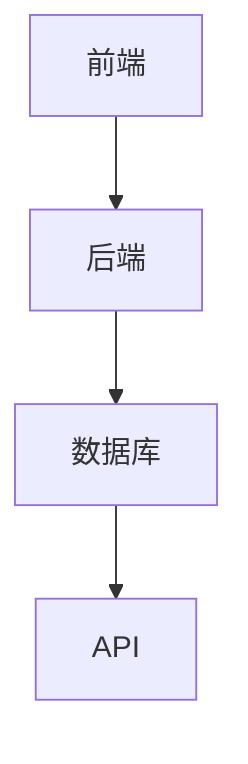
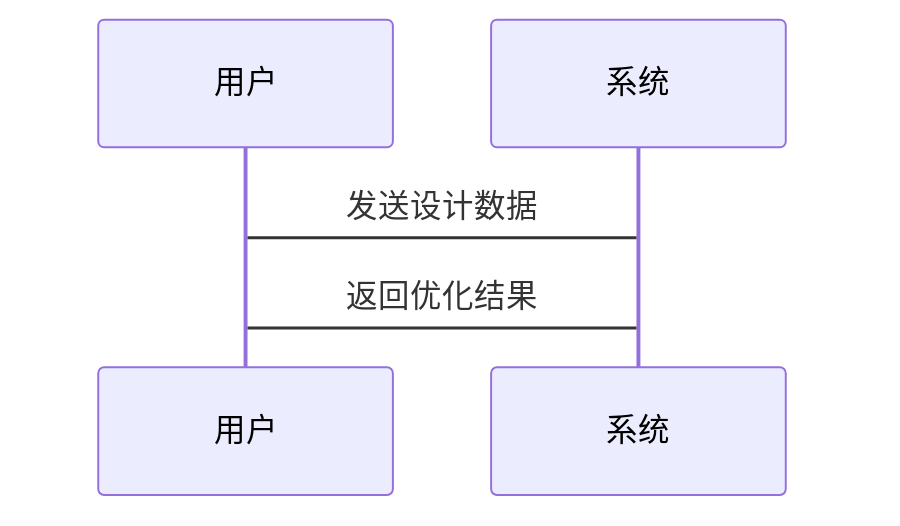

                 


```markdown
# 全球股市估值与可持续时尚智能设计系统的关联

> 关键词：全球股市估值、可持续时尚、智能设计系统、系统关联性、算法原理、系统架构

> 摘要：本文探讨了全球股市估值与可持续时尚智能设计系统之间的关联性，通过系统分析、算法原理和架构设计，揭示了两者在数据驱动决策、智能设计优化和可持续性发展中的协同作用。

---

# 第1章: 全球股市估值与可持续时尚智能设计系统的背景介绍

## 1.1 问题背景与意义

### 1.1.1 全球股市估值的现状与挑战
全球股市估值是衡量市场健康状况的重要指标，但受到经济波动、政策变化和市场情绪等多种因素的影响。近年来，随着可持续发展理念的兴起，投资者越来越关注企业的社会责任和环境影响，这使得传统估值方法需要与时俱进。

### 1.1.2 可持续时尚设计的兴起与趋势
可持续时尚强调减少资源消耗和环境污染，通过技术创新和智能化设计实现绿色生产。随着消费者环保意识的提升，可持续时尚正成为市场的新趋势，企业需要通过智能设计系统优化生产流程。

### 1.1.3 问题解决路径与边界条件
本文试图通过分析全球股市估值与可持续时尚设计系统之间的关联，提出一种数据驱动的智能设计优化方法，边界条件包括数据来源、模型假设和应用场景。

## 1.2 核心概念与问题描述

### 1.2.1 全球股市估值的定义与关键指标
全球股市估值是基于市场资本化率和企业盈利情况的综合指标，包括市盈率（P/E）、市净率（P/B）等。

### 1.2.2 可持续时尚智能设计系统的定义与目标
可持续时尚智能设计系统通过数据分析和人工智能技术，优化设计流程，减少资源浪费，提高生产效率。

### 1.2.3 问题解决路径与边界条件
本文通过构建系统关联性分析模型，探索如何利用股市估值数据优化智能设计系统，同时考虑数据来源的可靠性和模型的可解释性。

## 1.3 核心概念与要素组成

### 1.3.1 全球股市估值的核心要素
- 市场资本化率
- 企业盈利能力
- 行业竞争格局

### 1.3.2 可持续时尚智能设计系统的构成模块
- 数据采集与分析模块
- 智能设计优化模块
- 可持续性评估模块

### 1.3.3 两者的关联性与协同机制
通过数据共享和模型协同，实现股市估值与设计系统的双向优化。

---

# 第2章: 全球股市估值与可持续时尚智能设计系统的关联性分析

## 2.1 核心概念与联系

### 2.1.1 全球股市估值与可持续时尚设计的双向影响
- 股市估值影响企业投资决策
- 可持续设计影响企业市场表现

### 2.1.2 系统关联性分析框架与模型
- 数据流分析
- 因果关系图

## 2.2 概念属性对比分析

### 2.2.1 全球股市估值的属性特征
| 属性 | 描述 |
|------|------|
| 测度指标 | 市盈率、市净率 |
| 数据来源 | 市场交易数据 |
| 影响因素 | 经济政策、市场情绪 |

### 2.2.2 可持续时尚设计系统的属性特征
| 属性 | 描述 |
|------|------|
| 设计目标 | 减少资源消耗 |
| 技术支撑 | AI算法、大数据分析 |
| 应用场景 | 服装设计、材料选择 |

### 2.2.3 属性对比分析与表格总结
通过对比分析，发现两者在数据驱动和优化目标上有较强关联性。

## 2.3 ER实体关系图架构

```mermaid
erd
   衮(stock_market)
       衮(code, name, valuation)
   衮(sustainable_fashion_system)
       衮(system_id, design_target, optimization_metric)
   衮(stock_market)
        - 源(stock_id, valuation_method)
   衮(sustainable_fashion_system)
        - 依赖(stock_market, design_data)
```

---

# 第3章: 系统关联性分析的算法原理

## 3.1 算法原理与流程

### 3.1.1 系统关联性分析的算法选择
- 回归分析
- 机器学习模型

### 3.1.2 算法流程的 mermaid 描述



### 3.1.3 算法实现的 Python 代码示例

```python
import pandas as pd
from sklearn.linear_model import LinearRegression

# 数据预处理
data = pd.read_csv('data.csv')
X = data[['valuation', 'design_metric']]
y = data['target']

# 模型训练
model = LinearRegression()
model.fit(X, y)

# 结果分析
print('Coefficients:', model.coef_)
print('Intercept:', model.intercept_)
```

## 3.2 数学模型与公式

### 3.2.1 系统关联性分析的数学模型
$$ y = \beta_0 + \beta_1 x_1 + \beta_2 x_2 + \epsilon $$

其中：
- $y$ 表示目标变量
- $x_1$ 表示股市估值
- $x_2$ 表示设计系统指标
- $\beta_0$ 表示截距
- $\beta_1, \beta_2$ 表示回归系数
- $\epsilon$ 表示误差项

### 3.2.2 关键公式推导与解释
通过最小二乘法估计回归系数，得到最优模型参数。

### 3.2.3 公式示例与应用场景
示例：预测某服装企业在股市中的估值对其智能设计系统的优化效果的影响。

---

# 第4章: 全球股市估值与可持续时尚智能设计系统的系统分析与架构设计

## 4.1 问题场景与项目介绍

### 4.1.1 问题场景的定义与目标
通过构建智能设计系统，优化企业的股市估值表现。

### 4.1.2 项目的总体目标与范围
设计并实现一个可持续时尚智能设计系统，基于股市估值数据优化设计流程。

## 4.2 系统功能设计

### 4.2.1 领域模型的 mermaid 类图



### 4.2.2 系统功能模块的划分
- 数据采集模块
- 智能优化模块
- 可视化分析模块

### 4.2.3 功能模块的交互流程



## 4.3 系统架构设计

### 4.3.1 系统架构的 mermaid 架构图



### 4.3.2 关键组件的定义与职责
- 前端：用户交互界面
- 后端：数据处理逻辑
- 数据库：存储设计数据和估值数据

### 4.3.3 架构设计的优缺点分析
- 优点：模块化设计，易于扩展
- 缺点：数据传输延迟可能影响实时性

## 4.4 系统接口设计

### 4.4.1 关键接口定义
- 数据接口：RESTful API
- 模型接口：Python函数调用

### 4.4.2 系统交互的 mermaid 序列图



---

# 第5章: 项目实战

## 5.1 环境安装与配置

### 5.1.1 Python 环境安装
- 安装 Python 3.8+
- 安装依赖库：pandas、scikit-learn、mermaid

## 5.2 系统核心实现源代码

### 5.2.1 数据预处理代码

```python
import pandas as pd

def preprocess_data(data_path):
    data = pd.read_csv(data_path)
    # 去除缺失值
    data = data.dropna()
    # 标准化处理
    from sklearn.preprocessing import StandardScaler
    scaler = StandardScaler()
    data_scaled = scaler.fit_transform(data[['valuation', 'design_metric']])
    return data_scaled, data['target']
```

### 5.2.2 模型训练代码

```python
from sklearn.linear_model import LinearRegression

def train_model(X, y):
    model = LinearRegression()
    model.fit(X, y)
    return model
```

### 5.2.3 模型评估代码

```python
from sklearn.metrics import r2_score

def evaluate_model(model, X, y):
    y_pred = model.predict(X)
    print('R² score:', r2_score(y, y_pred))
```

## 5.3 代码应用解读与分析

### 5.3.1 代码功能解读
- 数据预处理：清洗和标准化数据
- 模型训练：基于线性回归算法
- 模型评估：计算R²分数

### 5.3.2 应用案例分析
通过实际数据训练模型，评估股市估值对设计系统优化的影响。

## 5.4 项目小结
本项目通过实战展示了如何利用数据驱动方法优化可持续时尚设计系统，提升企业股市估值表现。

---

# 第6章: 最佳实践 tips、小结、注意事项、拓展阅读

## 6.1 小结
本文系统分析了全球股市估值与可持续时尚智能设计系统的关联性，提出了数据驱动的优化方法。

## 6.2 注意事项
- 数据质量和来源需保证可靠性
- 模型需结合具体业务场景
- 系统设计需考虑可扩展性和可解释性

## 6.3 拓展阅读
- 推荐阅读《可持续时尚的未来》
- 推荐学习相关技术：时间序列分析、强化学习

---

# 作者

作者：AI天才研究院/AI Genius Institute & 禅与计算机程序设计艺术 /Zen And The Art of Computer Programming
```

