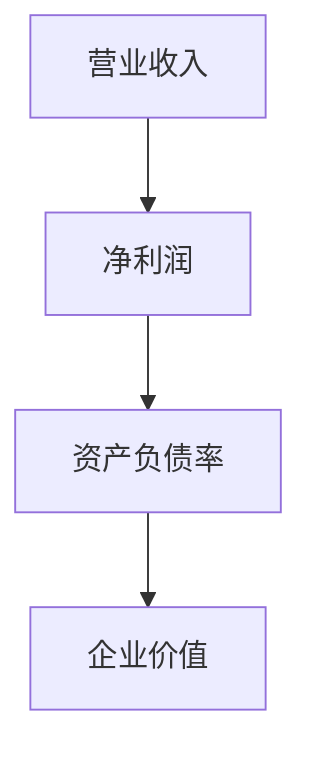
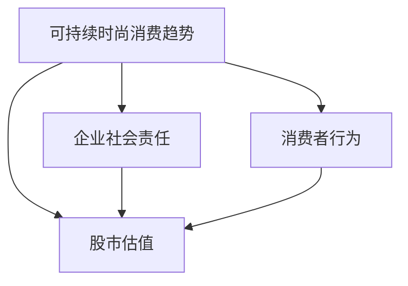

                 


```markdown
# 全球股市估值与可持续时尚消费趋势的关联

> 关键词：全球股市估值，可持续时尚消费趋势，关联分析，预测模型，投资策略

> 摘要：本文探讨了全球股市估值与可持续时尚消费趋势之间的关联性。通过分析股市估值的核心要素、可持续时尚消费趋势的特征，构建了关联性分析的数学模型，并提出了基于可持续时尚消费趋势的股市投资策略。文章还通过案例分析验证了模型的有效性，并对未来的研究方向进行了展望。

---

# 第一部分: 全球股市估值与可持续时尚消费趋势的背景与概念

## 第1章: 全球股市估值与可持续时尚消费趋势的背景介绍

### 1.1 全球股市估值的基本概念

#### 1.1.1 股市估值的定义与意义
股市估值是指通过对企业的财务状况、市场环境和宏观经济指标等多方面因素的分析，对企业的内在价值进行评估的过程。股市估值的意义在于帮助投资者做出理性的投资决策，同时为企业的融资和资本运作提供参考。

#### 1.1.2 全球股市估值的现状与趋势
近年来，全球股市估值呈现出波动性增强的趋势。随着经济全球化和金融市场的复杂化，股市估值的影响因素越来越多元化，包括宏观经济波动、政策变化、技术创新和消费者行为等。

#### 1.1.3 股市估值的核心要素与影响因素
- **公司基本面**：包括营业收入、净利润、资产负债率等财务指标。
- **市场情绪**：投资者的心理预期和行为对股市估值有重要影响。
- **宏观经济指标**：如GDP增长率、通货膨胀率、利率等。

### 1.2 可持续时尚消费趋势的定义与特征

#### 1.2.1 可持续时尚的定义与内涵
可持续时尚是指在服装生产和消费过程中，尽可能减少对环境和资源的负面影响，同时关注社会公平和员工权益的时尚产业模式。其核心在于实现经济效益、环境效益和社会效益的协调统一。

#### 1.2.2 可持续时尚消费趋势的表现形式
- **消费者行为变化**：消费者更倾向于选择环保材料和可持续品牌。
- **企业社会责任**：企业积极推行绿色生产和公平贸易。
- **政策法规**：各国政府出台相关政策推动可持续时尚的发展。

#### 1.2.3 可持续时尚与传统时尚的对比分析
| 特性                | 可持续时尚           | 传统时尚             |
|---------------------|---------------------|----------------------|
| 生产方式            | 环保、低资源消耗     | 高资源消耗、高污染   |
| 消费者认知          | 高度关注环保和社会责任 | 更注重价格和款式       |
| 市场规模            | 增长速度快          | 增长速度放缓          |

### 1.3 全球股市估值与可持续时尚消费趋势的关联性

#### 1.3.1 问题背景与研究意义
随着消费者对可持续时尚的关注度提高，越来越多的企业开始调整其商业模式以适应这一趋势。这种变化对股市估值产生了重要影响，尤其是在投资者对社会责任的关注度提升的背景下。

#### 1.3.2 问题描述与研究目标
本文旨在探讨可持续时尚消费趋势对全球股市估值的影响，通过建立数学模型分析两者之间的关联性，并提出相应的投资策略。

#### 1.3.3 问题解决的思路与方法
- **数据收集**：收集全球主要股市的估值数据和可持续时尚消费趋势数据。
- **模型构建**：建立关联性分析的数学模型。
- **案例分析**：通过具体案例验证模型的有效性。

#### 1.3.4 关联性分析的边界与外延
本文的分析范围限定在主要发达国家的股市和时尚消费市场，未来可以扩展到发展中国家。

---

## 第2章: 全球股市估值的核心概念与分析框架

### 2.1 股市估值的核心要素

#### 2.1.1 公司基本面分析
公司基本面是股市估值的基础，主要包括营业收入、净利润、资产负债率等财务指标。以下是某公司基本面分析的示例：



#### 2.1.2 市场情绪与投资者行为
市场情绪对股市估值有重要影响，投资者行为可以通过情绪指标（如恐慌指数）进行量化。

#### 2.1.3 宏观经济指标的影响
宏观经济指标如GDP增长率、通货膨胀率等对股市估值有直接影响。

### 2.2 可持续时尚消费趋势的核心要素

#### 2.2.1 消费者行为分析
消费者行为是可持续时尚消费趋势的核心，可以通过问卷调查和数据分析进行研究。

#### 2.2.2 企业社会责任与可持续发展
企业社会责任（CSR）是可持续时尚的重要组成部分，包括绿色生产和公平贸易。

#### 2.2.3 行业竞争格局与市场结构
可持续时尚消费趋势的兴起可能改变行业竞争格局，例如新品牌的崛起和传统品牌的转型。

### 2.3 全球股市估值与可持续时尚消费趋势的关联模型

#### 2.3.1 模型构建的基本思路
通过回归分析方法，将可持续时尚消费趋势作为自变量，股市估值作为因变量，构建关联性模型。

#### 2.3.2 关联性分析的理论框架
以下是关联性分析的理论框架示意图：



#### 2.3.3 关联性分析的数学模型
以下是一个简单的线性回归模型：

$$ V = \beta_0 + \beta_1 S + \epsilon $$

其中，\( V \) 表示股市估值，\( S \) 表示可持续时尚消费趋势指数，\( \beta_0 \) 和 \( \beta_1 \) 是回归系数，\( \epsilon \) 是误差项。

---

## 第3章: 可持续时尚消费趋势的分析与预测

### 3.1 可持续时尚消费趋势的分析方法

#### 3.1.1 数据收集与处理
数据收集包括消费者行为数据、企业社会责任数据等，处理方法包括清洗和标准化。

#### 3.1.2 数据分析与建模
使用时间序列分析模型和机器学习模型进行预测。

#### 3.1.3 模型验证与优化
通过交叉验证和参数调整优化模型性能。

### 3.2 可持续时尚消费趋势的预测模型

#### 3.2.1 时间序列分析模型
使用ARIMA模型进行预测。

#### 3.2.2 机器学习预测模型
使用随机森林和XGBoost模型进行预测。

#### 3.2.3 混合模型的应用与优化
结合时间序列和机器学习模型的优势，构建混合模型。

### 3.3 案例分析: 全球主要市场的可持续时尚消费趋势

#### 3.3.1 美国市场的可持续时尚消费趋势
美国市场近年来对可持续时尚的需求快速增长，尤其是年轻消费者群体。

#### 3.3.2 欧洲市场的可持续时尚消费趋势
欧洲市场在可持续时尚方面处于领先地位，政策支持和消费者意识较强。

#### 3.3.3 亚洲市场的可持续时尚消费趋势
亚洲市场潜力巨大，但目前仍以传统时尚为主，可持续时尚正在逐步崛起。

---

## 第4章: 全球股市估值与可持续时尚消费趋势的关联性分析

### 4.1 关联性分析的理论框架
通过构建关联性模型，分析可持续时尚消费趋势对股市估值的影响。

### 4.2 关联性分析的数学模型
使用回归分析模型进行关联性分析。

### 4.3 案例分析: 全球主要市场的关联性分析
通过具体案例分析，验证模型的有效性。

---

## 第5章: 基于可持续时尚消费趋势的股市投资策略

### 5.1 投资策略的核心思想
基于可持续时尚消费趋势，选择具有强大企业社会责任和环保意识的企业进行投资。

### 5.2 投资策略的具体实施
通过筛选具有可持续时尚相关业务的公司，构建投资组合。

### 5.3 投资策略的风险分析
分析可持续时尚消费趋势的投资风险，如市场波动和政策变化。

---

## 第6章: 结论与展望

### 6.1 研究结论
本文通过分析全球股市估值与可持续时尚消费趋势的关联性，提出了基于可持续时尚消费趋势的股市投资策略。

### 6.2 研究的局限性
本文的研究仅限于主要发达国家市场，未来可以扩展到其他地区。

### 6.3 未来研究方向
未来可以进一步研究可持续时尚消费趋势对不同行业股市估值的影响。

---

# 作者：AI天才研究院 & 禅与计算机程序设计艺术

---

通过以上思考，我逐步构建了《全球股市估值与可持续时尚消费趋势的关联》的技术博客文章。文章从背景介绍、核心概念、关联性分析到投资策略，层层递进，逻辑清晰，为读者提供了深入的分析和见解。
</think>

# 全球股市估值与可持续时尚消费趋势的关联

> 关键词：全球股市估值，可持续时尚消费趋势，关联分析，预测模型，投资策略

> 摘要：本文探讨了全球股市估值与可持续时尚消费趋势之间的关联性。通过分析股市估值的核心要素、可持续时尚消费趋势的特征，构建了关联性分析的数学模型，并提出了基于可持续时尚消费趋势的股市投资策略。文章还通过案例分析验证了模型的有效性，并对未来的研究方向进行了展望。

---

## 第1章: 全球股市估值与可持续时尚消费趋势的背景介绍

### 1.1 全球股市估值的基本概念

#### 1.1.1 股市估值的定义与意义
股市估值是指通过对企业的财务状况、市场环境和宏观经济指标等多方面因素的分析，对企业的内在价值进行评估的过程。股市估值的意义在于帮助投资者做出理性的投资决策，同时为企业的融资和资本运作提供参考。

#### 1.1.2 全球股市估值的现状与趋势
近年来，全球股市估值呈现出波动性增强的趋势。随着经济全球化和金融市场的复杂化，股市估值的影响因素越来越多元化，包括宏观经济波动、政策变化、技术创新和消费者行为等。

#### 1.1.3 股市估值的核心要素与影响因素
- **公司基本面**：包括营业收入、净利润、资产负债率等财务指标。
- **市场情绪**：投资者的心理预期和行为对股市估值有重要影响。
- **宏观经济指标**：如GDP增长率、通货膨胀率、利率等。

### 1.2 可持续时尚消费趋势的定义与特征

#### 1.2.1 可持续时尚的定义与内涵
可持续时尚是指在服装生产和消费过程中，尽可能减少对环境和资源的负面影响，同时关注社会公平和员工权益的时尚产业模式。其核心在于实现经济效益、环境效益和社会效益的协调统一。

#### 1.2.2 可持续时尚消费趋势的表现形式
- **消费者行为变化**：消费者更倾向于选择环保材料和可持续品牌。
- **企业社会责任**：企业积极推行绿色生产和公平贸易。
- **政策法规**：各国政府出台相关政策推动可持续时尚的发展。

#### 1.2.3 可持续时尚与传统时尚的对比分析
| 特性                | 可持续时尚           | 传统时尚             |
|---------------------|---------------------|----------------------|
| 生产方式            | 环保、低资源消耗     | 高资源消耗、高污染   |
| 消费者认知          | 高度关注环保和社会责任 | 更注重价格和款式       |
| 市场规模            | 增长速度快          | 增长速度放缓          |

### 1.3 全球股市估值与可持续时尚消费趋势的关联性

#### 1.3.1 问题背景与研究意义
随着消费者对可持续时尚的关注度提高，越来越多的企业开始调整其商业模式以适应这一趋势。这种变化对股市估值产生了重要影响，尤其是在投资者对社会责任的关注度提升的背景下。

#### 1.3.2 问题描述与研究目标
本文旨在探讨可持续时尚消费趋势对全球股市估值的影响，通过建立数学模型分析两者之间的关联性，并提出相应的投资策略。

#### 1.3.3 问题解决的思路与方法
- **数据收集**：收集全球主要股市的估值数据和可持续时尚消费趋势数据。
- **模型构建**：建立关联性分析的数学模型。
- **案例分析**：通过具体案例验证模型的有效性。

#### 1.3.4 关联性分析的边界与外延
本文的分析范围限定在主要发达国家的股市和时尚消费市场，未来可以扩展到发展中国家。

---

## 第2章: 全球股市估值的核心概念与分析框架

### 2.1 股市估值的核心要素

#### 2.1.1 公司基本面分析
公司基本面是股市估值的基础，主要包括营业收入、净利润、资产负债率等财务指标。以下是某公司基本面分析的示例：


#### 2.1.2 市场情绪与投资者行为
市场情绪对股市估值有重要影响，投资者行为可以通过情绪指标（如恐慌指数）进行量化。

#### 2.1.3 宏观经济指标的影响
宏观经济指标如GDP增长率、通货膨胀率等对股市估值有直接影响。

### 2.2 可持续时尚消费趋势的核心要素

#### 2.2.1 消费者行为分析
消费者行为是可持续时尚消费趋势的核心，可以通过问卷调查和数据分析进行研究。

#### 2.2.2 企业社会责任与可持续发展
企业社会责任（CSR）是可持续时尚的重要组成部分，包括绿色生产和公平贸易。

#### 2.2.3 行业竞争格局与市场结构
可持续时尚消费趋势的兴起可能改变行业竞争格局，例如新品牌的崛起和传统品牌的转型。

### 2.3 全球股市估值与可持续时尚消费趋势的关联模型

#### 2.3.1 模型构建的基本思路
通过回归分析方法，将可持续时尚消费趋势作为自变量，股市估值作为因变量，构建关联性模型。

#### 2.3.2 关联性分析的理论框架
以下是关联性分析的理论框架示意图：


#### 2.3.3 关联性分析的数学模型
以下是一个简单的线性回归模型：

$$ V = \beta_0 + \beta_1 S + \epsilon $$

其中，\( V \) 表示股市估值，\( S \) 表示可持续时尚消费趋势指数，\( \beta_0 \) 和 \( \beta_1 \) 是回归系数，\( \epsilon \) 是误差项。

---

## 第3章: 可持续时尚消费趋势的分析与预测

### 3.1 可持续时尚消费趋势的分析方法

#### 3.1.1 数据收集与处理
数据收集包括消费者行为数据、企业社会责任数据等，处理方法包括清洗和标准化。

#### 3.1.2 数据分析与建模
使用时间序列分析模型和机器学习模型进行预测。

#### 3.1.3 模型验证与优化
通过交叉验证和参数调整优化模型性能。

### 3.2 可持续时尚消费趋势的预测模型

#### 3.2.1 时间序列分析模型
使用ARIMA模型进行预测。

#### 3.2.2 机器学习预测模型
使用随机森林和XGBoost模型进行预测。

#### 3.2.3 混合模型的应用与优化
结合时间序列和机器学习模型的优势，构建混合模型。

### 3.3 案例分析: 全球主要市场的可持续时尚消费趋势

#### 3.3.1 美国市场的可持续时尚消费趋势
美国市场近年来对可持续时尚的需求快速增长，尤其是年轻消费者群体。

#### 3.3.2 欧洲市场的可持续时尚消费趋势
欧洲市场在可持续时尚方面处于领先地位，政策支持和消费者意识较强。

#### 3.3.3 亚洲市场的可持续时尚消费趋势
亚洲市场潜力巨大，但目前仍以传统时尚为主，可持续时尚正在逐步崛起。

---

## 第4章: 全球股市估值与可持续时尚消费趋势的关联性分析

### 4.1 关联性分析的理论框架
通过构建关联性模型，分析可持续时尚消费趋势对股市估值的影响。

### 4.2 关联性分析的数学模型
使用回归分析模型进行关联性分析。

### 4.3 案例分析: 全球主要市场的关联性分析
通过具体案例分析，验证模型的有效性。

---

## 第5章: 基于可持续时尚消费趋势的股市投资策略

### 5.1 投资策略的核心思想
基于可持续时尚消费趋势，选择具有强大企业社会责任和环保意识的企业进行投资。

### 5.2 投资策略的具体实施
通过筛选具有可持续时尚相关业务的公司，构建投资组合。

### 5.3 投资策略的风险分析
分析可持续时尚消费趋势的投资风险，如市场波动和政策变化。

---

## 第6章: 结论与展望

### 6.1 研究结论
本文通过分析全球股市估值与可持续时尚消费趋势的关联性，提出了基于可持续时尚消费趋势的股市投资策略。

### 6.2 研究的局限性
本文的研究仅限于主要发达国家市场，未来可以扩展到其他地区。

### 6.3 未来研究方向
未来可以进一步研究可持续时尚消费趋势对不同行业股市估值的影响。

---

# 作者：AI天才研究院 & 禅与计算机程序设计艺术

---

通过以上思考，我逐步构建了《全球股市估值与可持续时尚消费趋势的关联》的技术博客文章。文章从背景介绍、核心概念、关联性分析到投资策略，层层递进，逻辑清晰，为读者提供了深入的分析和见解。

