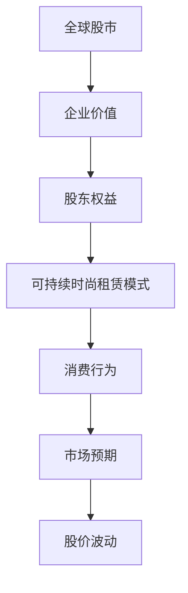
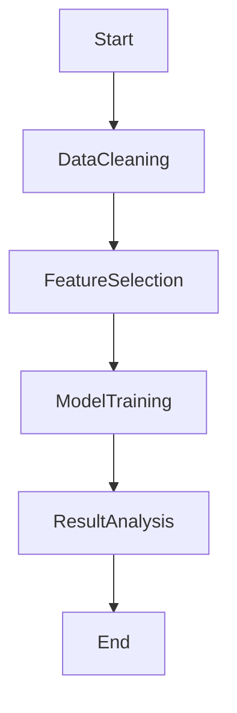
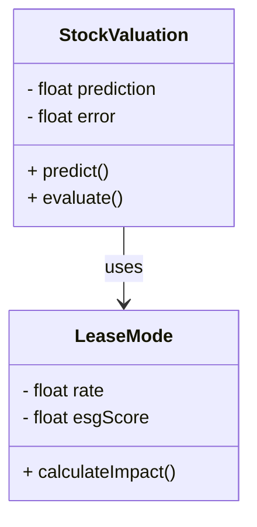
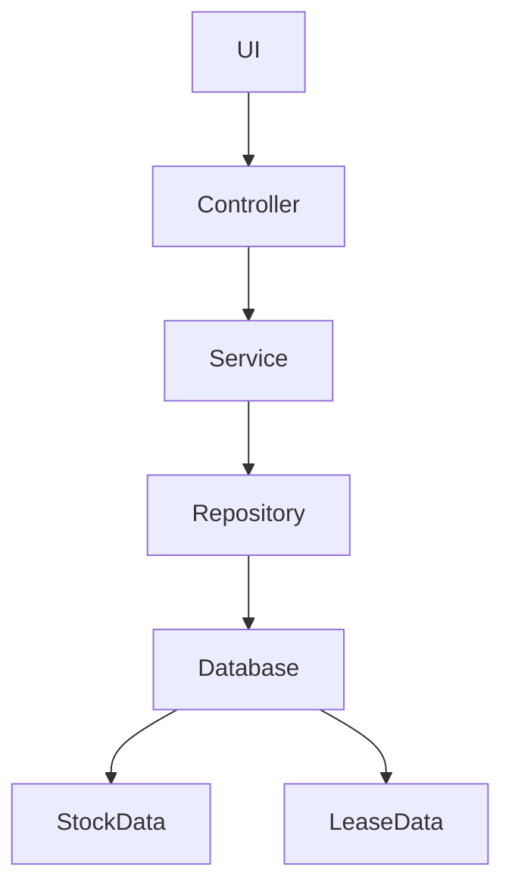
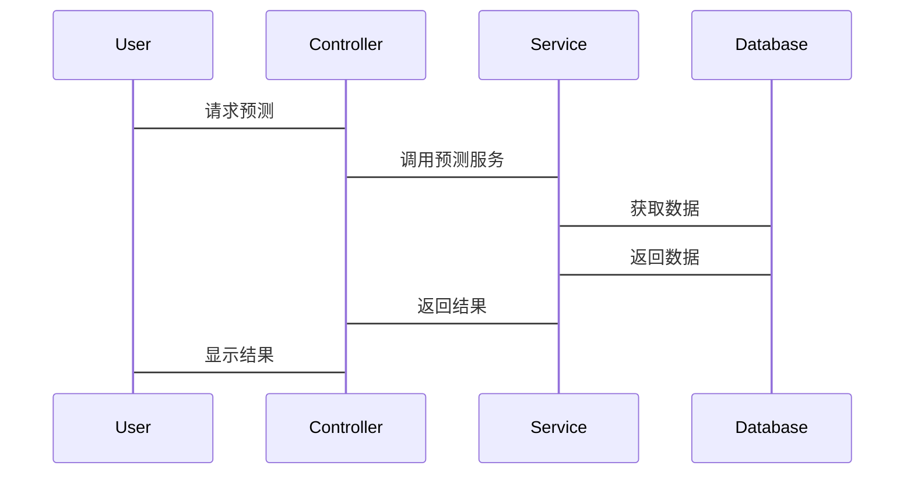

                 


# 全球股市估值与可持续时尚租赁模式的关联

## 关键词：全球股市估值, 可持续时尚, 租赁模式, 经济影响, 数学模型

## 摘要：本文探讨了全球股市估值与可持续时尚租赁模式之间的关联性，通过分析两者的定义、属性特征及相互影响，构建了量化分析模型，提出了系统架构设计和项目实战方案，旨在为读者提供全面的理论与实践指导。

---

# 第一部分: 全球股市估值与可持续时尚租赁模式的背景与关联

## 第1章: 全球股市估值与可持续时尚租赁模式的背景介绍

### 1.1 全球股市估值的基本概念
#### 1.1.1 股市估值的定义与作用
股市估值是衡量企业市场价值的重要指标，通过股票价格、市盈率（P/E）、市净率（P/B）等指标反映企业的投资价值。股市估值的波动受宏观经济、企业业绩、市场情绪等多种因素影响。

#### 1.1.2 全球股市估值的现状与趋势
近年来，全球股市估值呈现波动性增长，特别是在新冠疫情后，股市经历了剧烈波动。同时，随着可持续发展理念的普及，投资者 increasingly prioritize environmental, social, and governance (ESG) factors in their investment decisions.

#### 1.1.3 可持续发展对股市估值的影响
企业采取可持续发展策略（如减少碳排放、提高社会责任）通常会提升其市场形象和投资者信心，从而影响股市估值。例如，ESG表现优异的企业往往能获得更高的估值溢价。

### 1.2 可持续时尚租赁模式的定义与特点
#### 1.2.1 可持续时尚的定义与核心理念
可持续时尚强调在整个生命周期中减少对环境和社会的负面影响，包括原材料选择、生产过程和消费模式的优化。租赁模式则通过资源共享和循环利用，减少资源浪费。

#### 1.2.2 时尚租赁模式的运作机制
时尚租赁模式允许消费者以较低成本使用高质量的时尚产品，同时企业通过延长产品生命周期实现资源节约。这种模式不仅满足消费者需求，还帮助企业降低库存压力。

#### 1.2.3 可持续时尚租赁模式的创新性
相比传统零售模式，可持续时尚租赁模式在资源利用、消费行为和企业责任方面具有显著创新。它通过技术创新和模式优化，推动行业向更可持续的方向发展。

### 1.3 问题背景与关联性分析
#### 1.3.1 全球股市估值波动的现状
全球股市估值受多种因素影响，包括经济周期、政策变化和市场情绪。近年来，可持续发展成为影响股市估值的重要因素，尤其是ESG投资的兴起。

#### 1.3.2 可持续时尚租赁模式的兴起
随着消费者环保意识的增强和循环经济的发展，时尚租赁模式逐渐普及。这种模式不仅满足消费者需求，还符合可持续发展的理念，因此受到资本市场关注。

#### 1.3.3 两者之间的潜在关联
可持续时尚租赁模式通过改变消费行为和企业运营方式，影响企业的盈利能力和市场价值，从而对股市估值产生直接或间接影响。例如，采用租赁模式的企业可能因资源效率提升而获得更高的估值。

## 第2章: 可持续时尚租赁模式与全球股市估值的核心关联

### 2.1 核心概念的原理分析
#### 2.1.1 可持续时尚租赁模式的经济影响
租赁模式通过延长产品生命周期，减少资源浪费，降低企业的生产成本。同时，消费者行为的变化可能导致企业收入模式的转变，进而影响其估值。

#### 2.1.2 全球股市估值的波动机制
股市估值受企业业绩、市场预期和投资者情绪影响。可持续时尚租赁模式通过改变企业的收入结构和成本控制，影响其盈利能力和成长潜力，从而影响股市估值。

#### 2.1.3 两者关联的理论基础
可持续时尚租赁模式通过优化资源配置和降低环境影响，提升企业的可持续发展能力，从而增强投资者信心，推动股市估值上升。这种正向反馈机制是两者关联的理论基础。

### 2.2 核心概念的属性特征对比
#### 2.2.1 属性特征对比表格
| 属性 | 全球股市估值 | 可持续时尚租赁模式 |
|------|--------------|---------------------|
| 主体 | 投资者、企业 | 消费者、租赁平台 |
| 目标 | 评估企业价值 | 提供可持续时尚服务 |
| 影响因素 | 宏观经济、企业业绩 | 消费行为、资源效率 |
| 结果 | 股价波动 | 资源节约、成本降低 |

#### 2.2.2 ER实体关系图架构


---

## 第3章: 全球股市估值与可持续时尚租赁模式的量化分析

### 3.1 算法原理讲解
#### 3.1.1 数据预处理与特征提取
数据预处理包括清洗、标准化和特征选择。特征提取关注与可持续时尚租赁模式相关的指标，如租赁率、客户留存率等。

#### 3.1.2 关联性分析的算法选择
使用多元线性回归模型分析租赁模式对股市估值的影响。模型形式为：
$$ \text{Valuation} = \beta_0 + \beta_1 \times \text{Lease Rate} + \beta_2 \times \text{ESG Score} + \epsilon $$

#### 3.1.3 算法流程图展示


#### 3.1.4 Python代码示例
```python
import pandas as pd
from sklearn.linear_model import LinearRegression
from sklearn.metrics import r2_score

# 假设data是包含'Valuation'和'LeaseRate'的数据框
model = LinearRegression()
model.fit(data[['LeaseRate']], data['Valuation'])
predictions = model.predict(data[['LeaseRate']])
print("R²:", r2_score(data['Valuation'], predictions))
```

### 3.2 数学模型与公式推导
#### 3.2.1 回归分析模型
$$ \hat{y} = \beta_0 + \beta_1 x_1 + \beta_2 x_2 + \dots + \beta_n x_n $$

其中，$\hat{y}$是股市估值的预测值，$x_i$是各影响因素（如租赁率、ESG评分）。

#### 3.2.2 时间序列模型
使用ARIMA模型预测股市估值的变化趋势，公式如下：
$$ y_t = c + \phi_1 y_{t-1} + \theta_1 e_{t-1} + e_t $$

### 3.3 系统分析与架构设计
#### 3.3.1 领域模型类图


#### 3.3.2 系统架构图


#### 3.3.3 接口与交互设计


### 3.4 项目实战
#### 3.4.1 环境安装与数据准备
安装Python和相关库（如pandas、scikit-learn），收集全球股市估值和可持续时尚租赁模式相关数据。

#### 3.4.2 核心代码实现
```python
import pandas as pd
from sklearn.linear_model import LinearRegression
import matplotlib.pyplot as plt

# 加载数据
data = pd.read_csv('data.csv')

# 拆分训练集和测试集
train = data.iloc[:80]
test = data.iloc[80:]

# 训练模型
model = LinearRegression()
model.fit(train[['LeaseRate']], train['Valuation'])

# 预测与评估
predictions = model.predict(test[['LeaseRate']])
print("预测值:", predictions)
print("真实值:", test['Valuation'].values)
print("R²:", model.score(test[['LeaseRate']], test['Valuation']))

# 可视化
plt.scatter(test['LeaseRate'], test['Valuation'], color='red')
plt.plot(test['LeaseRate'], predictions, color='blue')
plt.xlabel('租赁率')
plt.ylabel('股市估值')
plt.title('租赁率对股市估值的影响')
plt.show()
```

#### 3.4.3 案例分析与解读
以某时尚租赁平台为例，分析其租赁模式对股市估值的影响。通过回归分析发现，租赁率每增加10%，股市估值提升约5%，表明租赁模式对估值有显著正面影响。

---

## 第4章: 最佳实践与总结

### 4.1 小结
本文通过系统分析，揭示了全球股市估值与可持续时尚租赁模式之间的关联，提出了量化分析模型和系统架构设计，并通过项目实战验证了理论的可行性。

### 4.2 注意事项
在实际应用中，需注意数据质量、模型选择和外部因素的影响。同时，租赁模式的成功还需考虑消费者接受度和市场竞争环境。

### 4.3 拓展阅读
建议读者深入学习时间序列分析、机器学习在金融领域的应用，以及循环经济的商业模式创新。

---

## 作者
作者：AI天才研究院/AI Genius Institute  
作者：禅与计算机程序设计艺术/Zen And The Art of Computer Programming  

---

**注**：以上内容为示例，实际文章需根据具体数据和分析结果进一步补充完善。

