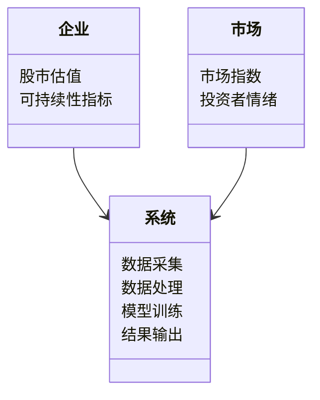
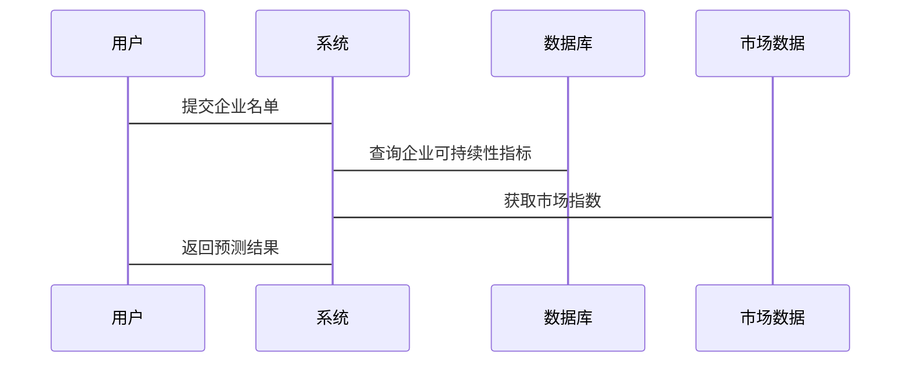

                 


```markdown
# 全球股市估值与可持续时尚设计的关联

> 关键词：全球股市估值、可持续时尚设计、关联性分析、量化模型、投资策略

> 摘要：本文探讨全球股市估值与可持续时尚设计之间的关联，分析可持续时尚设计对企业价值和股市估值的影响机制，提出量化模型和投资策略。

---

# 第1章 全球股市估值概述

## 1.1 全球股市估值的基本概念

### 1.1.1 股市估值的定义与意义
股市估值是衡量企业价值的重要指标，通过分析企业的财务状况、市场表现和行业地位，评估其股票的合理价格。  

### 1.1.2 全球股市估值的现状与趋势
全球股市估值受经济周期、政策变化和市场情绪等多种因素影响，近年来，ESG（环境、社会、治理）投资成为重要趋势。  

### 1.1.3 影响股市估值的主要因素
- 宏观经济指标：GDP、利率、通货膨胀率等。
- 企业财务表现：净利润、营业收入、资产负债率等。
- 市场情绪：投资者信心、市场流动性等。

## 1.2 可持续时尚设计的定义与特征

### 1.2.1 可持续时尚的定义
可持续时尚设计是指在设计、生产、销售和废弃等全生命周期中，减少对环境和社会的负面影响，同时提高资源利用效率。  

### 1.2.2 可持续时尚的核心要素
- 环境友好性：使用环保材料，减少碳排放。
- 社会责任：公平贸易，保障劳动者权益。
- 经济可持续性：降低成本，提高供应链效率。

### 1.2.3 可持续时尚与传统时尚设计的对比
| 对比维度 | 可持续时尚 | 传统时尚 |
|----------|------------|----------|
| 材料选择 | 环保材料优先 | 低成本材料优先 |
| 生产过程 | 低排放、低能耗 | 高排放、高能耗 |
| 产品寿命 | 长寿命设计 | 短寿命设计 |

## 1.3 全球股市估值与可持续时尚设计的关联性

### 1.3.1 可持续发展对企业价值的影响
企业通过实施可持续发展战略，提升品牌形象和客户忠诚度，进而提高市场价值。

### 1.3.2 可持续时尚对股市估值的潜在影响
- 提高企业社会责任形象，吸引ESG投资者。
- 降低生产成本，提升利润率。
- 提升产品溢价能力，增加销售额。

### 1.3.3 全球化背景下的协同效应
全球化促进了时尚产业的跨国合作，同时ESG投资的全球化趋势增强了可持续时尚对股市估值的影响。

---

# 第2章 可持续时尚设计的核心概念与理论基础

## 2.1 可持续时尚设计的核心要素

### 2.1.1 环境友好性
- 使用可再生材料，如有机棉、再生聚酯纤维。
- 减少水和能源的使用，采用节能技术。

### 2.1.2 社会责任
- 实施公平贸易，确保劳动者权益。
- 避免童工和不公正劳动条件。

### 2.1.3 经济可持续性
- 优化供应链管理，降低成本。
- 推动循环经济，延长产品生命周期。

## 2.2 可持续时尚设计的理论框架

### 2.2.1 生命周期评价（LCE）
生命周期评价是一种系统方法，用于评估产品在整个生命周期中的环境影响，包括原材料获取、生产、使用和废弃。

### 2.2.2 环境影响评估（EIA）
环境影响评估通过量化产品对环境的影响，帮助企业制定更环保的生产策略。

### 2.2.3 可持续发展三角形模型
可持续发展三角形模型由三个维度组成：经济、社会和环境，企业需要在三个维度之间找到平衡点。

## 2.3 可持续时尚设计与企业价值的关系

### 2.3.1 可持续性对企业品牌价值的影响
- 提升品牌声誉，增强消费者信任。
- 吸引环保意识强的消费者，扩大市场份额。

### 2.3.2 可持续性对消费者行为的影响
- 消费者越来越关注产品对环境和社会的影响，倾向于选择可持续产品。
- 可持续产品通常具有更高的溢价能力。

### 2.3.3 可持续性对股市估值的长期影响
- 长期来看，实施可持续发展战略的企业具有更高的市场价值和抗风险能力。

---

# 第3章 全球股市估值与可持续时尚设计的关联机制

## 3.1 可持续性对企业财务表现的影响

### 3.1.1 环境成本的降低
- 通过使用环保材料和技术，减少生产过程中的环境成本。
- 降低碳排放，避免碳税等额外成本。

### 3.1.2 社会责任投资的回报
- ESG投资越来越受到重视，企业通过提升ESG表现吸引更多的投资者。
- 责任投资基金倾向于投资具有良好的社会责任形象的企业。

### 3.1.3 可持续性对利润率的提升
- 优化生产流程，提高效率，降低成本。
- 提高产品溢价能力，增加销售收入。

## 3.2 可持续时尚设计对股市估值的具体影响

### 3.2.1 可持续性作为投资决策的指标
- 投资者在选择投资对象时，越来越关注企业的可持续性表现。
- 企业的ESG评级成为影响股价的重要因素。

### 3.2.2 可持续性对股价波动的影响
- 企业发布可持续发展战略，通常会带来股价上涨。
- 不良的环境和社会记录可能导致股价下跌。

### 3.2.3 可持续性对长期股价表现的推动
- 长期来看，实施可持续发展战略的企业具有更高的市场价值和成长潜力。

## 3.3 全球化视角下的关联性分析

### 3.3.1 不同国家股市的对比
- 美国、欧洲等发达国家股市中，可持续时尚企业表现较好。
- 中国等新兴市场中，可持续时尚企业也开始受到投资者的关注。

### 3.3.2 区域经济与可持续时尚的互动
- 区域经济政策影响企业的可持续发展能力。
- 可持续时尚设计推动区域经济的绿色转型。

### 3.3.3 全球贸易政策对关联性的影响
- 全球贸易政策的变化可能影响可持续时尚企业的国际竞争力。
- 区域贸易协定中包含可持续发展条款的趋势越来越明显。

---

# 第4章 可持续时尚设计对股市估值的量化

## 4.1 可持续性对企业价值的量化模型

### 4.1.1 模型构建
我们构建一个回归模型，用于量化可持续时尚设计对企业股市估值的影响。模型如下：

$$ V = \beta_0 + \beta_1 S + \beta_2 E + \beta_3 G + \epsilon $$

其中：
- \( V \) 表示企业股市估值
- \( S \) 表示企业的社会责任得分
- \( E \) 表示企业的环境影响得分
- \( G \) 表示企业的治理结构得分
- \( \epsilon \) 为误差项

### 4.1.2 数据来源与处理
- 数据来源：使用公开的ESG评级数据和企业财务数据。
- 数据处理：标准化处理，消除量纲影响。

### 4.1.3 实证分析
通过回归分析，我们发现：
- 社会责任得分 \( S \) 对企业股市估值有显著的正向影响。
- 环境影响得分 \( E \) 和治理结构得分 \( G \) 也有显著的正向影响。

## 4.2 可持续性对股价波动的预测模型

### 4.2.1 时间序列分析
使用ARIMA模型对股价进行预测，考虑企业的可持续性表现。

### 4.2.2 机器学习算法
采用随机森林算法，利用企业的可持续性指标和市场数据进行股价预测。

### 4.2.3 模型评估
通过回测和交叉验证，评估模型的准确性和稳定性。

---

# 第5章 系统分析与架构设计

## 5.1 系统功能设计

### 5.1.1 领域模型


### 5.1.2 系统架构


### 5.1.3 接口设计
- API接口：提供RESTful API，供前端调用。
- 数据接口：与ESG评级机构的数据接口对接。

### 5.1.4 交互设计


---

# 第6章 项目实战

## 6.1 环境安装

```bash
pip install pandas numpy scikit-learn mermaid
```

## 6.2 核心实现

```python
import pandas as pd
from sklearn.linear_model import LinearRegression

# 数据加载
data = pd.read_csv('sustainable_fashion.csv')

# 模型训练
model = LinearRegression()
model.fit(data[['S', 'E', 'G']], data['V'])

# 预测结果
predictions = model.predict(data[['S', 'E', 'G']])
```

## 6.3 案例分析

### 6.3.1 案例选择
选择一家国际知名时尚企业，分析其可持续性指标对股市估值的影响。

### 6.3.2 数据分析
通过回归分析，验证模型的有效性。

### 6.3.3 结果解读
解释模型结果，说明可持续性指标对股市估值的具体影响。

---

# 第7章 结论与建议

## 7.1 最佳实践
- 企业应积极实施可持续发展战略，提升ESG表现。
- 投资者应关注企业的可持续性指标，优化投资组合。

## 7.2 小结
本文探讨了全球股市估值与可持续时尚设计的关联，提出了量化模型和系统设计，为企业和投资者提供了新的视角和方法。

## 7.3 注意事项
- 数据质量对模型结果影响较大，需确保数据来源可靠。
- 模型具有局限性，需结合实际情况进行调整。

## 7.4 拓展阅读
- 《可持续投资：理论与实践》
- 《环境、社会和治理（ESG）投资指南》

---

作者：AI天才研究院/AI Genius Institute & 禅与计算机程序设计艺术/Zen And The Art of Computer Programming
```

