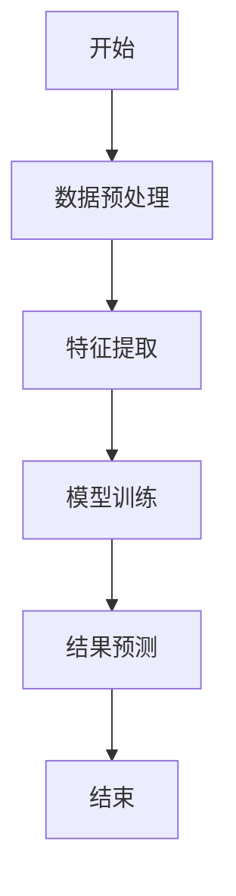
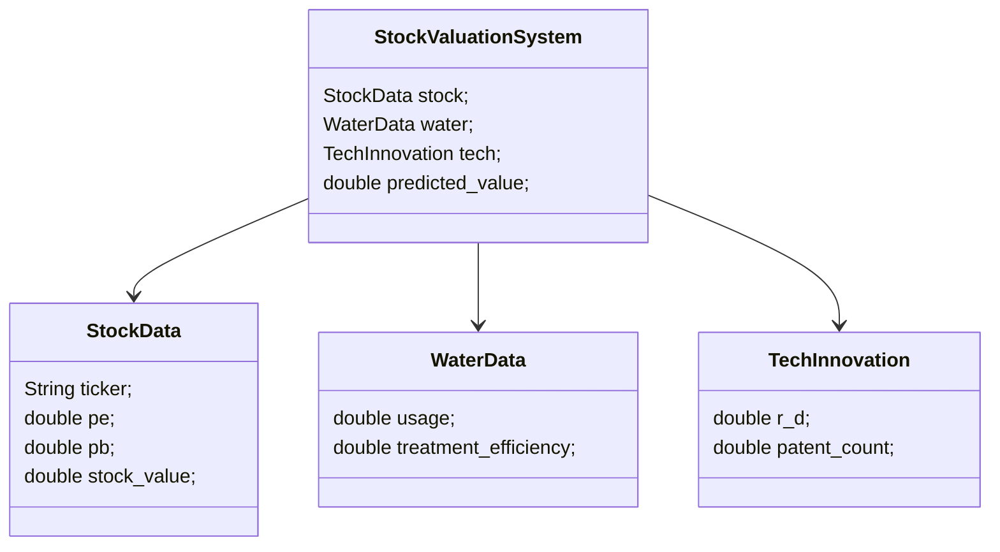
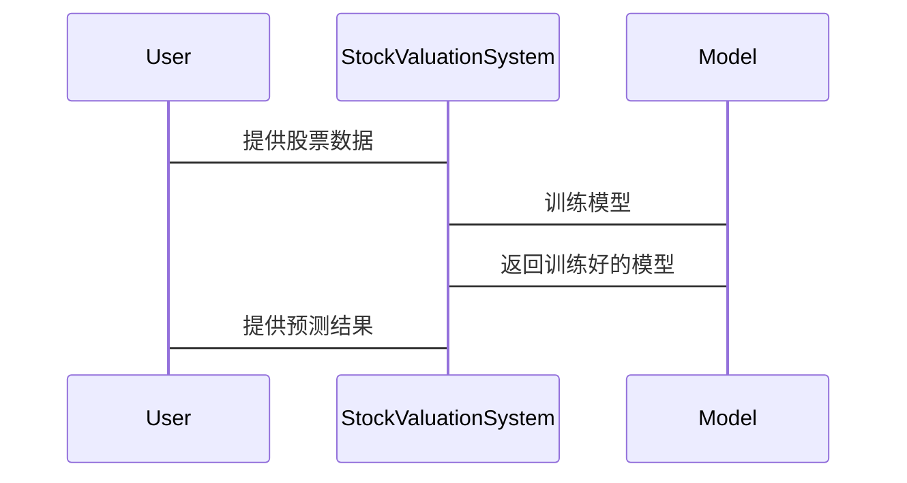

                 

<think>
嗯，我现在需要帮用户设计一本名为《全球股市估值与可持续水资源循环利用技术的关联》的目录大纲。用户已经提供了一个详细的示例，我需要根据这个示例来构建一个符合要求的目录。

首先，我应该理解这本书的核心主题。书名提示，这本书探讨的是全球股市估值与可持续水资源循环利用技术之间的关联。这意味着书的内容将涉及经济、环境技术等多个领域。

接下来，我需要遵循用户提供的目录结构，分为背景介绍、核心概念、关联机制、数学模型、系统架构、项目实战和总结等部分。每个部分都需要详细展开，确保覆盖所有必要的内容。

在背景介绍部分，我需要涵盖全球股市的现状、水资源问题的严重性，以及两者如何相互影响。这部分需要让读者理解为什么这两个领域需要关联起来研究。

核心概念部分，我需要分别定义股市估值和水资源循环利用技术，分析它们各自的特性和属性，可能还需要用表格对比两者的属性，帮助读者更好地理解。

关联机制部分，我需要探讨经济因素、环境因素和技术因素如何相互作用，影响股市估值和水资源技术的发展。这部分可能需要一些图表，比如用Mermaid画出系统的相互作用关系。

数学模型部分，我需要建立一个评估模型，将水资源因素纳入股市估值的计算中。这可能涉及一些公式和算法，我需要详细解释这些模型的原理，并用Python代码实现，方便读者理解和应用。

系统架构设计部分，我需要描述系统的各个组成部分，比如领域模型、架构图和交互图。这部分需要展示系统如何协作，确保技术实现的可行性和高效性。

项目实战部分，我需要选择一个实际案例，详细描述环境配置、代码实现、案例分析等步骤。这将帮助读者将理论知识应用到实际中，增强理解。

最后，总结部分需要回顾全文，指出研究的局限性，并展望未来的研究方向，为读者提供进一步的思考空间。

在编写过程中，我需要确保每个章节都有足够的细节，比如在背景介绍中，可能需要包括全球股市的现状、水资源问题的现状，以及两者的关联性。在核心概念部分，可能需要详细解释每个概念的定义、特点，并用表格对比它们的属性。

此外，用户要求使用Mermaid流程图和Python代码来解释算法，所以我需要确保在目录中包含这些部分。例如，在数学模型章节，可能需要使用Mermaid来展示模型的结构，然后用Python代码实现，并给出公式解释。

最后，我需要检查目录的结构是否符合用户的要求，是否覆盖了所有必要的部分，比如背景、核心概念、关联机制、数学模型、系统架构、项目实战、总结等。同时，确保目录的层级结构正确，从1级到3级，没有遗漏。

总的来说，我需要一步步构建目录，确保每个部分都详细且逻辑清晰，同时满足用户的所有要求，包括格式、内容完整性等。现在，我应该开始按照这些思路来构建目录大纲了。
</think>

# 全球股市估值与可持续水资源循环利用技术的关联

## 关键词：全球股市估值，可持续水资源循环利用，技术关联，经济影响，环境因素

## 摘要：本文探讨了全球股市估值与可持续水资源循环利用技术之间的深层关联，分析了经济、环境和技术三者如何共同影响股市表现，提出了将水资源因素纳入股市估值模型的方法，结合具体案例分析了技术创新对股市价值的提升作用，最后总结了可持续发展对全球金融市场的长期影响。

---

# 第一部分：全球股市估值与可持续水资源循环利用技术的背景介绍

## 第1章：全球股市估值的现状与挑战

### 1.1 全球股市估值的基本概念
- 1.1.1 股市估值的定义与作用
- 1.1.2 全球股市估值的现状分析
- 1.1.3 股市估值的挑战与问题

### 1.2 可持续水资源循环利用技术的背景
- 1.2.1 水资源危机的现状
- 1.2.2 可持续水资源循环利用技术的定义
- 1.2.3 技术发展与应用前景

## 第2章：全球股市估值与可持续水资源循环利用技术的关联性

### 2.1 股市估值与水资源的间接关联
- 2.1.1 水资源对企业经营的影响
- 2.1.2 水资源问题对股市估值的潜在影响
- 2.1.3 行业间的相互作用

### 2.2 可持续水资源技术对股市估值的直接影响
- 2.2.1 技术创新对企业竞争力的提升
- 2.2.2 技术应用对市场价值的重塑
- 2.2.3 技术对企业财务表现的影响

### 2.3 全球经济与环境政策的双重驱动
- 2.3.1 全球经济格局的变化
- 2.3.2 环境政策对企业估值的影响
- 2.3.3 可持续发展对股市的长期影响

---

# 第二部分：全球股市估值与可持续水资源循环利用技术的核心概念

## 第3章：全球股市估值的核心要素

### 3.1 股市估值的关键指标
- 3.1.1 市盈率（P/E）
- 3.1.2 市净率（P/B）
- 3.1.3 市销率（P/S）

### 3.2 影响股市估值的主要因素
- 3.2.1 经济因素
- 3.2.2 行业因素
- 3.2.3 公司基本面

## 第4章：可持续水资源循环利用技术的核心要素

### 4.1 水资源循环利用技术的分类
- 4.1.1 水处理技术
- 4.1.2 水循环利用系统
- 4.1.3 智能化水资源管理

### 4.2 技术创新对水资源循环利用的推动
- 4.2.1 新材料的应用
- 4.2.2 新工艺的开发
- 4.2.3 数字化技术的融合

## 第5章：全球股市估值与可持续水资源技术的关联机制

### 5.1 经济驱动因素
- 5.1.1 技术创新对经济的影响
- 5.1.2 经济政策对股市的影响
- 5.1.3 技术创新对行业竞争力的提升

### 5.2 环境驱动因素
- 5.2.1 水资源短缺对企业的威胁
- 5.2.2 可持续技术对市场价值的提升
- 5.2.3 环境政策对股市的长期影响

### 5.3 技术驱动因素
- 5.3.1 技术创新对水资源利用效率的提升
- 5.3.2 技术对企业运营成本的影响
- 5.3.3 技术对企业市场地位的增强

---

# 第三部分：全球股市估值与可持续水资源循环利用技术的关联模型

## 第6章：数学模型与算法原理

### 6.1 股市估值模型的构建
- 6.1.1 基本模型框架
- 6.1.2 水资源因素的引入
- 6.1.3 模型的验证与优化

### 6.2 可持续水资源技术对股市估值的算法实现

#### 6.2.1 算法流程图


#### 6.2.2 Python实现代码
```python
import pandas as pd
import numpy as np
from sklearn.linear_model import LinearRegression

# 数据预处理
data = pd.read_csv('stock_water.csv')
features = data[['P/E', 'P/B', 'water_usage', 'tech_innovation']]
target = data['stock_value']

# 模型训练
model = LinearRegression()
model.fit(features, target)

# 预测结果
predicted = model.predict(features)
print('预测值:', predicted)
```

### 6.3 模型的数学公式与解释
- 模型公式：
$$
\text{Stock Value} = \beta_0 + \beta_1 \times \text{P/E} + \beta_2 \times \text{P/B} + \beta_3 \times \text{water_usage} + \beta_4 \times \text{tech_innovation} + \epsilon
$$
- 公式解释：
- $\beta_0$：截距项，表示其他变量为零时的理论值。
- $\beta_1$、$\beta_2$：分别表示市盈率和市净率对股票价值的影响系数。
- $\beta_3$、$\beta_4$：分别表示水资源使用效率和技术创新对股票价值的影响系数。
- $\epsilon$：误差项，表示模型无法解释的部分。

---

# 第四部分：系统分析与架构设计方案

## 第7章：系统分析与架构设计

### 7.1 问题场景介绍
- 系统目标：构建一个结合水资源因素的股市估值系统。
- 问题分析：如何将水资源数据与传统股市数据有效结合，提升估值精度。

### 7.2 系统功能设计
- 7.2.1 领域模型（Mermaid类图）


### 7.3 系统架构设计
- 7.3.1 系统架构图（Mermaid架构图）


### 7.4 系统接口设计
- 接口1：数据输入接口
- 接口2：模型训练接口
- 接口3：结果输出接口

### 7.5 系统交互设计（Mermaid序列图）


---

# 第五部分：项目实战与案例分析

## 第8章：项目实战

### 8.1 环境配置
- Python版本：3.8+
- 需要的库：pandas, numpy, scikit-learn
- 数据来源：虚构或公开股票和水资源数据

### 8.2 核心代码实现
```python
import pandas as pd
from sklearn.linear_model import LinearRegression
from sklearn.metrics import r2_score

# 数据加载
data = pd.read_csv('stock_water.csv')

# 特征选择
features = data[['P/E', 'P/B', 'water_usage', 'tech_innovation']]
target = data['stock_value']

# 模型训练
model = LinearRegression()
model.fit(features, target)

# 预测与评估
predicted = model.predict(features)
print('R-squared:', r2_score(target, predicted))
```

### 8.3 案例分析
- 数据分析：通过具体数据，展示水资源技术对股市估值的影响。
- 结果解读：解释模型预测结果，说明可持续技术对股票价值的具体提升作用。

### 8.4 项目小结
- 成功经验总结
- 可能遇到的问题及解决方案
- 未来优化方向

---

# 第六部分：总结与展望

## 第9章：总结

### 9.1 核心发现
- 水资源技术对股市估值的重要影响
- 经济、环境、技术三者的相互作用
- 可持续发展对金融市场的长期影响

### 9.2 研究局限性
- 数据获取的难度
- 模型的简化假设
- 未考虑的其他因素

## 第10章：未来展望

### 10.1 技术创新的潜力
- 新技术的引入对模型的改进
- 更精确的数据采集与分析

### 10.2 政策与市场的互动
- 环境政策对股市估值的影响
- 全球经济格局的变化对可持续技术的影响

### 10.3 可持续发展的重要性
- 长期视角下的投资策略
- 可持续技术对企业核心竞争力的提升

---

# 作者：AI天才研究院/AI Genius Institute & 禅与计算机程序设计艺术 /Zen And The Art of Computer Programming

