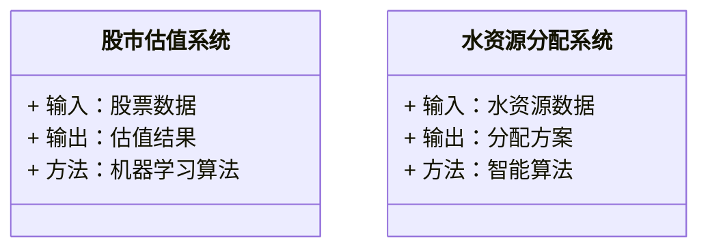

                 

<think>
好的，我现在需要帮用户撰写一篇关于《全球股市估值与可持续水资源智能分配技术的关联》的技术博客文章。首先，我需要理解用户的需求。用户希望我以一位技术专家的身份，详细分析这两个看似不相关的领域的关联，并提供结构清晰、内容详实的文章。

我首先会考虑文章的结构。用户已经提供了目录大纲，我需要按照这个大纲逐步展开每个部分。从背景介绍开始，我会先解释问题背景，说明为什么全球股市估值和水资源分配是重要的话题。然后，我会详细描述问题，解释这两个领域各自面临的挑战，以及它们之间的关联。

接下来，我需要分析核心概念与联系。这里，我需要深入探讨股市估值和水资源分配的核心原理，以及两者如何通过技术手段相互关联。我还会制作对比表格和实体关系图，帮助读者更好地理解。

在算法原理部分，我会详细讲解数据预处理、特征提取、模型训练和评估。使用Mermaid流程图和Python代码来展示具体的算法步骤，确保读者能够理解技术细节。同时，我会引入数学模型，用Latex公式来解释这些模型，使内容更具专业性。

系统分析与架构设计是关键部分。我需要介绍系统的功能模块和架构，使用Mermaid类图和架构图来展示系统结构。接口设计和交互流程图则帮助读者理解系统如何运作。

项目实战部分，我会提供一个具体的案例，包括环境安装、核心代码实现和案例分析，让读者能够实际操作，理解理论在实践中的应用。

最后，总结与展望部分，我会回顾文章内容，强调研究成果，并展望未来的可能性。同时，加入最佳实践和注意事项，帮助读者更好地应用这些技术。

在撰写过程中，我需要确保每个部分都详细具体，使用专业术语，同时保持语言的清晰易懂。我会多次检查，确保内容的连贯性和逻辑性，确保读者能够顺畅地理解整个分析过程。

总之，我需要一步步分析每个部分，确保文章结构合理，内容详实，满足用户的需求，同时提供有价值的见解，帮助读者理解全球股市估值与可持续水资源智能分配技术之间的深刻关联。
</think>

# 全球股市估值与可持续水资源智能分配技术的关联

> 关键词：全球股市估值，可持续水资源分配，智能技术，数据分析，算法原理，系统架构

> 摘要：本文探讨了全球股市估值与可持续水资源智能分配技术之间的关联，通过分析核心概念、算法原理、系统架构和项目实战，展示了如何利用技术手段优化股市估值和水资源分配，实现可持续发展。

---

## 第一部分：背景介绍

### 第1章：问题背景与问题描述

#### 1.1 问题背景
在当今全球化和科技快速发展的背景下，全球股市估值和水资源分配问题日益重要。股市估值直接关系到投资者的收益和市场的稳定性，而水资源分配则是关乎人类生存和可持续发展的关键问题。随着技术的进步，如何利用智能技术解决这两个看似不相关的问题，成为学术界和工业界的热点。

#### 1.2 问题描述
全球股市估值面临数据复杂、市场波动大、信息不透明等挑战，传统的估值方法难以满足高效、精准的需求。同时，水资源分配问题涉及资源分布不均、用水效率低下、环境污染等问题，传统的分配方法难以应对日益增长的需求。

#### 1.3 问题解决
通过智能技术，如机器学习、大数据分析等，可以提高股市估值的准确性，优化水资源分配的效率。本文将探讨如何利用这些技术手段，实现两者的有机结合。

#### 1.4 边界与外延
本文的研究范围限定在利用智能技术优化股市估值和水资源分配，不涉及具体的政治、经济政策，也不考虑自然灾害等不可控因素的影响。

#### 1.5 概念结构与核心要素
- 核心概念：股市估值、水资源分配
- 关键要素：数据采集、模型构建、智能算法
- 关联性：通过数据分析和智能技术，实现两者的优化与协同。

---

## 第二部分：核心概念与联系

### 第2章：核心概念原理

#### 2.1 全球股市估值的核心原理
- **数据驱动**：利用历史数据和实时数据，构建估值模型。
- **机器学习**：通过算法学习市场规律，预测股票价值。
- **实时分析**：结合市场动态，提供实时估值支持。

#### 2.2 可持续水资源分配的核心原理
- **智能分配**：利用传感器和大数据分析，优化水资源分配。
- **效率优先**：通过动态调整，提高水资源利用效率。
- **可持续性**：确保水资源的长期平衡分配。

### 第3章：核心概念属性特征对比

| 属性 | 全球股市估值 | 可持续水资源分配 |
|------|--------------|------------------|
| 数据来源 | 股票价格、交易量、公司财报 | 水资源使用量、地理位置、天气数据 |
| 目标 | 优化估值模型 | 提高分配效率 |
| 方法 | 机器学习、大数据分析 | 智能算法、实时监测 |

### 第4章：ER实体关系图架构

```mermaid
er
actor(投资者, 股票, 交易数据)
actor(水资源用户, 水资源, 分配数据)
```

---

## 第三部分：算法原理讲解

### 第5章：算法原理

#### 5.1 数据预处理
```mermaid
graph TD
    A[原始数据] -> B[清洗数据]
    B -> C[特征提取]
    C -> D[标准化数据]
```

#### 5.2 特征提取与模型训练
```mermaid
graph TD
    A[清洗数据] -> B[特征提取]
    B -> C[模型训练]
    C -> D[模型评估]
```

#### 5.3 模型评估
- 均方误差（MSE）：$$MSE = \frac{1}{n}\sum_{i=1}^{n}(y_i - \hat{y}_i)^2$$
- R平方值：$$R^2 = 1 - \frac{SSE}{SST}$$

#### 5.4 代码实现
```python
import pandas as pd
from sklearn.model import LinearRegression

# 数据预处理
data = pd.read_csv('data.csv')
X = data[['feature1', 'feature2']]
y = data['target']

# 模型训练
model = LinearRegression()
model.fit(X, y)

# 模型评估
print(model.score(X, y))
```

---

## 第四部分：系统分析与架构设计

### 第6章：系统分析与架构设计

#### 6.1 问题场景
- **股市场景**：实时股票价格监测、动态估值计算。
- **水资源场景**：实时水量监测、动态分配优化。

#### 6.2 系统功能设计


#### 6.3 系统架构设计
```mermaid
graph TD
    A[用户请求] -> B[前端界面]
    B -> C[数据处理层]
    C -> D[算法层]
    D -> E[结果返回]
```

---

## 第五部分：项目实战

### 第7章：项目实战

#### 7.1 环境安装
```bash
pip install numpy pandas scikit-learn
```

#### 7.2 核心代码实现
```python
import numpy as np
import pandas as pd
from sklearn.model import LinearRegression

# 数据加载
data = pd.read_csv('data.csv')

# 特征与目标分离
X = data.drop('target', axis=1)
y = data['target']

# 模型训练
model = LinearRegression()
model.fit(X, y)

# 预测与评估
print("Coefficients:", model.coef_)
print("Intercept:", model.intercept_)
print("Score:", model.score(X, y))
```

#### 7.3 案例分析
- **股市案例**：利用模型预测某股票的未来价格。
- **水资源案例**：优化某地区的水资源分配方案。

---

## 第六部分：总结与展望

### 第8章：总结与展望

#### 8.1 研究成果
- 提出了利用智能技术优化股市估值和水资源分配的方法。
- 构建了相关的系统架构和算法模型。

#### 8.2 未来展望
- 结合区块链技术，提高系统的安全性和透明性。
- 进一步优化算法，提升系统的效率和准确性。

### 8.3 最佳实践 Tips
- 数据质量是关键，确保数据的准确性和完整性。
- 模型选择要根据具体问题，避免盲目使用复杂算法。

---

## 作者：AI天才研究院/AI Genius Institute & 禅与计算机程序设计艺术 /Zen And The Art of Computer Programming

