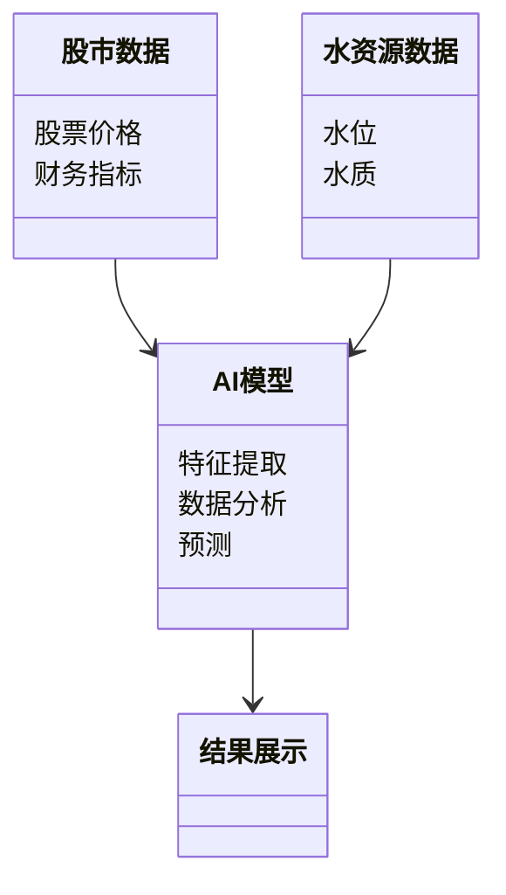
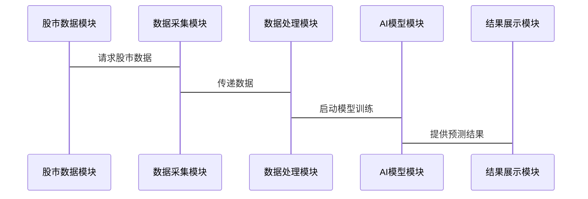

                 


---

# 全球股市估值与可持续水资源管理AI技术的关联

> 关键词：全球股市估值、可持续水资源管理、人工智能技术、机器学习算法、数据挖掘与分析、系统架构设计

> 摘要：本文探讨了人工智能技术在全球股市估值与可持续水资源管理领域的关联，分析了AI技术在数据挖掘、模型预测和系统优化中的应用，通过实际案例展示了AI如何帮助优化水资源管理并影响股市估值。

---

## 第一部分：全球股市估值与可持续水资源管理的背景与概念

### 第1章：全球股市估值与可持续水资源管理的背景

#### 1.1 全球股市估值的现状与挑战
##### 1.1.1 全球股市估值的基本概念
股市估值是指通过分析企业的财务数据、市场趋势和宏观经济指标，对股票价格进行评估的过程。常见的估值方法包括市盈率（P/E）、市净率（P/B）等。这些指标反映了市场的预期和企业的盈利能力。

##### 1.1.2 当前股市估值的主要挑战
- 市场波动性：股市受到多种因素影响，如经济政策、国际贸易、企业业绩等，导致估值的不确定性。
- 数据复杂性：海量数据的处理和分析需要高效的技术支持。
- 可持续性因素：随着环保意识的增强，企业的可持续发展能力成为影响股市估值的重要因素。

##### 1.1.3 可持续发展与股市估值的关联
企业的可持续发展能力，如水资源管理、碳排放控制等，逐渐成为投资者关注的重点。具备良好可持续性的企业通常能获得更高的估值，因为它们在长期发展中更具竞争力。

#### 1.2 可持续水资源管理的重要性
##### 1.2.1 水资源管理的基本概念
水资源管理是指通过合理的规划和调控，确保水资源的可持续利用，满足人类生活、生产和生态的需求。

##### 1.2.2 可持续水资源管理的核心要素
- 水资源保护：防止水污染，保护生态环境。
- 节水优化：提高用水效率，减少浪费。
- 水资源分配：合理分配水资源，确保各领域的需求得到满足。

##### 1.2.3 水资源管理与经济发展的关系
水资源是经济活动的基础，良好的水资源管理能够促进经济发展，反之则可能导致资源枯竭和经济停滞。

#### 1.3 AI技术在金融与水资源管理中的潜力
##### 1.3.1 AI技术的基本概念与特点
人工智能（AI）是指计算机系统模拟人类智能的能力，包括学习、推理、自适应等功能。AI技术在数据分析、模式识别和预测等方面具有显著优势。

##### 1.3.2 AI在金融领域的应用现状
- 数据分析：通过机器学习算法分析历史股价数据，预测市场趋势。
- 风险管理：利用AI识别潜在风险，优化投资组合。

##### 1.3.3 AI在水资源管理中的创新应用
- 数据监测：实时监测水质和水位，及时发现异常情况。
- 模拟优化：通过AI模拟不同管理策略的效果，选择最优方案。

---

### 第2章：全球股市估值与可持续水资源管理的核心概念

#### 2.1 股市估值的核心要素
##### 2.1.1 股市估值的主要指标
- 市盈率（P/E）：股价与每股收益的比率。
- 市净率（P/B）：股价与每股净资产的比率。
- 股息率：股息与股价的比率。

##### 2.1.2 影响股市估值的关键因素
- 宏观经济：GDP增长、利率水平、通货膨胀等。
- 企业盈利：销售收入、净利润、利润率等。
- 市场情绪：投资者信心、市场流动性等。

##### 2.1.3 可持续发展对股市估值的影响
- 企业可持续性表现越好，越容易获得投资者的信任，从而提高估值。
- 环保政策趋严，不达标的企业可能面临估值下降。

#### 2.2 可持续水资源管理的系统架构
##### 2.2.1 水资源管理的系统模型
水资源管理系统通常包括数据采集、处理、分析和决策支持四个模块。

##### 2.2.2 可持续水资源管理的ER实体关系图
- 实体：水资源、用户、管理机构。
- 关系：用户与水资源的使用关系，管理机构对水资源的监管关系。

##### 2.2.3 水资源管理的流程图分析
1. 数据采集：监测水质、水位等参数。
2. 数据处理：清洗和预处理数据。
3. 分析评估：评估水资源状况，识别问题。
4. 决策支持：制定管理策略，优化资源配置。

#### 2.3 AI技术在两者关联中的作用
##### 2.3.1 AI技术的核心原理
AI通过学习大量数据，识别模式和趋势，从而做出预测和决策。

##### 2.3.2 AI在数据挖掘与预测中的应用
- 时间序列分析：预测未来股市走势。
- 关联规则挖掘：发现水资源管理与经济活动之间的关联。

##### 2.3.3 AI技术的优缺点对比
优点：
- 高效性：快速处理大量数据。
- 准确性：通过机器学习模型提高预测精度。

缺点：
- 数据依赖性：模型性能依赖于数据质量和数量。
- 黑箱问题：难以解释模型的决策过程。

---

## 第二部分：AI技术在股市估值与水资源管理中的算法原理

### 第3章：数据采集与预处理

#### 3.1 数据来源与采集方法
##### 3.1.1 股市数据的来源与特征
- 数据来源：股票交易所、金融数据供应商。
- 数据特征：连续性、实时性、多样性。

##### 3.1.2 水资源数据的采集渠道
- 感知器：监测水质、水位的传感器。
- 数据库：政府机构和企业的历史数据。

##### 3.1.3 数据清洗与预处理技术
- 去除缺失值：填补或删除不完整的数据。
- 标准化：统一数据格式和单位。

#### 3.2 数据特征提取
##### 3.2.1 股市数据的特征提取方法
- 移动平均线（MA）：计算一定时间段内的平均股价。
- 相对强弱指数（RSI）：衡量股价的超买或超卖状态。

##### 3.2.2 水资源数据的关键特征分析
- 水位变化：监测河流、水库的水位波动。
- 水质指标：pH值、溶解氧含量等。

##### 3.2.3 数据特征与AI模型的关系
- 特征选择：选择对预测影响最大的特征。
- 特征工程：通过组合和变换特征，提高模型性能。

### 第4章：常见AI算法与模型

#### 4.1 机器学习算法概述
##### 4.1.1 线性回归模型
线性回归用于预测连续型变量，如股票价格。其数学模型为：
$$ y = \beta_0 + \beta_1x + \epsilon $$
其中，$y$是目标变量，$x$是自变量，$\beta$是系数，$\epsilon$是误差项。

##### 4.1.2 支持向量机（SVM）
SVM适用于分类和回归问题，通过构建超平面将数据分成不同类别。其核心思想是寻找使分类间隔最大化或预测误差最小的最优解。

##### 4.1.3 随机森林与梯度提升树
随机森林是一种基于决策树的集成学习方法，通过构建多棵决策树并取其平均，提高模型的准确性和稳定性。

#### 4.2 深度学习模型简介
##### 4.2.1 神经网络的基本结构
神经网络由输入层、隐藏层和输出层组成，通过多层非线性变换，捕捉数据中的复杂模式。其基本结构如下：


---

## 第三部分：系统架构与项目实战

### 第5章：系统架构设计

#### 5.1 问题场景介绍
本项目旨在利用AI技术优化水资源管理，并将其与股市估值相关联，帮助投资者做出更明智的决策。

#### 5.2 系统功能设计
##### 5.2.1 领域模型（Mermaid类图）


##### 5.2.2 系统架构设计（Mermaid架构图）


#### 5.3 系统接口设计
- 数据接口：提供API供其他模块调用数据。
- 模型接口：提供预测结果供其他系统使用。

#### 5.4 系统交互（Mermaid序列图）


### 第6章：项目实战

#### 6.1 环境搭建
- 安装Python、TensorFlow、Pandas等工具。

#### 6.2 系统核心实现源代码
```python
import pandas as pd
import numpy as np
from sklearn.model_selection import train_test_split
from sklearn.linear_model import LinearRegression

# 加载数据
data = pd.read_csv('stock_water_data.csv')

# 数据分割
X = data[['水位', '水质']]
y = data['股价']

X_train, X_test, y_train, y_test = train_test_split(X, y, test_size=0.2)

# 训练模型
model = LinearRegression()
model.fit(X_train, y_train)

# 预测结果
y_pred = model.predict(X_test)

# 输出结果
print('预测结果:', y_pred)
```

#### 6.3 代码应用解读与分析
- 数据加载：从CSV文件中读取数据。
- 数据分割：将数据分为训练集和测试集。
- 模型训练：使用线性回归模型进行训练。
- 模型预测：对测试数据进行预测，并输出结果。

#### 6.4 实际案例分析和详细讲解剖析
通过具体案例，分析AI技术如何优化水资源管理，并如何影响股市估值。例如，假设某企业优化了水资源管理，提高了生产效率，从而提升了股价。

#### 6.5 项目小结
总结项目的主要成果，分析存在的问题，并提出改进建议。

---

## 第四部分：最佳实践与结论

### 第7章：最佳实践

#### 7.1 实践技巧
- 数据预处理：确保数据的准确性和完整性。
- 模型选择：根据问题类型选择合适的算法。
- 模型评估：使用交叉验证等方法评估模型性能。

#### 7.2 注意事项
- 数据隐私：保护敏感数据，遵守相关法律法规。
- 模型解释性：确保模型的决策过程可解释，便于实际应用。

#### 7.3 拓展阅读
推荐相关领域的书籍和论文，供读者深入学习。

### 第8章：结论

#### 8.1 总结
本文探讨了AI技术在全球股市估值与可持续水资源管理中的应用，展示了如何通过AI技术优化水资源管理，并将其与股市估值相关联，为投资者和管理者提供了新的视角。

#### 8.2 未来展望
随着AI技术的不断发展，其在股市估值与水资源管理中的应用将更加广泛和深入。未来的研究可以进一步探索多模态数据的应用，以及如何将AI技术与区块链等其他技术结合，构建更高效的管理系统。

---

## 作者：AI天才研究院/AI Genius Institute & 禅与计算机程序设计艺术 /Zen And The Art of Computer Programming

---

这篇文章通过详细的分析和实际案例，展示了AI技术在全球股市估值与可持续水资源管理中的关联，为读者提供了丰富的理论和实践知识。

