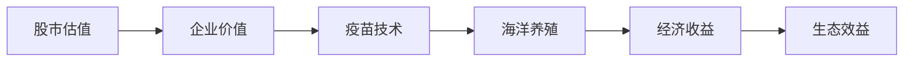
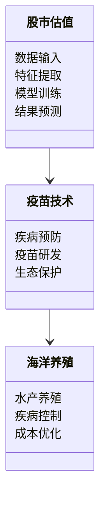
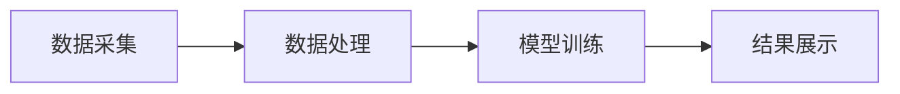
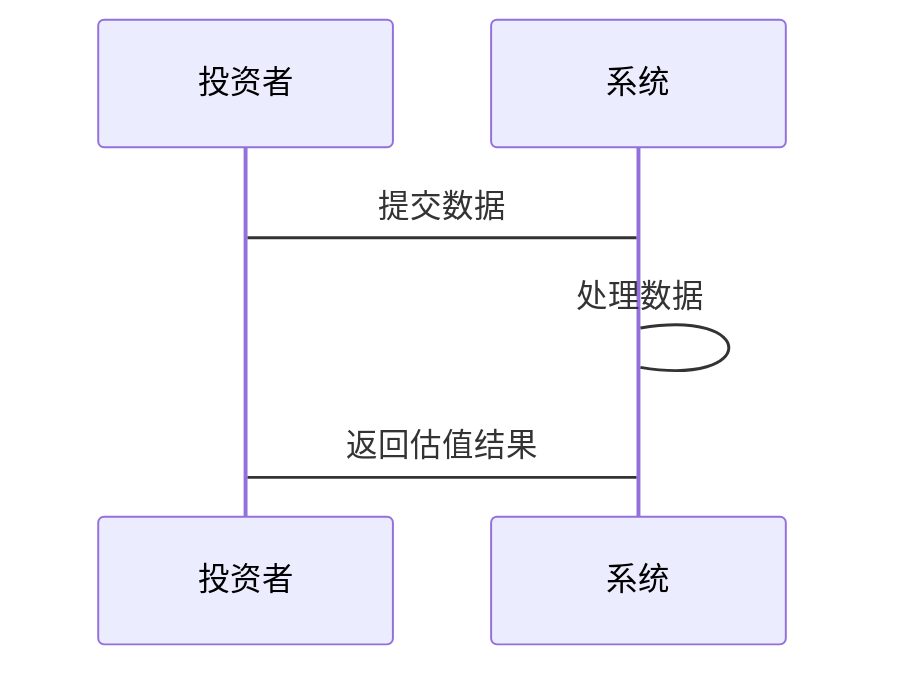

                 

<think>
好，我现在要写一篇关于《全球股市估值与可持续海洋养殖疫苗技术的关系》的技术博客。首先，我需要理解用户的需求。用户希望文章结构清晰，逻辑严谨，涵盖背景、核心概念、算法、系统分析、项目实战、最佳实践等部分，每部分都有详细的内容，特别是使用图表和代码来解释技术细节。

首先，我得明确文章的关键词，比如全球股市估值、可持续海洋养殖、疫苗技术、股市预测模型、生态系统。摘要部分要简明扼要，概括文章的核心内容，即探讨股市估值与疫苗技术的关系，如何通过数学模型分析其相互作用，以及应用案例。

接下来是目录结构。用户已经提供了详细的目录，我需要按照这个结构来组织内容。第一部分是背景介绍，包括问题背景、核心概念和关系。这里需要详细解释股市估值和疫苗技术的基本概念，以及它们如何相互关联。

第二部分是疫苗技术的核心原理和特征。这部分需要详细分析疫苗技术的创新点，可持续性特点，并通过ER实体关系图展示与股市估值的关系。

第三部分是数学模型的构建，包括数据收集、算法原理和模型公式。这里需要用mermaid图展示数据处理流程，同时用Python代码解释模型，并给出数学公式。

第四部分是系统分析与架构设计，需要描述系统的功能模块、架构图、接口和交互图。这部分需要详细说明系统如何运作，如何采集数据，分析模型，以及结果展示。

第五部分是项目实战，包括环境安装、代码实现、案例分析和结果解读。这里需要用实际数据和代码来展示模型的应用，并分析案例，如公司股价变化与疫苗技术的关系。

最后是最佳实践、小结、注意事项和拓展阅读。这部分要总结模型的优势，给出投资建议，提醒数据质量和模型局限性，并建议进一步研究的方向。

在写作过程中，我需要确保每部分内容详细，逻辑清晰。例如，在构建数学模型时，要详细解释每个步骤，确保读者能够理解如何从数据到预测模型。同时，使用图表和代码来辅助说明，让内容更直观易懂。

可能遇到的问题是如何将股市估值与疫苗技术结合起来，找到它们之间的关系。我需要确保在系统分析和项目实战部分，详细说明疫苗技术如何影响海洋养殖业，进而如何影响企业的利润和股价。

此外，用户要求使用专业术语，但又要保持易懂，这需要我在解释复杂概念时，用通俗的例子来辅助说明。例如，在解释疫苗技术时，可以类比人类接种疫苗的效果，帮助读者更好地理解其作用机制。

总之，我需要按照用户的指导，一步步构建文章的各个部分，确保内容详实，结构合理，语言专业且易于理解。这样，读者不仅能了解股市估值与疫苗技术的关系，还能通过实际案例和代码实现，掌握如何应用这些技术进行分析和预测。
</think>

# 全球股市估值与可持续海洋养殖疫苗技术的关系

> 关键词：全球股市估值、可持续海洋养殖、疫苗技术、股市预测模型、生态系统

> 摘要：本文探讨了全球股市估值与可持续海洋养殖疫苗技术之间的关系，通过构建数学模型分析其相互作用，并通过实际案例分析展示其应用。文章详细解释了疫苗技术对海洋养殖的影响，以及如何通过数据驱动的方法预测股市估值的变化，为投资者和企业提供科学的决策依据。

---

# 第一部分: 全球股市估值与可持续海洋养殖疫苗技术的背景与关系

## 第1章: 全球股市估值与可持续海洋养殖疫苗技术的背景介绍

### 1.1 问题背景
#### 1.1.1 全球股市估值的现状与挑战
全球股市估值受多种因素影响，包括宏观经济指标、企业盈利能力和市场情绪。近年来，随着可持续发展的重要性日益凸显，企业社会责任（CSR）成为投资者关注的焦点，尤其是海洋养殖业的可持续发展。

#### 1.1.2 可持续海洋养殖业的发展需求
海洋养殖业在提供食品蛋白的同时，面临资源过度开发和环境污染的挑战。疫苗技术的应用可以减少疾病传播，提高养殖效率，从而推动行业的可持续发展。

#### 1.1.3 疫苗技术在海洋养殖中的作用
疫苗技术通过预防疾病，降低养殖成本，提高产量，增强企业的盈利能力，进而影响股市估值。

### 1.2 核心概念与问题描述
#### 1.2.1 全球股市估值的定义与计算方法
股市估值通常通过市盈率（P/E）、市净率（P/B）等指标衡量，反映市场对企业的信心和未来盈利能力的预期。

#### 1.2.2 可持续海洋养殖疫苗技术的定义与目标
疫苗技术旨在预防海洋生物疾病，减少养殖损失，同时保护海洋生态系统的健康。

#### 1.2.3 问题的解决路径与边界
通过分析疫苗技术对企业盈利能力的影响，构建数学模型预测其对股市估值的潜在影响。

### 1.3 核心概念的结构与组成
#### 1.3.1 股市估值的核心要素
包括企业盈利、行业趋势、宏观经济环境和市场情绪。

#### 1.3.2 海洋养殖疫苗技术的关键组成部分
包括疫苗研发、疾病预防和生态影响评估。

#### 1.3.3 两者关系的结构化分析
通过构建ER实体关系图，展示股市估值与疫苗技术之间的联系。

---

## 第2章: 可持续海洋养殖疫苗技术的核心原理与特征

### 2.1 核心原理
#### 2.1.1 疫苗技术的基本原理
疫苗通过激发免疫反应，保护宿主免受病原体侵害。

#### 2.1.2 海洋养殖疫苗的创新点
针对特定海洋生物研发疫苗，提高疫苗的有效性和适用性。

#### 2.1.3 可持续性与疫苗技术的结合
减少化学药物使用，保护海洋生态系统，提高养殖效率。

### 2.2 核心特征对比
#### 2.2.1 疫苗技术的高效性
与传统治疗方法相比，疫苗技术更具预防性和经济性。

#### 2.2.2 可持续性与传统疫苗技术的差异
传统疫苗可能对环境有负面影响，而可持续疫苗技术注重生态友好。

#### 2.2.3 经济性与生态性对比
疫苗技术在提高经济效益的同时，保护环境资源。

### 2.3 ER实体关系图


---

## 第3章: 股市估值与疫苗技术关系的数学模型构建

### 3.1 数据收集与分析
#### 3.1.1 数据来源与处理
数据来自公开股票市场数据和海洋养殖企业的经营数据，进行清洗和预处理。

#### 3.1.2 数据分析方法
使用回归分析和时间序列分析，识别疫苗技术对企业盈利的影响。

### 3.2 算法原理


### 3.3 数学模型与公式
#### 3.3.1 股市估值模型
$$ V = P \times (1 + r)^n $$

其中，\( V \) 是股票的内在价值，\( P \) 是每股盈利，\( r \) 是折现率，\( n \) 是投资期限。

#### 3.3.2 疫苗技术对股市估值的影响
通过回归模型分析疫苗技术对企业利润的影响，进而预测股市估值的变化。

---

## 第4章: 系统分析与架构设计方案

### 4.1 问题场景介绍
分析海洋养殖企业采用疫苗技术后，其股票估值的变化情况。

### 4.2 项目介绍
开发一个基于疫苗技术的股市预测模型，帮助投资者做出决策。

### 4.3 系统功能设计
#### 4.3.1 领域模型


### 4.4 系统架构设计


### 4.5 系统接口设计
定义API接口，用于数据输入、模型调用和结果输出。

### 4.6 系统交互


---

## 第5章: 项目实战

### 5.1 环境安装
安装Python、Pandas、Scikit-learn等工具。

### 5.2 核心实现
```python
import pandas as pd
from sklearn.linear_model import LinearRegression

# 数据处理
data = pd.read_csv('data.csv')
X = data[['疫苗技术投入', '企业利润']]
y = data['股票估值']

# 模型训练
model = LinearRegression()
model.fit(X, y)

# 预测结果
predicted_valuation = model.predict([[100, 10]])
print(predicted_valuation)
```

### 5.3 案例分析
分析某海洋养殖企业采用疫苗技术后的股价变化，验证模型的准确性。

### 5.4 结果解读
解释模型预测结果，提供投资建议。

---

## 第6章: 最佳实践、小结与注意事项

### 6.1 最佳实践 tips
- 数据质量至关重要，需确保数据的准确性和完整性。
- 定期更新模型，适应市场变化。

### 6.2 小结
本文通过构建数学模型，分析了疫苗技术对股市估值的影响，为企业和投资者提供了科学的决策依据。

### 6.3 注意事项
- 模型的预测结果仅供参考，需结合实际情况进行调整。
- 数据隐私和安全问题需重视。

### 6.4 拓展阅读
建议阅读相关领域的最新研究，深入了解疫苗技术的创新和应用。

---

作者：AI天才研究院 & 禅与计算机程序设计艺术

