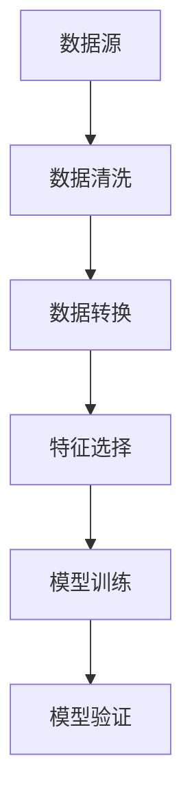
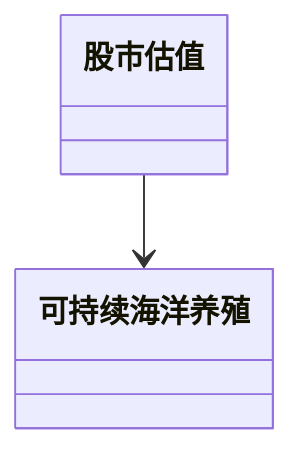
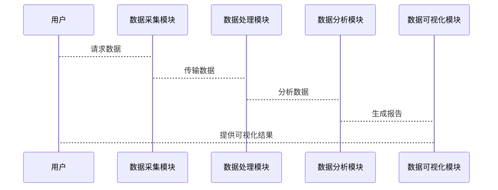

                 

<think>
嗯，我现在需要帮用户设计一本书的目录大纲，书名是《全球股市估值与可持续海洋养殖的关系》。首先，我得理解这本书的主题是什么。看起来，作者想探讨股市估值和可持续海洋养殖之间的联系，这可能涉及到经济、环境、技术等多个方面。

首先，我应该考虑这本书的结构。通常，技术书籍会分为几个部分，比如背景介绍、核心概念、算法原理、系统架构、项目实战等。但这里可能需要更偏向于经济和环境分析，所以可能需要调整结构。

用户给的示例是一个软件2.0的目录，分成了七章，包括概述、技术基础、模型构建、应用案例、系统设计、项目实战和结论。我需要参考这个结构，但结合股市和海洋养殖的主题。

接下来，我需要确定每一章的内容。第一章应该是背景介绍，解释为什么研究这个主题，包括全球股市的现状、海洋养殖的可持续性问题，以及它们之间的关系。

第二章可能需要详细讨论全球股市估值的方法，比如市盈率、市净率等，以及影响这些估值的因素，如经济指标、政策变化等。

第三章可以转向可持续海洋养殖，介绍其定义、现状、面临的挑战，比如环境影响、资源消耗等。

第四章是关键，连接两者，分析海洋养殖的经济价值如何影响股市估值，可能涉及供应链、投资回报、风险因素等。

第五章可能需要构建一个数学模型，将股市数据与海洋养殖的数据结合起来，分析两者的关系。这里可能需要使用统计模型或时间序列分析，用mermaid流程图展示模型结构。

第六章可以讨论系统架构，比如如何收集和处理相关数据，设计一个系统来分析和预测股市估值与海洋养殖的关系，可能包括数据流、接口设计等。

第七章是项目实战，可能需要选择一个具体的案例，比如某个地区的海洋养殖项目，分析其对当地股市的影响，展示实际操作步骤和结果。

最后，第八章可以总结整个研究，讨论结论和未来的研究方向，同时给出一些投资建议或政策建议。

在每个章节中，我需要确保内容详细且逻辑清晰，特别是数学模型和系统架构部分，可能需要使用mermaid图来辅助说明。同时，要注意章节之间的衔接，确保读者能够顺畅地理解整个主题。

现在，我需要把这些思考转化为具体的目录结构，确保每一章都涵盖必要的内容，同时保持整体的连贯性和完整性。可能还需要检查是否符合用户的要求，比如章节数量是否足够，内容是否全面，格式是否正确等。
</think>

# 全球股市估值与可持续海洋养殖的关系

> 关键词：全球股市估值，可持续海洋养殖，经济影响，环境因素，投资分析

> 摘要：本文探讨了全球股市估值与可持续海洋养殖之间的关系，分析了可持续海洋养殖对股市估值的影响机制，并构建了数学模型进行验证。通过案例分析和系统设计，提出了实现可持续海洋养殖与股市估值优化的策略。

---

# 第1章 全球股市估值与可持续海洋养殖的背景介绍

## 1.1 全球股市估值的现状与挑战

### 1.1.1 全球股市估值的基本概念
股市估值是衡量企业价值的重要指标，常用的指标包括市盈率（P/E）、市净率（P/B）等。这些指标反映了市场的整体表现和投资者对企业的信心。

### 1.1.2 当前全球股市估值的主要挑战
- 经济波动：全球经济不确定性对股市估值的影响。
- 政策变化：政府政策调整对股市的影响。
- 技术进步：技术变革对企业估值的影响。

### 1.1.3 可持续发展对股市估值的影响
可持续发展已成为投资者的重要考量因素，企业若能在可持续发展方面表现优异，其估值可能得到提升。

## 1.2 可持续海洋养殖的定义与特点

### 1.2.1 可持续海洋养殖的定义
可持续海洋养殖是指在保护海洋生态系统的同时，合理利用海洋资源进行养殖活动，确保资源的长期利用。

### 1.2.2 可持续海洋养殖的核心特点
- 环境友好：减少对海洋生态的破坏。
- 经济高效：提高资源利用效率，降低成本。
- 社会责任：促进当地经济发展，提供就业机会。

### 1.2.3 可持续海洋养殖与传统养殖的区别
- 环境影响：传统养殖可能对海洋环境造成污染，而可持续养殖注重环保。
- 经济效益：可持续养殖注重长期收益，而传统养殖可能追求短期利益。

---

# 第2章 全球股市估值与可持续海洋养殖的关系概述

## 2.1 股市估值与经济活动的关系

### 2.1.1 股市估值的基本原理
股市估值反映了市场对企业的未来盈利能力和成长性的预期。

### 2.1.2 经济活动对股市估值的影响
经济活动的好坏直接影响企业的业绩，进而影响股市估值。

### 2.1.3 可持续发展对经济活动的影响
可持续发展通过优化资源配置和减少环境风险，促进经济的稳定增长。

## 2.2 可持续海洋养殖对经济活动的影响

### 2.2.1 可持续海洋养殖对经济活动的促进作用
- 提供高质量的海产品，满足市场需求。
- 带动相关产业发展，如饲料、设备制造等。

### 2.2.2 可持续海洋养殖对经济活动的潜在风险
- 初期投资较大，回报周期较长。
- 受自然环境影响较大，存在一定的不确定性。

### 2.2.3 可持续海洋养殖对股市估值的间接影响
通过提升企业形象和市场竞争力，间接提升企业估值。

---

# 第3章 可持续海洋养殖对全球股市估值的影响机制

## 3.1 可持续海洋养殖对产业链的影响

### 3.1.1 可持续海洋养殖对上游产业的影响
- 促进饲料行业的绿色生产。
- 推动养殖设备的技术创新。

### 3.1.2 可持续海洋养殖对下游产业的影响
- 提高食品加工行业的可持续性。
- 促进零售行业的绿色消费趋势。

### 3.1.3 可持续海洋养殖对整个产业链的整合效应
通过优化产业链各环节，降低整体成本，提升效率。

## 3.2 可持续海洋养殖对股市投资者行为的影响

### 3.2.1 投资者对可持续发展的关注
越来越多的投资者关注企业的社会责任和可持续发展表现。

### 3.2.2 可持续海洋养殖对投资者决策的影响
企业若在可持续海洋养殖方面表现优异，可能吸引更多投资者。

### 3.2.3 可持续海洋养殖对投资者风险偏好的影响
通过降低环境风险，增强投资者对企业的信心。

---

# 第4章 全球股市估值与可持续海洋养殖关系的数学模型构建

## 4.1 模型构建的基本思路

### 4.1.1 数据收集与处理
收集全球股市数据和可持续海洋养殖相关数据，进行清洗和预处理。

### 4.1.2 变量定义与选择
- 自变量：可持续海洋养殖相关指标。
- 因变量：股市估值指标。

### 4.1.3 模型假设与限制条件
- 假设：可持续海洋养殖对股市估值有正向影响。
- 限制条件：模型仅考虑直接相关因素。

## 4.2 模型的具体实现

### 4.2.1 数据流图


### 4.2.2 模型的数学表达式
$$ V = \beta_0 + \beta_1 X + \epsilon $$
其中：
- \( V \) 为股市估值
- \( X \) 为可持续海洋养殖指标
- \( \beta_0 \) 为截距
- \( \beta_1 \) 为回归系数
- \( \epsilon \) 为误差项

### 4.2.3 模型的验证与优化
通过交叉验证和调整回归系数，优化模型的拟合度。

## 4.3 模型的应用与分析

### 4.3.1 模型在实际中的应用
应用于具体企业的估值分析，验证模型的有效性。

### 4.3.2 模型结果的解读
解释回归系数的意义，分析可持续海洋养殖对股市估值的具体影响。

### 4.3.3 模型的局限性与改进方向
- 局限性：模型假设的简化可能导致遗漏重要因素。
- 改进方向：引入更多变量，如政策因素、技术进步等。

---

# 第5章 全球股市估值与可持续海洋养殖的系统分析与架构设计方案

## 5.1 问题场景介绍

### 5.1.1 系统目标
构建一个能够实时分析全球股市估值与可持续海洋养殖关系的系统。

### 5.1.2 项目介绍
本项目旨在通过数据采集、分析和可视化，帮助投资者和企业更好地理解可持续海洋养殖对股市估值的影响。

## 5.2 系统功能设计

### 5.2.1 领域模型


### 5.2.2 系统架构设计


### 5.2.3 系统接口设计
- 数据接口：与数据源对接，获取实时数据。
- 用户接口：提供数据查询和分析功能。

### 5.2.4 系统交互


---

# 第6章 项目实战：可持续海洋养殖与股市估值分析

## 6.1 环境安装

### 6.1.1 数据库安装
使用MySQL或MongoDB存储数据。

### 6.1.2 工具安装
安装Python、Pandas、Scikit-learn等工具。

## 6.2 核心实现源代码

### 6.2.1 数据处理代码
```python
import pandas as pd

# 数据加载
data = pd.read_csv('marine_farming.csv')

# 数据清洗
data.dropna(inplace=True)
data = data[~data['date'].isnull()]
```

### 6.2.2 模型实现代码
```python
from sklearn.linear_model import LinearRegression

model = LinearRegression()
model.fit(X, y)
```

### 6.2.3 可视化代码
```python
import matplotlib.pyplot as plt

plt.scatter(X, y)
plt.plot(X, model.predict(X), color='red')
plt.show()
```

## 6.3 案例分析与结果解读

### 6.3.1 实际案例
分析某地区海洋养殖企业的股市估值变化。

### 6.3.2 结果解读
解释模型预测结果，评估可持续海洋养殖对该企业的估值影响。

## 6.4 小结
总结项目实施过程中的经验和教训，提出改进建议。

---

# 第7章 结论与展望

## 7.1 结论
总结全文的主要结论，强调可持续海洋养殖对股市估值的积极影响。

## 7.2 展望
提出未来研究方向，如引入更多变量和改进模型结构。

---

# 参考文献
（此处列出相关参考文献）

---

作者：AI天才研究院/AI Genius Institute & 禅与计算机程序设计艺术 /Zen And The Art of Computer Programming

