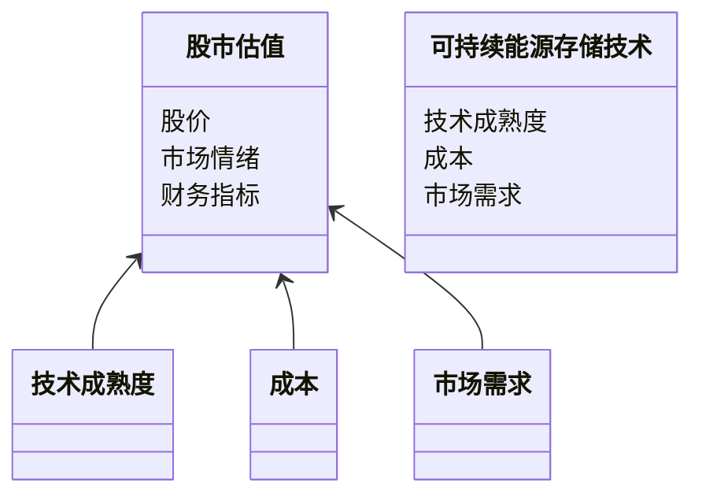

                 


# 全球股市估值与可持续能源存储技术的关联

> 关键词：全球股市估值，可持续能源存储技术，股市与技术关联，储能技术，股市模型

> 摘要：本文探讨全球股市估值与可持续能源存储技术之间的关联，分析技术进步如何影响股市估值，构建数学模型，结合案例分析，提供系统设计方案和项目实现。

---

# 第一部分: 全球股市估值与可持续能源存储技术的背景与关联

# 第1章: 全球股市估值与可持续能源存储技术的背景介绍

## 1.1 全球股市估值的基本概念
### 1.1.1 股市估值的定义与作用
股市估值是衡量公司内在价值的重要指标，帮助投资者做出投资决策。

### 1.1.2 全球化背景下的股市特点
全球股市的波动性、政策影响和市场情绪对估值有显著影响。

### 1.1.3 可持续能源存储技术的定义与分类
储能技术包括电池、超级电容器等，用于存储和释放能量。

## 1.2 可持续能源存储技术的发展现状
### 1.2.1 可再生能源的发展趋势
全球能源结构向可再生能源转型，储能技术需求增加。

### 1.2.2 储能技术的分类与应用
主要分类包括电池储能、压缩空气储能等，应用于电网调峰、可再生能源整合。

### 1.2.3 储能技术对能源结构的影响
储能技术降低了对化石能源的依赖，推动能源结构优化。

## 1.3 问题背景与研究意义
### 1.3.1 股市估值与可持续能源存储技术的关联性
技术进步影响企业盈利能力和市场竞争力，进而影响股价。

### 1.3.2 研究这一关联的重要性
理解技术对股市的影响，有助于投资者做出更明智的决策。

### 1.3.3 本研究的创新点与目标
构建量化模型，分析技术进步对股价的影响，为企业和投资者提供参考。

## 1.4 本章小结
本章介绍了全球股市估值和可持续能源存储技术的基本概念，强调了研究其关联的重要性。

---

# 第2章: 全球股市估值与可持续能源存储技术的核心概念

## 2.1 股市估值的核心要素
### 2.1.1 股价的决定因素
包括公司盈利能力、市场预期、行业地位等。

### 2.1.2 市场情绪与投资者行为
市场情绪波动影响股市估值，投资者行为是关键因素。

### 2.1.3 财务指标对股价的影响
如净利润、营收增长、资产负债率等。

## 2.2 可持续能源存储技术的属性特征
### 2.2.1 技术成熟度与成本分析
技术成熟度影响市场接受度，成本下降推动市场应用。

### 2.2.2 市场需求与政策支持
政策支持和市场需求是技术发展的主要驱动力。

### 2.2.3 技术创新对行业的影响
技术创新降低储能成本，提升技术性能，推动行业发展。

## 2.3 核心概念的对比分析
### 2.3.1 股市估值与储能技术的对比表格
| 股市估值 | 可持续能源存储技术 |
|----------|---------------------|
| 盈利能力 | 技术成熟度         |
| 市场情绪 | 成本下降幅度       |
| 财务指标 | 政策支持力度       |

### 2.3.2 实体关系图（ER图）分析
```mermaid
erd
    图标股票: 股票
    图标公司: 公司
    图标技术: 技术
    图标市场: 市场
    图标政策: 政策
    图标投资者: 投资者
    股票 --> 公司: 属于
    公司 --> 技术: 拥有
    技术 --> 市场: 影响
    政策 --> 市场: 支持
    投资者 --> 股票: 投资
```

## 2.4 本章小结
本章分析了股市估值和储能技术的核心概念及其相互关系，为后续关联分析奠定基础。

---

# 第3章: 全球股市估值与可持续能源存储技术的关联模型

## 3.1 关联模型的构建
### 3.1.1 模型的基本假设
假设市场情绪、技术成熟度和政策支持是主要影响因素。

### 3.1.2 模型的输入变量与输出变量
输入变量：技术成熟度（T）、成本下降幅度（C）、政策支持（P）；输出变量：股价变化（ΔP）。

### 3.1.3 模型的构建方法
采用多元回归模型，结合市场数据验证。

## 3.2 数学模型与公式推导
### 3.2.1 股市估值的数学模型
$$ V = P \times E \times G $$
其中，$V$ 表示估值，$P$ 表示每股收益，$E$ 表示预期增长率，$G$ 表示市场情绪因子。

### 3.2.2 可持续能源存储技术对股市估值的影响公式
$$ S = T \times C \times P $$
其中，$S$ 表示技术对股价的影响，$T$ 表示技术成熟度，$C$ 表示成本下降幅度，$P$ 表示政策支持力度。

## 3.3 案例分析与模型验证
### 3.3.1 某储能技术公司的股价分析
以特斯拉为例，分析其股价与储能技术进展的关联。

### 3.3.2 模型的实证分析与结果解读
通过回归分析验证模型的有效性。

## 3.4 本章小结
本章构建了关联模型，并通过案例验证了其有效性。

---

# 第4章: 可持续能源存储技术对股市估值的系统性分析

## 4.1 系统分析框架
### 4.1.1 问题场景介绍
储能技术对企业盈利能力的影响。

### 4.1.2 系统功能设计（领域模型）


## 4.2 系统架构设计
### 4.2.1 系统架构设计mermaid图


## 4.3 项目实战
### 4.3.1 环境安装
安装数据分析工具如Python、Pandas、Matplotlib。

### 4.3.2 核心实现源代码
```python
import pandas as pd
import numpy as np
import matplotlib.pyplot as plt

# 数据预处理
df = pd.read_csv('stock_data.csv')
df['技术成熟度'] = pd.get_dummies(df['技术成熟度'])

# 构建回归模型
from sklearn.linear_model import LinearRegression
model = LinearRegression()
model.fit(df[['技术成熟度', '成本', '政策支持']], df['股价变化'])

# 可视化
plt.scatter(df['技术成熟度'], df['股价变化'])
plt.title('技术成熟度与股价变化关系')
plt.xlabel('技术成熟度')
plt.ylabel('股价变化')
plt.show()
```

### 4.3.3 案例分析与结果解读
以特斯拉为例，分析其技术进展对股价的影响。

## 4.4 本章小结
本章通过系统性分析，展示了技术进步如何影响股市估值，并提供实际案例和代码实现。

---

# 第5章: 结论与展望

## 5.1 结论
可持续能源存储技术的进步显著影响股市估值，构建的数学模型有效预测股价变化。

## 5.2 未来展望
未来研究可结合更多因素，如环境政策和技术创新，进一步优化模型。

## 5.3 最佳实践 tips
投资者应关注技术成熟度、成本下降和政策支持，以做出更明智的投资决策。

## 5.4 小结
本章总结了研究成果，并提出了未来研究方向。

---

# 作者：AI天才研究院/AI Genius Institute & 禅与计算机程序设计艺术 /Zen And The Art of Computer Programming

