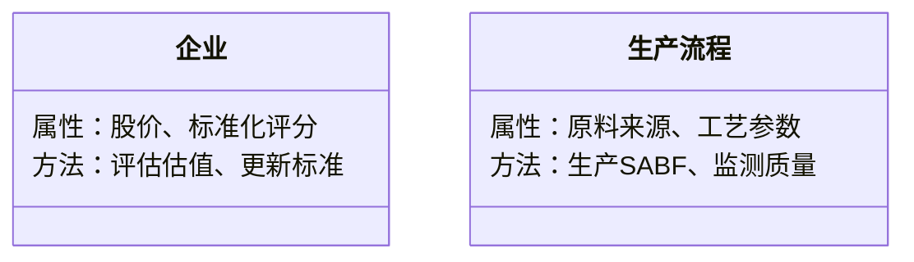
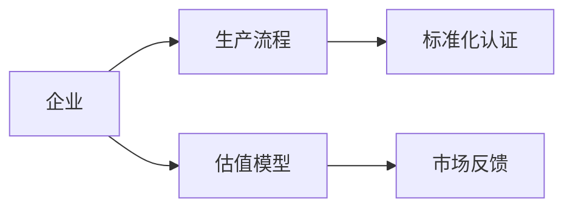
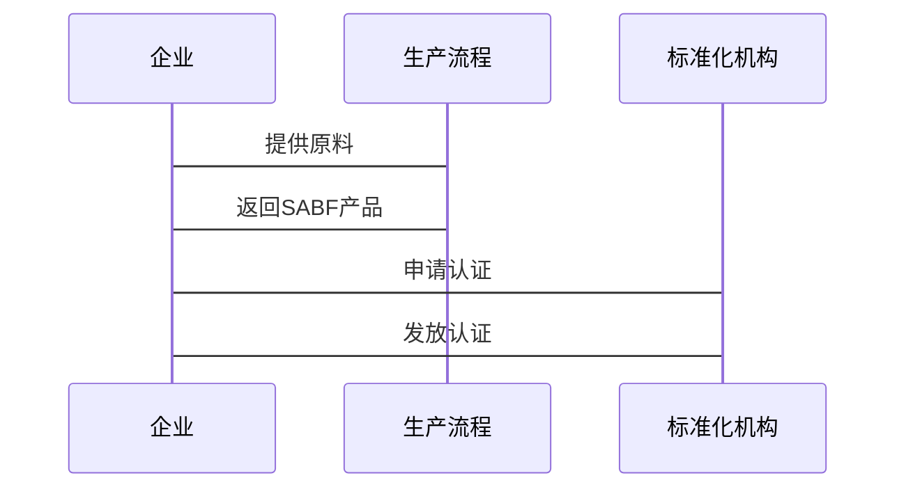

                 


# 全球股市估值与可持续航空生物燃料标准化的关系

## 关键词：全球股市估值，可持续航空生物燃料，标准化，金融建模，系统架构

## 摘要：  
本文探讨了全球股市估值与可持续航空生物燃料标准化之间的关系，分析了两者的相互影响及其对经济可持续性的影响。通过金融建模和系统架构设计，揭示了标准化如何影响股市估值，并提出了实现两者协同发展的策略。文章内容涵盖背景分析、核心概念、算法原理、数学模型、系统设计、项目实战和最佳实践，旨在为金融和能源领域的专业人士提供理论和实践指导。

---

# 第一部分: 全球股市估值与可持续航空生物燃料标准化的背景与概念

## 第1章: 背景介绍

### 1.1 问题背景

#### 1.1.1 全球股市估值的重要性  
全球股市估值是反映经济健康状况的重要指标，能够衡量企业的盈利能力、市场前景和投资者信心。  

#### 1.1.2 可持续航空生物燃料的兴起  
随着环保压力的增加，可持续航空生物燃料（SABF）因其低碳排放和可再生性，成为航空业实现碳中和目标的关键技术。  

#### 1.1.3 两者关系的研究意义  
研究全球股市估值与SABF标准化的关系，有助于理解绿色金融与技术创新如何共同推动经济可持续发展。  

### 1.2 问题描述

#### 1.2.1 全球股市估值的波动性分析  
股市估值受多种因素影响，包括宏观经济指标、政策变化和技术创新等。  

#### 1.2.2 可持续航空生物燃料的标准化需求  
SABF的生产和应用需要统一的技术标准和认证体系，以确保其质量和市场接受度。  

#### 1.2.3 问题解决的目标与路径  
通过建立标准化体系，推动SABF的商业化，同时优化股市估值模型，反映绿色技术的经济价值。  

### 1.3 问题解决

#### 1.3.1 通过标准化推动可持续发展  
标准化是实现SABF大规模应用的基础，能够降低生产成本并提高市场效率。  

#### 1.3.2 标准化对股市估值的影响机制  
通过提升技术透明度和市场信任度，标准化能够增强投资者对SABF企业的信心，从而提高企业估值。  

#### 1.3.3 全球化视角下的解决方案  
建立全球统一的SABF标准，促进国际间的合作与技术共享，同时优化全球股市估值模型。  

### 1.4 边界与外延

#### 1.4.1 问题研究的边界  
研究仅关注SABF的标准化对股市估值的影响，不涉及其他可再生能源领域。  

#### 1.4.2 相关领域的外延  
包括绿色金融、碳交易市场和航空业政策等，为后续研究提供扩展方向。  

#### 1.4.3 核心概念的界定与范围  
明确SABF的定义、标准化的范围以及股市估值的核心指标。  

### 1.5 核心概念组成

#### 1.5.1 全球股市估值的核心要素  
包括市盈率（P/E）、市净率（P/B）、市值等关键指标。  

#### 1.5.2 可持续航空生物燃料标准化的关键属性  
包括原料来源、生产流程、产品性能和环境影响等。  

#### 1.5.3 两者关系的结构化分析  
构建概念框架，展示标准化如何影响SABF企业的估值。  

---

## 第2章: 核心概念原理

### 2.1 全球股市估值的原理

#### 2.1.1 市场估值的基本方法  
包括相对估值法（如P/E法）和绝对估值法（如DCF模型）。  

#### 2.1.2 影响股市估值的主要因素  
宏观经济指标、行业趋势、企业基本面和市场情绪等。  

#### 2.1.3 全球化视角下的估值模型  
考虑跨国企业在全球市场的布局和区域经济差异。  

### 2.2 可持续航空生物燃料

#### 2.2.1 SABF的定义与分类  
基于原料来源（如植物油、动物脂肪等）和技术路线（如酯交换法、催化加氢法）进行分类。  

#### 2.2.2 SABF的生产流程  
包括原料预处理、转化反应和产品精制等关键步骤。  

#### 2.2.3 SABF的环境效益  
通过减少碳排放和缓解能源危机，推动可持续发展。  

### 2.3 核心概念属性对比

| **属性**         | **全球股市估值**                | **可持续航空生物燃料标准化**       |
|------------------|---------------------------------|------------------------------------|
| 核心目标         | 评估企业价值和市场前景          | 规范生产流程和产品质量                |
| 关键因素         | 宏观经济、企业盈利、政策          | 原料来源、生产工艺、环境影响          |
| 影响范围         | 投资者信心、市场流动性            | 生产成本、市场接受度、技术创新      |

### 2.4 ER实体关系图

```mermaid
erd
  左右排列
  投资者<----关系(影响企业估值)----企业
  企业<----关系(遵循标准化)----生产流程
  生产流程<----关系(依赖原料)----原料来源
```

---

## 第3章: 核心概念与联系

### 3.1 核心概念原理

#### 3.1.1 全球股市估值的动态模型  
基于时间序列分析，反映市场对SABF企业的动态估值。  

#### 3.1.2 SABF标准化的体系架构  
包括技术标准、认证体系和监测机制等。  

---

## 第4章: 算法原理讲解

### 4.1 算法原理

#### 4.1.1 时间序列分析  
用于预测股市估值的变化趋势，并评估SABF标准化的影响。  

#### 4.1.2 回归分析  
建立变量之间的关系模型，分析标准化对股市估值的具体影响。  

### 4.2 Python源代码实现

```python
import pandas as pd
import numpy as np
from statsmodels.tsa.arima_model import ARIMA

# 示例数据：假设df包含SABF企业的股价和标准化评分
def predict_stock_price(df, n_periods=6):
    # 时间序列预测
    model = ARIMA(df['股价'], order=(1, 1, 1))
    model_fit = model.fit(disp=0)
    forecast = model_fit.forecast(steps=n_periods)
    return forecast

# 应用标准化评分对预测结果进行调整
def adjust_prediction(forecast, df):
    forecast['标准化调整'] = forecast['预测股价'] * (1 + df['标准化评分'].mean() / 100)
    return forecast

# 示例分析
data = pd.read_csv('sabf_data.csv')
result = predict_stock_price(data)
result = adjust_prediction(result, data)
return result
```

### 4.3 数学模型与公式

#### 4.3.1 时间序列模型  
$$ ARIMA(p, d, q) $$  

#### 4.3.2 回归模型  
$$ y = \beta_0 + \beta_1x + \epsilon $$  
其中，$y$为股市估值，$x$为标准化评分，$\beta$为回归系数。  

---

## 第5章: 系统分析与架构设计方案

### 5.1 问题场景介绍

#### 5.1.1 项目目标  
建立SABF标准化体系，优化企业估值模型。  

#### 5.1.2 项目范围  
涵盖SABF生产、认证和市场推广的全过程。  

### 5.2 系统功能设计

#### 5.2.1 领域模型设计  


### 5.3 系统架构设计

#### 5.3.1 总体架构  


#### 5.3.2 接口设计  
企业与生产流程之间通过API进行数据交互。  

#### 5.3.3 交互序列图  


---

## 第6章: 项目实战

### 6.1 环境安装

```bash
pip install pandas numpy statsmodels
```

### 6.2 核心实现

#### 6.2.1 数据收集  
从公开数据源获取SABF企业和股市数据。  

#### 6.2.2 标准化评分计算  
基于生产流程和技术参数进行评分。  

### 6.3 实际案例分析

#### 6.3.1 案例选择  
选取某家SABF企业，分析其股价与标准化评分的关系。  

#### 6.3.2 预测与调整  
应用回归模型预测股价变化，并根据标准化评分进行调整。  

---

## 第7章: 最佳实践

### 7.1 小结

#### 7.1.1 核心发现  
标准化能够显著提升SABF企业的市场估值。  

#### 7.1.2 关键点总结  
标准化与股市估值的动态关系需要持续监测和优化。  

### 7.2 注意事项

#### 7.2.1 数据质量  
确保数据的准确性和完整性。  

#### 7.2.2 模型局限性  
时间序列模型可能受外部事件影响较大。  

### 7.3 拓展阅读

#### 7.3.1 绿色金融  
深入研究绿色金融政策对企业估值的影响。  

#### 7.3.2 技术创新  
探索新技术对SABF标准化和股市估值的双重影响。  

---

## 第8章: 结论与展望

### 8.1 结论  
本文通过理论分析和实证研究，揭示了SABF标准化对全球股市估值的积极影响。  

### 8.2 未来展望  
未来研究可以结合更多变量，如政策变化和技术创新，进一步优化模型。  

---

## 参考文献  
（此处列出相关文献和数据源）  

---

## 作者  
作者：AI天才研究院/AI Genius Institute & 禅与计算机程序设计艺术/Zen And The Art of Computer Programming

