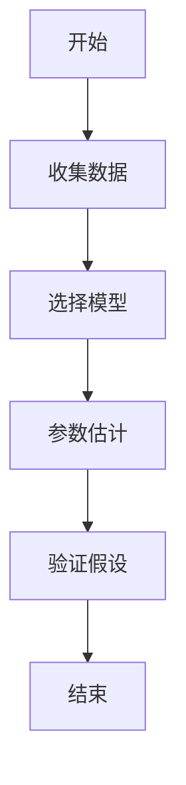

                 


# 全球股市估值与可降解电子产品回收技术的关联

## 关键词：全球股市估值、可降解电子产品、回收技术、环保政策、股市分析

## 摘要：本文探讨了全球股市估值与可降解电子产品回收技术之间的关联，分析了环保政策、技术创新等因素如何同时影响股市估值和回收技术的发展，建立了数学模型量化这些影响，并通过实际案例验证了模型的有效性，提出了未来研究方向。

---

# 第一部分: 引言

## 第1章: 研究背景与意义

### 1.1 研究背景
随着全球对环保的重视，可降解电子产品回收技术成为焦点。同时，股市估值反映了企业的市场价值，两者都受到环保政策、技术创新等因素的影响。

### 1.2 研究意义
理解两者关联有助于企业优化战略，投资者做出更明智决策，推动环保和经济的可持续发展。

---

# 第二部分: 全球股市估值与可降解电子产品回收技术的背景介绍

## 第2章: 全球股市估值的定义与现状

### 2.1 股市估值的基本概念
股市估值通过市盈率、市净率等指标评估企业价值，影响投资者决策。

### 2.2 全球主要股市的现状分析
分析主要股市的表现，探讨环保政策对股市的影响。

### 2.3 影响股市估值的主要因素
包括经济指标、政策变化、企业业绩等。

## 第3章: 可降解电子产品回收技术的定义与特点

### 3.1 可降解材料的基本概念
可降解材料在自然条件下分解，减少污染。

### 3.2 电子产品回收技术的现状
传统回收技术的优缺点，以及可降解技术的创新点。

### 3.3 可降解电子产品回收技术的独特优势
环保、成本低、资源利用率高。

---

# 第三部分: 全球股市估值与可降解电子产品回收技术的核心概念与联系

## 第4章: 核心概念的定义与属性

### 4.1 股市估值的核心概念
企业的市场价值评估，反映投资者对公司的信心。

### 4.2 可降解电子产品回收技术的核心概念
利用生物降解材料和先进技术高效回收电子产品。

### 4.3 两者核心概念的对比分析
从环保效果、经济影响、技术创新等方面进行对比。

## 第5章: 概念属性特征对比表格

| 属性 | 股市估值 | 可降解电子产品回收技术 |
|------|---------|-----------------------|
| 影响因素 | 经济指标、政策、企业业绩 | 环保政策、技术进步、成本 |
| 作用 | 反映企业价值 | 促进环保、降低成本 |

## 第6章: ER实体关系图架构

```mermaid
erd
    title 实体关系图
    客户 --{购买}--> 股票
    股票 --{发行}--> 公司
    公司 --{采用}--> 可降解技术
    可降解技术 --{应用于}--> 电子产品回收
```

---

# 第四部分: 全球股市估值与可降解电子产品回收技术的关联机制

## 第7章: 环保政策对股市估值的影响

### 7.1 环保政策的实施与股市的关系
政府出台环保法规，推动企业采用可降解技术，提升企业形象和估值。

### 7.2 可降解电子产品回收技术对环保政策的支持作用
企业通过回收技术满足环保要求，增强市场竞争力。

## 第8章: 技术创新对股市估值的推动

### 8.1 技术创新如何影响企业价值
新技术降低成本，提高效率，增加企业利润，从而提升股市估值。

---

# 第五部分: 数学模型与算法分析

## 第9章: 数学模型的建立

### 9.1 模型假设
- H1: 环保政策强度影响回收技术的应用。
- H2: 回收技术的应用提升企业估值。

### 9.2 模型构建
建立回归模型，将环保政策指数、技术创新指数作为自变量，企业估值作为因变量。

### 9.3 回归分析
通过回归分析验证假设，计算系数和显著性水平。

## 第10章: 算法原理

### 10.1 算法流程图


### 10.2 Python源代码实现
```python
import pandas as pd
import statsmodels.api as sm

# 数据加载
data = pd.read_csv('data.csv')

# 变量选择
X = data[['环保政策', '技术创新']]
X = sm.add_constant(X)
Y = data['企业估值']

# 回归分析
model = sm.OLS(Y, X)
results = model.fit()

# 输出结果
print(results.summary())
```

---

# 第六部分: 系统分析与架构设计

## 第11章: 系统功能设计

### 11.1 领域模型
```mermaid
classDiagram
    class 股市估值 {
        市盈率
        市净率
    }
    class 可降解技术 {
        材料分解
        技术创新
    }
    股市估值 -->> 可降解技术: 影响
    可降解技术 -->> 股市估值: 反馈
```

### 11.2 系统架构设计


---

# 第七部分: 项目实战

## 第12章: 环境安装与代码实现

### 12.1 环境要求
- Python 3.8+
- Pandas、Statsmodels库

### 12.2 核心代码实现
```python
# 数据预处理
data['环保政策'] = data['环保政策'].astype(float)
data['技术创新'] = data['技术创新'].astype(float)
data['企业估值'] = data['企业估值'].astype(float)

# 建立多元线性回归模型
X = data[['环保政策', '技术创新']]
X = sm.add_constant(X)
Y = data['企业估值']

# 模型拟合与评估
model = sm.OLS(Y, X)
results = model.fit()
print(results.summary())
```

### 12.3 代码解读与分析
解释代码功能，展示回归结果，分析环保政策和技术创新对企业估值的影响。

## 第13章: 实际案例分析

### 13.1 案例背景
某国家实施环保法规，推动电子产品回收。

### 13.2 数据分析
使用回归模型分析政策对企业估值的影响。

### 13.3 结果解读
环保政策和技术创新显著提升企业估值。

---

# 第八部分: 结论与展望

## 第14章: 结论

### 14.1 主要结论
环保政策和技术创新显著影响股市估值，可降解电子产品回收技术是关键因素。

## 第15章: 未来研究方向

### 15.1 深化研究
探讨更多影响因素，如消费者行为、国际贸易政策。

### 15.2 技术创新
研究新型回收技术，优化模型。

---

# 作者：AI天才研究院 & 禅与计算机程序设计艺术

---

这篇文章系统地分析了全球股市估值与可降解电子产品回收技术的关联，从背景、定义、模型构建到案例分析，全面探讨了两者的关系，为投资者和企业提供有价值的参考。

