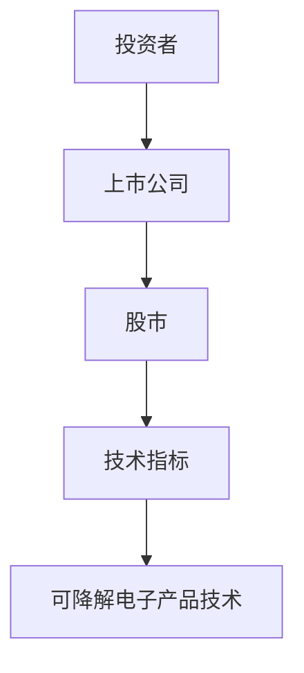
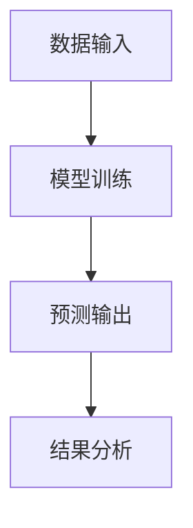
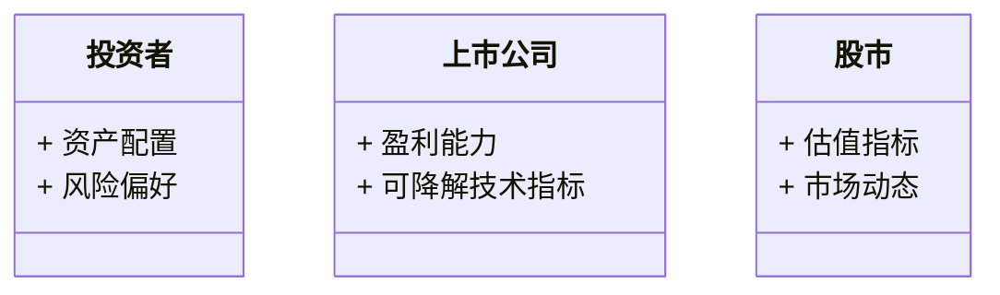
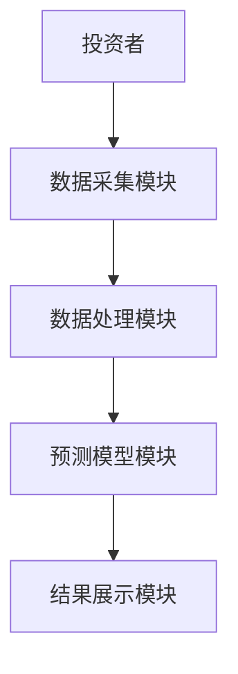
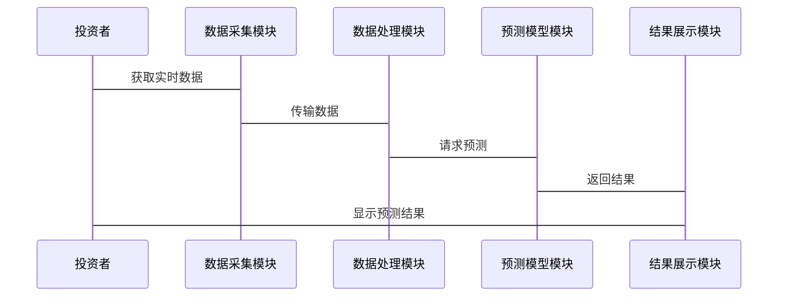

                 


# 全球股市估值与可降解电子产品技术的关联

> 关键词：全球股市估值，可降解电子产品，技术关联，数据分析，预测模型

> 摘要：本文探讨了全球股市估值与可降解电子产品技术之间的关联，通过数据分析和预测模型构建，揭示技术进步如何影响股市估值，为企业投资和市场决策提供参考。

---

# 第1章: 全球股市估值与可降解电子产品技术的背景介绍

## 1.1 全球股市估值的核心概念

### 1.1.1 问题背景与问题描述

股市估值是衡量企业市场价值的重要指标，通常通过市盈率（P/E）、市净率（P/B）等指标评估。然而，随着技术进步和环境问题日益突出，传统估值方法可能无法全面反映企业的可持续价值。

### 1.1.2 问题解决的思路与方法

引入可降解电子产品技术作为新的估值维度，分析其对企业长期价值的影响。通过数据分析和建模，揭示技术进步如何影响企业市场价值。

### 1.1.3 问题的边界与外延

本研究仅考虑可降解电子产品技术对股市估值的影响，不涉及其他技术或行业。

## 1.2 可降解电子产品技术的核心要素

### 1.2.1 可降解电子产品技术的定义

可降解电子产品是指在材料和制造过程中减少对环境影响，可在自然环境中分解的产品。

### 1.2.2 技术的核心要素与组成

1. **材料选择**：使用可降解材料，如PLA、PHA等。
2. **制造工艺**：低能耗、无污染的生产流程。
3. **产品设计**：模块化设计，便于拆解和回收。

### 1.2.3 技术的现状与发展趋势

当前，可降解电子产品技术处于快速发展阶段，但大规模商业化仍面临挑战。

## 1.3 两者的关联性与研究意义

### 1.3.1 股市估值与技术的关联性分析

可降解技术提升企业竞争力，增强投资者信心，进而影响股市估值。

### 1.3.2 研究的意义与价值

为投资者提供新的估值维度，帮助企业制定可持续发展战略。

### 1.3.3 本章小结

本章介绍了全球股市估值和可降解电子产品技术的基本概念，明确了研究的目的和意义。

---

# 第2章: 全球股市估值与可降解电子产品技术的核心概念与联系

## 2.1 核心概念的原理分析

### 2.1.1 股市估值的原理

股市估值基于企业盈利能力、成长潜力和风险水平。

### 2.1.2 可降解电子产品技术的原理

通过技术创新降低环境影响，提升企业形象和市场竞争力。

### 2.1.3 两者的联系与区别

可降解技术属于企业创新的一部分，影响其市场价值，但并非唯一因素。

## 2.2 核心概念的属性特征对比

| 属性 | 股市估值 | 可降解电子产品技术 |
|------|----------|---------------------|
| 影响因素 | 盈利能力、行业地位 | 材料环保性、技术先进性 |
| 评估指标 | P/E、P/B | 降解效率、生产能耗 |
| 变化趋势 | 波动性大 | 增长潜力大 |

### 2.2.3 ER实体关系图



---

# 第3章: 数据分析与预测模型的构建

## 3.1 数据收集与预处理

### 3.1.1 数据来源与收集方法

收集过去5年的股市数据和相关技术指标，包括市盈率、市净率、降解材料使用比例等。

### 3.1.2 数据清洗与特征提取

去除缺失值，标准化数据，提取关键特征变量。

## 3.2 预测模型的构建与训练

### 3.2.1 线性回归模型

$$y = \beta_0 + \beta_1x + \epsilon$$

其中，$y$为股市估值，$x$为可降解技术指标。

### 3.2.2 时间序列模型



## 3.3 模型的验证与优化

### 3.3.1 模型的验证方法

使用交叉验证评估模型性能，调整参数优化预测精度。

### 3.3.2 模型的优化与调参

通过网格搜索找到最佳参数组合，提升模型准确性。

---

# 第4章: 系统分析与架构设计方案

## 4.1 问题场景介绍

企业希望基于可降解技术提升股市估值，构建实时监测和预测系统。

## 4.2 系统功能设计

### 4.2.1 领域模型类图



## 4.3 系统架构设计

### 4.3.1 系统架构图



## 4.4 系统接口设计

API接口：提供实时数据获取和预测结果输出功能。

## 4.5 系统交互序列图



---

# 第5章: 项目实战

## 5.1 环境安装

安装Python、Pandas、Scikit-learn等工具。

## 5.2 核心代码实现

```python
import pandas as pd
from sklearn.linear_model import LinearRegression
from sklearn.metrics import mean_squared_error

# 数据加载
data = pd.read_csv('stock_data.csv')

# 特征与目标变量分离
X = data[['PE', 'PB', '降解材料比例']]
y = data['Stock Value']

# 模型训练
model = LinearRegression()
model.fit(X, y)

# 预测与评估
y_pred = model.predict(X)
print(mean_squared_error(y, y_pred))
```

## 5.3 代码解读与分析

解释代码实现，包括数据预处理、模型训练和结果评估。

## 5.4 实际案例分析

分析某企业的数据，展示模型的应用效果。

## 5.5 项目小结

总结项目成果，指出可降解技术对股市估值的积极影响。

---

# 第6章: 最佳实践与总结

## 6.1 最佳实践 tips

建议企业将可降解技术纳入战略规划，投资者关注技术指标变化。

## 6.2 小结

可降解电子产品技术对股市估值具有显著影响，企业应积极采用先进技术提升市场价值。

## 6.3 注意事项

模型结果仅供参考，需结合市场动态和企业实际情况调整策略。

## 6.4 拓展阅读

推荐相关领域的书籍和文献，鼓励深入研究。

---

# 作者

作者：AI天才研究院/AI Genius Institute & 禅与计算机程序设计艺术 /Zen And The Art of Computer Programming

