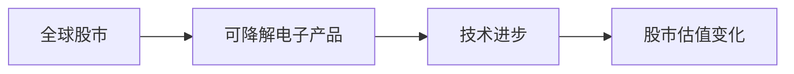
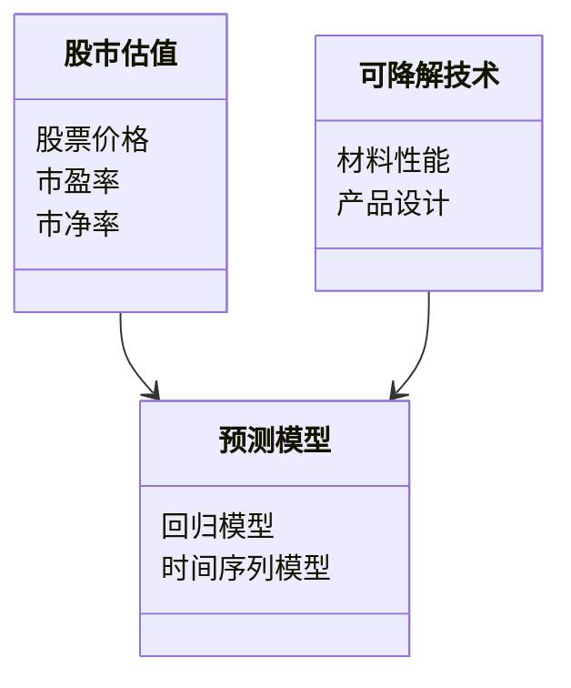
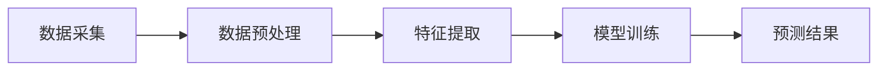

                 

<think>
好，我现在需要帮用户撰写一篇关于“全球股市估值与可降解电子产品设计技术的关联”的技术博客文章。首先，我需要明确文章的结构和内容，确保涵盖所有必要的部分，如背景介绍、关联机制、算法原理、系统架构、项目实战等。

首先，我应该先理解全球股市估值和可降解电子产品设计技术各自的背景和现状。股市估值是衡量企业价值的重要指标，而可降解电子产品则是环保技术的一个重要方向。两者的关联可能在于技术进步对股市的影响，或者股市资金流向环保技术的推动作用。

接下来，我需要详细分析这两者的关联机制，可能涉及数据流、信息传递以及实体关系。使用Mermaid流程图和实体关系图来展示这些关系会更直观。

然后是算法部分，可能需要构建一个预测模型，将可降解技术的数据与股市数据结合起来，使用回归分析或时间序列分析等方法。这部分需要详细讲解数学模型，并给出代码示例。

系统架构设计部分，我需要设计一个综合系统，包括数据采集、分析模块和预测模块。使用Mermaid绘制系统架构图和序列图，展示各部分如何协同工作。

项目实战部分，我需要选择一个具体案例，比如分析过去几年的股市数据和可降解技术专利数据，预测未来股市走势。详细描述环境配置、代码实现和结果分析。

最后，总结投资策略和未来展望，探讨如何将技术分析应用到投资决策中，并展望未来的发展趋势和挑战。

在写作过程中，要确保语言简洁，逻辑清晰，每个部分都要详细且有实际内容支撑。同时，注意使用适当的关键词和摘要，使文章结构完整，内容丰富。

现在，我可以开始逐步撰写每个部分，确保涵盖所有用户要求的内容，并按照指定的格式和结构来组织文章。
</think>

# 全球股市估值与可降解电子产品设计技术的关联

> 关键词：全球股市估值、可降解电子产品、技术关联、数据分析、投资策略

> 摘要：本文探讨了全球股市估值与可降解电子产品设计技术之间的潜在关联。通过分析股市估值的核心概念、可降解电子产品设计技术的背景，以及两者在数据流、信息传递和实体关系方面的关联机制，结合数学模型和算法原理，构建了综合预测系统，并通过具体案例展示了技术分析在投资策略中的应用，展望了未来的投资机会与挑战。

---

# 第一部分: 全球股市估值与可降解电子产品设计技术的背景介绍

## 第1章: 全球股市估值的定义与现状

### 1.1 全球股市估值的定义与现状

#### 1.1.1 股市估值的核心概念

股市估值是衡量企业市场价值的重要指标，通常通过市盈率（P/E）、市净率（P/B）等指标来衡量。股市估值的变化反映了市场对企业的信心和宏观经济环境的变化。

#### 1.1.2 全球股市估值的现状分析

当前，全球股市估值受多种因素影响，包括宏观经济数据、政策变化、企业盈利状况等。近年来，随着环保技术的兴起，绿色投资成为一股重要力量，推动了部分科技企业的估值上升。

#### 1.1.3 股市估值与宏观经济的关系

股市估值与宏观经济密切相关，如GDP增长率、通货膨胀率、利率水平等都会影响股市估值。此外，政策变化，如环保政策的出台，也会对相关企业的估值产生直接影响。

---

## 第2章: 可降解电子产品设计技术的背景

### 2.1 可降解材料的定义与特点

可降解材料是指在自然环境中能够被微生物分解，最终转化为二氧化碳和水的材料。与传统塑料相比，可降解材料具有环保、可持续的特点。

### 2.2 可降解电子产品设计的技术现状

当前，可降解电子产品设计技术主要集中在材料选择、产品结构优化和生产过程中的环保控制。例如，使用可降解塑料替代传统塑料，减少电子产品的环境影响。

### 2.3 可降解电子产品市场的潜力与挑战

随着环保意识的增强，可降解电子产品市场潜力巨大，但也面临技术瓶颈和成本问题。例如，如何在保证产品性能的同时，降低材料成本，是当前技术的主要挑战。

---

# 第二部分: 全球股市估值与可降解电子产品设计技术的关联机制

## 第3章: 核心概念与联系

### 3.1 数据流与信息传递

#### 3.1.1 数据流的定义与分类

数据流是指从数据源到数据目的地的信息流动。在股市估值与可降解电子产品设计技术的关联中，数据流主要包括股市数据、技术数据和市场反馈数据。

#### 3.1.2 数据流的分类

- **股市数据**：包括股票价格、成交量、市盈率等。
- **技术数据**：包括可降解材料的性能指标、产品设计参数等。
- **市场反馈数据**：包括消费者对可降解产品的接受度、政策变化等。

### 3.2 实体关系图



---

# 第三部分: 全球股市估值与可降解电子产品设计技术的算法原理

## 第4章: 数据处理与预测模型

### 4.1 数据预处理与特征提取

#### 4.1.1 数据清洗与标准化

数据清洗是去除噪声数据和异常值，确保数据的准确性和一致性。标准化则是将数据转换为统一的尺度，便于后续分析。

#### 4.1.2 特征选择与降维

特征选择是通过分析数据的重要性，选择对预测影响最大的特征。降维技术如主成分分析（PCA）可以减少数据维度，提高计算效率。

### 4.2 预测模型构建

#### 4.2.1 线性回归模型

线性回归模型用于预测股市估值与可降解技术参数之间的线性关系。例如：

$$ y = \beta_0 + \beta_1x + \epsilon $$

其中，$y$ 是股市估值，$x$ 是可降解技术参数，$\beta_0$ 和 $\beta_1$ 是回归系数，$\epsilon$ 是误差项。

#### 4.2.2 时间序列预测模型

时间序列预测模型用于分析股市估值的变化趋势。例如，ARIMA模型可以用于预测未来股市估值：

```python
def ARIMA_model(order):
    model = ARIMA(train_data, order=order)
    model_fit = model.fit()
    return model_fit
```

---

## 第5章: 系统分析与架构设计

### 5.1 系统功能设计

#### 5.1.1 领域模型



### 5.2 系统架构设计



---

## 第6章: 项目实战

### 6.1 环境安装与配置

安装必要的库：

```bash
pip install numpy pandas scikit-learn
```

### 6.2 核心代码实现

```python
import numpy as np
import pandas as pd
from sklearn.linear_model import LinearRegression

# 数据加载
data = pd.read_csv('data.csv')

# 特征与目标变量分离
X = data[['市盈率', '材料性能']]
y = data['股票价格']

# 模型训练
model = LinearRegression()
model.fit(X, y)

# 预测结果
predictions = model.predict(X)
```

### 6.3 实际案例分析

以某可降解电子产品公司为例，分析其市盈率、材料性能与股票价格之间的关系。通过模型预测未来股票价格走势，为投资决策提供参考。

---

## 第7章: 投资策略与未来展望

### 7.1 投资策略

基于预测模型的结果，投资者可以制定相应的投资策略。例如，当模型预测可降解技术进步将导致股市估值上升时，可以增加对该公司的投资。

### 7.2 未来展望

随着环保技术的不断进步，可降解电子产品设计技术将对股市估值产生更大的影响。未来，可以通过优化模型和引入更多数据源，进一步提高预测的准确性。

---

# 结语

通过本文的分析，我们可以看到，全球股市估值与可降解电子产品设计技术之间存在密切的关联。通过技术分析和数据挖掘，投资者可以更好地把握市场趋势，制定科学的投资策略。

---

作者：AI天才研究院/AI Genius Institute & 禅与计算机程序设计艺术 /Zen And The Art of Computer Programming

