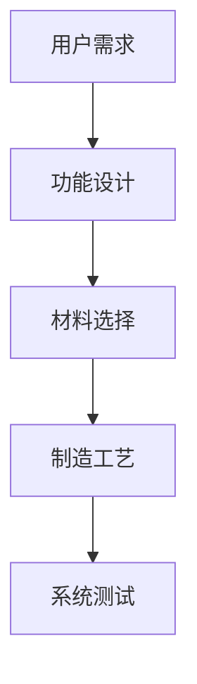

                 


# 全球股市估值与可食用包装在食品工业中的应用

---

## 关键词：
全球股市估值、可食用包装、食品工业、数学模型、系统架构、项目实战

---

## 摘要：
本文深入探讨了全球股市估值与可食用包装在食品工业中的应用。通过分析股市估值的核心概念、模型与算法，结合可食用包装的技术创新，本文旨在为读者提供跨领域的技术见解。从大数据与AI在股市分析中的应用，到可食用包装的材料科学与制造技术，本文结合实际案例，详细解读了两者的协同创新与应用前景。

---

## 正文：

---

## 第一部分：全球股市估值分析

### 第1章：全球股市估值概述

#### 1.1 股市估值的核心概念

股票估值是投资者评估股票内在价值的过程，旨在确定其合理的价格区间。以下是核心概念的详细解读：

- **股票的内在价值**：股票的真正价值是其未来现金流的现值。计算时需要考虑公司盈利能力、成长潜力和行业竞争状况。例如，苹果公司的股票估值不仅基于其当前的利润，还需考虑其技术创新带来的未来收益。

- **市盈率（PE）与市净率（PB）**：PE=股价/每股收益，PB=股价/每股净资产。这些指标帮助投资者判断股票是否被高估或低估。例如，若某股票的PE值远高于行业平均水平，可能表明市场对其未来利润预期过高。

- **宏观经济因素**：GDP增长率、利率水平、通货膨胀率等宏观经济指标直接影响股市估值。例如，低利率环境通常会推高股市估值，因为资金成本降低，企业更容易获得融资。

#### 1.2 股市估值的背景与意义

股市估值是投资者决策的核心依据，其背景与意义体现在以下几个方面：

- **投资者决策工具**：通过估值模型，投资者可以判断股票是否值得买入或卖出。例如，使用DCF模型评估初创企业的价值时，需考虑其未来现金流的贴现率。

- **风险管理**：准确的估值可以帮助投资者规避市场泡沫。例如，在2008年金融危机期间，许多投资者通过估值模型识别高风险资产，避免了重大损失。

- **市场趋势预测**：股市估值的动态变化反映了市场情绪和经济周期。例如，通过分析PE和PB的变化趋势，可以预测市场的牛熊转换。

#### 1.3 股市估值的核心要素

以下是股市估值的核心要素：

- **公司基本面**：包括收入、利润、现金流等财务指标。例如，一家公司过去三年的净利润增长率分别为20%、25%和30%，显示其强劲的盈利能力。

- **行业周期**：不同行业受经济周期影响不同。例如，周期性行业如制造业在经济衰退时可能面临更大的估值压力。

- **市场情绪**：投资者情绪波动直接影响股市估值。例如，市场恐慌时，股票可能被低估，而市场乐观时，股票可能被高估。

---

### 第2章：全球股市估值模型与方法

#### 2.1 常用估值模型

- **市盈率（PE）模型**：适用于盈利稳定的公司。例如，若某公司的PE为15，行业平均PE为20，说明该股可能被低估。

- **市净率（PB）模型**：适用于资产密集型行业。例如，银行和房地产公司常使用PB模型评估价值。

- **现金流折现模型（DCF）**：适用于高成长性公司。DCF模型通过预测未来现金流，计算其现值，得出目标股价。例如，特斯拉的高成长性使其更适合用DCF模型估值。

#### 2.2 估值模型的优劣势对比

以下是对几种常见估值模型的优劣势对比：

| 模型 | 优点 | 缺点 |
|------|------|------|
| PE | 简单易用，适用于盈利稳定的公司 | 无法反映资产质量，不适合亏损公司 |
| PB | 反映资产价值，适用于资产密集型行业 | 无法反映盈利能力，适合低增长行业 |
| DCF | 精确反映未来现金流，适合高成长公司 | 计算复杂，依赖未来现金流预测 |

#### 2.3 全球股市估值的多因素分析

- **宏观经济因素**：GDP增长率、利率、通货膨胀率等。例如，美联储加息可能导致股市估值下降。

- **行业周期**：行业处于扩张期或衰退期。例如，科技行业通常具有较高的估值倍数，因为其增长潜力大。

- **公司基本面**：收入、利润、现金流等财务指标。例如，ROE（净资产收益率）高的公司通常具有较高的估值。

---

### 第3章：大数据与AI在股市估值中的应用

#### 3.1 大数据驱动的股市分析

- **数据来源**：包括历史股价、财务报表、新闻 sentiment、社交媒体数据等。例如，通过分析社交媒体的情绪数据，可以预测市场短期走势。

- **数据处理与特征提取**：清洗数据，提取有用的特征，如移动平均线、相对强弱指数（RSI）等。例如，使用Python的pandas库进行数据清洗。

#### 3.2 AI在股市估值中的算法原理

- **算法流程图**：
  ```mermaid
  graph TD
      A[数据输入] --> B[数据清洗]
      B --> C[特征提取]
      C --> D[模型训练]
      D --> E[预测结果]
  ```

- **Python代码实现**：
  ```python
  import pandas as pd
  from sklearn.model_selection import train_test_split
  from sklearn.linear_model import LinearRegression

  # 数据清洗
  df = pd.read_csv('stock_data.csv')
  df = df.dropna()

  # 特征提取
  features = df[['PE', 'PB', 'ROE']]
  target = df['Price']

  # 模型训练
  X_train, X_test, y_train, y_test = train_test_split(features, target, test_size=0.2)
  model = LinearRegression()
  model.fit(X_train, y_train)

  # 预测结果
  predictions = model.predict(X_test)
  ```

---

## 第二部分：可食用包装在食品工业中的应用

### 第1章：可食用包装概述

#### 1.1 可食用包装的核心概念

- **定义**：可食用包装是指可以直接食用的包装材料，通常由天然成分制成，如蛋白质、多糖、脂质等。例如，使用海藻制成的可食用包装膜，可以在食用后自然降解。

- **优势**：环保、安全、可降解。例如，可食用包装可以减少塑料污染，符合可持续发展的趋势。

- **应用领域**：食品包装、医药包装、化妆品包装等。例如，可食用包装常用于包装零食、速溶咖啡等食品。

#### 1.2 可食用包装的背景与意义

- **背景**：随着环保问题日益严重，传统塑料包装的使用受到限制。可食用包装作为一种替代方案，逐渐受到关注。

- **意义**：可食用包装不仅环保，还能提升产品的市场竞争力。例如，消费者更倾向于选择环保包装的产品，特别是在高端市场。

#### 1.3 可食用包装的核心要素

- **材料科学**：研究可食用包装的成分，如多糖、蛋白质等。例如，使用壳聚糖和海藻酸钠制成的可食用膜具有良好的机械性能和阻隔性。

- **制造技术**：包括挤出成型、涂层技术、3D打印等。例如，3D打印技术可以制造复杂形状的可食用包装。

- **感官特性**：包括口感、颜色、气味等。例如，可食用包装应具有良好的口感，不会影响食品的味道。

---

### 第2章：可食用包装的技术分析

#### 2.1 可食用包装的材料科学

- **多糖基包装**：如纤维素、葡聚糖等，具有良好的成膜性和生物降解性。例如，纤维素膜可以用于包装新鲜水果。

- **蛋白质基包装**：如明胶、酪蛋白等，具有良好的成膜性和机械性能。例如，酪蛋白膜可以用于包装乳制品。

- **脂质基包装**：如明胶脂、壳聚糖脂等，具有良好的水蒸气阻隔性。例如，脂质膜可以用于包装高湿食品。

#### 2.2 可食用包装的制造技术

- **挤出成型**：通过加热熔化材料，通过挤出机挤出成膜。例如，使用壳聚糖和纤维素的混合物制成可食用膜。

- **涂层技术**：在基材表面涂覆可食用涂层。例如，使用多糖溶液涂覆纸张，制成可食用涂层包装纸。

- **3D打印**：通过3D打印技术制造复杂形状的可食用包装。例如，打印成为空心的包装盒，内层可食用。

#### 2.3 可食用包装的感官特性

- **口感**：可食用包装应具有良好的口感，不会影响食品的风味。例如，使用薄荷味的可食用膜，可以增加包装的趣味性。

- **颜色**：颜色应与食品协调，提升视觉吸引力。例如，使用红色的可食用膜包装糖果，增强节日氛围。

- **气味**：气味应与食品匹配，提升消费者体验。例如，使用咖啡香气的可食用膜包装咖啡豆，增强品牌识别度。

---

### 第3章：可食用包装的系统设计与应用

#### 3.1 系统功能设计

- **包装性能**：包括机械强度、阻气性、阻水性等。例如，可食用包装需要具备足够的机械强度，防止内容物受压变形。

- **包装设计**：包括形状、颜色、图案等。例如，设计成与食品颜色协调的可食用膜，提升包装的美观性。

- **用户交互**：包括包装的开启方式、使用体验等。例如，设计成易于撕开的可食用膜，方便消费者使用。

#### 3.2 系统架构设计



---

## 第三部分：全球股市估值与可食用包装的协同创新

### 第1章：跨领域协同创新

#### 1.1 两者的协同效应

- **数据共享**：股市估值数据与包装技术数据的结合，可以为食品企业提供更全面的市场分析。例如，通过分析包装材料的市场表现，优化包装设计。

- **技术创新**：包装技术的创新可以提升食品企业的竞争力，进而影响股市估值。例如，推出新型可食用包装的产品，提升品牌价值，推动股价上涨。

#### 1.2 协同创新的实现路径

- **数据驱动**：利用大数据分析股市估值与包装技术的相关性。例如，分析可食用包装企业的股价波动，寻找投资机会。

- **技术融合**：将包装技术与股市分析相结合，开发智能化的包装解决方案。例如，使用AI技术预测包装材料的市场趋势，指导包装设计。

---

## 结语

本文通过深入分析全球股市估值与可食用包装在食品工业中的应用，探讨了两者的协同创新与未来趋势。从股市估值的核心概念到可食用包装的材料科学，本文为读者提供了全面的技术见解。未来，随着技术的进步，股市估值与可食用包装的结合将推动食品工业的智能化与可持续发展。

---

## 作者：AI天才研究院/AI Genius Institute & 禅与计算机程序设计艺术/Zen And The Art of Computer Programming

