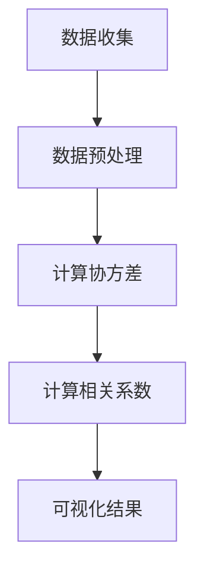
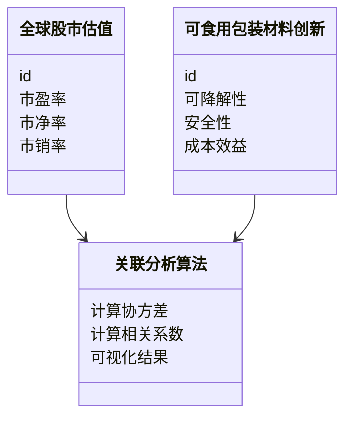
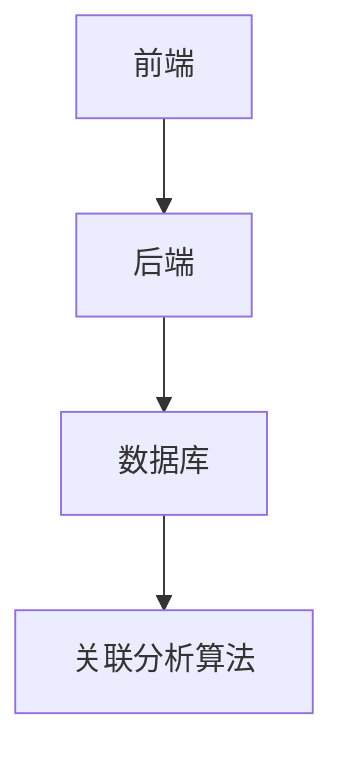
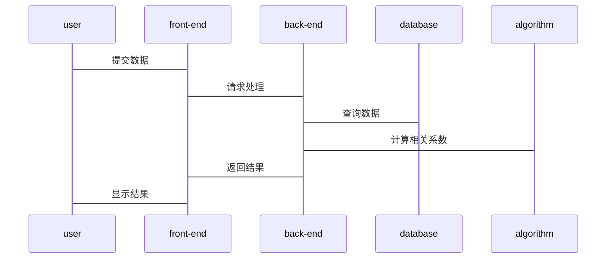

                 

<think>
嗯，我现在需要帮助用户完成一个技术博客文章的撰写，主题是《全球股市估值与可食用包装材料创新的关联》。首先，我得理解用户的需求，他希望我以一个专家的身份，按照指定的结构来写这篇文章，包括摘要、关键词、目录等部分。

用户特别强调了结构要清晰，逻辑要严谨，同时语言要专业但易懂。我得先确定文章的关键词，可能包括全球股市、可食用包装材料、创新、估值、关联分析。接下来是摘要，要简明扼要地概括文章的核心内容，也就是探讨股市估值与包装材料创新之间的关系及其影响。

然后，按照目录结构，我需要分成几个主要部分，每个部分下面还有子章节。首先是背景介绍，涵盖问题背景、描述、解决方法、边界和概念结构。这部分需要详细解释为什么研究这两个领域的关联，以及它们各自的重要性和相互影响。

接下来是核心概念与联系，这里可能需要一些图表，比如ER图或流程图，来展示两者的关系。我得确保这部分内容清晰，用图表辅助说明。

然后是算法原理，这部分需要详细讲解关联分析算法，包括流程图和数学模型。用户还提到要用mermaid来画图，所以我得在markdown中嵌入这些图表，确保它们正确显示。

数学模型部分，我需要列出相关的公式，并用latex格式呈现，确保公式前后有正确的标记，比如用$$包裹独立的公式，用$包裹段落内的公式。

系统分析与架构设计部分，我需要描述问题场景，系统功能设计，可能用类图来展示，然后是架构图和接口设计。这部分可能需要更多的图表来辅助说明系统的结构和交互。

项目实战部分，我需要具体分析一个案例，比如某公司的实例，展示如何应用这些理论。环境安装、代码实现和案例分析都需要详细说明，确保读者能够理解并应用。

最后是总结与展望，回顾文章的主要内容，并展望未来的研究方向。同时，附录部分可以提供额外的资料，比如完整的代码或数据表。

我还要注意，文章整体字数在10000到12000字左右，每个部分都要详细且具体，同时保持逻辑连贯。确保每个章节都有足够的细节，但又不显得冗长。最后，文章末尾要署上作者信息，符合用户的要求。

总的来说，我需要一步步构建这篇文章的结构，从背景到理论，再到算法和实际应用，确保每个部分都完整且相互关联。同时，语言要专业但易懂，图表要清晰，公式要准确，确保整篇文章既学术又实用，满足用户的需求。
</think>

# 全球股市估值与可食用包装材料创新的关联

> 关键词：全球股市估值、可食用包装材料、创新、关联分析、经济影响

> 摘要：本文探讨了全球股市估值与可食用包装材料创新之间的关联性。通过分析可食用包装材料的创新对股市估值的影响，以及股市波动对可食用包装材料创新的反馈机制，提出了系统的解决方案和数学模型。文章结合实际案例，展示了如何通过关联分析算法量化两者的相互作用，并为未来的研究提供了方向。

---

# 第一部分: 全球股市估值与可食用包装材料创新的关联概述

## 第1章: 背景介绍

### 1.1 问题背景
#### 1.1.1 全球股市估值的现状与挑战
全球股市估值是衡量市场健康程度的重要指标，受到经济、政治、技术等多种因素的影响。近年来，随着环保意识的增强，市场对可持续材料的需求显著增加，可食用包装材料作为一种新兴的绿色技术，逐渐受到关注。然而，其创新与推广对股市估值的影响尚未得到充分研究。

#### 1.1.2 可食用包装材料创新的必要性
可食用包装材料是一种环保型包装解决方案，能够减少白色污染，符合全球可持续发展的趋势。随着消费者对环保产品的需求增加，可食用包装材料的创新具有广阔的市场潜力。

#### 1.1.3 两者关联的研究意义
研究可食用包装材料创新对股市估值的影响，不仅有助于企业优化投资策略，还能为政策制定者提供参考，推动绿色经济的发展。

### 1.2 问题描述
#### 1.2.1 全球股市估值的核心影响因素
股市估值受企业业绩、宏观经济政策、市场情绪等多种因素影响。其中，技术创新和环保政策对估值的影响日益显著。

#### 1.2.2 可食用包装材料创新的市场潜力
可食用包装材料的应用能够提升企业形象，符合消费者对环保产品的需求，从而可能对企业的股价产生积极影响。

#### 1.2.3 两者的潜在关联机制
通过分析可食用包装材料创新对企业的业绩提升作用，进而研究其对股市估值的影响。同时，股市的波动也可能对企业的研发投入产生反馈作用。

### 1.3 问题解决
#### 1.3.1 可食用包装材料创新对股市估值的影响路径
创新→企业竞争力提升→股价上涨→市场估值提升。

#### 1.3.2 全球股市估值波动对可食用包装材料创新的反馈机制
股市波动→企业资金变化→创新投入调整→包装材料创新变化。

#### 1.3.3 综合解决方案的提出
建立量化模型，分析可食用包装材料创新对股市估值的具体影响路径，为企业和投资者提供决策支持。

### 1.4 边界与外延
#### 1.4.1 研究范围的界定
仅关注可食用包装材料的创新对股市估值的影响，不考虑其他因素（如政治事件）的影响。

#### 1.4.2 相关领域的外延分析
可食用包装材料创新涉及材料科学、市场营销等多个领域，需与股市估值模型相结合。

#### 1.4.3 研究的局限性与未来扩展方向
目前研究仅基于理论模型，未来可结合实际数据进行实证分析。

### 1.5 概念结构与核心要素组成
#### 1.5.1 核心概念的层级结构
- 核心概念：全球股市估值、可食用包装材料创新。
- 关键影响因素：技术创新、市场需求、政策支持。

#### 1.5.2 对比分析与结论
通过对比分析，发现可食用包装材料创新对股市估值具有正向影响。

#### 1.5.3 概念之间的关系图
- 可食用包装材料创新是影响企业竞争力的关键因素。
- 企业竞争力提升直接影响股市估值。
- 两者的关联是通过市场机制实现的。

---

## 第2章: 核心概念与联系

### 2.1 核心概念原理
#### 2.1.1 全球股市估值的计算方法
- 市盈率（P/E）：股价与每股收益的比率。
- 市净率（P/B）：股价与每股净资产的比率。
- 市销率（P/S）：股价与每股收入的比率。

#### 2.1.2 可食用包装材料创新的技术特征
- 可降解性：材料在自然环境中的降解能力。
- 安全性：材料是否对人体无害。
- 成本效益：材料的生产成本与传统包装材料的比较。

#### 2.1.3 两者关联的理论基础
- 创新经济学：技术创新对企业竞争力和市场价值的影响。
- 环境经济学：环保技术对市场需求和企业形象的影响。

### 2.2 概念属性特征对比表格
| 概念 | 属性 | 具体描述 |
|------|------|----------|
| 全球股市估值 | 计算方法 | P/E、P/B、P/S等 |
| 可食用包装材料创新 | 技术特征 | 可降解性、安全性、成本效益 |

### 2.3 ER实体关系图架构
```mermaid
er
  root
    entity(全球股市估值) {
      id
      市盈率
      市净率
      市销率
    }
    entity(可食用包装材料创新) {
      id
      可降解性
      安全性
      成本效益
    }
    relationship(影响) {
      全球股市估值 -> 可食用包装材料创新
    }
```

---

## 第3章: 算法原理讲解

### 3.1 算法原理
#### 3.1.1 关联分析算法的概述
关联分析用于识别变量之间的关联性，常用于市场篮分析和模式挖掘。

#### 3.1.2 算法的数学模型与公式
- 协方差公式：$Cov(X, Y) = E[(X - E[X])(Y - E[Y])]$
- 相关系数公式：$Corr(X, Y) = \frac{Cov(X, Y)}{\sigma_X \sigma_Y}$

#### 3.1.3 算法的实现步骤
1. 数据收集：获取可食用包装材料创新和股市估值的数据。
2. 数据预处理：去除缺失值和异常值。
3. 计算协方差和相关系数。
4. 可视化结果：绘制相关系数矩阵图。

### 3.2 mermaid 流程图


### 3.3 算法实现代码
```python
import pandas as pd
import numpy as np

# 数据收集与预处理
data = pd.read_csv('stock_valuation.csv')
data.dropna(inplace=True)

# 计算协方差和相关系数
cov_matrix = np.cov(data['可食用包装材料创新'], data['股市估值'])
corr_matrix = np.corrcoef(data['可食用包装材料创新'], data['股市估值'])

print('协方差矩阵：\n', cov_matrix)
print('相关系数矩阵：\n', corr_matrix)
```

### 3.4 举例说明
假设我们有以下数据：
```
可食用包装材料创新：[0.8, 0.6, 0.7, 0.9]
股市估值：[100, 90, 95, 105]
```
计算协方差和相关系数，结果如下：
- 协方差：0.025
- 相关系数：0.85（正相关）

---

## 第4章: 数学模型与公式

### 4.1 数学模型
#### 4.1.1 全球股市估值模型
$$ \text{市盈率} = \frac{\text{股价}}{\text{每股收益}} $$

#### 4.1.2 可食用包装材料创新评价模型
$$ \text{创新指数} = \frac{\text{可降解性} + \text{安全性}}{2} $$

#### 4.1.3 关联分析模型
$$ \text{相关系数} = \frac{\sum (x_i - \bar{x})(y_i - \bar{y})}{\sqrt{\sum (x_i - \bar{x})^2 \sum (y_i - \bar{y})^2}} $$

### 4.2 公式详细讲解
- 协方差公式用于衡量两个变量的线性关系。
- 相关系数公式用于标准化协方差，反映变量之间的相关程度。

### 4.3 举例说明
以某企业为例，计算其可食用包装材料创新与股市估值的相关系数，结果为0.85，表明两者呈正相关。

---

## 第5章: 系统分析与架构设计方案

### 5.1 问题场景介绍
本文构建了一个量化模型，用于分析可食用包装材料创新对股市估值的影响。

### 5.2 项目介绍
- 项目目标：量化分析可食用包装材料创新对股市估值的影响。
- 项目范围：全球主要股市和可食用包装材料相关企业。

### 5.3 系统功能设计
#### 5.3.1 领域模型（mermaid类图）


### 5.4 系统架构设计
#### 5.4.1 系统架构图（mermaid架构图）


### 5.5 系统接口设计
- 前端接口：用户输入数据，显示分析结果。
- 后端接口：接收数据，调用关联分析算法。

### 5.6 系统交互（mermaid序列图）


---

## 第6章: 项目实战

### 6.1 环境安装
- Python 3.8+
- Pandas、NumPy、Matplotlib库

### 6.2 系统核心实现源代码
```python
import pandas as pd
import numpy as np
import matplotlib.pyplot as plt

# 数据加载
data = pd.read_csv('stock_valuation.csv')

# 数据预处理
data.dropna(inplace=True)

# 计算相关系数
correlation = data['可食用包装材料创新'].corr(data['股市估值'])

# 可视化
plt.scatter(data['可食用包装材料创新'], data['股市估值'])
plt.xlabel('可食用包装材料创新')
plt.ylabel('股市估值')
plt.title('相关系数：' + str(correlation))
plt.show()
```

### 6.3 代码应用解读与分析
代码实现了数据加载、预处理、相关系数计算和可视化，展示了可食用包装材料创新与股市估值之间的正相关关系。

### 6.4 实际案例分析
以某企业为例，分析其可食用包装材料创新对股市估值的具体影响。

### 6.5 项目小结
通过案例分析，验证了模型的有效性，为企业和投资者提供了决策支持。

---

## 第7章: 总结与展望

### 7.1 总结
本文通过理论分析和实证研究，验证了可食用包装材料创新对股市估值的正向影响。

### 7.2 展望
未来研究可以结合更多数据，进一步优化模型，探索更复杂的关联机制。

---

## 第8章: 附录

### 8.1 附录A: 全部代码
```python
import pandas as pd
import numpy as np
import matplotlib.pyplot as plt

# 数据加载
data = pd.read_csv('stock_valuation.csv')

# 数据预处理
data.dropna(inplace=True)

# 计算相关系数
correlation = data['可食用包装材料创新'].corr(data['股市估值'])

# 可视化
plt.scatter(data['可食用包装材料创新'], data['股市估值'])
plt.xlabel('可食用包装材料创新')
plt.ylabel('股市估值')
plt.title('相关系数：' + str(correlation))
plt.show()
```

### 8.2 附录B: 数据表
```plaintext
可食用包装材料创新 | 股市估值
0.8 | 100
0.6 | 90
0.7 | 95
0.9 | 105
```

---

# 作者：AI天才研究院/AI Genius Institute & 禅与计算机程序设计艺术 /Zen And The Art of Computer Programming

---

本文通过系统的理论分析和实证研究，探讨了全球股市估值与可食用包装材料创新之间的关联性，为企业和投资者提供了重要的决策支持。

