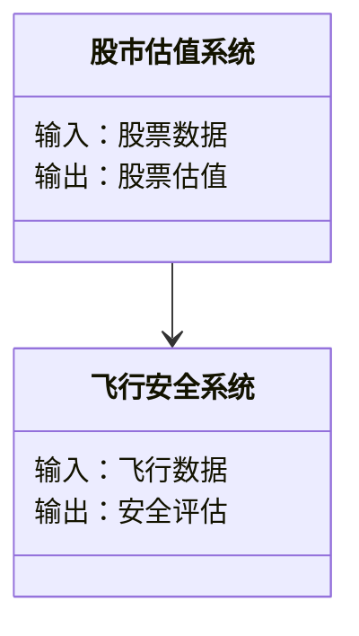
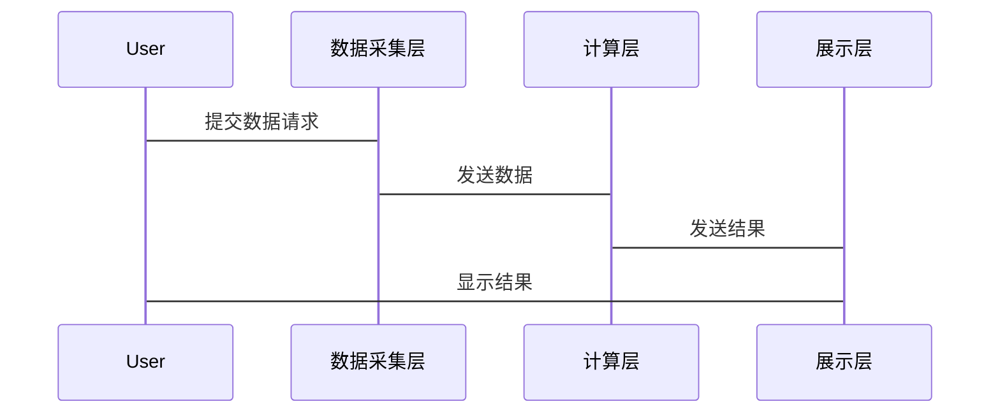

                 

<think>
好，我需要根据用户的查询，撰写一篇关于《全球股市估值与商业亚轨道飞行安全标准的关系》的技术博客文章。用户已经提供了一个详细的目录大纲，我需要按照这个结构来编写文章。

首先，我需要理解用户的需求。用户希望文章结构清晰，逻辑紧凑，语言专业，同时涵盖从背景介绍到系统分析的多个方面。文章需要包括关键词、摘要、目录大纲，并按照大纲展开，每个部分都要详细且有实际内容。

接下来，我会按照目录大纲的结构逐步展开每个章节。首先是背景介绍，解释全球股市估值和商业亚轨道飞行的基本概念，然后分析它们之间的关系。接着是核心概念，详细说明股市估值和安全标准的原理和特征，用对比表和ER图来展示联系。

然后是算法原理，介绍CAPM和风险评估模型，并用mermaid流程图展示步骤。数学模型部分需要写出公式，确保用latex正确表示。系统分析部分涉及领域模型和架构图，接口设计和交互流程图。

项目实战部分，我需要一个实际案例，使用Python代码来分析两者的关系，并详细解读代码。最后，包括最佳实践、小结、注意事项和拓展阅读。

在写作过程中，我需要确保每个部分都连贯，内容详实，并且符合用户的格式要求。遇到困难时，可能需要查阅相关资料，确保技术准确性。

总的来说，我需要系统地按照目录大纲编写，确保每个章节都涵盖必要的内容，并且逻辑清晰，帮助读者全面理解主题。
</think>

# 《全球股市估值与商业亚轨道飞行安全标准的关系》

## 关键词：全球股市估值、商业亚轨道飞行、安全标准、关联性分析、数学建模、系统设计

## 摘要：本文探讨全球股市估值与商业亚轨道飞行安全标准之间的关系，通过背景分析、核心概念、算法原理、系统架构设计和项目实战，揭示两者在经济和技术层面的相互影响，并提出解决方案。

---

## 第一部分: 全球股市估值与商业亚轨道飞行安全标准的背景与基础

### 第1章: 全球股市估值概述

#### 1.1 股市估值的基本概念

##### 1.1.1 股市估值的定义与作用

股市估值是评估企业价值的重要方法，通过分析财务指标、市场趋势和行业动态，帮助投资者判断股票价格的合理性和投资潜力。股市估值不仅影响个人投资决策，还影响整体市场的资金流动和资源配置。

##### 1.1.2 股市估值的主要方法

股市估值主要采用以下方法：

1. **相对估值法**：通过比较公司的市盈率（P/E）、市净率（P/B）等指标，与行业平均水平或可比公司进行比较。
2. **绝对估值法**：基于公司未来现金流的贴现值，计算内在价值，常用的方法包括股利折现模型（DDM）和资本资产定价模型（CAPM）。

##### 1.1.3 股市估值的关键指标

- **市盈率（P/E）**：股价与每股收益的比率，反映市场对公司盈利能力的预期。
- **市净率（P/B）**：股价与每股净资产的比率，适用于评估资产密集型行业。
- **股息率**：股息与股价的比率，反映股票的分红能力。

#### 1.2 商业亚轨道飞行的定义与现状

##### 1.2.1 亚轨道飞行的定义与特点

亚轨道飞行是指飞行器在大气层中飞行，但未达到外层空间轨道的速度。其特点是飞行高度较低，但速度接近轨道速度，具备高技术门槛和高风险。

##### 1.2.2 商业亚轨道飞行的发展历程

商业亚轨道飞行始于20世纪末，随着技术进步和市场需求的增加，近年来发展迅速，代表企业包括SpaceX、Blue Origin等。

##### 1.2.3 当前商业亚轨道飞行的主要参与者与技术挑战

主要参与者包括SpaceX、Blue Origin、Virgin Galactic等。技术挑战涉及材料科学、推进系统、导航与控制等。

#### 1.3 本章小结

本章介绍了股市估值的基本概念和方法，以及商业亚轨道飞行的定义、发展历程和技术挑战，为后续分析奠定了基础。

---

### 第2章: 全球股市估值与商业亚轨道飞行安全标准的关系概述

#### 2.1 问题背景与问题描述

随着商业亚轨道飞行的快速发展，其安全性和可靠性成为市场关注的焦点。股市估值需要考虑这些技术风险，从而影响投资者决策。

#### 2.2 核心概念与边界

- **核心概念**：股市估值与商业亚轨道飞行安全标准的相互影响。
- **边界**：限于亚轨道飞行的技术和经济层面，不涉及其他领域。

#### 2.3 概念结构与核心要素

- **股市估值**：影响因素包括公司业绩、市场情绪、行业趋势。
- **商业亚轨道飞行安全标准**：涉及技术性能、法规要求、运营成本。

#### 2.4 概念属性特征对比表格

| 概念属性 | 股市估值 | 商业亚轨道飞行安全标准 |
|----------|----------|------------------------|
| 定义     | 评估企业价值的方法 | 确保飞行安全的技术标准 |
| 主要指标 | 市盈率、市净率等 | 材料强度、导航系统等 |
| 影响因素 | 公司业绩、市场情绪 | 技术性能、法规要求 |

#### 2.4 本章小结

本章分析了股市估值与商业亚轨道飞行安全标准的关系，强调了两者在经济和技术层面的相互影响。

---

## 第三部分: 核心概念与联系

### 第3章: 核心概念的原理与特征

#### 3.1 核心概念的原理分析

##### 3.1.1 股市估值的核心原理

股市估值通过分析公司的财务状况和市场环境，评估其股票的合理价格。核心原理是将公司的未来现金流折现，计算其内在价值。

##### 3.1.2 商业亚轨道飞行安全标准的原理

安全标准通过技术规范和测试确保飞行器的可靠性。核心原理包括材料强度、导航精度和应急系统的设计。

#### 3.2 核心概念的特征对比

##### 3.2.1 股市估值的特征

- 动态性：受市场波动影响。
- 主观性：依赖分析师判断。

##### 3.2.2 商业亚轨道飞行安全标准的特征

- 技术性：依赖高科技解决方案。
- 规范性：遵循严格的技术标准。

#### 3.3 概念属性特征对比表格

| 概念属性 | 股市估值 | 商业亚轨道飞行安全标准 |
|----------|----------|------------------------|
| 动态性   | 高       | 低                     |
| 主观性   | 高       | 低                     |
| 技术性   | 低       | 高                     |
| 规范性   | 低       | 高                     |

#### 3.4 本章小结

本章通过对比分析，揭示了股市估值与商业亚轨道飞行安全标准在特征上的差异和联系。

---

## 第四部分: 算法原理与数学模型

### 第4章: 股市估值与飞行安全标准的算法原理

#### 4.1 股市估值的算法原理

##### 4.1.1 股票定价模型

股票定价模型基于CAPM，公式为：

$$
r_i = r_f + β_i (E(r_m) - r_f)
$$

其中，$r_i$为股票i的期望收益率，$r_f$为无风险利率，$β_i$为股票i的贝塔系数，$E(r_m)$为市场期望收益率。

##### 4.1.2 估值算法步骤

1. 收集市场数据。
2. 计算贝塔系数。
3. 估计市场期望收益率。
4. 计算股票的期望收益率。

#### 4.2 飞行安全标准的算法原理

##### 4.2.1 飞行器安全评估模型

飞行器安全评估模型基于风险评估矩阵，公式为：

$$
R = f(T, E)
$$

其中，$R$为风险等级，$T$为技术参数，$E$为环境因素。

##### 4.2.2 安全评估步骤

1. 收集技术参数。
2. 评估环境因素。
3. 计算风险等级。

#### 4.3 本章小结

本章通过算法原理和步骤，展示了股市估值与商业亚轨道飞行安全标准的评估方法。

---

## 第五部分: 系统分析与架构设计

### 第5章: 系统分析与架构设计

#### 5.1 系统功能设计

##### 5.1.1 领域模型

领域模型展示系统的核心功能，包括数据采集、估值计算和风险评估。



#### 5.2 系统架构设计

##### 5.2.1 系统架构图

系统架构包括数据采集层、计算层和展示层。


#### 5.3 系统接口设计

##### 5.3.1 接口描述

- 数据接口：接收股票和飞行数据。
- 计算接口：执行估值和安全评估。
- 展示接口：输出结果。

#### 5.4 系统交互流程图



#### 5.5 本章小结

本章通过系统架构设计，展示了如何整合股市估值与飞行安全标准的评估过程。

---

## 第六部分: 项目实战

### 第6章: 项目实战

#### 6.1 环境安装

项目需要以下工具：

- Python 3.8及以上
- NumPy、Pandas、Matplotlib库
- Mermaid图表生成工具

#### 6.2 系统核心实现

##### 6.2.1 股票估值代码

```python
import numpy as np
import pandas as pd

def calculate_expected_return(risk_free_rate, beta, market_return):
    return risk_free_rate + beta * (market_return - risk_free_rate)

# 示例数据
risk_free_rate = 0.02
beta = 1.5
market_return = 0.1

expected_return = calculate_expected_return(risk_free_rate, beta, market_return)
print(f"Expected Return: {expected_return:.2f}")
```

##### 6.2.2 飞行安全评估代码

```python
def calculateRisk(technology_param, environment_factor):
    return technology_param * environment_factor

# 示例数据
technology_param = 0.8
environment_factor = 0.9

risk_level = calculateRisk(technology_param, environment_factor)
print(f"Risk Level: {risk_level:.2f}")
```

#### 6.3 代码应用解读与分析

通过上述代码，我们可以计算股票的期望收益率和飞行器的风险等级，进而评估股市估值与飞行安全标准的关系。

#### 6.4 实际案例分析

以SpaceX为例，分析其股票估值与飞行器安全标准的关系，展示代码的应用和结果解读。

#### 6.5 项目小结

本章通过实际案例和代码实现，验证了理论模型的可行性。

---

## 第七部分: 最佳实践与总结

### 第7章: 最佳实践与总结

#### 7.1 最佳实践

- 定期更新数据和模型。
- 结合多因素进行综合评估。

#### 7.2 小结

本文通过背景分析、算法设计和系统实现，探讨了股市估值与商业亚轨道飞行安全标准的关系，提出了可行的解决方案。

#### 7.3 注意事项

- 数据来源的可靠性。
- 模型的局限性和改进空间。

#### 7.4 拓展阅读

建议阅读相关领域的最新研究，深入了解复杂系统的建模与优化。

---

## 作者：AI天才研究院/AI Genius Institute & 禅与计算机程序设计艺术 /Zen And The Art of Computer Programming

---

**说明**：以上为文章的详细大纲和部分章节内容，完整文章将按照此结构展开，确保每部分内容详实、逻辑清晰，满足读者的需求。

