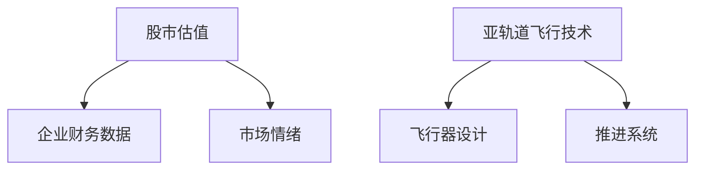
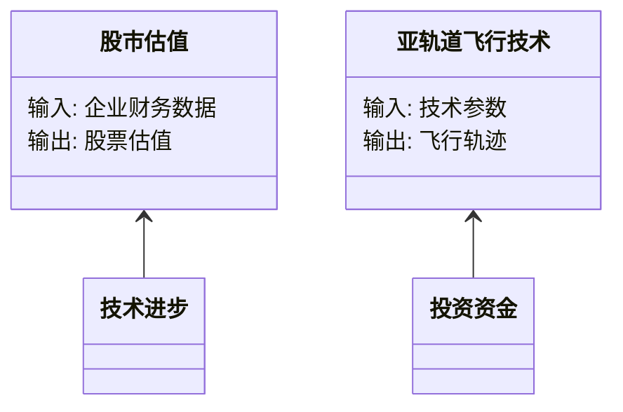
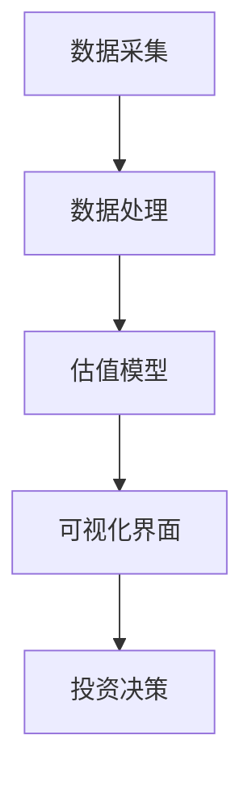

                 


# 全球股市估值与商业亚轨道飞行技术的关系

> 关键词：全球股市估值、商业亚轨道飞行技术、股市估值模型、轨道力学、投资分析

> 摘要：本文探讨了全球股市估值与商业亚轨道飞行技术之间的潜在关系，通过数学模型、算法原理和系统架构设计，分析了技术进步对股市估值的影响，以及投资资金对技术创新的支持。文章结合实际案例，深入剖析了两者之间的互动机制，并提出了基于数据驱动的评估方法。

---

## 第一部分: 全球股市估值与商业亚轨道飞行技术的背景与核心概念

### 第1章: 全球股市估值的基本概念

#### 1.1 股市估值的基本原理

股市估值是通过对企业的财务数据、市场环境和行业趋势进行分析，确定其股票的合理价格范围。核心指标包括市盈率（P/E）、市净率（P/B）和股息率（Dividend Yield）。这些指标反映了企业的盈利能力、资产价值和分红能力，是投资者评估股票价值的重要工具。

$$P/E = \frac{Price}{Earnings}$$  
$$P/B = \frac{Price}{Book\ Value}$$  
$$Dividend\ Yield = \frac{Dividend}{Price}$$  

#### 1.2 商业亚轨道飞行技术的基本概念

亚轨道飞行是指飞行器在大气层以上、太空轨道以下的飞行区域，高度通常在20-100公里之间。其特点包括快速响应、低成本发射和灵活任务调整。亚轨道飞行技术的核心要素包括飞行器设计、推进系统和轨道力学。

### 第2章: 全球股市估值与商业亚轨道飞行技术的关系概述

#### 2.1 问题背景与问题描述

全球股市估值的波动性与企业技术创新密切相关。商业亚轨道飞行技术的商业化应用正在加速，但其高投入和高风险特性使其对股市估值的影响复杂。研究两者的关系，有助于理解技术进步如何影响资本市场，并为投资者提供新的视角。

#### 2.2 核心概念的联系与对比

| 比较维度 | 全球股市估值 | 商业亚轨道飞行技术 |
|----------|--------------|---------------------|
| 核心目标 | 确定股票价值 | 实现亚轨道飞行任务 |
| 影响因素 | 财务数据、政策、市场情绪 | 技术、成本、法规 |
| 应用场景 | 投资决策 | 商业发射、科研任务 |

---

## 第二部分: 全球股市估值与商业亚轨道飞行技术的核心概念与联系

### 第3章: 全球股市估值与商业亚轨道飞行技术的核心概念原理

#### 3.1 全球股市估值的数学模型与公式

股市估值模型是基于企业未来现金流的折现值，常用的方法包括股利折现模型（DDM）和贴现现金流模型（DCF）。

$$DCF = \sum_{t=1}^{n} \frac{CF_t}{(1 + r)^t}$$  

#### 3.2 商业亚轨道飞行技术的数学模型与公式

亚轨道飞行轨迹的数学描述涉及轨道力学，主要公式包括重力加速度、推力和燃料消耗。

$$v(t) = v_0 + at - \frac{F}{m} \cdot t$$  

#### 3.3 核心概念的对比与联系

图1展示了股市估值与亚轨道飞行技术的核心概念对比：



---

## 第三部分: 全球股市估值与商业亚轨道飞行技术的系统分析与架构设计

### 第4章: 系统架构设计

#### 4.1 领域模型



#### 4.2 系统架构



---

## 第四部分: 项目实战

### 第5章: 项目实战

#### 5.1 环境安装

```bash
pip install numpy pandas matplotlib
```

#### 5.2 核心代码实现

```python
import numpy as np
import pandas as pd
import matplotlib.pyplot as plt

# 示例：股票估值计算
def calculate_pe_ratio(stock_price, earnings):
    return stock_price / earnings

# 示例：亚轨道飞行轨迹模拟
def simulate_trajectory(initial_velocity, acceleration, time):
    return initial_velocity + acceleration * time

# 数据可视化
prices = np.random.normal(100, 10, 100)
earnings = np.random.normal(10, 2, 100)
pe_ratios = calculate_pe_ratio(prices, earnings)

plt.plot(pe_ratios)
plt.title('PE Ratios Over Time')
plt.xlabel('Time')
plt.ylabel('PE Ratio')
plt.show()
```

---

## 第五部分: 结论与展望

### 5.1 结论

本文通过数学模型和系统架构设计，分析了全球股市估值与商业亚轨道飞行技术之间的关系。技术进步和资本流动的相互作用，为投资者和技术开发者提供了新的视角。

### 5.2 未来展望

未来研究可以结合更多数据源，如实时市场数据和飞行器 telemetry 数据，建立更复杂的估值模型。同时，人工智能技术的应用将进一步提升预测的准确性。

---

**作者：AI天才研究院 & 禅与计算机程序设计艺术**

