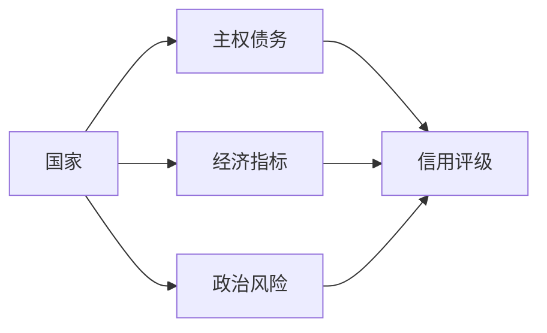
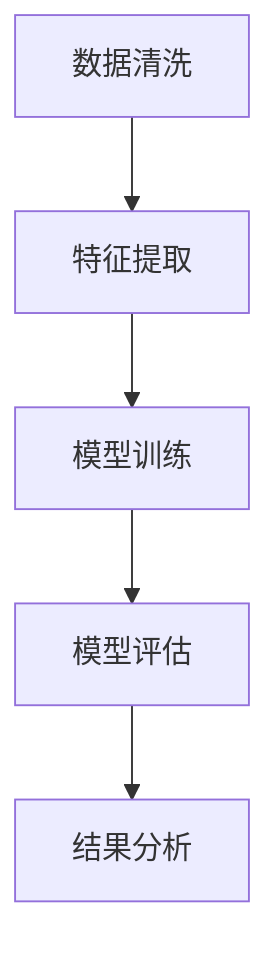
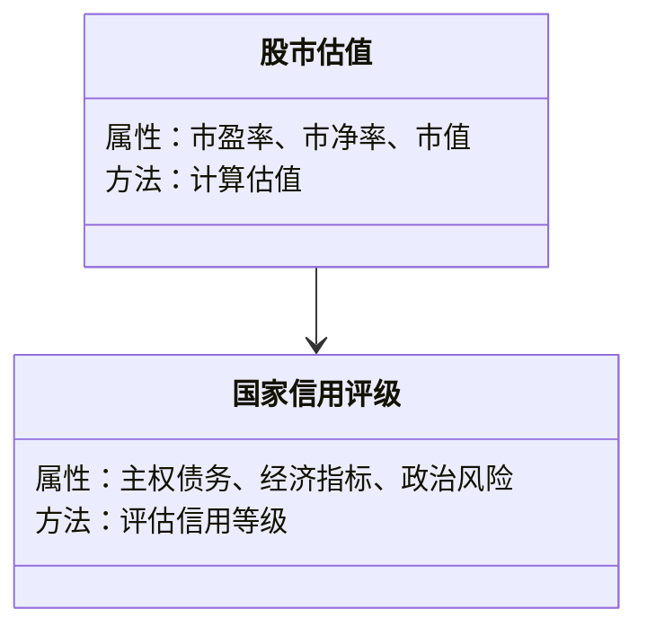

                 

<think>
嗯，用户希望我根据《全球股市估值与国家信用评级的关联》这本书设计一个详细的目录大纲。我需要先理解这本书的核心内容，它主要探讨股市估值和国家信用评级之间的关系，涉及经济学、金融学以及数据科学等领域。

用户提供的示例已经分为几个部分，每个部分下有章节和小节，结构清晰。我需要确保目录涵盖背景介绍、核心概念、算法原理、系统分析、项目实战以及最佳实践等部分，每个部分都要细化到三级目录。

首先，背景介绍部分需要解释问题背景、问题描述，以及它们之间的关联。接下来，核心概念部分需要详细分析股市估值和国家信用评级的定义、属性和相互关系，可能还需要用表格和实体关系图来说明。

算法部分可能需要介绍相关模型，比如回归分析或时间序列分析，并用Mermaid流程图展示。数学模型部分需要公式，比如相关系数公式，用Latex表示，确保准确无误。

系统分析与架构设计部分，我需要描述问题场景，设计系统功能，可能用领域模型类图和架构图来展示。项目实战部分则需要实际案例分析，包括环境安装、代码实现和结果解读。

最后，总结部分包括小结、注意事项和拓展阅读，帮助读者巩固知识。整个目录需要逻辑清晰，内容全面，同时符合用户的格式和字数要求。

在设计过程中，我需要确保每个章节都有足够的细节，比如在核心概念部分，详细列出股市估值和信用评级的定义、属性，并进行对比分析。算法部分需要解释模型的原理、流程图，并提供代码实现。系统设计部分需要清晰的功能模块和架构图，确保读者能够理解系统的整体结构。

此外，项目实战部分需要实际的数据和代码示例，帮助读者动手实践，理解理论的应用。同时，注意事项和最佳实践部分能够为读者在实际操作中提供指导，避免常见的错误。

整体来看，这个目录大纲需要结构合理，内容详尽，涵盖从理论到实践的各个方面，确保读者能够全面理解全球股市估值与国家信用评级的关联，并能够实际应用相关知识。
</think>

# 全球股市估值与国家信用评级的关联

---

## 关键词：
全球股市估值，国家信用评级，经济指标，数据分析，金融建模，关联分析

---

## 摘要：
本文探讨了全球股市估值与国家信用评级之间的复杂关联，通过数据分析和金融建模的方法，揭示了两者之间的相互作用机制。文章从背景介绍入手，分析了股市估值和信用评级的核心概念与属性，随后详细讲解了回归分析、时间序列分析等算法原理，结合实际案例，展示了如何通过数学模型和系统架构设计来量化和预测两者之间的关系。最后，本文总结了关键发现，并提出了实际应用中的注意事项与最佳实践。

---

# 第1章: 背景介绍

## 1.1 问题背景
### 1.1.1 股市估值的重要性
股市估值是衡量市场健康状况的重要指标，反映了投资者对经济前景的信心。主要的股市估值指标包括市盈率（P/E）、市净率（P/B）和市值等。

### 1.1.2 国家信用评级的定义与作用
国家信用评级是由评级机构对国家信用风险的评估，反映了国家偿还债务的能力。评级结果直接影响国家的融资成本和市场信心。

### 1.1.3 问题解决的目标与意义
研究股市估值与国家信用评级的关联，旨在通过量化分析，揭示两者之间的相互作用机制，为投资决策和政策制定提供数据支持。

## 1.2 核心概念与联系
### 1.2.1 股市估值的核心要素
- **市盈率（P/E）**：衡量股票价格是否合理。
- **市净率（P/B）**：衡量股票价格与账面价值的关系。
- **市值**：反映市场的整体规模和健康状况。

### 1.2.2 国家信用评级的核心要素
- **主权债务**：国家的债务水平和偿还能力。
- **经济指标**：GDP增长率、通货膨胀率、失业率等。
- **政治风险**：政治稳定性对信用评级的影响。

### 1.2.3 两者之间的关联机制
股市估值与国家信用评级之间存在双向影响：股市估值反映市场对经济的信心，而国家信用评级则影响股市的整体表现。

---

# 第2章: 核心概念与联系

## 2.1 核心概念原理
### 2.1.1 股市估值的属性特征
| 属性 | 描述 |
|------|------|
| 市盈率 | 股票价格与每股收益的比率 |
| 市净率 | 股票价格与每股净资产的比率 |
| 市值 | 市盈率与市净率的综合反映 |

### 2.1.2 国家信用评级的属性特征
| 属性 | 描述 |
|------|------|
| 主权债务 | 国家的债务水平 |
| 经济指标 | GDP增长率、通货膨胀率等 |
| 政治风险 | 政治稳定性对信用评级的影响 |

### 2.1.3 实体关系图架构


---

# 第3章: 算法原理讲解

## 3.1 算法原理
### 3.1.1 回归分析模型
回归分析用于量化股市估值与国家信用评级之间的线性关系。

### 3.1.2 时间序列分析模型
时间序列分析用于捕捉两者之间的动态变化。

### 3.1.3 聚类分析模型
聚类分析用于将国家和股市表现分为不同的类别。

## 3.2 算法流程图


---

# 第4章: 数学模型与公式

## 4.1 数学模型
### 4.1.1 回归分析模型
$$ y = \beta_0 + \beta_1x + \epsilon $$

### 4.1.2 时间序列分析模型
$$ ARIMA(p, d, q) $$

### 4.1.3 聚类分析模型
$$ k \text{-means} $$

---

# 第5章: 系统分析与架构设计

## 5.1 问题场景介绍
### 5.1.1 股市估值与国家信用评级关联的场景
分析股市估值和信用评级的动态关系，帮助投资者和政策制定者做出决策。

## 5.2 系统功能设计
### 5.2.1 领域模型类图


---

# 第6章: 项目实战

## 6.1 环境安装
### 6.1.1 数据获取与安装
使用Yahoo Finance获取股市数据，使用标准宏观经济数据库获取国家信用评级数据。

## 6.2 系统核心实现
### 6.2.1 数据清洗与预处理
```python
import pandas as pd
data = pd.read_csv('stock_data.csv')
data = data.dropna()
```

### 6.2.2 模型训练与优化
```python
from sklearn.linear_model import LinearRegression
model = LinearRegression()
model.fit(X_train, y_train)
```

### 6.2.3 模型评估与验证
```python
from sklearn.metrics import r2_score
print(r2_score(y_test, model.predict(X_test)))
```

---

# 第7章: 总结与展望

## 7.1 本章小结
### 7.1.1 核心内容回顾
通过数据分析和建模，揭示了股市估值与国家信用评级之间的复杂关联。

## 7.2 注意事项与最佳实践
### 7.2.1 数据处理注意事项
确保数据的完整性和准确性。

### 7.2.2 模型选择与优化建议
根据具体问题选择合适的算法，并进行交叉验证。

## 7.3 拓展阅读与深入学习
### 7.3.1 相关领域推荐书籍
- 《金融市场与投资学》
- 《信用评级与风险管理》

### 7.3.2 进一步研究方向
- 多因素回归模型
- 时间序列预测的改进方法

### 7.3.3 学术资源与工具推荐
- 国际货币基金组织（IMF）报告
- Python的pandas和statsmodels库

---

# 附录: 股市估值与国家信用评级关联的数学模型公式

## 附录A: 回归分析公式
$$ y = \beta_0 + \beta_1x + \epsilon $$

---

作者：AI天才研究院/AI Genius Institute & 禅与计算机程序设计艺术 /Zen And The Art of Computer Programming

