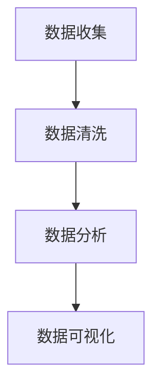

                 


# 全球股市估值与国家竞争力的相关性

## 关键词：全球股市估值，国家竞争力，相关性分析，回归模型，经济指标

## 摘要：本文探讨了全球股市估值与国家竞争力之间的相关性，分析了股市估值作为经济指标对国家竞争力的影响，通过相关性分析和回归模型，揭示了两者之间的内在联系，并提出了实际应用的建议。

---

## 第1章 背景介绍

### 1.1 问题背景

#### 1.1.1 股市估值的定义与意义
股市估值是指通过对上市公司股票价格、市盈率、市净率等指标的分析，评估整个股市的健康状况和价值水平。股市估值不仅是投资者决策的重要依据，也是反映国家经济状况的重要指标。

#### 1.1.2 国家竞争力的定义与衡量标准
国家竞争力是指一个国家在全球经济中与其他国家竞争的能力，通常包括经济发展水平、科技创新能力、人力资源质量、基础设施建设等多个方面的指标。

#### 1.1.3 问题解决的目标与意义
研究全球股市估值与国家竞争力的相关性，旨在通过量化分析，揭示股市估值对国家竞争力的影响，为企业投资决策和国家经济发展提供理论支持。

---

## 第2章 核心概念与联系

### 2.1 股市估值的核心原理

#### 2.1.1 股市估值的基本原理
股市估值主要通过分析上市公司的财务数据（如利润、收入、市盈率等）和宏观经济指标（如GDP、利率、通货膨胀率等）来评估股市的整体价值。

#### 2.1.2 影响股市估值的主要因素
- **宏观经济因素**：如GDP增长率、通货膨胀率、利率水平等。
- **公司基本面**：如净利润、营业收入、负债率等。
- **市场情绪**：如投资者信心、市场波动性等。

#### 2.1.3 股市估值与国家经济的关系
股市估值是国家经济状况的晴雨表，股市的涨跌反映了国家经济的健康状况和发展趋势。

---

### 2.2 国家竞争力的核心原理

#### 2.2.1 国家竞争力的定义与构成
国家竞争力包括技术创新能力、人力资源质量、基础设施建设、市场规模、政策环境等多个方面。

#### 2.2.2 影响国家竞争力的主要因素
- **技术创新**：技术创新是提升国家竞争力的关键因素。
- **人力资源**：高素质的人才队伍是国家竞争力的核心。
- **政策环境**：良好的政策环境可以吸引外资和促进经济发展。

#### 2.2.3 国家竞争力与经济发展的关系
国家竞争力是经济发展的驱动力，强大的国家竞争力能够促进经济的持续增长和繁荣。

---

### 2.3 股市估值与国家竞争力的联系

#### 2.3.1 股市估值是国家竞争力的晴雨表
股市估值反映了国家经济的健康状况，股市的涨跌与国家竞争力密切相关。

#### 2.3.2 国家竞争力对股市估值的影响
强大的国家竞争力能够提升投资者信心，推动股市估值上涨。

#### 2.3.3 两者之间的相互作用
股市估值与国家竞争力之间存在相互促进的关系，股市的健康发展可以为国家竞争力提供资金支持，而国家竞争力的提升又能推动股市的持续增长。

---

## 第3章 核心概念的属性特征对比

### 3.1 股市估值与国家竞争力的对比分析

| 属性       | 股市估值              | 国家竞争力          |
|------------|-----------------------|--------------------|
| 定义       | 股市整体价值的评估    | 国家在全球经济中的竞争能力 |
| 主要因素   | 股票价格、市盈率等    | 技术创新、人力资源等 |
| 影响因素   | 宏观经济、市场情绪等  | 政策环境、市场规模等 |
| 相关性     | 高相关性             | 高相关性           |

### 3.2 股市估值与国家竞争力的差异性

- **时间维度**：股市估值是实时变化的，而国家竞争力的提升是一个长期过程。
- **主体维度**：股市估值主要涉及企业和投资者，而国家竞争力涉及更广泛的经济和社会因素。

### 3.3 股市估值与国家竞争力的共同点

- **经济指标**：两者都是衡量经济状况的重要指标。
- **相互影响**：股市估值和国家竞争力之间存在相互促进的关系。

---

## 第4章 相关性分析的算法原理

### 4.1 相关性分析的基本原理

#### 4.1.1 相关性的定义
相关性是指两个变量之间的线性关系程度，通常用相关系数来衡量。

#### 4.1.2 相关性分析的方法
常用的相关性分析方法包括皮尔逊相关系数和斯皮尔曼相关系数。

#### 4.1.3 相关性系数的计算公式
$$ r = \frac{\sum (x_i - \bar{x})(y_i - \bar{y})}{\sqrt{\sum (x_i - \bar{x})^2 \sum (y_i - \bar{y})^2}} $$

### 4.2 回归分析的算法原理

#### 4.2.1 回归分析的基本原理
回归分析是一种统计学方法，用于研究变量之间的关系，通常用于预测和解释。

#### 4.2.2 线性回归的数学模型
$$ y = \beta_0 + \beta_1 x + \epsilon $$

#### 4.2.3 回归分析的应用场景
- 预测股市估值的变化趋势。
- 分析国家竞争力对股市的影响。

---

## 第5章 系统分析与架构设计方案

### 5.1 问题场景介绍

#### 5.1.1 全球股市估值与国家竞争力相关性分析的背景
随着全球化的发展，股市估值与国家竞争力之间的关系日益重要。

#### 5.1.2 问题目标与范围
- 分析全球股市估值与国家竞争力的相关性。
- 提出提升国家竞争力的建议。

#### 5.1.3 问题的约束与假设
- 数据来源：全球主要股市的指数数据和国家竞争力排名数据。
- 时间范围：最近10年的数据。

### 5.2 系统功能设计

#### 5.2.1 数据收集模块
- 数据来源：全球主要股市的指数数据和国家竞争力排名数据。
- 数据清洗：去除异常值和缺失值。

#### 5.2.2 数据分析模块
- 相关性分析：计算股市估值与国家竞争力的相关系数。
- 回归分析：建立回归模型，预测股市估值的变化趋势。

#### 5.2.3 数据可视化模块
- 绘制相关性热图。
- 绘制回归分析的散点图和回归线。

### 5.3 系统架构设计

#### 5.3.1 系统架构图


#### 5.3.2 模块之间的交互关系
- 数据收集模块将数据传递给数据清洗模块。
- 数据清洗模块将清洗后的数据传递给数据分析模块。
- 数据分析模块将结果传递给数据可视化模块。

#### 5.3.3 系统的可扩展性与可维护性
系统设计模块化，便于后续功能的扩展和维护。

---

## 第6章 项目实战

### 6.1 环境安装与数据准备

#### 6.1.1 环境安装
- 安装Python和相关库（如pandas、numpy、matplotlib、sklearn）。

#### 6.1.2 数据获取
- 下载全球主要股市的指数数据和国家竞争力排名数据。

### 6.2 系统核心实现

#### 6.2.1 数据清洗
```python
import pandas as pd

# 读取数据
data = pd.read_csv('stock_market.csv')

# 删除缺失值
data.dropna(inplace=True)

# 处理异常值
data = data[(data['stock_valuation'] > 0) & (data['competitiveness_rank'] > 0)]
```

#### 6.2.2 数据分析

```python
import numpy as np
from sklearn.linear_model import LinearRegression

# 计算相关系数
correlation = np.corrcoef(data['stock_valuation'], data['competitiveness_rank'])

# 建立回归模型
model = LinearRegression()
model.fit(data[['stock_valuation']], data['competitiveness_rank'])

# 预测结果
predictions = model.predict(data[['stock_valuation']])
```

#### 6.2.3 数据可视化

```python
import matplotlib.pyplot as plt

# 绘制散点图
plt.scatter(data['stock_valuation'], data['competitiveness_rank'])
plt.plot(data['stock_valuation'], predictions, color='red')
plt.xlabel('Stock Valuation')
plt.ylabel('Competitiveness Rank')
plt.show()
```

---

## 第7章 最佳实践

### 7.1 小结

- 股市估值是国家竞争力的重要指标。
- 相关性分析和回归分析是研究两者关系的有效方法。

### 7.2 注意事项

- 数据的准确性和完整性对分析结果影响较大。
- 模型的选择和参数的设置需要根据实际情况进行调整。

### 7.3 拓展阅读

- 《全球经济与股市估值》
- 《国家竞争力与经济发展》

---

## 作者：AI天才研究院/AI Genius Institute & 禅与计算机程序设计艺术 /Zen And The Art of Computer Programming

---

**本文内容到此结束，感谢您的阅读！**

